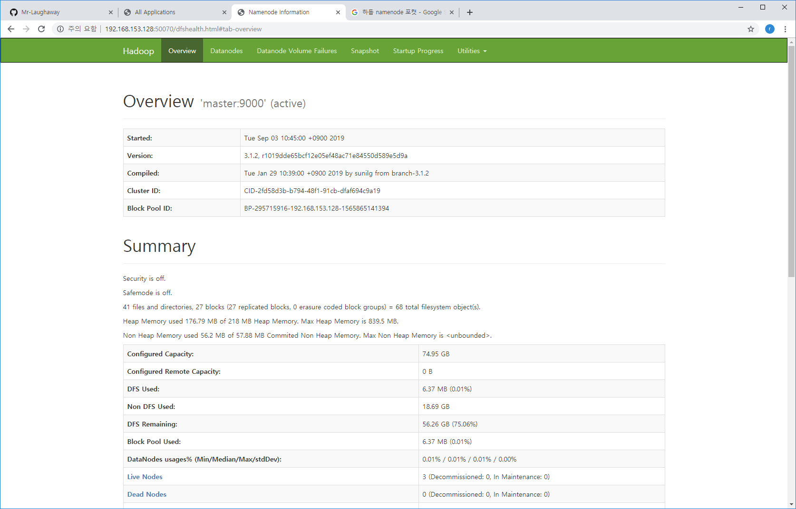

<h1>Hadoop Ecosystem</h1>


> **아파치 하둡**(Apache Hadoop, High-Availability Distributed Object-Oriented Platform)은 대량의 자료를 처리할 수 있는 큰 컴퓨터 클러스터에서 동작하는 분산 응용 프로그램을 지원하는 [프리웨어](https://ko.wikipedia.org/wiki/프리웨어) [자바](https://ko.wikipedia.org/wiki/자바_(프로그래밍_언어))[소프트웨어 프레임워크](https://ko.wikipedia.org/wiki/소프트웨어_프레임워크)이다. 원래 [너치](https://ko.wikipedia.org/wiki/너치)의 [분산 처리](https://ko.wikipedia.org/wiki/분산_파일_시스템)를 지원하기 위해 개발된 것으로, [아파치](https://ko.wikipedia.org/wiki/아파치_웹_서버) [루씬](https://ko.wikipedia.org/wiki/루씬)의 하부 프로젝트이다[[2\]](https://ko.wikipedia.org/wiki/아파치_하둡#cite_note-2). 분산처리 시스템인 [구글 파일 시스템](https://ko.wikipedia.org/wiki/구글_파일_시스템)을 대체할 수 있는 하둡 분산 파일 시스템(HDFS: Hadoop Distributed File System)과 [맵리듀스](https://ko.wikipedia.org/wiki/맵리듀스)를 구현한 것이다.
>
> 베이스 아파치 하둡 프레임워크는 다음의 모듈을 포함하고 있다:
>
> - 하둡 커먼(Hadoop Common)
> - 하둡 분산 파일 시스템(HDFS)
> - 하둡 YARN
> - 하둡 맵리듀스

<br>

# 1. Apache Hadoop

## 1.1 설치 절차

### 1.1.1 Download

- [oracle](https://www.oracle.com/technetwork/java/javase/downloads/index.html) 에서 Java SE Development Kit 8u221 를 다운받는다(linux x64).
- [apache hadoop](https://hadoop.apache.org/) Apache Hadoop 3.1.2 를 다운 받는다.
- eclipse-jee-photon-R-linux-gtk-x86_64 를 다운 받는다.

### 1.1.2. 압축 해제 및 설치

```bash
[hadoop@master ~]$ su -
[root@master ~]# cd /usr/local
[root@master local]# tar -xvf /home/hadoop/Downloads/jdk-8u221-linux-x64.tar.gz 
[root@master local]# chown -R hadoop:hadoop /usr/local/jdk1.8.0_221/

[root@master local]# tar -xvf /home/hadoop/Downloads/eclipse-jee-photon-R-linux-gtk-x86_64.tar.gz 
[root@master local]# chown -R hadoop:hadoop /usr/local/eclipse/

[root@master local]# tar -xvf /home/hadoop/Downloads/hadoop-2.7.7.tar.gz 
[root@master local]# chown -R hadoop:hadoop /usr/local/hadoop-2.7.7/
```

### 1.1.3. Hostname 변경

> CentOS를 처음 시작하면 다음과 같이 Hostname이 localhost로 설정된다. 관리해야될 서버가 한대라면 모르지만 여러대를 관리한다면 서버별로 hostname을 지정해 주는것이 좋다.

```bash
[root@master ~]# hostname
[root@master ~]# hostnamectl set-hostname master

#서버를 재시작 하지 않아도 아래의 명령을 실행하고 실행중인 터미널을 닫고 다시 열면 hostname이 변경된것을 확인할 수 있다.
/bin/hostname -F /etc/hostname
```

### 1.1.4. hosts 파일 설정

```bash
[root@master ~]# vi /etc/hosts
192.168.21.131  master
192.168.21.132  secondary
192.168.21.132  slave1
192.168.21.131  slave2
```

### 1.1.5. .bash_profile 설정

```bash
[hadoop@master ~]$ vi .bash_profile

#아래와 같이 수정한다
#------------------------------------------------------
# .bash_profile

# Get the aliases and functions
if [ -f ~/.bashrc ]; then
        . ~/.bashrc
fi

# User specific environment and startup programs
#PATH=$PATH:$HOME/.local/bin:$HOME/bin:$JAVA_HOME/bin

PATH=$PATH:$HOME/.local/bin:$HOME/bin
export JAVA_HOME=/usr/local/jdk1.8.0_221
export HADOOP_HOME=/usr/local/hadoop-2.7.7
export HADOOP_CMD=/usr/local/hadoop-2.7.7/bin/hadoop
export HADOOP_STREAMING=/usr/local/hadoop-2.7.7/share/hadoop/tools/lib/hadoop-streaming-2.7.7.jar
export HADOOP_CONF_DIR=/usr/local/hadoop-2.7.7/etc/hadoop
export YARN_CONF_DIR=/usr/local/hadoop-2.7.7/etc/hadoop
export PATH=$PATH:$JAVA_HOME/bin:$HADOOP_HOME/bin
#------------------------------------------------------
```

### 1.1.6. worker node 만들기

- 위 1.1 ~ 1.6을 각각의 worker node에서도 동일하게 하여야 하지만, 가상머신 소프트웨어를 이용중이므로 편의상 가상머신 이미지를 복사하여 원하는 수 만큼의 노드를 생성한다.
- 그 후 hostname을 각각의 worker node에 맞게 지정한다.
- 나머지는 같다

### 1.1.7. ssh 설정

```bash
#Hadoop  home 디렉토리아래 ssh 디렉토리 생성 후 접근 권한 변경
[hadoop@master ~]$ mkdir .ssh
[hadoop@master ~]$ chmod 755 ~/.ssh
[hadoop@master ~]$ ssh-keygen -t rsa
[hadoop@master ~]$ cp .ssh/id_rsa.pub .ssh/authorized_keys
[hadoop@master ~]$ ls .ssh
authorized_keys id_rsa id_rsa.pub

#master 서버에서 공개 키 분배
[hadoop@master ~]$ scp ~/.ssh/authorized_keys hadoop@slave1:~/.ssh/

#slave 노드에 인증 키 복제 되었는지 확인
[hadoop@slave1 ~]$ ls .ssh/

#master 노드에서 테스트
[hadoop@master ~]$ ssh hadoop@master date
[hadoop@master ~]$ ssh hadoop@secondary date
[hadoop@master ~]$ ssh hadoop@slave1 date
[hadoop@master ~]$ ssh hadoop@slave2 date
```

### 1.1.8 셸 스크립트 및 설정 파일 수정

#### 1.1.8.1 hadoop-env.sh

```bash
[hadoop@master ~]$ cd /usr/local/hadoop-2.7.7/etc/hadoop
[hadoop@master hadoop]$ vi hadoop-env.sh

#자바 설치된 경로 확인 후 아래 라인 수정 혹은 삽입
export JAVA_HOME=/usr/local/jdk1.8.0_221/
```

#### 1.1.8.2. core-site.xml

```xml
<?xml version="1.0" encoding="UTF-8"?>
<?xml-stylesheet type="text/xsl" href="configuration.xsl"?>
<configuration>
	<property>
		<name>fs.default.name</name>
		<value>hdfs://master:9000</value>
	</property>
	<property>
		<name>hadoop.tmp.dir</name>
		<value>/usr/local/hadoop-2.7.7/tmp</value>
	</property>
</configuration>
```

#### 1.1.8.3. hdfs-site.xml

```xml
<?xml version="1.0" encoding="UTF-8"?>
<?xml-stylesheet type="text/xsl" href="configuration.xsl"?>
<configuration>
	<property>
		<name>dfs.replication</name>
		<value>2</value>
	</property>
	<property>
		<name>dfs.permissions.enabled</name>
		<value>false</value>
	</property>
	<property>
		<name>dfs.secondary.http.address</name>
		<value>secondary:50090</value>
	</property>
</configuration>
```

#### 1.1.8.4. mapred-site.xml

```xml
<?xml version="1.0"?>
<?xml-stylesheet type="text/xsl" href="configuration.xsl"?>
<configuration>
	<property>
		<name>mapreduce.framework.name</name>
		<value>yarn</value>
	</property>
</configuration>
```

#### 1.1.8.5. yarn-site.xml

`yarn.nodemanager.resource.cpu-vcores`, `yarn.scheduler.maximum-allocation-mb` 등은 가상 머신을 세팅한 것을 확인 후 설정한다.

```xml
<?xml version="1.0"?>
<configuration>
    <property>  
    	<name>yarn.resourcemanager.hostname</name>  
    	<value>master</value>  
    </property>
    <property>
    	<name>yarn.nodemanager.aux-services</name>
    	<value>mapreduce_shuffle</value>
    </property>
    <property>
    	<name>yarn.nodemanager.aux-services.mapreduce_shuffle.class</name>
    	<value>org.apache.hadoop.mapred.ShuffleHandler</value>
    </property>
    <property>
    	<name>yarn.log-aggregation-enable</name>
    	<value>true</value>
    </property>
    <property>
        <name>yarn.nodemanager.resource.cpu-vcores</name>
        <value>1</value>
    </property>
    <property>
        <name>yarn.scheduler.maximum-allocation-mb</name>
        <value>2048</value>
    </property>
    <property>
        <name>yarn.scheduler.minimum-allocation-mb</name>
        <value>1024</value>
    </property>
    <property>
        <name>yarn.nodemanager.vmem-pmem-ratio</name>
        <value>2.1</value>
    </property>
    <property>
        <name>yarn.nodemanager.pmem-check-enabled</name>
        <value>true</value>
    </property>
    <property>
        <name>yarn.nodemanager.vmem-check-enabled</name>
        <value>false</value>
    </property>
</configuration>

```

#### 1.1.8.6. tmp 디렉토리 생성

hadoop에서 작업을 진행할 tmp 디렉토리를 생성한다. 이 디렉토리는 `core-site.xml`에 설정 되어 있다.

```bash
[hadoop@master ~]$ mkdir -p /usr/local/hadoop-2.7.7/tmp
```

### 1.1.9 설정 동기화

master에서 설정한 내용을 다른 node 들에도 모두 적용한다.

```bash
[hadoop@master ~]$ cd /usr/local/hadoop-2.7.7/etc/hadoop
[hadoop@master ~]$ rsync -av . hadoop@slave1:/usr/local/hadoop-2.7.7/etc/hadoop/
```

### 1.1.10. 방화벽 설정

#### 1.1.10.1. iptables 설치

- 설치

  ```bash
  [hadoop@master ~]$ yum install iptables-services
  ```

- 설정

  ```bash
  [hadoop@master local]$ ssudo vi /etc/sysconfig/iptables
  
  #------------------------------------------------------------
  # sample configuration for iptables service
  # you can edit this manually or use system-config-firewall
  # please do not ask us to add additional ports/services to this default configuration
  *filter
  :INPUT ACCEPT [0:0]
  :FORWARD ACCEPT [0:0]
  :OUTPUT ACCEPT [0:0]
  -A INPUT -m state --state RELATED,ESTABLISHED -j ACCEPT
  -A INPUT -p icmp -j ACCEPT
  -A INPUT -i lo -j ACCEPT
  -A INPUT -p tcp -m state --state NEW -m tcp --dport 22 -j ACCEPT
  # master node의 경우 외부에서 접근하여 resource 등을 볼 수 있게 아래와 같이 설정한다.
  -A INPUT -m state --state NEW -m tcp -p tcp --dport 8080 -j ACCEPT
  -A INPUT -m state --state NEW -m tcp -p tcp --dport 8088 -j ACCEPT
  -A INPUT -m state --state NEW -m tcp -p tcp --dport 4040 -j ACCEPT
  -A INPUT -m state --state NEW -m tcp -p tcp --dport 50070 -j ACCEPT
  -A INPUT -m state --state NEW -m tcp -p tcp --dport 50090 -j ACCEPT
  -A INPUT -m state --state NEW -m tcp -p tcp --dport 50100 -j ACCEPT
  -A INPUT -m state --state NEW -m tcp -p tcp --dport 5432 -j ACCEPT
  -A INPUT -m state --state NEW -m tcp -p tcp --dport 3306 -j ACCEPT
  -A INPUT -m state --state NEW -m tcp -p tcp --dport 8032 -j ACCEPT
  -A INPUT -m state --state NEW -m tcp -p tcp --dport 12000 -j ACCEPT
  # IPV4의 C class 수준에서 모든 연결을 pass 시켜주는 설정을 넣는다.
  # master node 와 기타 다른 node들 간의 연결은 모두 허용되게 된다.
  # master node 외의 다른 node 들은 아래의 두 줄만 있으면 된다.
  -A INPUT -s 192.168.21.0/24 -d 192.168.21.0/24 -j ACCEPT
  -A OUTPUT -s 192.168.21.0/24 -d 192.168.21.0/24 -j ACCEPT
  -A INPUT -j REJECT --reject-with icmp-host-prohibited
  -A FORWARD -j REJECT --reject-with icmp-host-prohibited
  COMMIT
  ```

#### 1.1.10.2. firewalld deamon 해제

위에서 설치한 `iptables`를 사용할 것이므로 기본 방화벽인 `firewalld` deamon을 해제한다. 해제 하지 않으면 `iptables` 보다 우선순위로 작동하기 때문에 리부팅 시 `iptables`가 제대로 설정되지 않는다.

```bash
[root@master ~]# systemctl stop firewalld
[root@master ~]# systemctl mask firewalld
```

#### 1.1.10.3. iptables service 등록 및 재시작

- `iptables` 설정도 마쳤고 기본 방화벽인 `firewalld` 도 해제하였으므로 `iptables`를 동작시킨다. 

- 위 설정들은 `/etc/sysconfig/iptables` 파일의 약간을 설정 차이만 유념하여, 각 slave node에서도 모두 적용한다.

```bash
[root@master ~]# systemctl enable iptables
[root@master ~]# systemctl start iptables

# 재시작이 필요할 경우
[root@master ~]# service iptables restart
```

### 1.1.11. namenode 포맷

```bash
#마스터 노드에서
[hadoop@master ~]$ hadoop namenode -format 
```

## 1.2. hadoop 실행과 정지

### 1.2.1. hadoop 기동

#### 1.2.1.1. 기동

```bash
#마스터 노드에서
[hadoop@master ~]$ cd /usr/local/hadoop-2.7.7/sbin
[hadoop@master sbin]$ ./start-all.sh

[hadoop@master sbin]$  ./mr-jobhistory-daemon.sh start historyserver
[hadoop@master sbin]$ jps
```

#### 1.2.1.2. history server 기동

```bash
[hadoop@master sbin]$  ./mr-jobhistory-daemon.sh start historyserver
```

#### 1.2.1.3. jps 로 기동 상황 확인

- master node

  ```bash
  [hadoop@master hadoop]$ jps
  12643 NameNode
  17763 JobHistoryServer
  17831 Jps
  12779 DataNode
  13293 NodeManager
  13166 ResourceManager
  ```

- other node

  ```bash
  [hadoop@secondary ~]$ jps
  12485 DataNode
  12568 SecondaryNameNode
  12717 NodeManager
  17166 Jps
  ```

#### 1.2.1.4. namedoe information 체크(WEB UI)

http://master:50070



#### 1.2.1.5. hadoop cluster 체크 (WEB UI)

http://master:8088


### 1.2.2. 종료

```bash
[hadoop@master sbin]$ ./stop-all.sh
```

### 1.2.3. safemode

비정상 종료 등의 이유로 `hadoop`이 `safemode `로 빠졌다면 문제상황을 확인하고 해결 후, 다음 커맨드를 이용하여 `safemode`로부터 빠져 나온다.

```bash
[hadoop@master ~]$ hadoop dfsadmin -safemode leave
```

## 1.3. HDFS 관리

### 1.3.1. 기본적인 명령어

```bash
$ hadoop fs {-커맨드 [-옵션]} {경로} [경로]
```

- 파일 목록 확인 : `ls`, `lsr`

- 파일 용량 확인 : `du`, `dus`

- 파일 내용 보기 : `cat`, `text`
- 파일 병합 : `getmerge`

- 디렉토리 생성 : `mkdir`

- 파일 복사 : `put`, `get`, `getmerge`, `cp`, `copyFromLocal`, `copyToLocal`

- 파일 이동 : `mv`, `moveFromLocal`

- 카운트 값 조회 : `count`

- 파일삭제, 디렉토리 삭제 : `rm`, `rmr`

- 파일의 마지막 내용 확인 : `tail`

- 권한 변경 : `chmod`, `chown`, `chgrp`

- 0바이트파일 생성 : `touch`

- 통계 정보 조회 : `stat`

- 복제 데이터 개수 변경 : `setrep`

- 휴지통 비우기 : `expunge`

- 파일 형식 확인 : `test`

### 1.3.2. 기타 관리 명령

```bash
$ hadoop dfsadmin {-커맨드 [-옵션]} {경로} [경로]
```

- `fsck` : 파일 시스템 상태 체크

- `balancer` : HDFS 재균형

- `deamonlog` : 로그 레벨 동적 변경

- `dfsadmin` : HDFS 상태 확인. HDFS 퇴거, DataNode 참가 등

### 1.3.3. 로깅

기본적으로 `log4j`를 사용한다.

### 1.3.4. node 추가 및 삭제

#### 1.3.4.1. node 삭제

- `$HADOOP_HOME/conf/hdfs-site.xml` 파일에 아래 내용 추가

  ```xml
  <property>
  	<name>dfs.hosts.exclude</name>
      <value>${HADOOP_HOME}/conf/exclude_list</value>
  </property>
  ```

- 위에서 지정한`$HADOOP_HOME/conf/exclude_list` 파일에 삭제하고자 하는 데이터노드의 호스트명을 기록.

  ```txt
  datanode_to_remove1
  datanode_to_remove2
  ```

- hadoop 에게 알림

  ```bash
  [hadoop@master ~]$ hadoop dfsadmin -refreshNodes #갱신하라고 명령
  [hadoop@master ~]$ hadoop dfsadmin -report #상태 확인
  
  # replicationFactor를 맞추기 위해 나머지 data node 들이 data 를 분배하는 과정이 필요하므로, server 성능과 data 상황에 따라 오래 걸릴 수 있다.
  
  [hadoop@master ~]$ hadoop mradmin -refreshNodes #완료되면 잡 트래커에게도 알린다
  ```

#### 1.3.4.2. node 추가

- `$HADOOP_HOME/conf/hdfs-site.xml` 파일에 아래 내용 추가

  ```xml
  <property>
  	<name>dfs.hosts</name>
      <value>${HADOOP_HOME}/conf/include_list</value>
  </property>
  ```

- 위에서 지정한`$HADOOP_HOME/conf/include_list` 파일에 추가하고자 하는 데이터노드의 호스트명을 기록.

  ```txt
  datanode_to_add1
  datanode_to_add2
  ```

- hadoop 에게 알림

  ```bash
  [hadoop@master ~]$ hadoop dfsadmin -refreshNodes #갱신하라고 명령
  [hadoop@master ~]$ hadoop dfsadmin -report #상태 확인
  
  ```

- 새로 추가된 노드에서 daemon 가동

  ```R
  [hadoop@newnode ~]$ cd /usr/local/hadoop-3.1.2/sbin
  [hadoop@newnode sbin]$ ./hadoop-daemon.sh start datanode # hdfs 데몬 가동
  [hadoop@newnode sbin]$ ./yarn-daemon.sh start nodemanager # yarn 데몬 가동
  ```

- 데이터 분산

  ```R
  
  [hadoop@master ~]$ hadoop balancer -threshold 20 #완료되면 데이터를 분산시킨다
  [hadoop@master ~]$ hadoop mradmin -refreshNodes #완료되면 잡 트래커에게도 알린다
  ```

#### 1.3.4.3. replication 맞추기 밑 rebalancing

> 노드 추가 삭제 시 임시로 replication을 변경해야 하거나 혹은 모든 작업 완료후 특정 node에 편중된 data를 다시 고르고 분포시켜야 할 경우.

- replication 변경

  ```bash
  hadoop fs -setrep -w 3 / # 3은 복제 개수
  ```

- rebalanacing

  ```bash
  hadoop balancer -threshold N # N은 데이터 노드간 데이트 사이즈 차이의 한계 퍼센티지
  ```

<br>

# 2. MapReduce Programming


> MapReduce 프레임워크는 페타바이트 이상의 대용량 데이터를 신뢰할 수 없는 컴퓨터로 구성된 클러스터 환경에서 병렬 처리를 지원하기 위해서 개발되었다.
>
> MapReduce프레임워크는 함수형 프로그래밍에서 일반적으로 사용되는 Map()과 Reduce() 함수 기반으로주로 구성되어있다.
>
> - Map()은 (key, value) 쌍을 처리하여 또 다른 (key ,value) 쌍을 생성
> - Reduce()는 맵(map)으로부터 생성된 (key, list(value)) 들을 병합(merge)하여 최종적으로 list(value) 들을 생성
> - 데이터 처리를 위한 프로그래밍 모델
> - 분산컴퓨팅에 적합한 함수형 프로그래밍
> - 배치형 데이터 처리 시스템
> - 자동화된 병렬처리 및 분산처리
> - Fault-tolerance(내고장성, 결함허용)
> - 프로그래머를 위한 추상클래스 제공

## 2.1. 용어

### 2.1.1.작업(Job)

- 데이터 집합을 이용하여 `Mapper`와 `Reducer`를 실행하는 "전체 프로그램“
- 20개의 파일로부터 `WordCount`를 실행하는 것은 1개의 작업(Job)

### 2.1.2. 태스크(Task)

- 1개의 데이터 조각을 처리하는 1개의` Mapper` 또는 `Reducer`의 실행
- 20개의 파일은 20개의 `Map` 태스크에 의해 처리

### 2.1.3.태스크 시도(Task Attempt)

- 머신 위에서 1개의 태스크를 실행하는 특정 시도
- 최소한 20개의 Map 태스크 시도들이 수행됩니다. 서버 장애 시에는 더 많은 시도들이 수행

### 2.1.4. Map

- 어떤 데이터의 집합을 받아들여 데이터를 생성하는 프로세스
- 주로 입력 파일을 한 줄씩 읽어서 filtering등의 처리를 수행

### 2.1.5. Reduce

- Map에 의해서 만들어진 데이터를 모아서 최종적으로 원하는 결과로 만들어 내는 프로세스
- 데이터 집약 처리

<br>

>※ 어떤 처리든 데이터는 키(key)와 밸류(value)의 쌍으로 이루어지고, 해당 쌍의 집합을 처리한다.
>
>※ 입력 데이터도 출력 데이터도 key-value의 집합으로 구성된다.

<br>

### 2.1.6. Shuffle

- Map 처리 후 데이터를 정렬해서, 같은 키를 가진 데이터를 같은 장소에 모으는 작업
- 슬레이브 서버 간에 네트워크를 통한 전송이 발생한다

## 2.2. MapReduce 프로그래밍 준비(이클립스 설치)

```bash
[hadoop@master ~]$ su - 
[root@master ~]# cd /usr/local
[root@master ~]# tar -xvf /home/hadoop/Downloads/eclipse-jee-photon-R-linux-gtk-x86_64.tar.gz
[root@master ~]# chown -R hadoop:hadoop /usr/local/eclipse/


ls -al(로 그룹명 변화 확인)

```

## 2.3. Hello HDFS

> `HDFS`에 지정한 파라미터로 텍스트파일을 작성하고 읽어오는 간단한 `jar` 파일을 만들어본다.

### 2.3.1. 프로젝트 생성 및 hadoop shared library 추가

```java
$HADOOP-HOME/share/hadoop/common/lib/common-cli-1.2.jar
$HADOOP-HOME/share/hadoop/common/hadoop-common-2.7.7.jar
$HADOOP-HOME/share/hadoop/mapreduce/hadoop-mapreduce-client-core-2.7.7.jar
$HADOOP-HOME/share/hadoop/mapreduce/lib/log4j ~.jar //없어도 됨
```

### 2.3.2. 코드 작성

```java
package lab.hadoop.io;

import org.apache.hadoop.conf.Configuration;
import org.apache.hadoop.fs.FSDataInputStream;
import org.apache.hadoop.fs.FSDataOutputStream;
import org.apache.hadoop.fs.FileSystem;
import org.apache.hadoop.fs.Path;

public class SingleFileWriteRead {
  public static void main(String[] args) {
	// 입력 파라미터 확인
	if (args.length != 2) {
		System.err.println("Usage: SingleFileWriteRead <filename> <contents>");
			System.exit(2);
		}

	try {
		// 파일 시스템 제어 객체 생성
		Configuration conf = new Configuration();
		FileSystem hdfs = FileSystem.get(conf);

		// 경로 체크
		Path path = new Path(args[0]);
		if (hdfs.exists(path)) {
			hdfs.delete(path, true);
		}

		// 파일 저장
		FSDataOutputStream outStream = hdfs.create(path);
		outStream.writeUTF(args[1] + "\n");
		outStream.close();

		// 파일 출력
		FSDataInputStream inputStream = hdfs.open(path);
		String inputString = inputStream.readUTF();
		inputStream.close();

		System.out.println("## inputString:" + inputString);
        System.out.println(path.getFileSystem(conf).getHomeDirectory()); //hdfs 홈 경로
        System.out.println(path.toUri()); //패스의 파일명
        System.out.println(path.getFileSystem(conf).getUri().getPath());

		} catch (Exception e) {
			e.printStackTrace();
		}
	}
}
```

### 2.3.3. jar export

- project > export > jar file > **경로/이름지정** > **main class 지정**

### 2.3.4. 실행

```bash
[hadoop@master ~]$ hadoop jar ./writeread.jar test.txt "Hello hadoop HDFS"
## inputString:Hello hadoop HDFS

hdfs://master:9000/user/hadoop
test.txt

[hadoop@master ~]$ hadoop fs -cat /user/hadoop/test.txt
Hello hadoop HDFS
[hadoop@master ~]$
```

## 2.4. WordCount 만들기

### 2.4.1. Mapper Class 작성

```java
package lab.hadoop.wordcount;

import java.io.IOException;
import java.util.StringTokenizer;

import org.apache.hadoop.io.IntWritable;
import org.apache.hadoop.io.LongWritable;
import org.apache.hadoop.io.Text;
import org.apache.hadoop.mapreduce.Mapper;

//org.apache.hadoop.mapreduce.Mapper를 상속 받아 map 을 override 한다
public class WordCountMapper  extends Mapper<LongWritable, Text, Text, IntWritable>{
	
	private final static IntWritable one=new IntWritable(1);
	private Text word=new Text();
	
	@Override
	protected void map(LongWritable key, Text value, Mapper<LongWritable, Text, Text, IntWritable>.Context context)
			throws IOException, InterruptedException {
		
		StringTokenizer itr=new StringTokenizer(value.toString());
		while(itr.hasMoreTokens()) {
			word.set(itr.nextToken());
			context.write(word, one);
		}
	}

}
```

### 2.4.2. Reducer Class 작성

```java
package lab.hadoop.wordcount;

import java.io.IOException;

import org.apache.hadoop.io.IntWritable;
import org.apache.hadoop.io.Text;
import org.apache.hadoop.mapreduce.Reducer;

//org.apache.hadoop.mapreduce.Reducer 를 상속받아 reduce 를 override 한다.
public class WordCountReducer extends Reducer<Text, IntWritable, Text, IntWritable> {

	private final static IntWritable result = new IntWritable();
	
	@Override
	protected void reduce(Text key, Iterable<IntWritable> values, Context context)
			throws IOException, InterruptedException {
		
		int sum = 0;
		for(IntWritable val : values) {
			sum += val.get();
		}
		result.set(sum);
		context.write(key,result);
	}	
}

```

### 2.4.3. Driver Class 작성

```java
package lab.hadoop.wordcount;

import org.apache.hadoop.conf.Configuration;
import org.apache.hadoop.fs.FileSystem;
import org.apache.hadoop.fs.Path;
import org.apache.hadoop.io.IntWritable;
import org.apache.hadoop.io.Text;
import org.apache.hadoop.mapreduce.Job;
import org.apache.hadoop.mapreduce.lib.input.FileInputFormat;
import org.apache.hadoop.mapreduce.lib.input.TextInputFormat;
import org.apache.hadoop.mapreduce.lib.output.FileOutputFormat;

public class WordCount {

	public static void main(String[] args) throws Exception {
		Configuration conf = new Configuration();
		if(args.length != 2) {
			System.err.println("Usage: WordCount <input> <output>");
			System.exit(2);
		}
		Job job = new Job(conf, "WordCount");
		
		job.setJarByClass(WordCount.class);
		job.setMapperClass(WordCountMapper.class);
		job.setReducerClass(WordCountReducer.class);
		
		job.setInputFormatClass(TextInputFormat.class);
	
		job.setOutputKeyClass(Text.class);
		job.setOutputValueClass(IntWritable.class);
		
		//file system control object making
		FileSystem hdfs = FileSystem.get(conf);
		
		//route check
		Path path = new Path(args[1]);
		if(hdfs.exists(path)) {
			hdfs.delete(path,true);
		}
		FileInputFormat.addInputPath(job, new Path(args[0]));
		FileOutputFormat.setOutputPath(job, new Path(args[1]));
		
		job.waitForCompletion(true);
	}
}
```

### 2.4.4. 실행 및 결과 확인

```bash
#실행
[hadoop@master ~]$ hadoop jar wordcount.jar README.txt output/wordcount
2019-09-03 17:49:46,340 INFO client.RMProxy: Connecting to ResourceManager at master/192.168.153.128:8032
2019-09-03 17:49:47,162 WARN mapreduce.JobResourceUploader: Hadoop command-line option parsing not performed. Implement the Tool interface and execute your application with ToolRunner to remedy this.
2019-09-03 17:49:47,196 INFO mapreduce.JobResourceUploader: Disabling Erasure Coding for path: /tmp/hadoop-yarn/staging/hadoop/.staging/job_1567475125668_0002
2019-09-03 17:49:47,591 INFO input.FileInputFormat: Total input files to process : 1
2019-09-03 17:49:47,799 INFO mapreduce.JobSubmitter: number of splits:1
2019-09-03 17:49:48,412 INFO mapreduce.JobSubmitter: Submitting tokens for job: job_1567475125668_0002
2019-09-03 17:49:48,415 INFO mapreduce.JobSubmitter: Executing with tokens: []
2019-09-03 17:49:48,680 INFO conf.Configuration: resource-types.xml not found
2019-09-03 17:49:48,681 INFO resource.ResourceUtils: Unable to find 'resource-types.xml'.
2019-09-03 17:49:48,782 INFO impl.YarnClientImpl: Submitted application application_1567475125668_0002
2019-09-03 17:49:48,844 INFO mapreduce.Job: The url to track the job: http://master:8088/proxy/application_1567475125668_0002/
2019-09-03 17:49:48,845 INFO mapreduce.Job: Running job: job_1567475125668_0002
2019-09-03 17:50:00,184 INFO mapreduce.Job: Job job_1567475125668_0002 running in uber mode : false
2019-09-03 17:50:00,186 INFO mapreduce.Job:  map 0% reduce 0%
2019-09-03 17:50:09,679 INFO mapreduce.Job:  map 100% reduce 0%
2019-09-03 17:50:21,906 INFO mapreduce.Job:  map 100% reduce 100%
2019-09-03 17:50:21,922 INFO mapreduce.Job: Job job_1567475125668_0002 completed successfully
2019-09-03 17:50:22,102 INFO mapreduce.Job: Counters: 53
        File System Counters
                FILE: Number of bytes read=2419
                FILE: Number of bytes written=436423
                FILE: Number of read operations=0
                FILE: Number of large read operations=0
                FILE: Number of write operations=0
                HDFS: Number of bytes read=1472
                HDFS: Number of bytes written=1306
                HDFS: Number of read operations=8
                HDFS: Number of large read operations=0
                HDFS: Number of write operations=2
        Job Counters
                Launched map tasks=1
                Launched reduce tasks=1
                Data-local map tasks=1
                Total time spent by all maps in occupied slots (ms)=6902
                Total time spent by all reduces in occupied slots (ms)=9598
                Total time spent by all map tasks (ms)=6902
                Total time spent by all reduce tasks (ms)=9598
                Total vcore-milliseconds taken by all map tasks=6902
                Total vcore-milliseconds taken by all reduce tasks=9598
                Total megabyte-milliseconds taken by all map tasks=7067648
                Total megabyte-milliseconds taken by all reduce tasks=9828352
        Map-Reduce Framework
                Map input records=31
                Map output records=179
                Map output bytes=2055
                Map output materialized bytes=2419
                Input split bytes=106
                Combine input records=0
                Combine output records=0
                Reduce input groups=131
                Reduce shuffle bytes=2419
                Reduce input records=179
                Reduce output records=131
                Spilled Records=358
                Shuffled Maps =1
                Failed Shuffles=0
                Merged Map outputs=1
                GC time elapsed (ms)=942
                CPU time spent (ms)=2960
                Physical memory (bytes) snapshot=463089664
                Virtual memory (bytes) snapshot=5582635008
                Total committed heap usage (bytes)=397934592
                Peak Map Physical memory (bytes)=273211392
                Peak Map Virtual memory (bytes)=2787102720
                Peak Reduce Physical memory (bytes)=189878272
                Peak Reduce Virtual memory (bytes)=2795532288
        Shuffle Errors
                BAD_ID=0
                CONNECTION=0
                IO_ERROR=0
                WRONG_LENGTH=0
                WRONG_MAP=0
                WRONG_REDUCE=0
        File Input Format Counters
                Bytes Read=1366
        File Output Format Counters
                Bytes Written=1306

#결과 파일 목록 확인
[hadoop@master ~]$ hadoop fs -ls -R output
drwxr-xr-x   - hadoop supergroup          0 2019-09-03 17:50 output/wordcount
-rw-r--r--   3 hadoop supergroup          0 2019-09-03 17:50 output/wordcount/_SUCCESS
-rw-r--r--   3 hadoop supergroup       1306 2019-09-03 17:50 output/wordcount/part-r-00000

#결과 파일 내용 확인
[hadoop@master ~]$ hadoop fs -cat output/wordcount/part-r-00000
(BIS),  1
(ECCN)  1
(TSU)   1
(see    1
5D002.C.1,      1
740.13) 1
<http://www.wassenaar.org/>     1
Administration  1
Apache  1
BEFORE  1
BIS     1
Bureau  1
Commerce,       1
Commodity       1
Control 1
Core    1
Department      1
ENC     1
Exception       1
Export  2
For     1
Foundation      1
Government      1
Hadoop  1
Hadoop, 1
Industry        1
Jetty   1
License 1
Number  1
Regulations,    1
SSL     1
Section 1
Security        1
See     1
Software        2
Technology      1
The     4
This    1
U.S.    1
Unrestricted    1
about   1
algorithms.     1
and     6
and/or  1
another 1
any     1
as      1
asymmetric      1
at:     2
both    1
by      1
check   1
classified      1
code    1
code.   1
concerning      1
country 1
country's       1
country,        1
cryptographic   3
currently       1
details 1
distribution    2
eligible        1
encryption      3
exception       1
export  1
following       1
for     3
form    1
from    1
functions       1
has     1
have    1
http://hadoop.apache.org/core/  1
http://wiki.apache.org/hadoop/  1
if      1
import, 2
in      1
included        1
includes        2
information     2
information.    1
is      1
it      1
latest  1
laws,   1
libraries       1
makes   1
manner  1
may     1
more    2
mortbay.org.    1
object  1
of      5
on      2
or      2
our     2
performing      1
permitted.      1
please  2
policies        1
possession,     2
project 1
provides        1
re-export       2
regulations     1
reside  1
restrictions    1
security        1
see     1
software        2
software,       2
software.       2
software:       1
source  1
the     8
this    3
to      2
under   1
use,    2
uses    1
using   2
visit   1
website 1
which   2
wiki,   1
with    1
written 1
you     1
your    1
```

## 2.5. 항공기 출발 지연 건수 확인

### 2.5.1. data file 준비

- http://stat-computing.org/dataexpo/2009/the-data.html 에서 2007년과 2008년의 .csv파일 다운

- 압축해제

  ```bash
  [hadoop@master Downloads]$ bunzip2 ./2007.csv.bz2
  [hadoop@master Downloads]$ bunzip2 ./2008.csv.bz2
  ```

- HDFS put

  ```bash
  [hadoop@master ~]$ hadoop fs -mkdir -p /data/airline
  [hadoop@master ~]$ hadoop fs -put *.csv /data/airline/
  ```

### 2.5.2. Mapper Class 작성

```java
package lab.hadoop.airline;

import java.io.IOException;

import org.apache.hadoop.io.IntWritable;
import org.apache.hadoop.io.LongWritable;
import org.apache.hadoop.io.Text;
import org.apache.hadoop.mapreduce.Mapper;


public class DepartureDelayCountMapper extends Mapper<LongWritable, Text, Text, IntWritable> {
	
	//map 출력키(key)
	private Text outputKey = new Text();
	//map 출력값(value)
	private final static IntWritable outputValue = new IntWritable(1);
	

	public void map(LongWritable key, Text value, Context context) 
			throws IOException,InterruptedException {
		if( key.get() > 0) {
			//콤마 구분자 분리
			String[] colums = value.toString().split(",");
			if(colums != null && colums.length > 0) {
				try{
					//출력키 설정
					outputKey.set(colums[0]+ "," + colums[1]);
					if(!colums[15].equals("NA")) {
						int depDelayTime = Integer.parseInt(colums[15]);
						if(depDelayTime > 0) {
			                        	//출력데이터 설정
							context.write(outputKey, outputValue);
						}
					}
				} catch (Exception e) {
					e.printStackTrace();
				}
			}
		}
	}
}
```

### 2.5.3. Reduce Class 작성

```java
package lab.hadoop.airline;

import java.io.IOException;

import org.apache.hadoop.io.IntWritable;
import org.apache.hadoop.io.Text;
import org.apache.hadoop.mapreduce.Reducer;

public class DelayCountReducer extends Reducer<Text, IntWritable, Text, IntWritable> {
	
	private IntWritable result = new IntWritable();

	public void reduce(Text key, Iterable<IntWritable>values, Context context)throws IOException, InterruptedException{
		
		int sum = 0;
		for(IntWritable value: values) {
			sum += value.get();
		}
		result.set(sum);
		context.write(key, result);
	}
}
```

### 2.5.4.  Driver Class 작성

```java
package lab.hadoop.airline;

import org.apache.hadoop.conf.Configuration;
import org.apache.hadoop.fs.FileSystem;
import org.apache.hadoop.fs.Path;
import org.apache.hadoop.io.IntWritable;
import org.apache.hadoop.io.Text;
import org.apache.hadoop.mapreduce.Job;
import org.apache.hadoop.mapreduce.lib.input.FileInputFormat;
import org.apache.hadoop.mapreduce.lib.input.TextInputFormat;
import org.apache.hadoop.mapreduce.lib.output.FileOutputFormat;
import org.apache.hadoop.mapreduce.lib.output.TextOutputFormat;

public class DepartureDelayCount {

	public static void main(String[] args) throws Exception {
		Configuration conf= new Configuration();
		
		if(args.length !=2) {
			System.err.println("Usage: DepartureDelayCount <input> <output>");
			System.exit(2);//셀 커맨드 잘못 사용시 종료!
		}
		FileSystem hdfs = FileSystem.get(conf);

		//경로 체크
		Path path = new Path(args[1]);
		if(hdfs.exists(path)) {
			hdfs.delete(path, true);
		}
				
		//job 이름 설정
		Job job = new Job(conf, "DepartureDelayCount");
		//입출력 데이터 경로 설정
		FileInputFormat.addInputPath(job, new Path(args[0]));
		FileOutputFormat.setOutputPath(job, new Path(args[1]));
		
		//job 클래스 설정
		job.setJarByClass(DepartureDelayCount.class);        
		job.setMapperClass(DepartureDelayCountMapper.class); 	//Mapper 클래스 설정
		job.setReducerClass(DelayCountReducer.class);			//Reducer 클래스 설정
		
		//입출력 데이터 포맷 설정
		job.setInputFormatClass(TextInputFormat.class);
		//job.setOutputValueClass(TextOutputFormat.class);
	    	
		//출력키 및 출력값 유형 설정
		job.setOutputKeyClass(Text.class);
		job.setOutputValueClass(IntWritable.class);
		
		job.waitForCompletion(true);
	}

}
```

### 2.5.6. 실행

```bash
[hadoop@master ~]$ hadoop jar ./departure-delay-count.jar /data/airline /output/airline
[hadoop@master ~]$ hadoop fs -ls /output/airline
[hadoop@master ~]$ hadoop fs -cat /output/airline/part-r-00000
2007,1  255777
2007,10 231129
2007,11 217557
2007,12 304011
2007,2  259288
2007,3  276261
2007,4  249097
2007,5  241699
2007,6  307986
2007,7  307864
2007,8  298530
2007,9  195615
2008,1  247948
2008,10 162531
2008,11 157278
2008,12 263949
2008,2  252765
2008,3  271969
2008,4  220864
2008,5  220614
2008,6  271014
2008,7  253632
2008,8  231349
2008,9  147061
```

## 2.6. 옵션에 따른 지연 건수 확인시

- 앞의 예와는 다르게 실행시 옵션을 주어 **출발/도착** 중 하나를 골라 건수를 확인하는 jar를 만든다.

- DriverClass에서  `ToolRunner`를 이용하여 실행해 본다.
- ```extends Configured``` : *org.apache.hadoop.conf.Configured*
- ```implements Tool```: *org.apache.hadoop.util.Tool*

### 2.6.1.  Mapper Class 작성

```java
package lab.hadoop.airline;

import java.io.IOException;

import org.apache.hadoop.io.IntWritable;
import org.apache.hadoop.io.LongWritable;
import org.apache.hadoop.io.Text;
import org.apache.hadoop.mapreduce.Mapper;

public class ArrivalDelayCountMapper extends Mapper<LongWritable,Text , Text, IntWritable>{

	private String workType;
	private Text outputKey = new Text();
	private final static IntWritable outputValue = new IntWritable(1);

	//setup은 Mapper class에서 작업시작  시 한 번 호출되는 메서드
	@Override
	protected void setup(Mapper<LongWritable, Text, Text, IntWritable>.Context context)
			throws IOException, InterruptedException {

		workType = context.getConfiguration().get("workType");
	}
	
	public void map(LongWritable key, Text value, Context context) throws IOException, InterruptedException{//입력 분할에서 각 키 / 값 쌍마다 한 번씩 호출된다.
		if (key.get()>0) {
			String[] colums=value.toString().split(",");
			if(colums !=null && colums.length>0) {
				try {
					if(workType.equals("departure")) {
						if(!colums[15].equals("NA")){
							int depDelayTime = Integer.parseInt(colums[15]);
							if(depDelayTime > 0) {
								//출력키 설정
								outputKey.set(colums[0]+ "," + colums[1]);
                                				//출력 데이터 생성
								context.write(outputKey, outputValue);
							}
						}
					}else if(workType.equals("arrival")) {
						if(!colums[14].equals("NA")) {
							int arrDelayTime = Integer.parseInt(colums[14]);
							if(arrDelayTime > 0) {
                               					//출력키 설정
								outputKey.set(colums[0] + "," + colums[1]);
                                				//출력 데이터 생성
								context.write(outputKey, outputValue);
							}
						}
					}
				}catch (Exception e) {
					e.printStackTrace();
				}
			}
		}
	}
}
```

### 2.6.2. Reducer Class 작성

```java
// Reducer Class 는 앞의 2.5에서 사용했던 것을 그대로 사용한다.
```

### 2.6.3. Driver Class 작성

```java
package lab.hadoop.airline;

import org.apache.hadoop.conf.Configuration;
import org.apache.hadoop.conf.Configured;
import org.apache.hadoop.fs.FileSystem;
import org.apache.hadoop.fs.Path;
import org.apache.hadoop.io.IntWritable;
import org.apache.hadoop.io.Text;
import org.apache.hadoop.mapreduce.Job;
import org.apache.hadoop.mapreduce.lib.input.FileInputFormat;
import org.apache.hadoop.mapreduce.lib.input.TextInputFormat;
import org.apache.hadoop.mapreduce.lib.output.FileOutputFormat;
import org.apache.hadoop.mapreduce.lib.output.TextOutputFormat;
import org.apache.hadoop.util.GenericOptionsParser;
import org.apache.hadoop.util.Tool;
import org.apache.hadoop.util.ToolRunner;

public class DelayCount extends Configured implements Tool {
	
	public int run(String[] args) throws Exception{
	
		String[] otherArgs = new GenericOptionsParser(getConf(),args).getRemainingArgs();
		//입출력 경로 인자 확인
		if(args.length !=2) {
			System.err.println("Usage: DelayCount <in> <out>");
			System.exit(2);
		}

		Job job = new Job(getConf(), "DelayCount");
		
		FileSystem hdfs = FileSystem.get(getConf());

		Path path= new Path(args[1]);
		if(hdfs.exists(path)) {
			hdfs.delete(path,true);
		}

		FileInputFormat.addInputPath(job, new Path(args[0]));
		FileOutputFormat.setOutputPath(job, new Path(args[1]));

		job.setJarByClass(DelayCount.class);
		job.setMapperClass(DelayCountMapper.class);
		job.setReducerClass(DelayCountReducer.class);
		
		job.setInputFormatClass(TextInputFormat.class);
		//job.setOutputValueClass(TextOutputFormat.class);
	
		job.setOutputKeyClass(Text.class);
		job.setOutputValueClass(IntWritable.class);
		
		job.waitForCompletion(true);

		return 0;
	}
	
	public static void main(String[] args) throws Exception {
		//Tool 인터페이스 실행
		int res = ToolRunner.run(new Configuration(), new DelayCount(), args);
		System.out.println("##RESULT:" + res);
	}
}
```

### 2.6.4.  실행

```bash
[hadoop@master ~]$ hadoop jar delay-count.jar -D workType=arrival /data/airline /output/delaycount
[hadoop@master ~]$ hadoop fs -cat /output/delaycount/part-r-00000
2007,1  286334
2007,10 270098
2007,11 242722
2007,12 332449
2007,2  284152
2007,3  293360
2007,4  273055
2007,5  275332
2007,6  326446
2007,7  326559
2007,8  317197
2007,9  225751
2008,1  279427
2008,10 183582
2008,11 181506
2008,12 280493
2008,2  278902
2008,3  294556
2008,4  256142
2008,5  254673
2008,6  295897
2008,7  264630
2008,8  239737
2008,9  169959
```

## 2.7. 정렬

- 맵리듀스의 핵심 기능

- 하나의 리듀스 테스크만 실행되게 하면 쉽게 해결 가능 하지만, 여러 데이터 노드가 구성된 상황에서 하나의 리듀스 테스크만 실행하는 것은 분산 환경의 장점을 살리지 못하는 것

- 대량의 데이터를 정렬시 부하도 상당함

- 하둡이 제공하는 정렬 방식
  - 보조 정렬(Secondary Sort)

  - 부분 정렬(Partial Sort)

  - 전체 정렬(Total Sort)

### 2.7.1. 보조 정렬

1. 키의 값들을 그룹핑하고, 그룹핑된 레코드에 순서를 부여하는 방식
2. 구현 순서
   - 기존 키의 값들을 조합한 복합키(Composite Key)정의
   - 키의 값 중에서 그룹핑 키로 사용할 키 결정
   - 복합키의 레코드를 정렬하기 위한 비교기(comparator)정의
   - 그룹핑 키를 파티셔닝할 파티셔녀(partitioner)정의
   - 그룹 핑 키를 정렬하기 위한 비교기(Comparator)정의

### 2.7.2. 보조 정렬 구현

#### 2.7.2.1. Custom Key 작성

***정렬 가능한 key를 만들려면,` WritableCOmparable`을 상속받아 구현해야한다.***

```java
package lab.hadoop.sort;

import java.io.DataInput;
import java.io.DataOutput;
import java.io.IOException;

import org.apache.hadoop.io.WritableComparable;
import org.apache.hadoop.io.WritableUtils;

public class DateKey implements WritableComparable<DateKey> {
	
	private String year;
	private Integer month;
	
	public DateKey() {
		
	}
	
	public DateKey(String year, Integer month) {
		super();
		this.year = year;
		this.month = month;
	}
	
	public String getYear() {
		return year;
	}

	public void setYear(String year) {
		this.year = year;
	}

	public Integer getMonth() {
		return month;
	}

	public void setMonth(Integer month) {
		this.month = month;
	}

	@Override
	public void readFields(DataInput in) throws IOException {
		year = WritableUtils.readString(in);
		month = in.readInt();

	}

	@Override
	public void write(DataOutput out) throws IOException {
		WritableUtils.writeString(out, year);
		out.writeInt(month);
	}

	@Override
	public int compareTo(DateKey key) {
		int result = year.compareTo(key.year);
		if(0 == result) {
			result = month.compareTo(key.month);
		}
		return result;
	}

}
```

#### 2.7.2.2. Key Comparator 작성

- 2.7.2.1.에서 작성한 DateKey를 비교할 수 있는 Comparator를 작성한다.
- `WritableComparator` 를 상속받아 구현한다.

```java
package lab.hadoop.sort;

import org.apache.hadoop.io.WritableComparable;
import org.apache.hadoop.io.WritableComparator;

public class DateKeyComparator extends WritableComparator{
	protected DateKeyComparator() {
		super(DateKey.class,true);
	}
	
	@SuppressWarnings("rawtypes")
	@Override
	public int compare(WritableComparable w1, WritableComparable w2) {
		//복합키 클래스 캐스팅
		DateKey k1 = (DateKey)w1;
		DateKey k2 = (DateKey)w2;
		
		//연도 비교
		int cmp = k1.getYear().compareTo(k2.getYear());
		if(cmp !=0 ) {
			return cmp;
		}
		//월 비교
		return k1.getMonth() == k2.getMonth() ? 0 : (k1.getMonth() < k2.getMonth() ? -1 : 1);
	}
	
}
```

#### 2.7.2.4. Partitioner 작성

`Grouping`에 쓰일 키를 하나 정하여 파티션을 나누어 작업하도록 해 주는 파티셔너를 작성한다.

```java
package lab.hadoop.sort;

import org.apache.hadoop.io.IntWritable;
import org.apache.hadoop.mapreduce.Partitioner;

public class GroupKeyPartitioner extends Partitioner<DateKey, IntWritable>{

	@Override
	public int getPartition(DateKey key, IntWritable val, int numPartitions) {
		
		int hash = key.getYear().hashCode();
		int partition = hash % numPartitions;
		
		return partition;
	}
}
```

#### 2.7.3.5. Group Comparator 작성

`Grouping` 된 group들을 정렬하기 위한 `Comparator`를 작성한다.

```java
package lab.hadoop.sort;

import org.apache.hadoop.io.WritableComparable;
import org.apache.hadoop.io.WritableComparator;

public class GroupKeyComparator extends WritableComparator {
	protected GroupKeyComparator() {
		super(DateKey.class, true);
	}
	
	@SuppressWarnings("rawtypes")
	@Override
	public int compare(WritableComparable w1, WritableComparable w2) {
		
		DateKey k1 = (DateKey)w1;
		DateKey k2 = (DateKey)w2;
		//연도값 비교
		return k1.getYear().compareTo(k2.getYear());
	}
}
```

#### 2.7.3.6. Enum 작성

정렬 결과 외에 추가적인 정보를 출력하기 위한 ` Enum` 을 작성한다(optional).

```java
package lab.hadoop.sort;

public enum DelayCounters {
	not_available_arrival,
	scheduled_arrival,
	early_arrival,
	not_available_departure,
	scheduled_departure,
	early_departure;
}
```

#### 2.7.3.7. Mapper Class 작성

```java
package lab.hadoop.sort;


import java.io.IOException;

import org.apache.hadoop.io.IntWritable;
import org.apache.hadoop.io.LongWritable;
import org.apache.hadoop.io.Text;
import org.apache.hadoop.mapreduce.Mapper;

public class DelayCountMapperWithDateKey extends Mapper<LongWritable,Text,DateKey,IntWritable> {

	//map출력값
	private final static IntWritable outputValue = new IntWritable(1);
	private DateKey outputKey = new DateKey();
	
	public void map(LongWritable key,Text value,Context context)throws IOException,InterruptedException{
		if (key.get() > 0) {
			//콤마 구분자 분리
			String[] colums = value.toString().split(",");
			if(colums != null && colums.length > 0) {
				try {
					//출발지연 제이터 출력
					if(!colums[15].equals("NA")) {
						int depDelayTime=Integer.parseInt(colums[15]);
						if(depDelayTime > 0) {
							//출력키 설정 
							outputKey.setYear(("D," + colums[0]));
							outputKey.setMonth(new Integer(colums[1]));
							//출력데이터 생성
							context.write(outputKey, outputValue);
						}else if(depDelayTime == 0) {
							context.getCounter(DelayCounters.scheduled_departure).increment(1);
						}else if(depDelayTime < 0) {
							context.getCounter(DelayCounters.early_departure).increment(1);
						}
					}else {
						context.getCounter(DelayCounters.not_available_departure).increment(1);
					}
					
					//도착 지연 데이터 출력
					if(!colums[14].equals("NA")) {
						int arrDelayTime = Integer.parseInt(colums[14]);
						if(arrDelayTime > 0) {
							//출력키 설정 
							outputKey.setYear(("A," + colums[0]));
							outputKey.setMonth(new Integer(colums[1]));
							//출력데이터 생성
							context.write(outputKey, outputValue);
						}else if(arrDelayTime == 0) {
							context.getCounter(DelayCounters.scheduled_arrival).increment(1);
						}else if(arrDelayTime < 0) {
							context.getCounter(DelayCounters.early_arrival).increment(1);
						}
					}else {
						context.getCounter(DelayCounters.not_available_arrival).increment(1);
					}
					
				}catch(Exception e) {
					e.printStackTrace();
				}
				
			}
		}
	}
}
```

#### 2.7.3.8. Reducer Class 작성

```java
package lab.hadoop.sort;

import java.io.IOException;

import org.apache.hadoop.io.IntWritable;
import org.apache.hadoop.mapreduce.Reducer;
import org.apache.hadoop.mapreduce.lib.output.MultipleOutputs;

public class DelayCountReducerWithDateKey extends Reducer<DateKey,IntWritable,DateKey,IntWritable>{
	//병렬로 여러개의 아웃풋 을 생성하는 것!
	private MultipleOutputs<DateKey,IntWritable>mos;
	//reduce출력키
	private DateKey outputKey=new DateKey();
	//reduce 출력
	private IntWritable result=new IntWritable();
	
	@Override
	protected void setup(Context context)
			throws IOException, InterruptedException {
		mos = new MultipleOutputs<DateKey, IntWritable>(context);
	}
	
	public void reduce(DateKey key, Iterable<IntWritable> values, Context context)throws IOException,InterruptedException{
		//콤마 구분자 분리
		String[] colums = key.getYear().split(",");
		
		int sum = 0;
		Integer bMonth = key.getMonth();
		
		if(colums[0].equals("D")) {
			for(IntWritable value:values) {
				if(bMonth != key.getMonth()) {
					result.set(sum);
					outputKey.setYear(key.getYear().substring(2));
					outputKey.setMonth(bMonth);
					mos.write("departure", outputKey, result);
					sum = 0;
				}
				sum += value.get();
				bMonth = key.getMonth();
			}
			if(key.getMonth() == bMonth) {
				outputKey.setYear(key.getYear().substring(2));
				outputKey.setMonth(key.getMonth());
				result.set(sum);
				mos.write("departure", outputKey, result);
			}
		}else {
			for(IntWritable value:values) {
				if(bMonth !=key.getMonth()) {
					result.set(sum);
					outputKey.setYear(key.getYear().substring(2));
					outputKey.setMonth(bMonth);
					mos.write("arrival", outputKey, result);
					sum=0;
				}
				sum += value.get();
				bMonth = key.getMonth();
			}
			if(key.getMonth() == bMonth) {
				outputKey.setYear(key.getYear().substring(2));
				outputKey.setMonth(key.getMonth());
				result.set(sum);
				mos.write("arrival", outputKey, result);
			}
		}
	}
	
	@Override
	protected void cleanup(Context context)
			throws IOException, InterruptedException {
		mos.close();
	}	
}
```

#### 2.7.3.9. Driver Class 작성

```java
package lab.hadoop.sort;

import org.apache.hadoop.conf.Configuration;
import org.apache.hadoop.conf.Configured;
import org.apache.hadoop.fs.FileSystem;
import org.apache.hadoop.fs.Path;
import org.apache.hadoop.io.IntWritable;
import org.apache.hadoop.mapreduce.Job;
import org.apache.hadoop.mapreduce.lib.input.FileInputFormat;
import org.apache.hadoop.mapreduce.lib.input.TextInputFormat;
import org.apache.hadoop.mapreduce.lib.output.FileOutputFormat;
import org.apache.hadoop.mapreduce.lib.output.MultipleOutputs;
import org.apache.hadoop.mapreduce.lib.output.TextOutputFormat;
import org.apache.hadoop.util.GenericOptionsParser;
import org.apache.hadoop.util.Tool;
import org.apache.hadoop.util.ToolRunner;

public class DelayCountWithDateKey extends Configured implements Tool{
	public int run(String[] args) throws Exception{
		
		String[] otherArgs=new GenericOptionsParser(getConf(),args).getRemainingArgs();
		//입추력 데이터 경로 확
		if(args.length !=2) {
			System.err.println("Usage: DelayCountwithDateKey <in> <out>");
			System.exit(2);
		}
		//job이름 설정 
		Job job=new Job(getConf(), "DelayCountWithDateKey");
		
		FileSystem hdfs=FileSystem.get(getConf());
		//route check 
				//경로 체크
				Path path= new Path(args[1]);
				if(hdfs.exists(path)) {
					hdfs.delete(path,true);
				}
		//입출력 데이터 경로 설
		FileInputFormat.addInputPath(job, new Path(args[0]));
		FileOutputFormat.setOutputPath(job, new Path(args[1]));
		//job클래스 설
		job.setJarByClass(DelayCountWithDateKey.class);
		job.setPartitionerClass(GroupKeyPartitioner.class);
		job.setGroupingComparatorClass(GroupKeyComparator.class);
		job.setSortComparatorClass(DateKeyComparator.class);
		
		//Mapper클래스 설정
		job.setMapperClass(DelayCountMapperWithDateKey.class);
		//Reducer클래스 설
		job.setReducerClass(DelayCountReducerWithDateKey.class);
		
		job.setMapOutputKeyClass(DateKey.class);
		job.setMapOutputValueClass(IntWritable.class);
		
		//입출력 데이터 포맷 설정
		job.setInputFormatClass(TextInputFormat.class);
		job.setOutputFormatClass(TextOutputFormat.class);
		
	
		//출력키 및 출력값 유형 설정 
		job.setOutputKeyClass(DateKey.class);
		job.setOutputValueClass(IntWritable.class);
		//MultipleOupputs 설정
		MultipleOutputs.addNamedOutput(job, "departure", TextOutputFormat.class, DateKey.class, IntWritable.class);
		MultipleOutputs.addNamedOutput(job, "arrival",TextOutputFormat.class,DateKey.class , IntWritable.class);
		
		job.waitForCompletion(true);
		return 0;
	}
	
	public static void main(String[] args)throws Exception{
		//Tool 인터페이스 실행
		int res=ToolRunner.run(new Configuration(),new DelayCountWithDateKey(),args);
		System.out.println("##RESULT:"+res);
	}

}
```

#### 2.7.3.10. 실행

```bash
[hadoop@master test]$ hadoop jar ./delay-count-datekey.jar /data/airline /output/datekey
[hadoop@master test]$ hadoop fs -cat /output/datekey/arrival-r-00000
DateKey [year=2008, month=1]    279427
DateKey [year=2008, month=2]    278902
DateKey [year=2008, month=3]    294556
DateKey [year=2008, month=4]    256142
DateKey [year=2008, month=5]    254673
DateKey [year=2008, month=6]    295897
DateKey [year=2008, month=7]    264630
DateKey [year=2008, month=8]    239737
DateKey [year=2008, month=9]    169959
DateKey [year=2008, month=10]   183582
DateKey [year=2008, month=11]   181506
DateKey [year=2008, month=12]   280493
[hadoop@master test]$ hadoop fs -cat /output/datekey/departure-r-00000
DateKey [year=2008, month=1]    247948
DateKey [year=2008, month=2]    252765
DateKey [year=2008, month=3]    271969
DateKey [year=2008, month=4]    220864
DateKey [year=2008, month=5]    220614
DateKey [year=2008, month=6]    271014
DateKey [year=2008, month=7]    253632
DateKey [year=2008, month=8]    231349
DateKey [year=2008, month=9]    147061
DateKey [year=2008, month=10]   162531
DateKey [year=2008, month=11]   157278
DateKey [year=2008, month=12]   263949
```

# 3. Apache Hive

> *아파치 하이브(Apache Hive)*는 하둡에서 동작하는 *데이터 웨어하우스(Data Warehouse)* 인프라 구조로서 데이터 요약, 질의 및 분석 기능을 제공한다. 초기에는 *페이스북*에서 개발되었지만 *넷플릭스* 등과 같은 회사에서 사용되고 있으며 개발되고 있다.
>
> *아파치 하이브*는 *아파치 HDFS*나 *아파치 HBase*와 같은 데이터 저장 시스템에 저장되어 있는 대용량 데이터 집합들을 분석한다. *HiveQL* 이라고 불리는 *SQL*같은 언어를 제공하며 맵리듀스의 모든 기능을 지원한다. 쿼리를 빠르게 하기위해 비트맵 인덱스를 포함하여 인덱스 기능을 제공한다.

## 3.1. hive 설치

- 설치 

```bash
http://www.apache.org/dyn/closer.cgi/hive/

[root@master local]# tar -xzvf /home/hadoop/Downloads/apache-hive-1.2.2-bin.tar.gz 
[root@master local]# chown -R hadoop:hadoop apache-hive-1.2.2-bin/

[root@master local]# ln -s apache-hive-1.2.2-bin/  hive
[root@master local]# ls -l

[root@master local]# chown -R hadoop:hadoop hive
[root@master local]# ls -l

#마스터에서 hadoop 환경설정 파일 변경
[root@master local]# su - hadoop
[hadoop@master ~]$ vi .bash_profile

export HIVE_HOME=/usr/local/hive
export PATH=$PATH:$JAVA_HOME/bin:$HADOOP_HOME/bin:$HIVE_HOME/bin:


#마스터 노드에 hive 메타스토어 mysql 구성 (로컬모드)
[root@master ~]# rpm -ivh /home/hadoop/Downloads/mysql-community-release-el6-5.noarch.rpm
[root@master ~]#  ls -la /etc/yum.repos.d/
[root@master ~]# yum install mysql-server

[root@master ~]# ls /usr/bin/mysql
[root@master ~]# ls /usr/sbin/mysqld
[root@master ~]#  service mysqld start

[root@master ~]# mysql --version
[root@master ~]# netstat -anp | grep mysql

[root@master ~]# mysql

#JsgUokwg7=;
!Hadoop23!

# mysql-community 5.7+ < 를 깔았을 경우 패스워드 문제로 접속이 안 됨.
# 아래 명령어로 임시 패스워드를 알아낸 뒤
[root@master ~]# sudo grep 'temporary password' /var/log/mysqld.log
# 아래 명령어로 접속
[root@master ~]# mysql -u root -p
Enter password: 알아낸 패스워드 입력
# 특문/대문자/소문자/숫자 포함된 암호로 최소 한번 alter user 를 실행해 줘야 모든 접근 제한들이 풀림
mysql> alter user 'root'@'localhost' identified by '@Hadoop00@'
# 이제 비로소 각종 설정등이 가능하므로 패스워드 설정을 간단하게 바꾼다
mysql> SHOW VARIABLES LIKE 'validate_password%';
+--------------------------------------+--------+
| Variable_name                        | Value  |
+--------------------------------------+--------+
| validate_password_check_user_name    | OFF    |
| validate_password_dictionary_file    |        |
| validate_password_length             | 8      |
| validate_password_mixed_case_count   | 1      |
| validate_password_number_count       | 1      |
| validate_password_policy             | MEDIUM |
| validate_password_special_char_count | 1      |
+--------------------------------------+--------+
# validate_password_policy 를 0 (LOW) 으로 바꿈
mysql> SET GLOBAL validate_password_policy = 0;
# validate_password_length 를 4 로 바꿈
mysql> set GLOBAL validate_password_length = 6;
# validate_password_number_count 를 0 으로 바꿈
mysql> set GLOBAL validate_password_number_count = 0;
# 확인
mysql> SHOW VARIABLES LIKE 'validate_password%';
+--------------------------------------+-------+
| Variable_name                        | Value |
+--------------------------------------+-------+
| validate_password_check_user_name    | OFF   |
| validate_password_dictionary_file    |       |
| validate_password_length             | 4     |
| validate_password_mixed_case_count   | 1     |
| validate_password_number_count       | 0     |
| validate_password_policy             | LOW   |
| validate_password_special_char_count | 1     |
+--------------------------------------+-------+
# root 패스워드를 쉽게 변경
mysql> ALTER USER 'root'@'localhost' identified by 'hadoop'

```


- mysql  설정

```mysql
mysql> grant all privileges on *.* to hive@localhost identified by 'hive' with grant option;
Query OK, 0 rows affected (0.05 sec)
>flush privileges;
 
mysql> show databases;
 +--------------------+
| Database           |
+--------------------+
| information_schema |
| mysql              |
| performance_schema |
+--------------------+


mysql> use mysql;
mysql> show tables;
+---------------------------+
| Tables_in_mysql           |
+---------------------------+
| columns_priv              |
| db                        |
| event                     |
| func                      |
| general_log               |
| help_category             |
| help_keyword              |
| help_relation             |
| help_topic                |
| innodb_index_stats        |
| innodb_table_stats        |
| ndb_binlog_index          |
| plugin                    |
| proc                      |
| procs_priv                |
| proxies_priv              |
| servers                   |
| slave_master_info         |
| slave_relay_log_info      |
| slave_worker_info         |
| slow_log                  |
| tables_priv               |
| time_zone                 |
| time_zone_leap_second     |
| time_zone_name            |
| time_zone_transition      |
| time_zone_transition_type |
| user                      |
+---------------------------+

mysql> select user from user;
+------+
| user |
+------+
| root |
| root |
|      |
| hive |
| root |
|      |
| root |
+------+
```


- hive 설정

```bash
[hadoop@master conf]$ cd /usr/local/hive/conf/
[hadoop@master conf]$ cp hive-env.sh.template hive-env.sh
[hadoop@master conf]$ vi hive-env.sh
# HADOOP_HOME=/usr/local/hadoop-2.7.7 삽입
[hadoop@master conf]$ chmod 755 hive-env.sh

# /usr/local/hive/conf/hive-site.xml을 수정
[hadoop@master ~]$ vi /usr/local/hive/conf/hive-site.xml

```

hive-site.xml

```xml
<?xml version="1.0"?>
<?xml-stylesheet type="text/xsl" href="configuration.xsl"?>
<configuration>
<property>
  <name>hive.metastore.local</name>
  <value>true</value>
</property>
<property>
  <name>javax.jdo.option.ConnectionURL</name>
  <value>jdbc:mysql://localhost:3306/metastore_db?createDatabaseIfNotExist=true</value>
  <description>JDBC connect string for a JDBC metastore</description>
</property>
<property>
  <name>javax.jdo.option.ConnectionDriverName</name>
  <value>com.mysql.jdbc.Driver</value>
  <description>Driver class name for a JDBC metastore</description>
</property>
<property>
  <name>javax.jdo.option.ConnectionUserName</name>
  <value>hive</value>
  <description>username to use against metastore database</description>
</property>

<property>
  <name>javax.jdo.option.ConnectionPassword</name>
  <value>hive</value>
  <description>password to use against metastore database</description>
</property> 
  </configuration>
```


- mysql에 database와 table 생성

```mysql
[root@master ~]# mysql -u root -p


# 스크립트 실행하여 hive를 위한 db  생성
mysql> show databases;
+--------------------+
| Database           |
+--------------------+
| information_schema |
| mysql              |
| performance_schema |
+--------------------+
3 rows in set (0.02 sec)

mysql> CREATE DATABASE metastore_db;
Query OK, 1 row affected (0.00 sec)

mysql> show databases;
+--------------------+
| Database           |
+--------------------+
| information_schema |
| metastore_db       |
| mysql              |
| performance_schema |
+--------------------+
4 rows in set (0.00 sec)

mysql> USE metastore_db;
Database changed

mysql> show tables;
Empty set (0.01 sec)

mysql> SOURCE /usr/local/hive/scripts/metastore/upgrade/mysql/hive-schema-1.1.0.mysql.sql;
...
ERROR:
Failed to open file 'hive-txn-schema-0.13.0.mysql.sql', error: 2
...

mysql> show tables;
#45개 나옴

#실패한 스크립트 직접 실행
mysql> SOURCE /usr/local/hive/scripts/metastore/upgrade/mysql/hive-txn-schema-0.14.0.mysql.sql

mysql> show tables;
#53개 나옴


#드라이버 카피
hadoop@master ~]$ tar -xvzf mysql-connector-java-5.1.36.tar.gz
hadoop@master ~]$ cp ./Downloads/mysql-connector-java-5.1.36-bin.jar /usr/local/hive/lib/

```


- hive

```mysql
# hive 에 접속하여 테스트
[hadoop@master ~]$ hive
hive> show databases;
OK
default
Time taken: 0.867 seconds, Fetched: 1 row(s)

hive> create database test_db;
OK
Time taken: 0.75 seconds

hive> show databases;
OK
default
test_db
Time taken: 0.035 seconds, Fetched: 2 row(s)

hive> use test_db
OK
Time taken: 0.076 seconds

hive> create table test ( name  varchar(10) );


# mysql 에서 변경 사항이 있는지 확인
mysql> describe TBLS;
+--------------------+--------------+------+-----+---------+-------+
| Field              | Type         | Null | Key | Default | Extra |
+--------------------+--------------+------+-----+---------+-------+
| TBL_ID             | bigint(20)   | NO   | PRI | NULL    |       |
| CREATE_TIME        | int(11)      | NO   |     | NULL    |       |
| DB_ID              | bigint(20)   | YES  | MUL | NULL    |       |
| LAST_ACCESS_TIME   | int(11)      | NO   |     | NULL    |       |
| OWNER              | varchar(767) | YES  |     | NULL    |       |
| RETENTION          | int(11)      | NO   |     | NULL    |       |
| SD_ID              | bigint(20)   | YES  | MUL | NULL    |       |
| TBL_NAME           | varchar(128) | YES  | MUL | NULL    |       |
| TBL_TYPE           | varchar(128) | YES  |     | NULL    |       |
| VIEW_EXPANDED_TEXT | mediumtext   | YES  |     | NULL    |       |
| VIEW_ORIGINAL_TEXT | mediumtext   | YES  |     | NULL    |       |
| LINK_TARGET_ID     | bigint(20)   | YES  | MUL | NULL    |       |
+--------------------+--------------+------+-----+---------+-------+
12 rows in set (0.10 sec)


mysql> select OWNER, TBL_NAME, TBL_TYPE from TBLS;
+--------+----------+---------------+
| OWNER  | TBL_NAME | TBL_TYPE      |
+--------+----------+---------------+
| hadoop | test     | MANAGED_TABLE |
+--------+----------+---------------+
1 row in set (0.00 sec)


mysql> describe DBS;
+-----------------+---------------+------+-----+---------+-------+
| Field           | Type          | Null | Key | Default | Extra |
+-----------------+---------------+------+-----+---------+-------+
| DB_ID           | bigint(20)    | NO   | PRI | NULL    |       |
| DESC            | varchar(4000) | YES  |     | NULL    |       |
| DB_LOCATION_URI | varchar(4000) | NO   |     | NULL    |       |
| NAME            | varchar(128)  | YES  | UNI | NULL    |       |
| OWNER_NAME      | varchar(128)  | YES  |     | NULL    |       |
| OWNER_TYPE      | varchar(10)   | YES  |     | NULL    |       |
+-----------------+---------------+------+-----+---------+-------+
6 rows in set (0.00 sec)

mysql> select OWNER_NAME, OWNER_TYPE, NAME from DBS;
+------------+------------+---------+
| OWNER_NAME | OWNER_TYPE | NAME    |
+------------+------------+---------+
| public     | ROLE       | default |
| hadoop     | USER       | test_db |
+------------+------------+---------+
2 rows in set (0.00 sec)


# hadoop hdfs 에서도 변경 사항 확인
[hadoop@master ~]$ hadoop fs -ls -R /user/
drwxr-xr-x   - hadoop supergroup          0 2019-08-16 13:45 /user/hadoop
-rw-r--r--   2 hadoop supergroup         19 2019-08-16 13:45 /user/hadoop/test.txt
drwxr-xr-x   - hadoop supergroup          0 2019-08-21 09:51 /user/hive
drwxr-xr-x   - hadoop supergroup          0 2019-08-21 09:51 /user/hive/warehouse
drwxr-xr-x   - hadoop supergroup          0 2019-08-21 09:52 /user/hive/warehouse/test_db.db
drwxr-xr-x   - hadoop supergroup          0 2019-08-21 09:52 /user/hive/warehouse/test_db.db/test


## hive 에서 데이터 베이스를 지워보자
hive> drop database test_db cascade;
hive> use default;
hive> show tables;
hive> show databases;
OK
default
Time taken: 0.022 seconds, Fetched: 1 row(s)


# mysql 에서 지워졌는지 확인
mysql> select OWNER, TBL_NAME, TBL_TYPE from TBLS;
Empty set (0.00 sec)

mysql> select OWNER_NAME, OWNER_TYPE, NAME from DBS;
+------------+------------+---------+
| OWNER_NAME | OWNER_TYPE | NAME    |
+------------+------------+---------+
| public     | ROLE       | default |
+------------+------------+---------+
1 row in set (0.00 sec)

```

## 3.2. hive 실습

### 3.2.1. 월별 지연 횟수 카운트

```mysql
hive> create database airline_db;
OK
Time taken: 0.236 seconds
hive> use airline_db;
OK
Time taken: 0.017 seconds

hive> CREATE EXTERNAL TABLE airline (
Year string,
Month string,
DayofMonth string,
DayOfWeek string,
DepTime string,
CRSDepTime string,
ArrTime string,
CRSArrTime string,
UniqueCarrier string,
FlightNum string,
TailNum string,
ActualElapsedTime string,
CRSElapsedTime string,
AirTime string,
ArrDelay string,
DepDelay string,
Origin string,
Dest string,
Distance string,
TaxiIn string,
TaxiOut string,
Cancelled string,
CancellationCode string,
Diverted string,
CarrierDelay string,
WeatherDelay string,
NASDelay string,
SecurityDelay string,
LateAircraftDelay  string
)
ROW FORMAT DELIMITED
 FIELDS TERMINATED BY ',' 
 LINES TERMINATED BY '\n'
LOCATION '/data/airline/';


#월별 도착지연횟수를 출력하는 select문
hive> SELECT Year,Month, count(DepDelay)
      FROM airline
      GROUP BY Year,Month
      SORT BY Year,Month;   #reducer 별 처리 데이터 정렬, 전체 결과 정렬되지 않음


hive> SELECT Year,Month, count(DepDelay)
      FROM airline
      GROUP BY Year,Month
      ORDER BY Year,Month;   #reducer개수 1개로 제한, 전체 정렬
      
# 실행 계획 확인
explain SELECT Year,Month, count(DepDelay)
      FROM airline
      GROUP BY Year,Month
      SORT BY Year,Month;

```

### 3.2.2. 로컬 파일로 table 만들기

```mysql
# dept 테이블에 넣을 로컬 파일 만들기
vi /home/hadoop/dept.txt 
10,'ACCOUNTING','NEW YORK'
20,'RESEARCH','DALLAS'
30,'SALES','CHICAGO'
40,'OPERATIONS','BOSTON'


# dept 테이블 만들기
hive> CREATE TABLE IF NOT EXISTS dept (
deptno INT, dname STRING, loc STRING)
ROW FORMAT DELIMITED FIELDS TERMINATED BY ',';
hive> describe dept;
OK
deptno                  int
dname                   string
loc                     string
Time taken: 0.116 seconds, Fetched: 3 row(s)

# 로컬파일로 dept 테이블에 값 덮어씌우기
hive> load data local inpath '/home/hadoop/exercise/hadoop/dept.txt' overwrite into table dept;
hive> select  * from dept;
OK
10      'ACCOUNTING'    'NEW YORK'
20      'RESEARCH'      'DALLAS'
30      'SALES' 'CHICAGO'
40      'OPERATIONS'    'BOSTON'
Time taken: 0.094 seconds, Fetched: 4 row(s)

# hadoop hdfs 확인
hive> !hadoop fs -ls -R /user/hive
drwxr-xr-x   - hadoop supergroup          0 2019-08-21 10:36 /user/hive/warehouse
drwxr-xr-x   - hadoop supergroup          0 2019-08-21 10:54 /user/hive/warehouse/airline_db.db
drwxr-xr-x   - hadoop supergroup          0 2019-08-21 10:57 /user/hive/warehouse/airline_db.db/dept
-rwxr-xr-x   2 hadoop supergroup         96 2019-08-21 10:57 /user/hive/warehouse/airline_db.db/dept/dept.txt
```

### 3.2.3. Join을 해보자( carriers.csv 이용)

```mysql
1. carriers.csv파일을 carriers테이블을 생성하고, 데이터 로딩하고
   UniqueCarrier string,
   CarrierFullName String

2.  airlineinfo 테이블 생성
   UniqueCarrier string,
   CarrierFullName String,
   FlightNum string,
   TailNum string,
   Dest string,
   Distance string,
   Cancelled string

3. airline테이블과 carriers테이블의 조인 결과를 airlineinfo 테이블에 로딩


# carriers External 테이블 생성
CREATE EXTERNAL TABLE carriers (
    UniqueCarrier string,
    CarrierFullName String
)
ROW FORMAT DELIMITED
 FIELDS TERMINATED BY ',' 
 LINES TERMINATED BY '\n'
LOCATION '/data/metadata/';


# airlineinfo 테이블 생성
CREATE TABLE IF NOT EXISTS airlineinfo (
    UniqueCarrier string,
    CarrierFullName String,
    FlightNum string,
    TailNum string,
    Dest string,
    Distance string,
    Cancelled string
);
#ROW FORMAT DELIMITED FIELDS TERMINATED BY ',';


# JOIN and INSERT
hive> INSERT  OVERWRITE  TABLE  airlineinfo 
 select  a.UniqueCarrier ,
   b.CarrierFullName ,
   a.FlightNum,
   a.TailNum ,
   a.Dest ,
   a.Distance ,
   a.Cancelled 
 from  
     airline a join carriers b  
     on (a.UniqueCarrier = regexp_replace(b.UniqueCarrier, '"', ''));
     

## count로 결과 확인
hive> select count(*) from airlineinfo ;
hive> select count(*) from airline ;

```


> 참고자료:
>
> https://wikidocs.net/book/2203

### 3.2.4. hive 에서 R 사용하기

#### 3.2.4.1. 설치

```bash
[root@master ~]# yum install epel-release
[root@master ~]# yum install npm
[root@master ~]# yum install R
[root@master ~]# cd /usr/lib64
[root@master lib64]# chown -R hadoop:hadoop R/
[root@master lib64]# chown -R hadoop:hadoop /usr/share/doc/R-3.6.0/html/

# .bash_profile 설정
export HADOOP_CMD=/usr/local/hadoop/bin/hadoop
export HADOOP_STREAMING=/usr/local/hadoop-2.7.7/share/hadoop/tools/lib/hadoop-streaming-2.7.7.jar


>Sys.setenv(HADOOP_HOME="/usr/local/hadoop-2.7.7")
>Sys.setenv(HADOOP_CMD="/usr/local/hadoop-2.7.7/bin/hadoop")
>Sys.getenv("HADOOP_HOME")


```

#### 3.2.4.2. Hello, R!

```R
> install.packages(c("rJava", "Rcpp", "RJSONIO", "bitops", "digest", "functional", "stringr", "plyr", "reshape2", "caTools"))
> update.packages(c("rJava", "Rcpp", "RJSONIO", "bitops", "digest", "functional", "stringr", "plyr", "reshape2", "caTools"))
> update.packages()
yes
yes
yes
yes


# 아래 패키지가 없어서 직접 설치해야한다
> install.packages(c("rhdfs", "rmr", "plyrmr"))


#패키지 직접 다운로드
https://github.com/RevolutionAnalytics/RHadoop/wiki
-> Download 가서 windows 용 빼고 전부 다운로드

#소스로부터 직접 설치
>install.packages("/home/hadoop/Downloads/rhdfs_1.0.8.tar.gz", repos=NULL, type="source")

>install.packages("/home/hadoop/Downloads/rmr2_3.3.1.tar.gz", repos=NULL, type="source")

#에러나는??
>install.packages("/home/hadoop/Downloads/plyrmr_0.6.0.tar.gz", repos=NULL, type="source")
>install.packages("/home/hadoop/Downloads/rhbase_1.2.1.tar.gz", repos=NULL, type="source")

>install.packages("/home/hadoop/Downloads/ravro_1.0.4.tar.gz", repos=NULL, type="source")

>install.packages(c("bit64", "rjson"))


ERROR: dependencies ‘dplyr’, ‘R.methodsS3’, ‘Hmisc’, ‘memoise’, ‘lazyeval’ are not available for package ‘plyrmr’

```

<br>

# swap 늘리기

```bash
#Swap 메모리 늘리기
#2G로 설정한 swap공간 확인 2048*1024=2097152
[root@master swap]# free

#스왑 파일을 저장할 디렉토리를 만든다
[root@master swap]# mkdir /swap


# dd 명령어를 이용하여 swapfile이라는 스왑파일을 만든다.
[root@master swap]# dd if=/dev/zero of=/swap/swapfile bs=1024 count=4194304
 


# swap 디렉토리로 이동한다.
[root@master swap]#  cd /swap


# mkswap 명령어를 이용하여 swapfile이 스왑공간을 쓰도록 만든다. (스왑 영역 생성)
[root@master swap]#  mkswap swapfile

 
# 스왑파일을 즉시 활성화 할 수 있다.
[root@master swap]# swapon swapfile
[root@master swap]# swapon -s  
[root@master swap]# free

```


# 복습

- 분산 컴퓨팅 필요 조건

  - **장애 허용** - 분산 클러스터  노드 중 하나에서 문제가 생겨도 메인 컴퓨팅 프로세스에 부정적인 영향을 주지 않아야 한다(프로세스 실패가 발생하지 않아야한다).
  - **복구 능력** - 분산 클러스터 노드에서 수행 중인 작업이 실패하더라도 작업으로부터 어떤 데이터도 손실 되어서는 안 된다.
  - **선형적 확장성** - 컴퓨팅 능력, 스토리지 공간 확장등, 성능도 선형적으로 증가해야 합니다.

- 하둡 아키텍쳐

  ```HDFS```, ```Yarn```, ```MapReduce```, etc. APIs

- 하둡 클러스터 

  하둡 분산 파일 시스템(***HDFS***)과 클러스터 리소스 매니저(***Yarn***)를 기반으로 하는 하둡 소프트웨어를 사용하는 컴퓨터들의 집합

- 마스터 노드
  - Hadoop 2.0부터 마스터 노드 2개 이상 구성하여 고가용성을 지원합니다(High Availability).
  - ```Active``` + ```Standby``` (***Zoo Keeper*** 같이 구성해 줘야 함)
  - 하둡 클러스터의 작업을 중재 - 하둡 클라이언트는 파일을 저장, 읽고, 처리하려면 master 노드에 접속해야합니다.
  - ***namenode*** 구성되고, 파일을 저장 쓰고, 파일시스템의 메타 정보 관리
  - ***mapreduce*** 작업의 중재하는 프로세스 JobTracker가 구성

- 워커노드(슬레이브 노드) 

  마스터 노드의 지시를 받아서 명령을 수행. 실제 데이터를 저장하고, 데이터 처리 프로세싱하는 노드.

- HDFS는 HDFS의 스토리지를 관리
  - *NameNode* - HDFS 파일 시스템 디렉토리 트리와 파일의 위치 등 HDFS 스토리지 관련 메타 정보를 관리
    - 블럭 데이터를 데이터 노드에 매핑
    - 파일, 디렉토리, 생성, 열기, 쓰기 오퍼레이션 수행
    - 어떤 데이터 노드에 복제/삭제 할지 결정
    - 데이터 노드에서 보내온 하트비트와 블록 리포드를 처리 (블록 위치 유지, 데이터 노드의 상태 관리)
  - *SecondaryNameNode* - HDFS 스토리지 메타 정보 업데이트(기본 1시간 간격, fsimage파일과 editlog 파일을 merge)
  - *DataNode* - 마스터 노드에 접속 유지, 3초 간격으로 heartbeat, block, report를 주기적으로 전송, 마스터 노드의 요청을 처리(block 저장, block 삭제)
    - 로컬 파일 시스템에 블록을 저장
    - 데이터에 대한 읽기, 쓰기 수행
    - 데이터 블록 생성 및 삭제 수행
    - 클러스터에 데이터 블럭 복제
    - 주기적으로 네임노드에 heartbeat와 block report를 전송

- **Yarn** 서비스
  - *resource manager* - 마스터 노드에서 실행. 클러스터의 리소스를 나눠주는 역할, TaskTracker들의 Task를 스케줄링
  - *node manager* - 워커 노드에서 실행, Task들을 실행시키고 관리, resource manager와 관계 유지, 태스크/노드 상태 관리
  - *application manager* - 클러스터에서의 메인이 되는 마스터 프로세스로서 어플리케이션별로 하나씩 실행됨. 클러스터에서 실행되는 어플리케이션의 실행 조율, 리소스 매니저와 통신(관계 유지)하면서 리소스 조절

- 기타 특징
  - ***sharding***, ***replication*** -  하둡 클러스터에서 장애 허용과 복구 능력을 위해 sharding, replication을 수행합니다.
  - 배치 처리, 파일 기반 처리 
    - map의 처리 결과도 map처리된 datanode에 파일로 저장. -
    - reducer의 출력결과도 hdfs에 저장
    - disk/stream 기반
    - sequential 하게 처리

