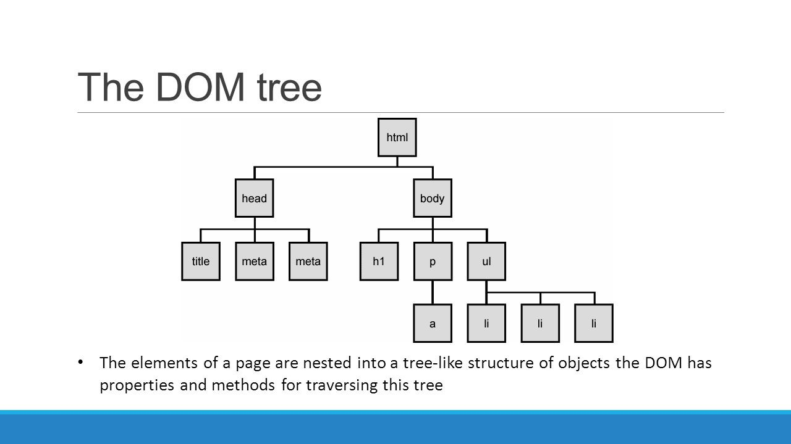

# Happy Hacking 수업 내용

## VSCODE 설치

### Extention 설치

- HTML Snippet
- Open in Browser
- HTML CSS Support

> :point_right:꿀팁!
>
> vscode 첫 줄에서 `!` `tab` 을 하면 기본적인 사항이 적용된다.
>
> snippet의 힘

## HTML

> HTML에 대한 기본적인 사항에 대하여 리마인드 하고 넘어간다.

- Hyper Text Markup Language의 약자
- `<head>`:
- `<body>`:
- attribute
- `DOM` 트리
- 시맨틱 태그
  - header
  - nav
  - aside
  - section
  - article
  - footer

### Tags

> CSS에 대한 기본적인 사항에 대하여 리마인드 하고 넘어간다.

- `h`, `p`, `div`, `span`
- `ol`, `ul`, `li`
- `table`, `tr`, `th`, `td`
- `section`
- `iframe`
- `img`
- `form`, `input`, `select`
  - text, email, password, number
  - radio, check
  - date

## CSS

- em

  em은 배수 단위로 상대 단위이다. 요소에 지정단 사이즈(상속된 사이즈나 디폴트 사이즈)에 상대적인 사이즈를 설정한다

- rem

  rem의 기준은 상속의 영향으로 바뀔 수 있다. 즉, 상황에 따라  1.2em은 각기 다른 값을 가질 수 있따. rem은 최상위 요소의 사이즈를 기준으로 삼는다. rem의 r은 root를 의미

- viewport

  디바이스 마다 다른 크기의 화면을 가지고 있기 때문에 상대적인 단위 viewport를 기준으로 만든 단위

- 색상표현

- box model의 구성

  - border
  - margin
  - padding
  - 크기지정은 shorthand 표현 가능

- display 속성

  - block
    - 항상 새로운 라인에서 시작
    - 100% 차지
    - 컨텐츠 영역 외에는 마진으로 채워진다
    - 정렬에는 margin을 auto로 설정
    - div, table emdemd

  - inline
    - 새로운 라인에서 시작하지 않으며 문자의 중간에 들어갈 수 있다.
    - content의 너비 만큼 지정 가능
    - span, a, strong, img, br, input, select, textarea, button

  - inline-block

    inline과는 다르게 상하좌우 마진 등을 줄 수 있다.

  - none

    해당 요소를 화면에 표현하지 않는다. 공간 조차 사라진다.

    ig. visibility:hidden - 해당 요소를 화면에 표현하지 않지만 공간은 남아 있다.

- 위치

  - static

  - relative(상대위치)

    top, bottom, left, right를 사용하여 위치를 이동

  - absolute(절대위치)

    부모 요소 또는 가장 가까이 있는 조상 요소(static 제외)를 기준으로 좌표 프로퍼티만큼 이동한다.

  - fixed(고정위치)

    부모 요소와 관계없이 브라우저의 viewport를 기준으로 위치를 잡는다.  스크롤 해도 사라지지 않는다.

#### Bootstrap

 https://getbootstrap.com/ 

#### Animate.css

 https://daneden.github.io/animate.css/ 

## Python

> 파이썬 기본 사항에 대하여 간단하게 훑고 지나감.

### flask

- virtualenv 가상 환경 설정

  >  독립적인 파이썬 가상환경 관리에 용이한 패키지

  ```bash
  > pip install virtualenv
  
  > virtualenv venv
  
  # 가상환경으로 들어가기
  > source venv/Scripts/activate
  
  # 빠져나가기
  > deactivate
  ```

- flask 설치

  ```
  pip install flask
  ```

- app.py

  ```python
  from flask import Flask
  import random
  
  app = Flask(__name__)
  
  @app.route("/")
  def hello():
      name = "World!!"
      return f"Hello {name}!"
  
  @app.route("/mulcam")
  def mulcal():
      return "Hello mulcam"
  
  @app.route("/greeting/<string:name>")
  def greeting(name):
      return f"{name}님 안녕하세요."
  
  
  @app.route("/lunch/<int:num>")
  def lunch(num):
      menu = ["짜장면", "짬뽕", "라면", "스파게티", "스테이크"]
      order = random.sample(menu, num)
      return str(order)
  
  @app.route("/lotto/<int:num>")
  def lotto(num):
      base = range(1, 47)
      lotnum = random.sample(base, num)
      return str(lotnum)
  
  
  # app.py 로 바로 실행 시
  if __name__ == "__main__":
      app.run(debug=True, port=8000)
  
  ```

- 실행

  ```bash
  # 1번 실행 예: 
  > env FLASK_APP=hello.py flask run
  # 2번 실행 예: 
  > python app.py
  ```

#### render_template

flask 상에서 html 파일을 해석해서 보여줌

- templates 폴더 생성

  이곳에 hi.html 등의 html 파일을 생성한다.

  ```bash
  mkdir templates
  
  # 만약 hi.html을 미리 만들었었다면
  mv hi.html templates/
  ```

  ***hi.html***

  ```html
  <h1>Hi, {{ name }}</h1>
  ```

  ***lunch.html***

  ```html
  <h1>오늘의 개인별 메뉴는!</h1>
  <h3>{{ menu }}</h3>
  
  <ul>
  
      <li>{{ m }}</li>
  
  </ul>
  ```

- 사용 예

  ```python
  # -----------------------------------------------------------------------------
  # render_template 적용
  # -----------------------------------------------------------------------------
  @app.route("/hi/<string:name>")
  def hi(name):
      return  render_template("hi.html", name=name)
  
  @app.route("/lunch2/<int:num>")
  def lunch2(num):
      menu = ["짜장면", "짬뽕", "라면", "스파게티", "스테이크"]
      order = random.sample(menu, num)
      return render_template("lunch.html", menu=order)
  ```

#### fake 검색엔진

***fake_xxx.html***

```html
<form action="https://search.naver.com/search.naver">
    <input type="text" name="query"/>
    <input type="submit">
</form>

<form action="https://www.google.com/search">
    <input type="text" name="q"/>
    <input type="submit">
</form>
```

***app source***

```python
# -----------------------------------------------------------------------------
# fake 검색엔진
# -----------------------------------------------------------------------------
@app.route("/fake_naver")
def fake_naver():
    return render_template('fake_naver.html')

@app.route("/fake_google")
def fake_google():
    return render_template('fake_google.html')
```

#### send 와 receive

***send.html***

```html
<form action="/receive" method="GET">
    이름: <input type="text" name="name"/><br>
    메세지: <input type="text" name="message"/><br/>
    <input type="submit" value="보내기"/>
</form>
```

***receive.html***

```html
<h1>{{ name }}: {{ msg }}</h1>
```

***indian_s.html***

```html
<form action="/indian_r" method="GET">
    이름을 입력해주세요: <input type="text" name="name"/><br>
    <input type="submit" value="보내기"/>
</form>
```

***indian_r.html***

```html
<h1>{{ name }}님의 인디언식 이름:</h1>
<h2> {{ pre }} {{ mid}}{{suf}} </h2> 
```

***app source***

```python
# -----------------------------------------------------------------------------
#  send와 receive
# -----------------------------------------------------------------------------
@app.route("/send")
def send():
    return render_template("send.html")

@app.route("/receive")
def receive():
    name = request.args.get('name')
    message = request.args.get('message')
    return render_template("receive.html", name=name, msg=message)


@app.route("/indian_s")
def indian_s():
    return render_template("indian_s.html")
    

@app.route("/indian_r")
def indian_r():
    name = request.args.get('name')

    list_1 = [
        "시끄러운, 말 많은", "푸른", "어두운 →적색", "조용한",
        "웅크린", "백색", "지혜로운", "용감한", "날카로운", "욕심 많은"]

    list_2 = [
        "늑대", "태양", "양", "매", "황소", "불꽃", "나무", "달빛", "말",
        "돼지", "하늘", "바람"]

    list_3 = [
        "와(과) 함께 춤을", "의 기상", "은(는) 그림자 속에", "의 환생",
        "의 죽음", "아래에서", "을(를) 보라.", "이(가) 노래하다.",
        "의 그늘 → 그림자", "의 일격", "에게 쫒기는 남자", "의 행진",
        "의 왕", "의 유령", "을 죽인 자.", "은(는) 맨날 잠잔다.",
        "처럼..", "의 고향", "의 전사", "은(는) 나의 친구", "의 노래",
        "의 정령", "의 파수꾼", "의 악마", "와(과) 같은 사나이",
        "의 심판자→을(를) 쓰러뜨린 자", "의 혼", "은(는) 말이 없다"
    ]

    pre = random.sample(list_1, 1)
    mid = random.sample(list_2, 1)
    suf = random.sample(list_3, 1)

    return render_template("indian_r.html", 
        name=name, pre=pre[0], mid=mid[0], suf=suf[0])
```

- 실행결과


#### requests 로또 번호 가져와서 맞춰보기

- lotto_get.html

  ```html
  <form action="/lotto_num" method="GET">
      원하시는 회차: <input type="text" name="num"/>
      <input type="submit" value="확인"/>
  </form>
  ```

- lotto_result.html

  ```html
  <div>
      회차: {{ num }}<br/>
      당첨번호: {{ winNum}}<br/>
      응모번호: {{ myNum}}<br/>
      결과: {{ msg }}<br/>
  </div>
  ```

- app source

  ```python
  # -----------------------------------------------------------------------------
  #  lotto 맞춰보기
  # -----------------------------------------------------------------------------
  # https://dhlottery.co.kr/common.do?method=getLottoNumber&drwNo=882
  
  @app.route("/lotto_get")
  def lotto_get():
      return render_template("lotto_get.html")
  
  @app.route('/lotto_num')
  def lotto_num():
      num = request.args.get('num')
      url= f"https://dhlottery.co.kr/common.do?method=getLottoNumber&drwNo={num}"
      res = requests.get(url).json()
      # pprint(res)
  
      base = range(1, 47)
      myNum = sorted(random.sample(base, 6))
  
      # list comprehention
      # [ 받는변수 for 받는변수 in 범위로된데이터 ]
      winNum = [ res[f"drwtNo{i}"] for i in range(1, 7) ]
  
      match = list(set(myNum) & set(winNum))
      hit = len(match)
      
      print(match)
  
      if hit == 6:
          rank = "1등입니다."
      elif hit == 5:
          rank = "2등입니다. "
      elif hit == 4:
          rank = "3등"
      elif hit == 3:
          rank = "4등"
      else:
          rank = "꽝 다음 기회에..."
  
      return render_template("lotto_result.html",
          num=num, winNum=winNum, myNum=myNum, msg=rank)
  
  ```

## Chat bot 만들기

### 준비작업

- Telegram 가입

- @BotFather 친추

- `/newbot` 으로 bot 생성 및 필수 사항 입력

- TOKEN 받기

- 기능 확인

  ```
  # 상태 확인
  https://api.telegram.org/botxxxxooxoxoxooxooOXOOXOXOxoxoxoxoxoxo/getMe
  
  # 업데이트 된 내용 확인 (chat_id 도 확인 가능)
  https://api.telegram.org/botxxxxooxoxoxooxooOXOOXOXOxoxoxoxoxoxo/getUpdates
  
  # 위에서 확인한 chat_id로 message 보내보기
  https://api.telegram.org/botxxxxooxoxoxooxooOXOOXOXOxoxoxoxoxoxosendMessage?chat_id=936561044&text=%EC%9C%BC%ED%95%98%ED%95%98%ED%95%98%ED%95%98%ED%95%98
  ```

### 코드 작성

- `.env` 에 TOKEN 설정
- `pip install python-decouple`

**app.py**

```python
from flask import Flask, request, render_template
from decouple import config
from pprint import pprint
import requests
import random

app = Flask(__name__)

token = config('TOKEN')
base_url = f"https://api.telegram.org/bot{token}"


# -----------------------------------------------------------------------------
# 로또 번호 보내보기
# -----------------------------------------------------------------------------
@app.route('/telegram')
def telegram(): 
    # telegram 서버에 data 요청
    # .json() 이 없으면 응답코드만 받음
    res = requests.get(f"{base_url}/getUpdates").json()
    pprint(res)

    # chat id 추출 (sendMessage 할 때 필요하기 때문)
    chat_id = res['result'][0]['message']['chat']['id']
    print(chat_id)

    lotNum = str(random.sample(range(1, 47), 6))
    res = requests.get(
        f"{base_url}/sendMessage?chat_id={chat_id}&text={lotNum}")

    return f"Message have sent: {lotNum}"


# -----------------------------------------------------------------------------
# View 를 이용하여 메시지 보내보기
# -----------------------------------------------------------------------------
@app.route('/chat')
def chat():
    return render_template("chat.html")
   

@app.route('/send_msg')
def send_message():
    req = request.args.get('chat')

    res = requests.get(f"{base_url}/getUpdates").json()
    chat_id = res['result'][0]['message']['chat']['id']

    send_url = f"/sendMessage?chat_id={chat_id}&text={req}"
    response = requests.get(base_url + send_url)

    return "보내기 완료"
# -----------------------------------------------------------------------------
# main process 로 실행 시
# -----------------------------------------------------------------------------
if __name__ == "__main__":
    app.run(debug=True)

```

### webHook 설정

> webHook을 설정하면 getUpdates 메서드는 더이상 작동하지 않게 된다. webHook으로 설정한 route로 테스트 필요.

**set_webhook.py**

```python
from decouple import config
import requests
from pprint import pprint

token = config('TOKEN')
base_url = f"https://api.telegram.org/bot{token}"
url = "https://1287d0fb.ngrok.io"
setweb_url = f"/setWebhook?url={url}"

req = requests.get(base_url + setweb_url).json()

pprint(req)
```

**ngrok 실행**

```bash
./ngrok.exe http 5000
```

**app.py** 내용 추가

```python
# -----------------------------------------------------------------------------
# 실시간 반응 Web hoc - ngrok.exe 이용
# -----------------------------------------------------------------------------
@app.route('/', methods=['POST'])
def tel_web():
    req = request.get_json().get('message')
    # pprint(req)

    # 방법 1
    print(req['chat']['id'], req['text'])

    # 방법 2
    if req is not None:
        chat_id = req.get('chat').get('id')
        text = req.get('text')
    print(chat_id, text)

    if re.search(r'로또', text):
        msg = str(random.sample(range(1, 47), 6))
    else:
        msg = text

    send_url = f"/sendMessage?chat_id={chat_id}&text={msg}"
    response = requests.get(base_url + send_url)
    
    return '', 200

```

### 인디언 이름 보내보기

**app.py 내용 추가**

```python
elif "/인디안" in text:
            name = text[text.index(" "):]
             
            list_1 = [
                "시끄러운, 말 많은", "푸른", "어두운 →적색", "조용한",
                "웅크린", "백색", "지혜로운", "용감한", "날카로운", 
                "욕심 많은"
            ]

            list_2 = [
                "늑대", "태양", "양", "매", "황소", "불꽃", "나무", "달빛",
                 "말", "돼지", "하늘", "바람"
            ]

            list_3 = [
                "와(과) 함께 춤을", "의 기상", "은(는) 그림자 속에", "의 환생",
                "의 죽음", "아래에서", "을(를) 보라.", "이(가) 노래하다.",
                "의 그늘 → 그림자", "의 일격", "에게 쫒기는 남자", "의 행진",
                "의 왕", "의 유령", "을 죽인 자.", "은(는) 맨날 잠잔다.",
                "처럼..", "의 고향", "의 전사", "은(는) 나의 친구", "의 노래",
                "의 정령", "의 파수꾼", "의 악마", "와(과) 같은 사나이",
                "의 심판자→을(를) 쓰러뜨린 자", "의 혼", "은(는) 말이 없다"
            ]

            pre = random.choice(list_1)
            mid = random.choice(list_2)
            suf = random.choice(list_3)

            msg = f"{name} : {pre} {mid}{suf}"
```

### Papago 번역 붙여보기

#### 사전준비

- NAVER 개발자 센터 App에  NMT 번역 API 설정
- `localhost` 등록
- .env에 키 설정 및 app.py에 headers 등록

#### 단독으로 붙여보기

```python
# -----------------------------------------------------------------------------
# 파파고 NMT 번역
# -----------------------------------------------------------------------------
@app.route('/papago')
def papago():
    C_ID = config('C_ID')
    C_SC = config('C_SC')
    url = "	https://openapi.naver.com/v1/papago/n2mt"

    headers = {
        'Content-Type': 'application/x-www-form-urlencoded; charset=UTF-8',
        'X-Naver-Client-Id': C_ID,
        'X-Naver-Client-Secret': C_SC
    }

    data = {
        'source': 'ko',
        'target': 'en',
        'text': "안녕하세요"
    }

    req = requests.post(url, headers=headers, data=data).json()
    pprint(req['message']['result']['translatedText'])

    return "Finish"
```

#### 텔레그램과 붙여보기 내용 추가

```python
elif "/번역" in text:
            req_text = text[text.index(" "):]
            data = {
                'source': 'ko',
                'target': 'en',
                'text': req_text
            }

            res = requests.post(url, headers=headers, data=data).json()
            msg = "번역 결과: " + res['message']['result']['translatedText']
```

### Python Anywhere 설정

#### 사전 준비

WEB > Add New Webapp > Files > my site > flask_app.py > 코드 복사 붙여넣기 > .env 업로드 > open bash > `pip3 install --user python-decouple`

#### 텔레그램 봇 webHook 재설정

> 텔레그램의 webHook 주소를 Python Anywhere로 설정하면 이제부터 계속 사용 가능하다.

**set_webhook.py**

```python
from decouple import config
import requests
from pprint import pprint

token = config('TOKEN')
base_url = f"https://api.telegram.org/bot{token}"
# url = "85bacf34.ngrok.io"
url = "CodeOrChord.pythonanywhere.com"
setweb_url = f"/setWebhook?url={url}"

req = requests.get(base_url + setweb_url).json()

pprint(req)
```

## Django

> 웹 개발 프레임워크.  http://hotframeworks.com/, https://octoverse.github.com/ 에서 좋은트렌드를 유지하고 있는 `python`과 `django`에 대해서 공부해본다.

- MTV(model, template, view)

  - M(model): MVC `M`과 같음

  - T(template): MVC `V`와 같음

    `요청` -> `urls` -> `View` -> `Template` 의 **순서**로 진행된다.

  - V(view): MVC `C`와 같음

### 설치 및 프로젝트 생성

```bash
$ pip install django

# 폴더명 중복으로 잘 쓰지 않는 방법
django-admin startproject mysite

# 권장 방법
$ mkdir django_ex
$ cd django_ex
$ django-admin startproject config .

# 서버 실행
$ python manage.py runserver {<port num>} # 없으면 8000이 기본
```

### setting.py 설정

```python
# SECRET_KEY를 decouple을 이용하여 .env 로 옮기는 등의 보안 처리를 한다.
# SECURITY WARNING: keep the secret key used in production secret!
SECRET_KEY = config('SECRET_KEY')

# localization 설정
# Internationalization
# https://docs.djangoproject.com/en/2.2/topics/i18n/
LANGUAGE_CODE = 'ko-kr'

TIME_ZONE = 'Asia/Seoul'
```

### app 만들기

```bash
$ python manage.py startapp pages
```

#### source 구조

- admin.py

  > database 설정 등 여러가지를 편리하게 설정할 수 있다.

- app.py

  > app의 추가 설정을 하는 곳

- models.py

  - model(M)을 담당하는 소스
  - class로 만든다

- tests.py

  > 테스트 코드를 작성하는 곳

- views.py

  > controller(C)를 담당하는 소스

#### app 설정

> settings.py 의 INSTALLED_APPS 에 생성한 앱을 설정한다. 새로 생성한 app을 상단에 붙여넣는 방식을 권장한다.

```python
INSTALLED_APPS = [
    'pages', # 방금 생성한 app를 등록한다.
    'django.contrib.admin',
    'django.contrib.auth',
    ...
]
```

#### index page 만들기

- urls.py 설정

  ```python
  from pages import views
  
  urlpatterns = [
      path('admin/', admin.site.urls),
      path('', views.index), #추가
  ]
  ```

- views.py에 index 함수 정의

  ```python
  from django.http import HttpResponse
  
  # Create your views here.
  def index(req):
      #return HttpResponse("Hello Django")
      return render(req, 'index.html')
  ```

- templates 디렉토리 생성 및 `index.html` 작성

  ```html
  <h1>Index Page</h1>
  <p>Hello Django!</p>
  ```

#### 동적 주소 설정하기

- type
  - `int`: 0 또는 양의 정수와 매치
  - `str`: /를 제외한 모든 문자열과 매치, 디폴트 값
  - `slug`: slug 형식(ASCII, 숫자, 하이픈, 밑줄)과 매치
  - `uuid`: uuid 형식의 문자열과 매치

- urls.py 설정

  ```python
  path('<int:age>/', views.age),
  ```

- views.py 설정

  ```python
  def age(req, age):
      return render(req, 'age.html', {'age' : age})
  ```

- age.html 작성

  ```html
  <h1>{{age}}</h1>
  ```

#### 동적 주소 실습

- urls.py

  ```python
  path('square/<int:num>/', views.square),
  path('<str:calc>/<int:a>/<int:b>/', views.calc)
  ```

- views.py

  ```python
  def square(req, num):
      return render(req, 'square.html', {
          'num' : num,
          'sol' : num**2
      })
  
  def calc(req, calc, a, b):
      if calc == 'plus':
          sol = a + b
          calc = "+"
      elif calc == 'minus':
          sol = a - b
          calc = "-"
      elif calc == 'multi':
          sol = a * b
          calc = "*"
      else:
          sol = a / b
          calc = "/"
  
      return render(req, 'calc.html', {
          'calc' : calc,
          'a' : a,
          'b' : b,
          'sol' : sol
      })
  ```

### joke2k/faker 사용해보기

> :point_right: https://github.com/joke2k/faker 

#### faker 설치

```bash
$ pip install faker
```

#### faker 사용

```python
from faker import Faker
...
 fake = Faker("ko_KR")
 b4job = fake.job()
... 
```

### Lorem Picsum 이용해보기

> :point_right: https://picsum.photos/ 
>
> Lorem Ipsum 도 있다.

```python
def image(req):
    num = random.choice(range(1, 1000))
    url = f"https://picsum.photos/id/{num}/320/320"
    return render(req, 'image.html', {
        'url' : url
    })
```

### Django Template Language(DTL)

> JSP의 EL과 JSTL을 합친 것과 같은(그보다 강력한) 템플릿 언어
>
> :point_right: [Django DTL]( https://docs.djangoproject.com/en/2.2/ref/templates/builtins/ ) 

```django
<h3>1. 반복문</h3>

    <p>{{ f }}</p>

<hr>

    <p>{{ forloop.counter }}. {{ f }}</p>

<hr>

    <p>{{ user }} 입니다.</p>

    <p>현재 가입한 유저가 없습니다.</p>

<hr>

<h3>2. 조건문</h3>

    <p>짜장면엔 단무지 최고!</p>

<hr>

    {{ forloop.counter }}번째 
    
        <p>짜장면 + 고추가루</p>
    
        <p>{{ f }}</p>
    

<hr>

<h3>3. lorem ipsum</h3>

<hr>

<hr>

<hr>

<hr>

<h3>4. length filter 활용</h3>

    
        <p>글씨가 너무 길어요.</p>
    
        <p>{{ message }}, {{ message|length}}</p>
    

<hr>

<h3>5. 글자수 제한(truncate)</h3>
<p>{{ my_sentence }}</p>
<p>{{ my_sentence|truncatewords:3 }} 단어 단위로 문장 제한</p>
<p>{{ my_sentence|truncatechars:5 }} 글자 단위로 문장 제한</p>
<p>{{ my_sentence|truncatechars:15 }} 글자 단위로 문장 제한</p>
<hr>

<h3>6. 글자 관련 필터</h3>
<p>{{  'abc'|length }}</p>
<p>{{ 'ABC'|lower }}</p>
<p>{{ my_sentence|title }}</p>
<P>{{ foods|random }}</P>

<!-- https://github.com/dbrgn/django-mathfilters -->
<h3>7. 연산</h3>
<p> {{ 4|add:6 }}</p>
<hr>

<h3>8. 날짜 표현</h3>
{{ timenow }}<br>
<br>
<br>
<br>
<br>
<hr>
<br>
<hr>

Copyright {{ current_year }}<br>
<hr>
{{ timenow|date:"SHORT_DATE_FORMAT" }}
<hr>

<h3>9. 하이퍼링크</h3>
{{ 'google.com'|urlize }}
```

- datetime 

  >  날짜 등을 다루어보고 생일 확인기를 만들어 본다

  html 을 이용하는 방법

  ```html
  
  
  <p>네!</p>
  
  <p>아니오...</p>
  
  
  <!-- 이 부분은 views.py 에서 계산 해온다 -->
  {{ d_day }}일 남았습니다.
  ```

  views.py 이용하는 방법

  ```python
  def isityourbirth(req):
      today = datetime.now()
      print(today)
      if today.month == 3 and today.date == 22:
          res = True
      else:
          res = False
  
      birth = datetime(2020, 3, 22)
      d_day = (birth - today).days
  
      return render(req, 'isityourbirth.html', {
          'res' : res,
          'd_day' : d_day
      })
  ```

- 주석

  ```html
  <!-- DTL 주석과 HTML 주석을 따로 적용 시켜줘야함. -->
  <!-- DTL 주석은 '{#' -->
  <!-- <p>{#{ 'abc'|length }}</p> -->
  ```

### Virtual Env 팁

```bash
$ pip freeze > requirements.txt
$ pip install -r requirements.txt
```

### GET method 통신

- views.py

  ```python
  def throw(request):
      return render(request, 'throw.html')
  
  def catch(request):
      # print(request)
      # print(request.path)
      # print(request.method)
      # print(request.META)
      print(request.GET)
  
      message = request.GET.get('message')
      message2 = request.GET.get('message2')
      context = {
          'msg': message,
          'msg2': message2
      }
  
      return render(request, 'catch.html', context)
  ```

- template

  ```html
  <h1>받을 내용 : {{ msg }} / {{ msg2 }}</h1>
  
  <form action="/catch/" method="GET">
      <label for="msg">메세지</label>
      <input type="text" name="message" id="msg"/><br/>
      <label for="msg2">메세지2</label>
      <input type="text" name="message2" id="msg2"/><br/>
      <input type="submit">
  </form>
  ```

### Artii API 사용해보기

- views.py

  ```python
  def artii(request):
      return render(request, 'artii.html')
  
  def artii_result(request):
      sent = request.GET.get('sent')
      sent = urllib.parse.quote(sent)
  
      font_url = "http://artii.herokuapp.com/fonts_list"
      font_list = requests.get(font_url).text.split("\n")
      font = random.choice(font_list)
  
      url = "http://artii.herokuapp.com/make?text=" + sent \
          + "&font=" + font
      res_text = requests.get(url).text
  
      return render(request, 'artii_result.html', {
          'result': res_text 
      })
  ```

- template

  ```html
  <!-- artii.html -->
  <form action="/artii_result/" method="GET">
      <label for="sent">요청 문장</label>
      <input type="text" name="sent" id="sent"/>
      <input type="submit"/>
  </form>
  
  <!-- artii_result.html -->
  {{ result }}
  ```

### POST method 통신

> 디비를 생성/변경할 때 주로 사용하고 html body 정보를 담아 전송
>
> 원칙적으로 POST 요청은 html 파일로 응답하면 안 됨.
>
> - POST 요청이 오면 GET 요청 받는 페이지로 redirec (RESTful)
>
> Django는 POST data를 그냥 보내지 않는다.
>
> - **csrf_token**(Cross Site Request Forgery Token)을 사용하여 보안성을 확보한다.
> - 이 토큰을 보내지 않으면 **`403 forbidden error`** 가 발생된다.

- views.py

  ```python
  def user_new(request):
      return render(request, 'user_new.html')
  
  def user_create(request):
      username = request.POST.get('name')
      pw = request.POST.get('pw')
      
      context = {
          'username': username,
          'pw': pw
      }
  
      return render(request, 'user_create.html', context)
  ```

- template (중요)

  ```html
  <form action="/user_create/" method="POST">
       <!-- 매우 중요!!!!! -->
      <label for="name">이름</label>
      <input type="text" name="name" id="name"><br/>
      <lable for="pw">패스워드</lable>
      <input type="password" name="pw" id="pw"><br/>
      <input type="submit">
  </form>
  ```

- list 받기

  > 리스트로 넘어온 값은 `request.POST.get`으로 받으면 단일 값만 넘어오므로 `getlist`로 받아야 한다

  ```python
  data.getlist('etc')
  ```

### Static File

> HTML 최상단에 ``을 선언하면 기본적으로 static 파일을 사용할 수 있다.

- template

  ```html
  
  <!DOCTYPE html>
  <html lang="en">
  <head>
      <meta charset="UTF-8">
      <meta name="viewport" content="width=device-width, initial-scale=1.0">
      <meta http-equiv="X-UA-Compatible" content="ie=edge">
      <title>Document</title>
      <link rel="stylesheet" href="">
  </head>
  <body>
      <h1>Static 파일 실습</h1>
      
  </body>
  </html>
  ```

- `<app name>/static/<something> ` 구조로 static 파일을 넣어두면 위와 같은 방법으로 사용 가능하다.

### urls.py (중요)

- main urls.py 변경

  ```python
  from django.contrib import admin
  from django.urls import path, include
  
  urlpatterns = [
      path('pages/', include('pages.urls')),
      path('admin/', admin.site.urls),
  ]
  ```

- app의 urls.py 작성

  ```
  from django.urls import path
  from . import views
  
  urlpatterns = [
      path('throw/', views.throw),
      path('catch/', views.catch),
      path('lotto/', views.lotto),
      path('lotto_result/', views.lotto_result),
      path('artii/', views.artii),
      path('artii_result/', views.artii_result),
      path('user_new/', views.user_new),
      path('user_create/', views.user_create),
      path('subway_form/', views.subway_form),
      path('subway_result/', views.subway_result),
      path('static_example/', views.static_example),
  ]
  ```

- template 폴더에 app 명으로 서브 디렉토리를 만들고 그 안에 모든 template 넣기

  >Django는 template을 찾을 때 첫 번째 app의 template 폴더 밑에 해당 이름의 html파일을 찾기 때문에 디렉토리 분리를 위와 같이 해줘야 한다.

### 템플릿 상속

#### setting.py 설정

```python
TEMPLATES = [
    {
        'BACKEND': 'django.template.backends.django.DjangoTemplates',
        'DIRS': [
            os.path.join(BASE_DIR, 'config', 'templates')
        ],
        'APP_DIRS': True, #App에 있는 templates를 불러 올 것인지
        'OPTIONS': {
            'context_processors': [
                'django.template.context_processors.debug',
                'django.template.context_processors.request',
                'django.contrib.auth.context_processors.auth',
                'django.contrib.messages.context_processors.messages',
            ],
        },
    },
]
```

#### base template 만들기

> `<app-root>/config/templates/`에  base.html 을 만든다.

***base.html***

```html
<!DOCTYPE html>
<html lang="ko">
<head>
    <meta charset="UTF-8">
    <meta name="viewport" content="width=device-width, initial-scale=1.0">
    <meta http-equiv="X-UA-Compatible" content="ie=edge">
    <title></title>
    
    
</head>
<body>
    <h1>여기는 BASE입니다.</h1>
    
    
</body>
</html>
```

#### 상속받을 html 수정하기

***pages/tempates/pages/index.html***

```html


INDEX PAGE


    <h1>여기는 PAGES의 INDEX입니다.</h1>

```

***pages/template/pages/static_example.html***

```html


Static Test

    <link rel="stylesheet" href="">


    <h1>Static 파일 실습</h1>
    


```

### ORM-Boards 구현

> 지금까지 배웠던 모든 것(urls 관리, template, template 상속, static적용 등 )을 적용하고 추가로 그 위에 ORM을 적용 하는 법을 배운다.

#### Database 용어

- query: 데이터에 관한 질의
- database: 체계화된 데이터의 모임
- schema: 데이터베이스의 구조, 관계 등에 관한 정의
- 테이블
  - 필드: 컬럼
  - 레코드: 로우

#### ORM(Object Relational Mapping)

- 장점
  - SQL을 몰라도 사용이 가능하다.
  - 코드의 가독성이 좋다.
  - 객체지향적인 접근으로 인해 생산성이 좋아진다.
  - ERD 관련 작업에서 의존성을 낮을 수 있다.
  - MTV(MVC)패턴을 견고하게 해준다.
- 단점
  - 모든것을 ORM으로 구현할 수 있다.
  - 사용은 편하지만 설계할 때는 주의해야한다.
  - 관계가 복잡해질 경우 난이도가 올라갈 수 있다.
  - 잘못 구현하면 속도저하가 일어날 수 있다.

#### class 테스트

```bash
>>> class Person:
...     name = "사람의 고유한 이름"
...     age = "출생 이후로부터 삶을 마감할 때까지의 기간"  
...     def greeting(self):
...             print(f"{self.name}이 인사합니다.")
...     def eating(self):
...             print(f"{self.name}이 밥을 먹고 있습니다.")  
...     def aging(self):
...             print(f"{self.name}은 현재 {self.age}살이지만 점점 나이를 더 먹겠죠.") 

>>> justin = Person()
>>> justin.name = "수능 보는 justin"
>>> justin.age = 19
>>> justin.greeting()
수능 보는 justin이 인사합니다.
>>> justin.eating()
수능 보는 justin이 밥을 먹고 있습니다.
>>> justin.aging()
수능 보는 justin은 현재 19살이지만 점점 나이를 더 먹겠죠.

```

#### Model

> - 모델은 단일 데이터에 대한 정보를 가지고 있다. 필수적인 필드(컬럼)과 데이터(레코드)에 대한 정보를 포함한다.
> - 각각의 모델은 각각의 DB 테이블과 매핑된다.
> - 사용자가 저장하는 데이터들의 필수적인 필드(컬럼) 동작을 포함한다.

##### Model 정의

***<app>/models.py***

```python
from django.db import models

# Create your models here.
class Board(models.Model):
    title = models.CharField(max_length=10)
    content = models.TextField()
    created_at = models.DateTimeField(auto_now_add=True)
    
```

##### Model 생성 - ```makemigrations```

> bash 명령어로 모델을 생성한다
>
> ```python manage.py makemigrations```

```bash
$ python manage.py makemigrations
Migrations for 'boards':
  boards\migrations\0001_initial.py
    - Create model Board
```

##### 생성된 <app>/migrations/ 확인

***0001_initial.py***

```python
# Generated by Django 2.2.7 on 2019-11-14 01:48

from django.db import migrations, models


class Migration(migrations.Migration):

    initial = True

    dependencies = [
    ]

    operations = [
        migrations.CreateModel(
            name='Board',
            fields=[
                ('id', models.AutoField(auto_created=True, primary_key=True, serialize=False, verbose_name='ID')),
                ('title', models.CharField(max_length=10)),
                ('content', models.TextField()),
                ('created_at', models.DateTimeField(auto_now_add=True)),
            ],
        ),
    ]

```

##### Create Query 확인

> 생성된 Model의 create query를 확인
>
> ```python manage.py sqlmigrate boards 0001```

```bash
$ python manage.py sqlmigrate boards 0001
BEGIN;
--
-- Create model Board
--
CREATE TABLE "boards_board" ("id" integer NOT NULL PRIMARY KEY AUTOINCREMENT, "title" varchar(10) NOT 
NULL, "content" text NOT NULL, "created_at" datetime NOT NULL);
COMMIT;
```

##### Database Model 적용 확인 - ```showmigrations```

> Model이 database에 적용되었는지 확인
>
> ```$ python manage.py showmigrations```

```bash
admin
 [ ] 0001_initial
 [ ] 0002_logentry_remove_auto_add
 [ ] 0003_logentry_add_action_flag_choices
auth
 [ ] 0001_initial
 [ ] 0002_alter_permission_name_max_length
 [ ] 0003_alter_user_email_max_length
 [ ] 0004_alter_user_username_opts
 [ ] 0005_alter_user_last_login_null
 [ ] 0006_require_contenttypes_0002
 [ ] 0007_alter_validators_add_error_messages
 [ ] 0008_alter_user_username_max_length
 [ ] 0009_alter_user_last_name_max_length
 [ ] 0010_alter_group_name_max_length
 [ ] 0011_update_proxy_permissions
boards
 [ ] 0001_initial
 [ ] 0002_board_updated_at
contenttypes
 [ ] 0001_initial
 [ ] 0002_remove_content_type_name
sessions
 [ ] 0001_initial
```

##### Database에  Model 적용 - ```migrate```

> `migrate` 명령으로 model을 database에 적용한다.
>
> ```$ python manage.py migrate```

```bash
$ python manage.py migrate
Operations to perform:
  Apply all migrations: admin, auth, boards, contenttypes, sessions
Running migrations:
  Applying contenttypes.0001_initial... OK
  Applying auth.0001_initial... OK
  Applying admin.0001_initial... OK
  Applying admin.0002_logentry_remove_auto_add... OK
  Applying admin.0003_logentry_add_action_flag_choices... OK
  Applying contenttypes.0002_remove_content_type_name... OK
  Applying auth.0002_alter_permission_name_max_length... OK
  Applying auth.0003_alter_user_email_max_length... OK
  Applying auth.0004_alter_user_username_opts... OK
  Applying auth.0005_alter_user_last_login_null... OK
  Applying auth.0006_require_contenttypes_0002... OK
  Applying auth.0007_alter_validators_add_error_messages... OK
  Applying auth.0008_alter_user_username_max_length... OK
  Applying auth.0009_alter_user_last_name_max_length... OK
  Applying auth.0010_alter_group_name_max_length... OK
  Applying auth.0011_update_proxy_permissions... OK
  Applying boards.0001_initial... OK
  Applying boards.0002_board_updated_at... OK
  Applying sessions.0001_initial... OK
Operations to perform:
  Apply all migrations: admin, auth, boards, contenttypes, sessions
Running migrations:
  Applying contenttypes.0001_initial... OK
  Applying auth.0001_initial... OK
  Applying admin.0001_initial... OK
  Applying admin.0002_logentry_remove_auto_add... OK
  Applying admin.0003_logentry_add_action_flag_choices... OK
  Applying contenttypes.0002_remove_content_type_name... OK
  Applying auth.0002_alter_permission_name_max_length... OK
  Applying auth.0003_alter_user_email_max_length... OK
  Applying auth.0004_alter_user_username_opts... OK
  Applying auth.0005_alter_user_last_login_null... OK
  Applying auth.0006_require_contenttypes_0002... OK
  Applying auth.0007_alter_validators_add_error_messages... OK
  Applying auth.0008_alter_user_username_max_length... OK
  Applying auth.0009_alter_user_last_name_max_length... OK
  Applying auth.0010_alter_group_name_max_length... OK
  Applying auth.0011_update_proxy_permissions... OK
  Applying boards.0001_initial... OK
  Applying boards.0002_board_updated_at... OK
  Applying sessions.0001_initial... OK
```

##### SQLITE 3 관련 툴 설치

:point_right: https://www.sqlite.org/download.html 

[sqlite-dll-win64-x64-3300100.zip](https://www.sqlite.org/2019/sqlite-dll-win64-x64-3300100.zip) (788.50 KiB)

 [sqlite-tools-win32-x86-3300100.zip](https://www.sqlite.org/2019/sqlite-tools-win32-x86-3300100.zip)(1.72 MiB) 

- sqlite-tools 압축 해제후 원하는 위치에 놓고

- dll 폴더의 파일들을 위 폴더에 넣기

```bash
$ vim ~/.bashrc

alias sqlite="c:/sqlite/sqlite3.exe"
:wq

$ source ~/.bashrc
$ sqlite
sqlite> .exit

$ sqlite db.sqlite3 
SQLite version 3.30.1 2019-10-10 20:19:45
Enter ".help" for usage hints.
sqlite> .tables ######### <----------테이블 확인
auth_group                  boards_board
auth_group_permissions      django_admin_log
auth_permission             django_content_type
auth_user                   django_migrations
auth_user_groups            django_session
auth_user_user_permissions
sqlite> .schema boards_board ########## <------------스키마 확인
CREATE TABLE IF NOT EXISTS "boards_board" ("id" integer NOT NULL PRIMARY KEY AUTOINCREMENT, "title" varchar(10) NOT NULL, "content" text NOT NULL, "created_at" datetime NOT NULL, "updated_at" datetime NOT NULL);
```

##### python shell로 테이블 확인 및 레코드 생성

>```python manage.py shell```

- 레코드 넣어보기

  ```bash
  $ python manage.py shell
  >>> from boards.models import Board
  >>> Board.objects.all() ### select * from board 와 같은 명령
  <QuerySet []>
  # 첫 번째 방법
  >>> board = Board()
  >>> board.title = "first"
  >>> board.content = "django !!!!"
  >>> board   
  <Board: Board object (None)>
  >>> board.save()
  >>> board
  <Board: Board object (1)>
  # 두 번째 방법
  >>> board = Board(title="second", content="django")
  >>> board.save()
  >>> board
  <Board: Board object (2)>
  # 세 번째 방법
  >>> Board.objects.create(title="third", content="django3")
  <Board: Board object (3)>
  # 테이블 확인 - query set list로 반환되는 것을 알 수 있다.
  >>> Board.objects.all()
  <QuerySet [<Board: Board object (1)>, <Board: Board object (2)>, <Board: Board object (3)>]>
  ```

- 모델에 함수 추가 - ***toString()***과 같은 역할

  ```python
  def __str__(self):
  	return f"{self.id} : {self.title}"
  
  # 모델이 변경된 것이 아니기 때문에 makemigrations를 하지 않아도 된다.
  ```

- 다시 Shell을 통해 ORM으로 데이터 확인

  > 변경된 부분을 적용하기 위해선 shell을 다시 시작해야한다.

  ```bash
  $ python manage.py shell
  Python 3.7.5 (tags/v3.7.5:5c02a39a0b, Oct 15 2019, 00:11:34) [MSC v.1916 64 bit (AMD64)] on win32
  Type "help", "copyright", "credits" or "license" for more information.
  (InteractiveConsole)
  >>> from boards.models import Board
  >>> Board.objects.all()
  <QuerySet [<Board: 1 : first>, <Board: 2 : second>, <Board: 3 : third>]>
  >>>
  ```

##### 정리

1. 첫 번째 방식

   ```bash
   >>> board = Board()
   >>> board.title = "값"
   >>> board.save()
   ```

2. 두 번째 방식

   ```bash
   >>> board = Board(title="값", content="값")
   >>> board.save()
   ```

3. 세 번째 방식

   ```bash
   >>> board = Board.objects.create(title="값", content="값")
   ```

##### Validation 체크

```bash
board2 = Board()
>>> board2.title = "12345678901"
>>> board2.full_clean() # <--------------- 정합성 체크
Traceback (most recent call last):
  File "<console>", line 1, in <module>
  File "C:\GIT@JA~1\MULTIC~1\해피해~1\실습\venv\lib\site-packages\django\db\models\base.py", line 1203, in full_clean
    raise ValidationError(errors)
django.core.exceptions.ValidationError: {'title': ['이 값이 최대 10 개의 글자인지 확인하세
요(입력값 11 자).'], 'content': ['이 필드는 빈 칸으로 둘 수 없습니다.']}
```

##### 기본 사용 법

- indexing

  ```bash
  # indexing
  >>> b = Board.objects.all()
  >>> b
  >>> b[0]
  <Board: 1 : first>
  >>> b[0].title
  'first'
  ```

- get

  > 단일 레코드를 선택할 때 사용 한다.
  >
  > 조건에 해당하는 객체가 많을 경우에는 에러 발생

  ```bash
  # select one by condition (get)
  >>> b = Board.objects.get(pk=3)
  >>> b                 
  <Board: 3 : third>
  >>> b = Board.objects.get(title='second')
  >>> b
  <Board: 2 : second
  ```

- filter

  >조건에 맞는 여러 레코드를 선택할 때 사용한다.

  ```bash
  # select many by condition (filter)
  >>> Board.objects.create(title='second', content="두 번째")
  >>> b = Board.objects.filter(title="second") 
  >>> b
  <QuerySet [<Board: 2 : second>, <Board: 5 : second>]>
  ```

- slicing

  > 파이썬 문법과 같게 슬라이싱을 사용할 수 있다.

  ```bash
  >>> b = Board.objects.all()
  >>> b[1:3]
  <QuerySet [<Board: 2 : second>, <Board: 3 : third>]>
  
  # 타입 확인
  >>> type(b)
  <class 'django.db.models.query.QuerySet'>
  >>> type(b[0])
  <class 'boards.models.Board'>
  ```

- like

  ***__contains***, ***__startswitdh***, ***__endswith***

  ```bash
  # __contains
  >>> b = Board.objects.filter(title__contains="sec") 
  >>> b
  <QuerySet [<Board: 2 : second>, <Board: 5 : second>]>
  
  
  # __startswith
  >>> b = Board.objects.filter(title__startswith="fi")
  >>> b
  <QuerySet [<Board: 1 : first>]>
  
  # __endswith
  >> b = Board.objects.filter(title__endswith="d")
  >>> b
  <QuerySet [<Board: 2 : second>, <Board: 3 : third>, <Board: 5 : second>]>
  ```

- update

  ***save()***

  ```bash
  >>> b.title = "hello orm"
  >>> b
  <Board: 1 : hello orm>
  >>> b.save()
  
  # 확인
  >>> b = Board.objects.get(pk=1)
  >>> b
  <Board: 1 : hello orm>
  ```

- delete

  ***delete()***

  ```bash
  >>> b = Board.objects.get(pk=3)
  >>> b
  <Board: 3 : third>
  >>> b.delete()
  (1, {'boards.Board': 1})
  
  #확인
  >>> Board.objects.all()
  <QuerySet [<Board: 1 : hello orm>, <Board: 2 : second>, <Board: 4 : forth>, <Board: 5 : second>]>
  ```

#### Subway 주문 실습

> Board와 같이 동일하게 설정하고 특이사항은 아래와 같다.

- admin.py

  ```python
  from django.contrib import admin
  from .models import Board, Subway
  
  # Customizing
  class BoardAdmin(admin.ModelAdmin):
      fields = ['content', 'title']
      list_display = ['id', 'title', 'updated_at', 'created_at']
      list_filter = ['updated_at']
      search_fields = ['title', 'content']
      
  
  # Register your models here.
  admin.site.register(Board, BoardAdmin)
  admin.site.register(Subway)
  ```

- models.py

  ```python
  class Subway(models.Model):
      name = models.CharField(max_length=10)
      date = models.DateTimeField()
      sandwich =  models.CharField(max_length=20)
      size = models.IntegerField()
      bread = models.CharField(max_length=20)
      source = models.TextField()
  
      def __str__(self):
          return f"{self.name}, {self.date}, {self.sandwich}," +\
              f"{self.size}, {self.bread}"
  
  ```

- urls.py

  ```python
  urlpatterns = [
      path('', views.index),
      path('order/', views.order),
      path('order_result/', views.order_result),
      path('order_list/', views.order_list),
      path('order/<int:id>/', views.order_id),
  ]
  ```

- views.py

  ```python
  def order(request):
      return render(request, "boards/order.html")
  
  def order_result(request):
      data = request.POST
  
      subway = Subway()
      subway.name = data['name']
      subway.date = data['date']
      subway.sandwich = data['sandwich']
      subway.bread = data['bread']
      subway.size = data['size']
      subway.source = ", ".join(data.getlist('source'))
      subway.save()
  
      subways = Subway.objects.all()
      context = {
          'subways': subways
      }
  
      return render(request, "boards/order_result.html", context)
  
  def order_list(request):
      subways = Subway.objects.all()
      context = {
          'subways': subways
      }
  
      return render(request, "boards/order_list.html", context)
  
  def order_id(request, id):
      context = {'id': id}
  
      subway = Subway.objects.filter(id=id)
      context['result'] = subway[0] if len(subway) > 0 else {
          'id': "해당 ID 정보가 없습니다."}
  
      return render(request, "boards/order_id.html", context)
  
  ```

#### ORM 정리

- SQL을 몰라도 DB를 활용할 수 있다.

- model

  - class명이 table명
  - 클래스 변수가 column명
  - `__str__`를 오버라이딩 함으로써 toString() 과 같은 역할을 수행할 수 있다.

- model 적용

  - `python manage.py makemigrations`
    - 장고에서 변경된 부분을 migrations 폴더안에 0001과 같이 명세서를 작성
    - 장고에서 변경점을 못 찾을 때는 새롭게 생성된 migration을 삭제한 후 다시 시도하면 적용 된다
  - ```python manage.py migrate```
    - migration 파일을 바탕으로 db에 테이블을 적용.

- admin.py

  - 거의 DB 관리용 페이지라고 봐도 무방하다.
  - 일반 사용자에게 보여지는 페이지는 아님.

  - fields 수정할 때 나타나는 수정박스를 나타나게할 수 있다.

    fields list, tuple 형식으로 수정할 항목이나 순서를 설정할 수 있다.

    ※ auto_now=True 일 경우 editable=False가 되므로 이러한 field는 설정할 수 없다.

  - list_filter

    - `bool`, `char`, `date`, `datetime`, `integer` 속성만 설정할 수 있다.

#### 관리자(admin) 계정 만들기

> 장고의 강력한 admin  기능을 사용해본다.
>
> - 사용자 관리
> - ORM model  관리

:point_right: https://tutorial.djangogirls.org/ko/django_admin/ 

- 계정 생성

  ```bash
  python manage.py createsuperuser
  사용자 이름 (leave blank to use 'student'): admin
  이메일 주소:
  Password:12341234
  Password (again):12341234
  비밀번호가 너무 일상적인 단어입니다.
  비밀번호가 전부 숫자로 되어 있습니다.
  Bypass password validation and create user anyway? [y/N]: y
  Superuser created successfully.
  ```

- admin.py

  ```python
  from django.contrib import admin
  from .models import Board
  
  # Register your models here.
  admin.site.register(Board)
  ```

- 접속 및 Board(Model) 등록 상황  확인

  ```loacalhost:8000/admin```

  

- 필트 순서 등 커스터마이징 하기

  ***admin.py***

  ```python
  # Customizing
  class BoardAdmin(admin.ModelAdmin):
      # 자세히 보기 컬럼 순서 변경
      fields = ['content', 'title'] 
      # 리스트 컬럼 순서 변경
      list_display = ['id', 'title', 'updated_at', 'created_at']
      # 해당 필드 필터 기능 추가
      list_filter = ['updated_at']
      # 검색 기능 추가
      search_fields = ['title', 'content']
  
  # Register your models here.
  admin.site.register(Board, BoardAdmin) # BoardAdmin 추가
  ```

source tree test

### CRUD

> Create / Read / Update / Delete

#### Model 정의

**models.py**

```python
from django.db import models

# Create your models here.
class Article(models.Model):
    title = models.CharField(max_length=50)
    content = models.TextField()
    created_at = models.DateTimeField(auto_now_add=True)
    updated_at = models.DateTimeField(auto_now=True)

    def __str__(self):
        return f"{self.id} {self.title}"
```

※`__save__` 정의시 auto_now_add 등의 기능등을 직접 구현할 수 있다

#### migration

> 명세서 작성 및 실적용

```bash
$ python manage.py makemigrations # 1단계 명세서 작성
Migrations for 'crud':
  crud\migrations\0001_initial.py
    - Create model Article

$ python manage.py migrate # 2단계 적용
Operations to perform:
  Apply all migrations: admin, auth, contenttypes, crud, sessions
...
Applying crud.0001_initial... OK
Applying sessions.0001_initial... OK
  
```

#### form 작성

***new.html***

```html


New

    <link href="" rel="stylesheet"/>


<div class="container">
    <h3>새 글 쓰기</h3>
    <hr>
    <form action='/crud/create/' method='POST'>
        
        <div class='form-group'>
            <label for='title'>Title</label>
            <input type='text' class='form-control' name='title' id='title'>
        </div>
        <div class='form-group'>
            <label for='content'>Content</label>
            <textarea class="form-control"  cols='30' rows='5' name='content' id='content'></textarea>
        </div>
        <button type='submit' class='btn btn-primary'>작성하기</button>
    </form> 
</div>


```

***views.py***

```python
def new(reuqest):
    return render(reuqest, 'crud/new.html', )
```

#### Create

***new.html***

```html


New

    <link href="" rel="stylesheet"/>


<div class="container">
    <h3>새 글 쓰기</h3>
    <hr>
    <form action='/crud/create/' method='POST'>
        
        <div class='form-group'>
            <label for='title'>Title</label>
            <input type='text' class='form-control' name='title' id='title'>
        </div>
        <div class='form-group'>
            <label for='content'>Content</label>
            <textarea class="form-control"  cols='30' rows='5' name='content' id='content'></textarea>
        </div>
        <button type='submit' class='btn btn-primary'>작성하기</button>
    </form> 
</div>


```

***views.py***

```python
def create(request):
    title = request.POST.get('title')
    content = request.POST.get('content')

    # DB에 저장
    article = Article()
    article.title = title
    article.content = content
    article.save()

    return render(request, 'crud/created.html')
```

#### Read

***index.html***

```html


Index

    <link href="" rel="stylesheet"/>


<div class="container">
    <h3>Article List</h3>
    <hr>
    <table class="table">
        <tr>
            <th>ID</th>
            <th>title</th>
        </tr>
        
        <tr>
            <td><a href="/crud/{{ art.pk }}/article/">{{ art.id }}</a></td>
            <td><a href="/crud/{{ art.pk }}/article/">{{ art.title }}</a></td>
        </tr>
        
    </table>
</div>

```

***detail.html***

```html


Detail

    <link href="" rel="stylesheet"/>


<div class="container">
    <h3>글 자세히 보기</h3>
    <hr>
    <form action='#' method='POST'>
        
        <div class='form-group'>
            <label for='title'>Title</label>
            <input type='text' class='form-control' name='title' id='title'
                value="{{article.title}}" disabled>
        </div>
        <div class='form-group'>
            <label for='content'>Content</label>
            <textarea class="form-control"  cols='30' rows='5' name='content' id='content' disabled>{{ article.content }}</textarea>
        </div>
    </form> 
    <a class="btn btn-warning" href="/crud/{{ article.id }}/update/" role="button">수정하기</a>
    <a class="btn btn-danger" href="/crud/{{ article.id }}/delete/" role="button">삭제하기</a>
</div>

</div>

```

***views.py***

> ※ 팁: index의 역순 정렬 기능 등을 확인

```python
def index(request):
    # python 에서 역순 정렬
    # articles = Article.objects.all()[::-1]
    
    # ORM 으로 정렬
    articles = Article.objects.order_by('-id')
    context = {
        'articles': articles
    }
    return render(request, 'crud/index.html', context)

def detail(request, pk):
    #(pk=pk) 가(id__exact=pk)
    article = Article.objects.get(pk=pk)
    context = {
        'article': article
    }

    return render(request, 'crud/detail.html', context)

```

#### Update

***update.html***

```html


Update

    <link href="" rel="stylesheet"/>


<div class="container">
    <h3>글 수정하기</h3>
    <hr>
    <form action='/crud/{{ article.id }}/revise/' method='POST'>
        
        <div class='form-group'>
            <label for='title'>Title</label>
            <input type='text' class='form-control' name='title' id='title'
                value="{{ article.title }}">
        </div>
        <div class='form-group'>
            <label for='content'>Content</label>
            <textarea class="form-control"  cols='30' rows='5' name='content' id='content'>{{ article.content }}</textarea>
        </div>
        <button type='submit' class='btn btn-primary'>수정하기</button>
    </form> 
</div>

```

***views.py***

```python
def update(request, pk):
    #(pk=pk) 가(id__exact=pk)
    article = Article.objects.get(pk=pk)
    context = {
        'article': article
    }

    return render(request, 'crud/update.html', context)

## redirect 사용!!!
def revise(request, pk):
    article = Article.objects.get(pk=pk)

    article.title = request.POST.get('title')
    article.content = request.POST.get('content')
    article.save()

    context = {
        'article': article
    }

    return redirect(f"/crud/{article.id}/article/")
```

#### Delete

***views.py***

```python
def delete(request, pk):
    article = Article.objects.get(pk=pk)
    article.delete()

    return redirect("/crud/")
```

### CRUD Subway(CRUD 복습)

> 반복이 중요... (동의)

- Subway

  - name
  - address
  - phone
  - menu
  - bread
  - vegetable
  - sauce
  - drink
  - created_at
  - updated_at

- nav bar

  홈으로 버턴 / 새로 주문하기

- index page

  - 주문자명, 메뉴명, 주문일자가 list로 보여짐
  - 클릭하면 detail 정보로 넘어가게 됨

- detail page

  - 주문 정보에 대한 내용 전부 출력
  - 하단에 수정하기/삭제 버튼

- 수정하기 page

  주문 내용을 수정하면 됨

- 삭제하기 page

  주문 내용을 삭제하면 됨

:point_right:꿀팁 ***URL 편하게 관리하기***

> urls.py 에서 name을 지정한 후 html 파일에서 사용하면 된다.

***urls.py***

```python
app_name = "subway"
urlpatterns = [
    path('', views.index, name='index'),
    path('order/', views.order, name='order'),
    path('order_do/', views.order_do, name='order_do'),
    path('detail/<int:pk>/', views.detail, name='detail'),
    path('edit/<int:pk>/', views.edit, name='edit'),
    path('update/<int:pk>/', views.update, name='update'),
    path('delete/<int:pk>/', views.delete, name='delete'),
]
```

***html***

```html
<!-- 기본 사용법 -->
<a class="nav-link" href="">Home</a>

<!-- 파라미터가 들어가야 하는 경우 -->
<a href=""
```

***views.py***

> python code 내에서 사용시 아래와 같이 사용한다.

```python
return redirect('subway:detail', pk)
```

### RESTful

> Represtational State Transfer.  Roy Fielding이 논문으로 아키텍쳐 발표.
>
> - http 설계의 우수성에 비해 활용을 제대로 하고 있지 못한 관계로 고안.

#### HTTP

- Request/Response로 서버와 클라이언트간 HTTP 통신

- 웹서버는 웹 리소스(static files)를 관리하고 제공을 함

- 미디어 타입: 수천가지 데이터 타입이 존재

  MIME(Multipurpose Intenrnet Mail Extendsions)

  - html: text/html
  - jpeg: image/jpeg
  - ASCII: text/plain

- URI(URL + URN)

  - URL: 리소스의 위치. ```스킴://서버위치/경로```, 스킴: 리소스에 접근하기위한 프로토콜
  - URN:  위치에 독립적임.

#### REST의 구성

- 자원: URI
- 행위: HTTP Method(GET / POST / PUT / DELETE / PATCH)
- 표현

#### REST 디자인 가이드

- '/'는 계층 관계를 나타내는데 사용
- '_' 대선 '-'를 활용
- 정보의 자원을 표현해야 함.

```bash
# REST 하지 않은 예 (GET)
GET /boards/show/1
# REST 한 예
GET /boards/1

# REST 하지 않은 예 (POST)
GET /boards/create
# REST 한 예
POST /boards

# REST 하지 않은 예 (PUT)
GET /boards/update
# REST 한 예
PUT /boards/1

# REST 하지 않은 예 (DELETE)
GET /boards/1/delete
# REST 한 예
DELETE /boards/1
```

> :point_right: ***Django 에서는 HTTP method 를 GET/POST 만 지원한다.*** 따라서 GET을 제외한 모든 행위를 POST로 보내고 행위를 선언하는 식으로 해결한다.

#### CRUD를 semi-RESTful 로 바꿔보기

- new : 데이터를 생성하기 위한 폼을 불러오는 것이기 때문에 GET

  ```GET /boards/new```

- create: 데이터를 생성하기때문에 POST

  ```POST /boards/new```

:smile:***잘 바꿨다고 전해진다.***

#### 영화관리 페이지 만들어보기

>Day11 소스 참조

- 특이사항 - date formatting

  DateTime 형식으로된 데이터를 ```<input type="date">``` 에 넣으려면 형식을 지정해 줘야한다.

  ```html
  value="{{ movie.open_date|date:'Y-m-d' }}
  ```

- 특이사항 - resolve

  url 요청 정보가 필요한 경우 사용한다.

  ```python
  import xxx
  sorttype = resolve(request.path_info).url_name
  ```

  

### 1:N 관계

> 1개의 데이터와 다른 테이블의 여러 데이터가 관계가 있는 경우

***models.py***

```python
from django.db import models

# Create your models here.
class Article(models.Model):
    title = models.CharField(max_length=50)
    content = models.TextField()
    created_at = models.DateTimeField(auto_now_add=True)
    updated_at = models.DateTimeField(auto_now=True)

    def __str__(self):
        return f"{self.id} {self.title}"

class Comment(models.Model):
    comment = models.CharField(max_length=200)
    # ForeignKey(어떤 테이블을 참조할지, 테이블이 삭제될 때 어떻게 할지)
    # models.CASCADE: 부모테이블이 삭제시 같이 삭제하는 옵션
    # models.PROTECT: 부모테이블이 삭제 될 때 오류 발생
    # models.SET_NULL: 삭제 되었을 때 부모 참고 값을 NULL 값으로 채움. 단 NOT NULL일 경우 에러
    # models.SET_DEFAULT: 삭제되었을 때 설정된 default 값으로 설정. default 값을 설정해 주어야 한다.
    # models.SET(): 특정 함수를 호출
    # models.DO_NOTHING: 아무것도 안 함.
    article = models.ForeignKey(Article, on_delete=models.CASCADE)
    created_at = models.DateTimeField(auto_now_add=True)
    updated_at = models.DateTimeField(auto_now=True)
```

***적용***

```bash
$ python manage.py makemigrations
...
$ python manage.py migrate
...OK
```

#### shell_plus 사용법

shell로 댓글 넣어보기

>  shell_plus는 모든 필요한 사항을 자동으로 import 해 준다. pip으로 설치하고 setting.py INSTALLED_APP 부분에 추가해준다
>
> 편해졌으니까 shell 명령어로 DB에서 1:N 관계를 다루어 본다.

```bash
$ pip install django-extensions
$ python manage.py shell_plus

>>> Article.objects.all()
<QuerySet [<Article: 1 첫 번째 글>, <Article: 3 세 번째 글>, <Article: 5 다섯 번째 글>, <Article: 
6 여섯 번째 글>]>

#첫 번째 댓글을 1번 글에 달아보기
>>> com = Comment()
>>> com.comment = "1빠"
>>> com.article = Article.objects.get(id=1)
>>> com.save()
>>> com.article_id
1
>>> com.comment
'1빠'
>>> com.article
<Article: 1 첫 번째 글>
>>> com.article.title
'첫 번째 글'

# 두 번째 댓글을 3번 글에 달아보기
>>> art2 = Article.objects.get(id=3)
>>> art2
<Article: 3 세 번째 글>
>>> com2 = Comment(article=art2, comment="2번 1빠")
>>> com2.save()
>>> com2.article_id
3
>>> com2.article.id   
3
>>> com2.article.title
'세 번째 글'

# 부모 데이터러부터 comment를 뽑아 낼 수 있다. '_set'!!!!
>>> art2.comment_set.all()
<QuerySet [<Comment: Comment object (2)>]>


# dir(테이블명)을 하면 쓸 수 있는 함수/변수 들이 리스팅 된다.
>>> dir(Commnet)
['DoesNotExist', 'MultipleObjectsReturned', '__class__', '__delattr__', '__dict__', '__dir__', '__doc__', '__eq__', '__format__', '__ge__', '__getattribute__', '__getstate__', '__gt__', '__hash__', '__init__', '__init_subclass__', '__le__', '__lt__', '__module__', '__ne__', '__new__', '__reduce__', '__reduce_ex__', '__repr__', '__setattr__', '__setstate__', '__sizeof__', '__str__', '__subclasshook__', '__weakref__', '_check_column_name_clashes', '_check_constraints', '_check_field_name_clashes', '_check_fields', '_check_id_field', '_check_index_together', '_check_indexes', '_check_local_fields', '_check_long_column_names', '_check_m2m_through_same_relationship', '_check_managers', '_check_model', '_check_model_name_db_lookup_clashes', '_check_ordering', '_check_property_name_related_field_accessor_clashes', '_check_single_primary_key', '_check_swappable', '_check_unique_together', '_do_insert', '_do_update', '_get_FIELD_display', '_get_next_or_previous_by_FIELD', '_get_next_or_previous_in_order', '_get_pk_val', '_get_unique_checks', '_meta', '_perform_date_checks', '_perform_unique_checks', '_save_parents', '_save_table', '_set_pk_val', 'article', 'article_id', 'check', 'clean', 'clean_fields', 'comment', 'created_at', 'date_error_message', 'delete', 'from_db', 'full_clean', 'get_deferred_fields', 'get_next_by_created_at', 'get_next_by_updated_at', 'get_previous_by_created_at', 'get_previous_by_updated_at', 'id', 'objects', 'pk', 'prepare_database_save', 'refresh_from_db', 'save', 'save_base', 'serializable_value', 'unique_error_message', 'updated_at', 'validate_unique']
```

#### 댓글 구현으로 1:N 적용해보기

> Day9 실습 코드에 모든 것이 들어 있다.
>
> 특별한 것은 아래 DTL 정도

```html
<p>댓글 갯수: {{ comments|length }} / {{ article.comment_set.all|length }} / {#{ comments.count }}</p>
<!-- DTL로 처리하는 것은 일반적으로 비추이며 특히 2, 3번째 방식은 쿼리를 한 번 더 타기 때문에 댓글이 많았을 경우 매우느려진다. -->

```

#### 질문/선택 게시판 만들어보기

> :smile:Day10 소스에 모든 것이 있다. 
>
> 아래는 기타 꿀팁.

- a(앵커) 태그를 POST로 동작하게 만들기

  form으로 감싸고 onclick에 아래와 같이 설정한다.

  ```html
  <form action="" method="POST" style="display:inline-block">
      
      <a href="#" onclick="this.parentNode.submit()">투표하기 </a>
  </form>
  ```

### STATIC (이미지 업로드)

- resource static과 다른 점

  > static vs media-file

  둘 다 static 파일이긴 하지만  resource 는 위치가 고정이지고,  사용자한테서 업로드 받는 이미지는 위치가 바뀐다.

  - 웹 서비스에서 사용하려고 미리 준비한 파일

  - 위치 변경 없이 서비스시 제공하는 파일

  - `` 으로 불러와서 사용

  - 상단에 ``을 기재해 줘야 사용 가능하다.

    ```html
    app_name/static/app_name
    boards/static/boards/images/a.jpeg
    
    
    
    ```

- settings.py 에서 static 추가 경로를 설정할 수 있다.

  - `STATIC_URL`

    웹에서 사용할 정적 파일의 최상위 URL(실제 파일이 위치한 디렉토리가 아님)

  - `STATICFILES_DIRS`

    실제 파일이 위치하는 디렉토리. 튜플이나 리스트 형식으로 지정. ***보통 프로젝트 전체에서 사용할 리소스를 관리할 때 사용한다.***

    ```python
    STATICFILES_DIRS = [
    	# "/assets/image/*"
        os.path.join(BASE_DIR, 'assets', 'image'),
    ]
    ```

  - `STATIC_ROOT`

    `debug=True` 일 때는 동작하지 않음. **배포용!**.

    ```python manage.py collectstatic```: 프로젝트 안의 모든 static file을 모아줌.

    해당 경로에 위치한 모든 파일을 웹 서버가 직접 제공하기 위해 존재.

- media file

  - `MEDIA_ROOT`

    - 업로드가 될 때 저장시킬 경로. 

    - staticfiles_dirs 비슷한 설정.

    - config/urls.py 수정 필요

      ```python
      urlpatterns += static(settings.MEDIA_URL, document_root=settings.MEDIA_ROOT)
      ```

      

  - `MEDIA_URL`

    - 파일의 주소를 만들어주는 역할
    - static_url 과 비슷한 설정
    - 실제 파일이 위치한 디렉토리가 아님
    - `/`가 필수이고 문자열로 설정 필요.

    - config/urls.py 수정 필요

#### 기본 적용

**setting.py 에 디렉토리 추가**

```python
STATIC_URL = '/static/'
STATICFILES_DIRS = [
    os.path.join(BASE_DIR, 'assets', 'img'),
]
```

**html** 적용

```html


<div class="container">
    <h1>Index Page</h1>
    
    
</div>
```

#### enctype

- `application/x-www-form-urlencoded`
  - 공백 -> +
  - 특문 -> ascii hex
- `multipart/form-data`
  - 파일 업로드
  - POST로 요청해야 한다.
- `text/plain`
  - 공백 -> +
  - 특문 -> 변환하지 않음

#### 실제 적용

***setting.py***

```python
# Static files (CSS, JavaScript, Images)
# https://docs.djangoproject.com/en/2.2/howto/static-files/

STATIC_URL = '/static/'

STATICFILES_DIRS = [
    os.path.join(BASE_DIR, 'assets', 'img'),
]

#python manage.py collectstatic 했을 경우 모이는 장소 지정
STATIC_ROOT = os.path.join(BASE_DIR, 'sf')

MEDIA_URL = "/media/"
MEDIA_ROOT = os.path.join(BASE_DIR, 'media')
```

***urls.py***

```python
urlpatterns += static(settings.MEDIA_URL, document_root=settings.MEDIA_ROOT)
```

***html***

```html
<br>
```

### Image Resizing

- Pillow: PIL 프로젝트에서 fork 된 라이브러리
  - 이미지 파일형식 지원
  - 다양한 이미지를 처리
  - ImageField 생성할 때 필수!
- pilkit: pillow를 쉽게 쓸 수 있도록 도와주는 패키지, 다양한 프로세서를 지원
  - Thumbnail
  - Resize
  - Crop
- django-imagekit: 이미지 썸네일 django app
  - 실제로 처리할 때는 pilkit을 사용한다.
  - 이미지 썸네일 헬퍼 장고앱
  - 

**:point_right:참고 싸이트** https://github.com/matthewwithanm/django-imagekit

#### 설치 및 설정

***설치***

```bash
$ pip install pillow
$ pip install pilkit
$ pip install django-imagekit
```

***settings.py***

````python
INSTALLED_APPS = [
    'boards',
    'django.contrib.admin',
    'django.contrib.auth',
    'django.contrib.contenttypes',
    'django.contrib.sessions',
    'django.contrib.messages',
    'django.contrib.staticfiles',
    'django_extensions',
    'imagekit',
]
````

:arrow_right:**PNG와 JPEG 차이점**

- PNG: 스크린샷, 단순한 그림, 아이콘 8bit 등 직접만들거나 색상이 적은 이미지에 쓰임
- JPEG: 인물, 경치, 사진 등등 자연적이고 색상이 많은 이미지 저장에 쓰임. 퀄리티는 70~90 정도가 적당. 퀄리티가 저하되면 다시 되돌릴 수 없다.

#### processor

- ResizeToFill

  지정한 사이즈를 맞추고 넘치는 부분을 잘라냄

- ResizeToFil

  지정한 사이즈를 맞추고 남는 부분은 빈공간으로 둠

#### model 설정

***models.py***

```python
from django.db import models
from imagekit.models import ProcessedImageField, ImageSpecField
from imagekit.processors import ResizeToFill, ResizeToFit, Thumbnail

# Create your models here.
def board_img_path(instance, filename):
    return f"boards/{instance.pk}번글/{filename}"


class Board(models.Model):
    title = models.CharField(max_length=20)
    content = models.TextField()
    updated = models.DateTimeField(auto_now=True)
    created = models.DateTimeField(auto_now_add=True)

    # # Resize To Fill Ver.1
    # image = ProcessedImageField(
    #     upload_to = 'boards/img',
    #     processors = [
    #         ResizeToFill(300, 300)
    #     ],
    #     format = "JPEG",
    #     options = {
    #         'quality': 90
    #     }
    # )

    # # Resize To Fit Ver.1
    # image = ProcessedImageField(
    #     upload_to = 'boards/img',
    #     processors = [
    #         ResizeToFit(300, 300)
    #     ],
    #     format = "JPEG",
    #     options = {
    #         'quality': 90
    #     }
    # )

    # # Thumbnail Ver.1
    # image = ProcessedImageField(
    #     upload_to = 'boards/img',
    #     processors = [
    #         Thumbnail(100, 100)
    #     ],
    #     format = "JPEG",
    #     options = {
    #         'quality': 90
    #     }
    # )
    
    # # thumbnail 원본 저장하고 썸네일은 캐쉬형태로 Ver.2
    # image = models.ImageField(blank=True)
    # image_thumb = ImageSpecField(
    #     source = 'image',
    #     processors = [
    #         Thumbnail(100, 100)
    #     ],
    #     format = "JPEG",
    #     options = {
    #         'quality': 90
    #     }
    # )

    image = models.ImageField(
        blank = True,
        # upload_to = "boards/%Y/%m/%d"
        upload_to = board_img_path
    )
    image_thumb = ImageSpecField(
        source = 'image',
        processors = [Thumbnail(100, 100)],
        format = "JPEG",
        options = {
            'quality': 90
        }
    )
```

#### Favicon

> link로 적용한다.
>
> link: 다른 문서 또는 외부 소스와의 링크를 표시 

- `type`: 연결 문서의 MIME 유형
- `rel`:  현재 문서와 링크된 문서와의 관계(relationship)를 지정한다. 속성값은 *alternate, author, help, icon, license, next, pingback, prefetch, search, stylesheet*를 가질 수 있다. rel은 href 속성을 위한 추가 정보이므로 href 속성이 있을 때에만 정의되어야 한다.
  - stylesheet
  - alternate
  - author
  - help
  - search

```html
<link rel="shortcut icon" href="" type="image/x-icon">
<link rel="icon" href="" type="image/x-icon">
```

### Form class

Model class와 유사

- 일반 Form

  항목을 일일이 지정함

- Model Form

  모델을 기반으로 항목이 정혀져있음

#### 기본 선언 방법

```python
class <모델명>(forms.Form)
```

```python
# 일반 폼
class BoardForm(Forms.Form):
	title = forms.CharField()
	content = forms.CharField()
    
# 모델 폼
class ArticleForm(forms.ModelForm):
    class Meta:
        model = Article
        field = ['title', 'content']
```

#### 주요 역할

- 입력 폼 html을 알아서 생성해줌
- 입력 폼의 값을 검증
- 검증에 통과된 값을 `Dictionary` 타입으로 제공

***views.py***

```python
from IPython import embed

def index(request):
    embed() #이 페이지를 새로고침하면 터미널에 배시창이 생긴다
    return render(request, 'article/index.html')
```

#### Python 설치 (debuggin 할 때 매우 좋음!!)

- 

```bash
$ pip install ipython
```

#### form class 생성

- form.as_p: `p` 태그로 내용을 감싸줌
- form.as_table: `tr`, `td` 태그로 내용을 감싸줌. `table` 태그로 감싸 주어야 함
- form.as_ul: `li` 태그로 내용을 감싸 줌. `ul` 태그로 감싸 주어야 함

***forms.py***

```python
from django import forms

class ArticleForm(forms.Form):
    title = forms.CharField()
    content = forms.CharField()
```

#### 적용

***views.py***

```python
def new(request):
    if request.method == 'POST':
        # title = request.POST.get('title')
        # content = request.POST.get('content')
        # article = Article()
        # article.title = title
        # article.content = content
        # article.save()
        
        # 바인딩
        form = ArticleForm(request.POST)
        # embed()
        # 유효성 체크
        if form.is_valid():
            # form.cleaned_data
            # form 에서 불필요한 내용을 제거하고 dictionary로 만들어준다
            title = form.cleaned_data.get('title')
            content = form.cleaned_data.get('content')
            article = Article.objects.create(title=title, content=content)

            return redirect('article:detail', article.id)

    else:
        form = ArticleForm()

    context = {
        'form': form
    }
    return render(request, 'article/new.html', context)

```

***new.html***

```html
<form action='' method='POST'>
    
    <!--
    TITLE: <br>
    <input type="text" name="title"><br>
    CONTENT: <br>
    <textarea name="content" cols="50"  rows="5"></textarea><br>
    -->
    <ul>
        {{ form.as_ul }}
    </ul>

    <input type="submit">
</form>
```

#### Model Absolute url 설정

> Model 의 페이지를 자동으로 지정할 수 있다

***models.py***

`get_absolute_url` 오버라이드

```python
from django.db import models
# reverse 사용 등록
from django.urls import reverse

# Create your models here.
class Article(models.Model):
    title = models.CharField(max_length=30)
    content = models.CharField(max_length=200)
    created_at = models.DateTimeField(auto_now_add=True)
    updated_at = models.DateTimeField(auto_now=True)

    def __str__(self):
        return self.title

    # detail page 지정
    def get_absolute_url(self):
        return reverse('article:detail', args=[self.id])
        # return reverse('article:detail', kargs={'a_id': self.id})
```

***views.py***

```python
article = Article.objects.get(id=a_id)

return redirect(article)
```

####  Form 쉬운 저장 save() 구현

***forms.py***

```python
from .models import Book
     
class BookForm(forms.Form):
    name = forms.CharField(max_length=20)
    preface = forms.CharField(max_length=200)

    # 일반 Form 에서도 form.save() 동작이 가능하게
    def save(self, commit=True):
        self.instance = Book(**self.cleaned_data)
        if commit:
            self.instance.save()
        return self.instance
```

***views.py***

```python
 if req.method == 'POST':
    form = BookForm(req.POST)
    if form.is_valid():
        #name = form.cleaned_data.get('name')
        #prefix = form.cleaned_data.get('prefix')
        #book = Book()
        #book.name = name
        #book.prefix = prefix
        #book.save()
        
        # ModelForm이 아닌경우에도 위와 같이 설정하면 바로 save를 할 수 있다.
        book = form.save() 
        return redirect(book)
```

#### 잘못 된 요청 404 에러로 돌리기

***views.py***

```python
from django.shortcuts import get_object_or_404

...
board = get_object_or_404(Board, id=b_id)
...

```

#### django FORM FIELD

:point_right: https://docs.djangoproject.com/en/2.2/ref/forms/fields/ 

#### django WIDGET

:point_right: https://docs.djangoproject.com/en/2.2/ref/forms/widgets/ 

***forms.py***

```python
from django import forms

check_box = [
    ('one', "하나"),
    ('two', "둘"),
    ('three', "셋")
]

MONTH_EN = {
    1:('JAN'), 2:('FEB'), 3:('MAR'), 4:('APR'),
    5:('MAY'), 6:('JUN'), 7:('JUL'), 8:('AUG'),
    9:('SEP'), 10:('OCT'), 11:('NOV'), 12:('DEC')
}

class ArticleForm(forms.Form):
    title = forms.CharField()
    content = forms.CharField()

    # # 체크 박스
    # content = forms.MultipleChoiceField(
    #     widget=forms.CheckboxSelectMultiple,
    #     choices=check_box
    # )

    # # 라이오 버튼
    # content = forms.ChoiceField(
    #     widget=forms.RadioSelect,
    #     choices=check_box
    # )

    # # 드랍 다운
    # content = forms.ChoiceField(
    #     widget=forms.Select,
    #     choices=check_box
    # )

    # # 날짜
    # content = forms.DateField(
    #     widget=forms.SelectDateWidget(
    #         years=range(1990, 2020),
    #         months=MONTH_EN
    #     )
    # )
```

#### Model Form

***models.py***

```python
from .models import Author

class AuthorForm(forms.ModelForm):
    class Meta:
        model = Author
        fields = ['name', 'company']
```

#### django-crispy-forms 설치

> 장고 Form을 bootstrap으로 감싸주는 역할

:point_right:  https://django-crispy-forms.readthedocs.io/en/latest/ 

```bash
$ pip install django-crispy-forms
```

***setting.py***

```python
INSTALLED_APPS = [
	...
	'crispy_forms',
]
```

***html***

```html

<form action="" method="POST">
    
    {{ form|crispy }}
    <br>
    <input type="submit" value="새 글 쓰기" class="btn btn-primary"/>
</form> 
```

#### Custom ModelForm

> ModelForm 에서 widget의 class나 id 등등 속성을 적용시켜줄 수 있다.

***forms.py***

```python
class CommentForm(forms.ModelForm):

    class Meta:
        model = Comment
        fields = ['comment'] # ('comment', ) # 튜플로 만들 때는 comma를 꼭 붙여줘야한다


    def __init__(self, *args, **kwargs):
        super().__init__(*args, **kwargs)

        self.fields['comment'].widget.attrs.update(
            {'class':'form-control-sm', 'id':'abcdef'})
```


### 회원가입 구현

#### django-bootstrap4 설치

```bash
$ pip install django-bootstrap4
```

***setting.py***

```python
INSTALLED_APPS = [
	...
	'crispy_forms',
]
```

***html***

```html


<div class="container">
    <form action="" method="POST">
        
        
        
            <button type="submit" class="btn btn-primary">회원가입</button>
        
        
        
    </form>
</div>
```

#### views.py 구현

```python
from django.shortcuts import render, redirect
from django.contrib.auth.forms import UserCreationForm, AuthenticationForm
from IPython import embed

# Create your views here.
def signup(request):
    if request.method == 'POST':
        form = UserCreationForm(request.POST)
        #embed()
        if form.is_valid():
            user = form.save()
            return redirect('boards:index')
    else:
        form = UserCreationForm()
        #embed()

    context = {
        'form': form
    }
    return render(request, 'accounts/signup.html', context)
```

#### 로그인

***views.py***

```python
def login(request):
    if request.method == 'POST':
        form = AuthenticationForm(request, request.POST)
        if form.is_valid():
            auth_login(request, form.get_user())
            return redirect('boards:index')
    else:
        form = AuthenticationForm()

    context = {
        'form': form
    }

    return render(request, 'accounts/login.html', context)

# 회원가입시 자동 로그인
def signup(request):
    if request.method == 'POST':
        form = UserCreationForm(request.POST)
        #embed()
        if form.is_valid():
            user = form.save()
            auth_login(request, user)
            return redirect('boards:index')
    else:
        form = UserCreationForm()
        #embed()

    context = {
        'form': form
    }
    return render(request, 'accounts/signup.html', context)
```

***html***

```html
<form action="" method="POST">
        
        
            <a href="" class="btn btn-primary">New</a>
            <br><br>
            <a href="#" onclick="this.parentNode.submit()" class="btn btn-danger">로그아웃</a>
        
            <a href="" class="btn btn-info">회원가입</a>
        <a href="" class="btn btn-info">로그인</a>
        
    </form>
```

#### session 관리

> django.contrib.auth 관련 모듈/함수를 사용.
>
> :point_right: DAY14 수업 참조
>
> ***그런데 user table을 커스터마이징 할 경우 어떻게 해야할까???***

### 댓글 구현

***models.py***

```python
from django.db import models
from django.conf import settings

# Create your models here.
class Board(models.Model):
    title = models.CharField(max_length=30)
    content = models.TextField()
    created_at = models.DateTimeField(auto_now_add=True)
    updated_at = models.DateTimeField(auto_now=True)
    user = models.ForeignKey(settings.AUTH_USER_MODEL, on_delete=models.CASCADE)

    def __str__(self):
        return f"{self.id} {self.title}"


class Comment(models.Model):
    comment = models.CharField(max_length=200)
    user = models.ForeignKey(settings.AUTH_USER_MODEL, on_delete=models.CASCADE)
    board = models.ForeignKey(Board, on_delete=models.CASCADE)

    def __str__(self):
        return self.comment
    
```

***views.py***

```python
# -----------------------------------------------------------------------------
# new_comment
# -----------------------------------------------------------------------------
@login_required
@require_POST
def new_comment(request, b_id):
    form = CommentForm(request.POST)
    if form.is_valid:
        comment = form.save(commit=False)
        # comment.board = Board.objects.get(id=b_id)
        comment.board_id = b_id
        comment.user = request.user
        comment.save()

        return redirect('boards:detail', b_id)
    else:
        board = Board.objects.get(id=b_id)
        comments = board.comment_set.all()
        context = {
            'board': board,
            'comment_form': form,
            'comments': comments
        }

        return render(request, 'boards.detail.html', context)


# -----------------------------------------------------------------------------
# com_del
# -----------------------------------------------------------------------------
@login_required
@require_POST
def del_comment(request, c_id):
    comment = get_object_or_404(Comment, id=c_id)
    b_id = comment.board_id
    if comment.user == request.user:
        comment.delete()

    return redirect('boards:detail', b_id)
```

### N:M

>다대 다 관계
>
>좋아요 관계가 그렇다?

```python
# 따옴표 사용은 선언되기 전의 클래스 등을 사용할 때 유용하다.
article = models.ManyToManyField(Article, through="ArticleComment")

class ArticleCommnet(models.Model):
    article = models.ForeignKey(Article)
    comment = models.ForeignKey(Comment)
```

### ORM 실습

#### 1:N

> 1:N 에서는 복잡하고 빈번히 일어나는 일들을 관리할 수 없다.

```bash
# 1. 1번 사람이 작성한 게시글을 다 가져오려면?
>>> u1 = User.objects.get(id=1)
>>> Board.objects.filter(user_id=u1.id)
# 와 같은 것
>>> u1.board_set.all()

# 2. 1번 사람이 작성한 모든 글의 댓글을 표시
>>>	   : for b in u1.board_set.all():
    ...:     for c in b.comment_set.all():
    ...:         print(c.content)

# 3. 2번째 댓글 을 쓴 사람은?
>>> com2 = Comment.objects.get(id=2)
>>> com2.user

# 4. 2번째 댓글을 쓴 사람의 이름은?
>>> com2.user.name

# 5. 2번 댓글을 쓴 사람의 게시글들은?
>>> Board.objects.filter(user_id=com2.user.id)
# 와 같은 것
>>> com2.user.board_set.all()

# 6-1. 1번 글의 첫 번째 댓글을 쓴 사람의 이름은?
>>> boa1 = Board.objects.get(id=1)
>>> boa1.comment_set.first().user.name
# 와 같은 것
>>> boa1.comment_set.all()[0].user.name

# 6-2 1번 글의 마지막 댓글을 쓴 사람의 이름은?
>>> boa1.comment_set.last().user.name

# 7. 1번글의 2번째 부터 4번째 까지 댓글을 가지고 오자.
>>> boa1.comment_set.all()[1:4]
# select 'manytomany_comment'.'id'.'...from manytomany_comment.postid = 1 limit 3 offset 1'

# 8. 1번 글의 첫 번째, 두 번째 댓글을 가져오면?
>>> boa1.comment_set.all()[0:2]

# 9. 1번 글의 두번째 댓글을 쓴 사람의 첫 번째 게시물의 작성자 이름은?
>>> boa1.comment_set.all()[1].user.board_set.all()[0].user.name

# 10-1. 모든 댓글에서 content 정보만 가지 온다면?
>>> Comment.objects.values('content')

# 10-2. 1번 댓글의 content 정보를 가지고 온다면?
>>> Comment.objects.first().content

# 11. 2번 사람이 작성한 댓글을 content의 내림 차순으로 정렬
>>> u2 = User.Objects.get(id=2)
>>> u2.comment_set.order_by('-content')

# 12-1. 1글 이라는 제목인 게시글
>>> Board.objects.filter(title='1글')

# 12-2. 글이라는 글자가 포함된 제목인 게시글을 보여주려면
>>> Board.objects.filter(title__contains='글')

```

#### N:M

> 중개 테이블을 만들어 관리

```bash
# 1. 손님 1의 입장에서 본 판매 정보
>>> p1 = Person.objects.get(pk=1)
>>> p1.sales_set.all()

# 2-1. 주류 1의 입장에서 본 판매 정보
>>> a1 = Alcohol.objects.get(pk=1)
>>> a1.sales_set.all()

# 2-2. 주류 2의 입장에서 본 판매 정보
>>> Sales.objects.filter(alcohol_id = Alcohol.objects.get(pk=2).id)

# 4. 손님 1의 주류 목록을 보고 싶다면?
>>> for sales in p1.sales_set.all():
    ...:     print(sales.alcohol.name)

```

#### N:M 중개 모델  설정

***models.py***

```python 
from django.db import models

# Create your models here.
class Person(models.Model):
    name = models.CharField(max_length=20)

    def __str__(self):
        return f"{self.id}번 술꾼 {self.name}"
        

class Alcohol(models.Model):
    name = models.CharField(max_length=20)
    
    ##### !!!!!!!!!!!!!중요!!!!!!!!!!!!#####
   	people = models.ManyToManyField(Person, through='Sales', related_name='alcohols')

    def __str__(self):
        return f"주류 No.{self.id} : {self.name}"


class Sales(models.Model):
    person = models.ForeignKey(Person, on_delete=models.CASCADE)
    alcohol = models.ForeignKey(Alcohol, on_delete=models.CASCADE)
    
    def __str__(self):
        return f"{self.person}이 마시는 {self.alcohol}"
    
```

***실습***

```bash
# 1. 조수를 마신 사람들
>>> alcohol1 = Alcohol.objects.get(id=1)
>>> alcohol1.people.all()

>>> alcohol2 = Alcohol.objects.get(id=2)
>>> alcohol2.people.all()

# 2. 1번 손님의 주류목록
# 장고가 만들어 준다!!!!!!!!!!!!
>>> person1 = Person.objects.get(pk=1)
>>> person1.alcohol_set.all()
# 아래는 related_name을 위와 같이 설정하면 아래와 같이 써야 한다
# alcohol_set.all()을 못쓰게 됨
>>> person1.alcohols.all()

```

#### 중개 테이블 자동생성

> 중개 테이블을 삭제하고 related_name 만 남긴다
>
> ```people = models.ManyToManyField(Person, related_name='alcohols')```

```bash
person1 = Person.objects.create(name="Pengsu")		
person2 = Person.objects.create(name="Sanseul")		
alcohol1 = Alcohol.objects.create(name="Soju")		
alcohol2 = Alcohol.objects.create(name="Beer")		
alcohol3 = Alcohol.objects.create(name="Makgeoly")	

# 중개 테이블이 자동생성 되었을 경우 데이터 넣는 법
>>> person1.alcohols.add(alcohol1)
>>> alcohol2.people.add(person1)
>>> person1.alcohols.all()
>>> person1.alcohols.remove(alcohol2)

```

### 좋아요 구현(accounts/boards 소스)

- like_users: 좋아요를 누른 유저
- like_boards: 좋아요가 눌린 게시글
- 사용 가능 ORM
  - boards.users: 게시글을 작성한 유저
  - boards.like_users: 게시글을 좋아요 누른 유저
  - user.boards_set.all(): 유저가 작성한 게시글들
  - user.like_boards.all():  유저가 좋아요 누른 게시글들

### 쿼리셋

- 지연 평가(lazy...)

  ```python
  person = Person.objects.filter(first_name="펭수")
  per = person.order_by()
  # 기타 등등
  person = per.filter().abc().er()
  
  # 실제로 값 참조가 이루어질 때
  for p in person:
      print(p) #이때 실제로 쿼리가 생행되게 된다.
  
  # 작성된 새로운 쿼리가 없이 같은 쿼리를 보내면 캐시된 값을 사용한다.
  for p in person:
      print(p) #이때 실제로 쿼리가 생행되게 된다.
      
  
  ```

- exist()

  > 값의 존재 여부만을 확인 할 때

  ```python
  # 값이 있는지만 확인해도 쿼리가 들어간다
  city = City.objects.filter(name="seoul")
  if city:
      ...
  
  # 이런 불필요한 자원 낭비를 막으려면 exists()를 활용한다.
  if city.exists():
      ...
  ```

- iterator()

  > 대용량 쿼리를 처리할 때 효율적으로 나누어 처리하도록 할 수 있다.

  ```python
  rabbits = Rabbit.objects.allo()
  if rabiit.exists():
      for rabbit in rabbit.iterator():
          print(rabbit)
  ```

  **고급활용**

  ```python
  atom = Atom.objects.all()
  atom_iterator = atom.iterator()
  try:
      first_atom = next(atom_iterator)
  except StopIteration:
      pass
  else:
      from itertool import chain
      for at in chain([first_atom], atom)
      	print(at)
  ```

### 팔로우 구현

#### AbstractBaseUser

- password /last_login
- 커스텀의 자유도가 높지만 수정하거나 추가할 것들이 많아서 pass
- AUTH_USER_MODEL  재설정 필요 **없음**

#### AbstrtactUser 

- settings.AUTH_USER_MODEL 을 재설정 해줘야함

  ```python
  AUTH_USER_MODEL = "앱이름.클래스이름`
  ```

#### 상속 받아 재 설정

***forms.py***

```python
from django.contrib.auth.forms import UserChangeForm, UserCreationForm
from django.contrib.auth import get_user_model

class UserCustomChangeForm(UserChangeForm):

    class Meta:
        model = get_user_model()
        fields = ['first_name', 'last_name', 'email']


class UserCustomCreationForm(UserCreationForm):

    class Meta(UserCreationForm.Meta):
        model = get_user_model()
        fields = UserCreationForm.Meta.fields
        
```

#### view 로직 구현

***views.py***

```python
@login_required
def follow(request, u_id):
    person = get_object_or_404(get_user_model(), id=u_id)

    if person.followers.filter(id=request.user.id).exists():
        person.followers.remove(request.user)
    else:
        person.followers.add(request.user)

    return redirect('boards:index')
    
```

### Pagination

> 장고의 기능을 이용하여 Pagination을  구현해본다.

***views.py***

```python
from django.core.paginator import Paginator

def index(request):
    boards = Board.objects.all()

    # Paginator(전체리스트, 페이지당 보여지는 개수)
    paging = Paginator(boards, 5)
    page = reqeust.GET.get('page')
    page_list = paging.get_page(page)

    context = {
        'boards': page_list
    }
    return render(request, 'boards/index.html', context)
```

***_page.html***

```django
<nav>
    <ul class="pagination">
        
            <li class="page-item">
                <a href="?page={{ boards.previous_page_number }}" 
                    class="page-link">Prev</a>
            </li>
        

        
            <li class="page-item active">
                <a href="?page={{ page_num }}" class="page-link">{{ page_num }}</a>
            </li>
        

        
            <li class="page-item">
                <a href="?page={{ boards.next_page_number }}" class="page-link">Next</a>
            </li>
        
    </ul>
</nav>
```

### OAuth 소셜 로그인

#### django-allauth 패키지 설치

```bash
$ pip install django-allauth
```

#### 패키지 설정

:point_right: https://django-allauth.readthedocs.io/en/latest/installation.html 

***setting.py***

```python
INSTALLED_APPS = [
    'accounts',
    'boards',
    'django.contrib.admin',
    'django.contrib.auth',
    'django.contrib.contenttypes',
    'django.contrib.sessions',
    'django.contrib.messages',
    'django.contrib.staticfiles',
    'django_extensions',
    'crispy_forms',
    'bootstrap4',

    # django-allauth
    # # The following apps are required:
    'django.contrib.sites',
    'allauth',
    'allauth.account',
    'allauth.socialaccount',
    # # ... include the providers you want to enable:
    'allauth.socialaccount.providers.kakao',
    'allauth.socialaccount.providers.naver',
]

SITE_ID = 1
```

***urls.py***

```python
urlpatterns = [
    path('accounts/', include('accounts.urls')),
    path('accounts/', include('allauth.urls')),
    path('', include('boards.urls')),
    path('admin/', admin.site.urls),
]

```

#### Migrate

> 소셜 로그인 관련 DB를 생성

```bash
$ pip install migrate
# 를 한 번 진행한다.
```

#### 카카오 앱 생성

- allauth 페이지에서 카카오 콜백 URL을 확인한다

  콜백 URL:  http://localhost:8000/accounts/kakao/login/callback/ 

- 카카오 개발자 센터에서 콜백 URL 설정

#### Admin page 설정

- 소셜 어플리케이션 추가

  > 제공자가 없을 경우 INSTALLED_APP에 provider를 등록해준다.

- 키  설정
  - Client ID
  - Client Secret

#### login html에 적용

:point_right: https://django-allauth.readthedocs.io/en/latest/templates.html  참조

```html


<a href="" class="btn btn-warning">카카오 로그인</a>
```

#### login redirect 설정

***settins.py***

```python
LOGIN_REDIRECT_URL = 'boards:index'
```

#### 네이버 적용

> 카카오와 대동소이하다.

## Node.js & Javascript

### 설치

#### Node.js 설치

:point_right: https://nodejs.org/ko/ 

```bash
$ node -v
v12.13.1

$ npm -v
6.12.1
```

#### VSCODE extension 설치

- `auto close tag`
- `ainbow brackets`
- `indent rainbow`
- `beautify`
- `code runner`
- `ESLint`
- `Live Server`

#### VSCODE 설정

- file preference > setting > json 검색 >  > edit in settings.json

  ```json
  "[html]": {
          "editor.tabSize": 2
      },
      "[css]": {
          "editor.tabSize": 2
      },
      "[python]": { // 추가!
          "editor.tabSize": 4,
      },
      "terminal.integrated.fontSize": 16,
      "editor.tabSize": 2,
  
      "beautify.language": {
          "js": {
          "type": ["javascript", "json"],
          "filename": [".jshintrc", ".jsbeautifyrc"]
          // "ext": ["js", "json"]
          // ^^ to set extensions to be beautified using the javascript beautifier
      },
      "css": ["css", "scss"],
      "html": ["htm", "html", "django-html"]
      // ^^ providing just an array sets the VS Code file type
      },
  
      "files.insertFinalNewline": true,
  
      "terminal.integrated.cwd": "${workspaceFolder}",
  ```

- editor.insert space 검색 > 체크 확인

- detect indentation 검색 > 체크 확인
- preference > keyboard shortcut > beautify > beautify selection > `ctrl + alt + b`

### Naming Convention 소개

- lowerCamelCase

  - 소문자로 시작하고 각 단위 단어의 첫 글자를 대문자로 표시하는 방식

  - 일반적인 Camel case

- UpperCamelCase

  - 모든 단어의 첫 글자를 대문자로 표시하는 방식

- Snake_case

  - 단어를 `_` 로 연결하는 방식

- Hungarian notation

  - 변수 앞에 타입에 대한 명시를 표기하는 방식
  - `un16number`, `s32num` 

- kebab-case

  - 단어를 `-` 로 연결하는 방식

### Javascript

#### 변수

- let
  - 선언은 1번만 가능
  - 재할당은 계속 가능
  - block scope

- const

  - 상수
  - 선언 1번만 가능
  - 재할당 불가능
  - 선언 할 때 값이 할당되어야 한다.
  - block scope

- var

  > ES6 이전에 문제가 많이 발생했음.  범위 제한이 들쭉날쭉하고, hoisting 등으로 선언 전에서 사용이 가능 하는 등 편의성도 있지만 여러가지 문제가 있어서 최근에는 잘 사용하지 않음.

  - 재할당/선언 계삭 사용 가능
  - 잘 사용하지 않는다.

#### if 문

> 똑같음

#### loop 문

> 똑같음

#### function함수 선언

- 선언식

  ```javascript
  function add(num1, num2) {
    return num1 + num2;
  }
  
  console.log(add(5, 7););
  ```

- 표현식

  ```javascript
  const sub = function(num1, num2) {
    return num1 - num2;
  }
  
  console.log(sub(7, 2));
  ```

#### 화살표 함수

- 익명함수

- function 표현에 비해 구문이 짧다.

- 생성자로 사용할 수 없다.

- 사용법

  > - function 생략 가능
  > - 인자가 1개인 경우 괄호도 생략 가능
  > - body 표현식이 1 줄인 경우 괄호와 리턴도 생략 가능

  ```javascript
  
  // 1. function 키워드 생략
  const greeging1 = (name) => {
    return 'hello ${name}';
  }
  
  
  // 2. 인자가 1개인 경우 괄호도 생략 가능
  const greegin2 = name => {
    return 'hello ${name}';
  }
  
  
  // 3. body 표현식이 1줄 인 경우 괄호와 리턴도 생략 가능
  const greeting3 = name => 'hello ${name}';
  
  
  // 실습
  // => 화살표 함수로 변환시켜 보자.
  let square = function(num) {
    return num;
  }
  // 답:
  let square2 = num => num**2;
  
  
  // object 형식으로 변환된다면?
  // #1. 
  let returnObject = () => {
    return {key: 'value'};
  }
  // #2.
  let returnObj = () => ({key: 'value'})
  
  
  // 인자에 기본값을 설정했을 경우 => 괄호를 유지한다.
  let sayHi2 = (name="pengsu") => 'hi ${name}';
  
  
  ```

#### 즉시 실행 함수

```javascript
// 즉시 실행 함수
const cube = function(num) {
  return num ** 3;
}(2)

// 익명 함 수 일때 즉시실행
console.log(function(num){ return num ** 3; }(2));

```

#### 배열

- 생성 및 값 참조

  ```javascript
  const numbers = [1, 2, 3, 4, 5, 6, 7];
  console.log(numbers[1]);
  // 인덱스에는 양의 정수만 넣을 수 있다.
  ```

- reverse

  > 배열 순서를 뒤집어준다.

  ```javascript
  // 마지막 녀석을 확인 하려면?
  
  // #1. 마지막 인덱스 넣기
  console.log(numbers[numbers.length - 1]);
  
  // #2. 배열 뒤집기 (원본이 뒤집힌다) // 중~~~~~~~~요
  console.log(numbers.reverse()[0]);
  ```

- push

  > 넣기

  ```javascript
  // push
  numbers.push('펭');					// 타입에 상관 없이 들어간다
  console.log(numbers);
  console.log(numbers.push('su'));  	// 배열의 길이를 리턴한다.
  ```

- pop

  > 뒤에서 부터 값을 하나씩 뽑아주고 배열에서 제거한다.

  ```javascript
  // pop
  console.log(numbers.pop());
  ```

- unshift 

  > 배열의 가장 앞쪽에 값을 넣어준다.

  ```javascript
  console.log(numbers.unshift("pengsu"));
  console.log(numbers);
  8
  ['pengsu', 1, 2, 3, 4, 5, 6, 7]
  
  ```

- shift

  > 배열의 첫 번째 요소를 리턴하고 배열에서 제거해준다.

  ```javascript
  console.log(numbers.shift());
  console.log(numbers);
  pengsu
  [1, 2, 3, 4, 5, 6, 7]
  ```

- includes

  > 배열 안에 인자로 넘겨받은 값이 있는 지 확인해준다.

  ```javascript
  console.log(numbers.includes(1))
  console.log(numbers.includes(0))
  true
  false
  ```

- indexof

  > 배열 안에 해당 인자가 몇 번째 인덱스에 위치하고 있는지 알려준다.

  ```javascript
  console.log(numbers.indexOf(1))
  console.log(numbers.indexOf(0))
  0
  -1
  
  // 배열 안에 같은 값이 두 개 있다면
  // 첫 번째 만나는 인덱스만 반환한다.
  ```

- join

  >각강의 배열 요소에 해당 값을 붙여서 스트링으로 표현한다.
  >
  >원본은 그대로 남는다.

  ```javascript
  console.log(numbers.join('-'))
  1-1-2-3-4-5-6-7-펭
  
  console.log(numbers.join())
  1,1,2,3,4,5,6,7,펭
  
  console.log(numbers.join(''))
  11234567펭
  ```

#### 오브젝트

- 생성

  ```javascript
  // 키 값에 공백이 있을 경우 quote로 감싼다.
  // 오브젝트 안에 오브젝트가 들어갈 수 있다.
  const pengsu = {
    name: '펭수',
    'phone number': '000-0000-0000',
    profile: {
      dream: "우주 대스타",
      age: '10살',
      speciality: "요들송"
    }
  }
  ```

- 접근

  ```javascript
  // 기본
  console.log(pengsu.name)
  펭수
  
  // 키 값으로 접근
  console.log(pengsu['name'])
  펭수
  
  // . 으로 접근
  console.log(pengsu.profile.dream)
  우주 대스타
  
  // 키 값에 공백이 있으면 . 으로 접근 하지 못한다.
  console.log(pengsu['phone number'])
  000-0000-0000
  ```

- 심화

  > ES6 에서 추가된 표현 법

  ```javascript
  
  var books = ['Learning JS', 'Learning Django']
  var comics = {
    DC: ['AquaMan', 'SuperMan'],
    Marvel: ['IronMan', 'AntMan']
  }
  var magazines = null;
  
  // Before
  var bookShop = {
    books: books,
    comics: comics,
    magazines: magazines
  }
  
  console.log(bookShop);
  console.log(typeof bookShop);
  console.log(bookShop.books[0]);
  
  // After (ES6)
  // 이름이 같으면 값만 넣으면 된다.
  let bookShop = {
    books,
    comics,
    magazines
  }
  console.log(bookShop);
  console.log(typeof bookShop);
  console.log(bookShop.books[0]);
  
  // 출력 결과 -----------------------
  {
    books: [ 'Learning JS', 'Learning Django' ],
    comics: { DC: [ 'AquaMan', 'SuperMan' ], Marvel: [ 'IronMan', 'AntMan' ] },
    magazines: null
  }
  object
  Learning JS
  // --------------------------------
  ```

#### JSON

> javascript object와 같은 키 밸류의 형태이지만 json은 문자열이다.
>
> 따라서 편하게 사용하려면 object로 변환하는 과정이 필요하다.

- JSON.parse (json -> object)

  ```javascript
  let jsonObj = JSON.parse("{ \"name\": \"pengsu\", \"age\": \"10\"}");
  console.log(typeof jsonObj);
  console.log(jsonObj);
  
  object
  { name: 'pengsu', age: '10' }
  ```

- JSON.stringify (object -> json)

  ```javascript
  let jsonStr = JSON.stringify(jsonObj);
  console.log(typeof jsonStr);
  console.log(jsonStr);
  
  string
  {"name":"pengsu","age":"10"}
  ```

#### Array Helper Method

> 자주 사용하는 배열 로직을 재사용 할 수 있게 제공하는 일종의 라이브러리.

- ES5.1 즈음부터 등장하여 ES6 에 본격적으로 시작되었다.

- `forEach`, `filter`, `find`, `map`, `every`, `some`, `reduce` 등이 있다.

- forEach

  > forEach 는 아무 값도 리턴해 주지 않는다.

  ```javascript
  // 기본 사용 법
  xxx.forEach(function(elem, index, array))
  
  // 예전
  var colors = ['red', 'orange', 'yellow']
  for (var i = 0; i < colors.length; i++) {
    console.log(colors[i]);
  }
  
  // forEach
  colors.forEach(function(color){
    console.log(color);
  });
  
  // forEach + 화살표 함수
  colors.forEach(color => console.log(color))
  
  
  // 실습 --------------------------------------------------------------
  // # 1
  function handlePosts() {
    const posts = [
      {
        id: 23,
        title: "오늘의 뉴스"
      },
      {
        id: 34,
        title: "오늘의 스포츠"
      },
      {
        id:78,
        title: "오늘의 연예"
      }
    ];
  
    // 기존 방법
    // for(let i = 0; i < posts.length; i++) {
    //   console.log(posts[i]);
    //   console.log(posts[i].id);
    //   console.log(posts[i].title);
    // }
  
    // forEach 사용
    posts.forEach(elem => {
      console.log(elem);
      console.log(elem.id);
      console.log(elem.title);
    });
  }
  
  // # 2.
  // image 배열 안에 있느 정보를 가지고
  // 넓이를 구하고 그 값을 areas에 저장해보자
  const IMAGES = [
    {height:10, width:30},
    {height:22, width:37},
    {height:54, width:42},
  ]
  
  let areas = []
  IMAGES.forEach(obj => areas.push(obj.height * obj.width))
  console.log(areas);
  
  [ 300, 814, 2268 ]
  
  
  
  ```

- map

  > 배열의 모든 요소마다 각각 함수로 주어진 처리를 취한 후 리스트로 반환

  ``` javascript 
  // map 사용
  let NUMBERS = [2, 4, 6]
  let doubleNum = []
  
  doubleNum = NUMBERS.map(function(num) {
    return num*2;
  });
  
  console.log(NUMBERS);
  console.log(doubleNum);
  
  [ 2, 4, 6 ] // 원래 값은 유지 됨
  [ 4, 8, 12 ]
  
  
  // 실습 # 1
  // 숫자가 담긴 배열을 받아서
  // 각 숫자들의 제곱근이 들어있는 새 배열로 만들어 보자.
  const newNum = [4, 9, 16];
  
  const roots = newNum.map(num => Math.sqrt(num));
  //const roots = newNum.map(num => num ** 0.5);
  console.log(roots);
  
  [ 2, 3, 4 ]
  
  
  // 실습 # 2
  // IMAGES 배열 안에 objectemfdml height만 들어잇는 배열을 만들어보자.
  const IMAGES = [
    {height: '34px', width: '39px'},
    {height: '54px', width: '22px'},
    {height: '48px', width: '22px'},
  ];
  
  const height = IMAGES.map(image => image.height);
  console.log(height);
  
  [ '34px', '54px', '48px' ]
  
  
  // 실습 # 3
  // { name: brand, movie: 영화 }
  const brands = ["Marble", "DC"]
  const movies = ["Avengers", "Batman"]
  
  const aaa = brands.map(function(brand, i){
    return {name: brand, movie: movies[i]}
  });
  
  const bbb = brands.map( (brand, i) => ({name: brand, movie: movies[i]}))
  
  console.log(aaa);
  console.log(bbb);
  
  [
    { name: 'Marble', movie: 'Avengers' },
    { name: 'DC', movie: 'Batman' }
  ]
  [
    { name: 'Marble', movie: 'Avengers' },
    { name: 'DC', movie: 'Batman' }
  ]
  ```

- filter

  > 모든 배열의 요소 중 함수로 주어진 조건을 만족하는 경우에 리스트로 반환
  >
  > 초기 값을 지정해 주지 않으면 배열의 첫 번째 인자를 초기값으로 가져간다.

  ```javascript
  const PRODUCTS = [
    { name: 'cucumber', type: 'vegetable'},
    { name: 'banana', type: 'fruit'},
    { name: 'carrot', type: 'vegetable'},
    { name: 'apple', type: 'fruit'},
  ]
  
  const R1 = PRODUCTS.filter(p => p.type === 'fruit');
  console.log(R1);
  
  [ 
      { name: 'banana', type: 'fruit' }, 
      { name: 'apple', type: 'fruit' } 
  ]
  
  // 실습 # 1
  const TestResults = [90, 85, 70, 78, 58, 86, 99, 82]
  const R2 = TestResults.filter(val => val >= 80);
  console.log(R2);
  
  [ 90, 85, 86, 99, 82 ]
  ```

- reduce

  > 모든 배열 요소의 누적된 값을 반환한다.

  ```javascript
  array.reduce(callback(acc, elements, ids) [, total의 초기값])
  ```

  ``` javascript 
  const numbers = [1, 2, 3, 4,]
  
  const R1 = numbers.reduce(function(total, num){
    return total += num;
  }, 0);
  const R2 = numbers.reduce( (total, num) => total += num, 0);
  console.log(R1);
  console.log(R2);
  
  // 실습 # 1
  // 평균 구하기
  const TestResults = [90, 85, 70, 78, 58, 86, 99, 82]
  const R3 = TestResults.reduce((tot, n) => tot += n, 0) / TestResults.length;
  console.log(R3);
  
  81
  
  
  // 실습 # 2
  // [{이름: 중복 횟수}, { 이름: 중복횟수}] 로 바꿔보기
  const names = ['pengsu', 'bbung', 'pororo', 'bbung', 'bungaeman', 'pengsu']
  const R4 = names.reduce( (allNames, name) => {
    if (name in allNames) {
      allNames[name] += 1;
    }
    else {
      allNames[name] = 1;
    }
  
    return allNames;
  }, {});
  
  console.log(R4);
  
  { pengsu: 2, bbung: 2, pororo: 1, bungaeman: 1 }
  ```

- find

  > 첫 번째 찾은 요소를 반환한다.

  ``` javascript 
  let heros = [
    { name: 'Tony Stark', age: 45 },
    { name: 'Captain Ame', age: 82 },
    { name: 'Thor', age: 1500 },
    { name: 'Tony Stark', age: 25 },
  ]
  
  const R = heros.find(hero => hero.name === 'Tony Stark');
  console.log(R);
  
  { name: 'Tony Stark', age: 45 }
  
  // 실습 # 1
  // 잔액이 20000원 이상인 사람의 이름
  const ACCOUNTS = [
    {name: "pengsu", money: 1200},
    {name: "bbung", money: 24000},
    {name: "pororo", money: 50000}
  ];
  
  const R1 = ACCOUNTS.find( p => p.money >= 20000);
  console.log(R1.name);
  ```

- some & every

  - some

    > 조건에 맞는 값을 찾으면 바로 true를 리턴

  - every

    > 모든 요소가 조건을 만족해야 true를 리턴

  ```javascript
  const NUMBERS = [1, 2, 3, 4, 5]
  
  const result = NUMBERS.some(function(elem){
    return elem % 2 === 0;
  });
  console.log(result);
  
  const every_result = NUMBERS.every(function(elem){
    return elem %2 === 0;
  });
  
  console.log(every_result);
  
  true
  false
  ```

#### Callback 함수

> 다른 함수에 인수로 넘겨지고, 호출한 함수의 실행 결과로 호출되는 함수이다.

- 기본 사용 법

  ```javascript
  function doSomething(task, callback) {
      alert(`자, ${task} 준비를 해보자.`);
      callback();
  }
  
  // 익명 함수로 callback 함수 추가
  doSomething(`탕수육 먹을`, function(){
      alert(`뿜빠이로 맛난 탕슉 먹으로 갑시다.!`)
  });
  
  
  function whereGo() {
      alert(`탕슉 어디가 맛나나요??`);
  }
  
  // 기명 합수로 callback 함수 추가
  doSomething(`탕수육 먹을`, whereGo);
  ```

- 실습

  콜백 만들어보기

  ```html
  <body>
    <p id="para">어떤 휴지 줄까?</p>
    <button onclick="changeColor('red', cb)">빨간 휴지</button>
    <button onclick="changeColor('blue', cb)">파란 휴지</button>
    <script>
      function changeColor(newColor, callback) {
        const elem = document.getElementById('para');
        elem.style.color = newColor;
  
        callback(newColor);
      }
  
      function cb(newColor) {
        alert(newColor);
      }
    </script>
  </body>
  ```

#### Event Listener

> :point_right: http://www.ktword.co.kr/word/abbr_view.php?m_temp1=2744&id=1356

```javascript
EventTarget.addEventListener(<event type>, <callback>)

EventTarget: 이벤트 리스너를 등록할 대상
event type: 이벤트 유형을 뜻하는 문자열
callback: 이벤트가 발생했을 때 처리를 담당하는 함수. 보통 e(event 객체)로 받는다.
```

- 기본 예제

  ```html
  <body>
    <div id="my"></div>
    <button id="this-button">이것을 누르면</button>
  
    <script>
      const button = document.querySelector('#this-button');
      button.addEventListener('click', function(e){
        console.log(e);
  
        const div = document.querySelector('#my');
        div.innerHTML = '<h1>뿅!</h1>';
  
      }, false);
    </script>
  </body>
  ```

#### BOM & DOM

- BOM(Browser Object Model)

  > 자바스크립트가 브라우저와 소통하기 위한 모델. 브라우저에 따라 다르게 구현되기도 하고 한정적이지만, 웹 브라우저의 버튼, URL 주소 입력, 타이틀바 같은 브라우저 일부분을 제어할 수 있기 때문에 이용한다.
  >
  > `window` 객체를 통하여 접근할 수 있고, 전역 JS 객체, 함수, 변수들은 자동으로 window 객체의 멤버가 된다. HTML DOM 역시 window 객체의 속성이다.

  ```javascript
  window.print() // 인쇄창 오픈
  window.open() // 탭 오픈
  window.document // document도 window 전역 객체에 포함되어 있다.
  window.confirm() // 확인&취소 버튼이 있는 대화상자를 표시.
  ...
  ```

- DOM(Document Object Model)

  > HTML 파일에 작성된 모든 요소(element)들이다. 요소에 이벤트를 등록해서 특정 이벤트가 발생할 시 특정 함수를 실행하도록 할 수 있다.
  >
  > HTML에 작성하지 않은 내용도 새로운 요소를 생성해서 추가/삭제할 수 있다.

  - DOM Tree

    

    ```
    - 부모 찾기
    const bg = document.querySelector('.bg');
    
    - 자식 찾기
    const movcon = bg.querySelector('#movcon');
    ```

  **기본 예제**

  ```html
  <!DOCTYPE html>
  <html lang="ko">
  <head>
    <meta charset="UTF-8">
    <meta name="viewport" content="width=device-width, initial-scale=1.0">
    <meta http-equiv="X-UA-Compatible" content="ie=edge">
    <title>Document</title>
    <style>
      .bg {
        background-color: skyblue;
        justify-content: center;
        align-items: center;
        min-height: 100vh;
        display: flex;
      }
    </style>
  
  </head>
  <body>
    <div class="bg">
      
    </div>
  
    <script>
      const bg = document.querySelector('.bg');
      const movcon = bg.querySelector('#movcon');
  
      movcon.style.width = "100px";
      bg.firstElementChild.remove();
  
      const newMovcon = document.createElement('img')
      newMovcon.id = 'movcon-2';
      newMovcon.src = 'https://www.blendedperspectives.com/wp-content/uploads/2019/06/GitHub-for-Jira.png'
      bg.append(newMovcon);
    </script>
  </body>
  </html>
  ```

  **공룡 놀이  및 술래잡기 예제**

  ```html
  <!DOCTYPE html>
  <html lang="ko">
  <head>
    <meta charset="UTF-8">
    <meta name="viewport" content="width=device-width, initial-scale=1.0">
    <meta http-equiv="X-UA-Compatible" content="ie=edge">
    <title>Document</title>
    <style>
      .bg {
        background-color: skyblue;
        justify-content: center;
        align-items: center;
        min-height: 100vh;
        display: flex;
      }
    </style>
  
  </head>
  <body>
  
    <div class="bg">
      
    </div>
    <div class="bg">
      
    </div>
  
    <script>
      const bg = document.querySelector('.bg');
      
      x = 0; y = 0;
      document.addEventListener('keydown', function(e){ 
        
        const dino = bg.querySelector('#dino');
  
        if (e.code === 'Space') {
          console.log('스페이스바');
        } else if(e.code === 'ArrowUp') {
            y -= 20;
            dino.style.marginTop = `${y}px`;
        } else if(e.code === 'ArrowDown') {
            y += 20;
            dino.style.marginTop = `${y}px`;
        } else if(e.code === 'ArrowLeft') {
            x -= 20;
            dino.style.marginLeft = `${x}px`;
        } else if(e.code === 'ArrowRight') {
            x += 20;
            dino.style.marginLeft = `${x}px`;
        } else {
          console.log('뭔가가 눌렸다...');
        }
      });
  
      const movcon = document.querySelector('#movcon');
      movcon.style.position = 'absolute;'
      movcon.addEventListener('mouseover', function(e){
        console.log('mouseover');
        // (현재 윈도우의 너비 * 랜덤한 값(Math.random())) - (윈도우의 너비 /2)
        const newWidth = window.innerWidth * Math.random() - window.innerWidth/2
        const newHeight = window.innerHeight * Math.random() - window.innerHeight/2
  
        movcon.style.marginLeft = newWidth + 'px';
        movcon.style.marginTop = newHeight + 'px';
      });
    </script>
  </body>
  </html>
  ```

  **위시 리시트**

  ```html
  <!DOCTYPE html>
  <html lang="ko">
  <head>
    <meta charset="UTF-8">
    <meta name="viewport" content="width=device-width, initial-scale=1.0">
    <meta http-equiv="X-UA-Compatible" content="ie=edge">
    <title>Document</title>
  </head>
  <body>
    <h1>My Wish List</h1>
    <form>
      내가 원하는 건 : <input type="text" id="wish-input"/>
      <button type="submit" id="add-button">추가하기</button>
    </form>
  
    <ol id="wish-list">
    </ol>
  
    <script>
      const input = document.querySelector('#wish-input');
      const ol = document.querySelector('#wish-list');
      const button = document.querySelector('#add-button');
  
      button.addEventListener('click', function(e){
        e.preventDefault();
  
        let value = input.value;
        input.value = '';
  
        const li = document.createElement('li');
        li.innerText = value;
  
        const btn = document.createElement('button');
        btn.style.marginLeft = '10px';
        btn.innerText = "했음";
        btn.addEventListener('click', function(){
          li.remove();
        });
        li.append(btn);
  
        ol.append(li);
      });
  
    </script>
  </body>
  </html>
  
  ```

## Heroku 배포하기

> django 프로젝트를 heroku에 배포하는 테스트

### IaaS / PaaS

- IaaS (Infrastructure As A Service)

  대표적으로 `AWS EC2`가 있다. 배포시에 인력적인 코스트가 많이 드는(일일이 다 해 주거야 하기때문에) 단점이 있다.

- PaaS (Platform As A Service)

  `Heroku`, `AWS EB` 등이 있다. 배포 환경이 이미 갖추어져있다.

### 배포 전 준비사항

- 배포하려는 소스 올리기

- decouple 설치

  ```bash
  $ pip install python-decouple
  ```

- 중요 정보 숨기기(.env)

  ```python
  from decouple import config
  # SECURITY WARNING: keep the secret key used in production secret!
  SECRET_KEY = config('SECRET_KEY')
  
  # SECURITY WARNING: don't run with debug turned on in production!
  DEBUG = config('DEBUG')
  ```

- django-heroku 설치

  :point_right:https://github.com/heroku/django-heroku

  ```bash
  $ pip install django-heroku
  ```

  ***setting.py***

  ```python
  # 최하단에
  import django_heroku
  django_heroku.setting(locals())
  ```

### 배포를 위한 설정

- **Procfile** 작성

  > 앱을 시작할 때 필요한 커맨드를 기록하는 파일. 프로세스 실행과 관련된 다양한 설정값을 처리 해준다.

  ```
  web: gunicorn config.wsgi --log-file -
  ```

- **gunicorn** 설치 (uwsgi 대신 사용, heroku 추천)

  ㅇㄹㅇㄹ

  ```bash
  $ pip install gunicorn
  ```

- **runtime.txt** 작성

  ```
  python-3.7.5
  
  ```

- ***pip freeze***

  ```bash
  $ pip freeze > requirements.txt
  ```

### Heroku 설치, 로그인 및 설정

heroku dev center > search > heroku cli 검색 > windows 64-bit 다운로드 > 설치

```bash
$ heroku
...
  spaces          manage heroku private spaces
  status          status of the Heroku platform
  teams           manage teams
  update          update the Heroku CLI
  webhooks        list webhooks on an app
  
$ heroku login
heroku: Press any key to open up the browser to login or q to exit: 
Opening browser to https://cli-auth.heroku.com/auth/browser/16c4b062-6336-4f91-8398-4102eac3d6ca
Logging in... done
Logged in as codeorchord@gmail.com

$ heroku create mulcamp-deploy-jh
Creating ⬢ mulcamp-deploy-jh... done
https://mulcamp-deploy-jh.herokuapp.com/ | https://git.heroku.com/mulcamp-deploy-jh.git
(venv)

student@M1504 MINGW64 /c/git@jaehyun/heroku-deploy (master)
$ git remote -v
heroku  https://git.heroku.com/mulcamp-deploy-jh.git (fetch)
heroku  https://git.heroku.com/mulcamp-deploy-jh.git (push)
origin  https://github.com/codeorchord/heroku-deploy.git (fetch)
origin  https://github.com/codeorchord/heroku-deploy.git (push)


```

### 환경변수 설정

- command 로 환경 변수 등록

  ```bash
  $ heroku config:set DEBUG=True
  Setting DEBUG and restarting ⬢ mulcamp-deploy-jh... done, v3
  DEBUG: True
  (venv) 
  ```

- Dash Board 를 이용한 환경변수 등록

  Heroku 접속 > 앱 이름 > setting > Reveal Config Vars 

  이곳에 SECRET_KEY를 등록한다.

### 배포

```bash
$ git add .
$ git commit -m 'heroku deploy'
$ git push heroku master

# migrate
$ heroku run python manage.py migrate
```

- 포트 에러시

  앱 대시보드 > More > Run console

  ```bash
  $ python manage.py migrate
  $ python manange.py createsuperuser
  ```

### 기동시키기

로컬 bash 에서

```bash
$ heroku open
```

:point_right:https://mulcamp-deploy-jh.herokuapp.com/

***DONE!!!***

### PostgreSQL 상태 확인

앱 대시보드 > Overview > Heroku Postgres


## 협업 툴 소개

### slack

> 메신저 스타일의 협업 툴

:point_right: https://slack.com/intl/en-kr/ 

- 시간대별 나열
- 모든 공유 파일 보기
- 강력한 검색기능

### Trello

> 게시판 형태의 협업 툴

:point_right: https://trello.com/home 

- 정보/아이디어 공유
- 회의록
- 첨삭
- 태깅

### Oven

> mock-up 툴. UI 샘플 등을 만들어 볼 수 있다.

:point_right: https://ovenapp.io/ 

- UI/UX mock-up
- 많은 템플릿 제공

### 어도비 XD

> Oven과 비슷하지만 강력한 기능을 제공하는 mock-up 툴

:point_right: https://www.adobe.com/kr/products/xd.html 

- 설치해야하는 단점이 있다

### 구글 폰트

> 수 많은 폰트 제공

:point_right: https://fonts.google.com/ 

- 라이선스 확인 후 사용

### Cloud9

> online 개발 환경

### goorm

> online 개발 환경
>
>  구름IDE는 설치가 필요없는 클라우드 통합 개발환경

:point_right: https://www.goorm.io/  :point_right: https://ide.goorm.io/ 

## VSCODE 팁

#### snippet

File > Preference > User Snippet > html 엔터 > 설정하기

ex)

```json
{
	"post_form": {
		"prefix": "post_form",
		"body": [
			"<form action='' method='POST'>",
			"    ",
			"    <input type='submit'/>",
			"</form>"
		],
		"description": "basic post form."
	}
}
```

#### emmet syntax

:point_right: https://docs.emmet.io/ 

ex) div>ul>li

```html
<div>
	<ul>
		<li></li>
	</ul>
</div>
```

#### Extension 팁

:point_right: https://marketplace.visualstudio.com/items?itemName=batisteo.vscode-django 

```File>Preference>Settings>Django 검색>Edit in settings.py```

```python
"files.associations": {
    "**/templates/*.html": "django-html",
    "**/templates/*": "django-txt",
    "**/requirements{/**,*}.{txt,in}": "pip-requirements"
},
"emmet.includeLanguages": {
    "django-html": "html"
},
```

