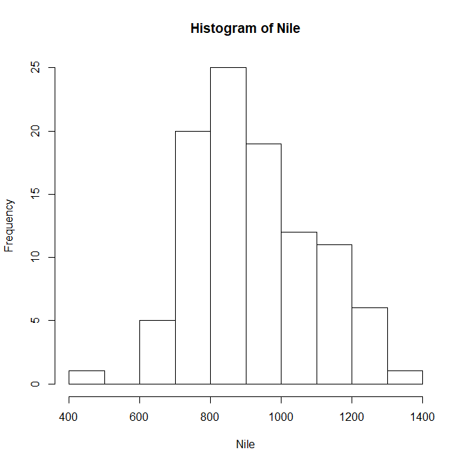
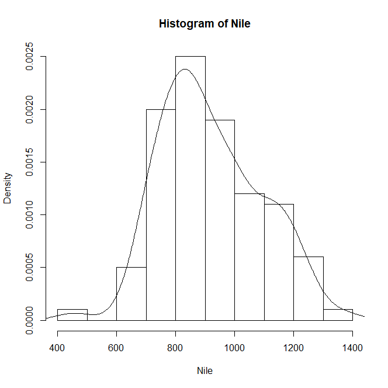
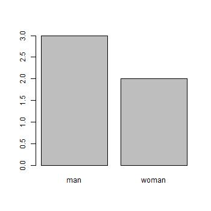
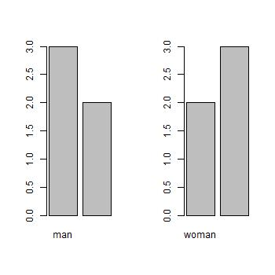
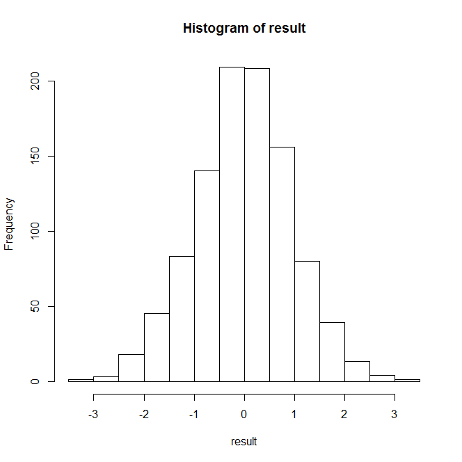
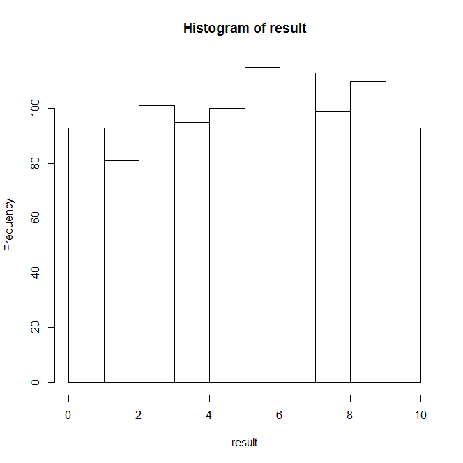
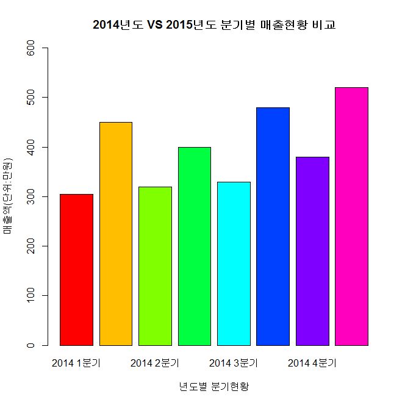

<h1>R</h1>


> - 객체지향 프로그래밍 언어
>- 데이터, 함수, 차트 등 모든 데이터는 객체 형태로 관리된다.
>   
>- 통계 분석과 data의 시각화를 지원하는 소프트웨어 환경
> 
>- 컴퓨터 언어이자 다양한 패키지의 집합
> 
>- data의 시각화를 위한 다양한 그래픽 도구를 제공

<br>

# 1. R

## 1.1  설치

### 1.1.1 R 설치

:link:[다운로드](https://www.r-project.org)

- mirror site 설정
- download
- 작동 확인
  - help()
  - demo()
  - q()

### 1.1.2 R Studio 설치

:link:[다운로드](https://www.rstudio.com/products/rstudio/download/)

## 1.2. 기본 동작 확인

### 1.2.1. R 패키지 확인

```R
dim(available.packages())
[1] 14883    17

available.packages()
                              Package                        
A3                            "A3"                           
aaSEA                         "aaSEA"   
...
```

#### 1.2.1.1. 설치된 R 패키지 목록 확인

```R
installed.packages()
```

#### 1.2.1.2. R 패키지 설치

```R
install.packages("패키지명")
```

#### 1.2.1.3. R 패키지 삭제

```R
remove.packasges("패키지명")
```

#### 1.2.1.4. R 패키지 로드

- library()

  ```R
  library("패키지명") 
  ```

- require()

  ```R
  require("패키지명")
  ```

#### 1.2.1.5. 메모리에 로드된 패키지 검색

```R
serach()
[1] ".GlobalEnv"        "package:stringr"  
[3] "tools:rstudio"     "package:stats"    
[5] "package:graphics"  "package:grDevices"
[7] "package:utils"     "package:datasets" 
[9] "package:methods"   "Autoloads"        
[11] "package:base
```

#### 1.2.1.6.  설치된 R 패키지의 저장위치 확인

```R
.libPaths()
[1] "C:/Program Files/R/R-3.6.1/library"
```

### 1.2.2. R 살펴보기 - 맛보기

#### 1.2.2.1. 기본 제공 data set 보기

```R
data()
```

- Nile 이라는 기본 데이터로 histogram 그려보기

  ```R
  hist(Nile)
  ```

  

- 밀도 기준 histogram

  ```R
  hist(Nile, freq=F)
  ```

- 분포 곡선 그리기

  ```R
  lines(density(Nile))
  ```

  

  

- plot 영역 설정 및 결과 저장

  ```R
  # 출력 영역 설정
  par(mfrow=c(1,1))
  
  #pdf 형식의 출력 파일 열기
  pdf("c:/workspace_R/sample.pdf")
  
  #정규분포를 따르는 난수 20개 생성해서 히스토그램 생성
  hist(rnorm(20)) 
  
  #출력 파일 닫기
  dev.off()	
  ```

#### 1.2.2.2. R session 정보 확인

사용자가 R 프로그램을 시작한 후 R콘솔 시작 ~종료 까지의 모든 정보를 담고있는 객체이다.

```R
sessionInfo()
```

#### 1.2.2.3. R 기본 함수 사용 예제 보기

```R
exmaple(seq)
```

####  1.2.3.4. R 기본 제공 함수의 파라미터 형식 보기

```R
args(max)
```

#### 1.2.3.5. help

```R
help(mean)
?sum #R document에서 확인
??mean #이건 뭐다? 
```

## 1.3. 변수

### 1.3.1. 변수 선언

> - 첫 문자는 영문자 혹은 . 으로 시작
> - 첫 문자가 .으로 시작한다면 .뒤에는 숫자가 올 수 없다.
> - 두 번 째 문자부터는 숫자, _, . 사용 가능
> - 대소문자 구분
> - 예약어 사용 불가
> - 변수에 저장된 값은 불변
> - R은 변수를 선언할 때 자료형(type)을 선언하지 않는다.

:point_right: 불변 객체 확인

```R
x <- 3
tracemem(x)
[1] "<00000000182A0858>"

x <- 'a'
tracemem(x)
[1] "<0000000010384628>"
```

### 1.3.2. 변수 확인

```
ls()
objects()
```

### 1.3.3. 변수 삭제

```
rm(list=ls())
rm(변수)
```

### 1.3.4. 전역 변수와 지역 변수

> :point_right:[1.10](#110-함수)의 함수를 공부한 다음에 테스트 가능

```R
g <- "global"
f6 <- function() {
    l <- "local"
    print(l)
    print(g)
}

f6()
[1] "local"
[1] "global"

print(g)
[1] "global"

print(l)
Error in print(l) : object 'l' not found
```

### 1.3.5. 변수의 scope

함수 내부 -> 전역 메모리 -> 에러 발생

``` R
g1 <- 1000

#
f7 <- function() {
    g1 <- 100 #로컬 변수를 선언한 것!
    print(g1)
}

f7()
[1] 100

print(g1)
[1] 1000

#
f7 <- function() {
    g1 <<- 100 #전역 변수를 참조한 것!!!!!!!!!!!!!!
    print(g1)
}

f7()
[1] 100

print(g1)
[1] 100
```


## 1.4. 자료형

### 1.4.1. Scalar 변수

> 단일 값(하나의 값)을 저장하는 변수

#### 1.4.1.1 numeric

```R
age <- 30 #age 변수는 하나의 값을 저장하고 있는 벡터 타입

class(age)
[1] "numeric"
```

#### 1.4.1.2. logical

```R
age <- TRUE #상수객체(TRUE, FALSE)
class(age)
[1] "logical"

#T 변수에 TRUE저장, F변수에 FALSE 저장
age <- F
class(age)
[1] "logical"

TRUE & TRUE
TRUE & FALSE

c(TRUE, TRUE) & c(TRUE, FALSE)
[1]  TRUE FALSE

#short circuit operator ?
c(TRUE, TRUE) && c(TRUE, FALSE)
[1] TRUE
```

#### 1.4.1.3. NA 

결측치, 즉 값이 빠져 있는 경우를 뜻한다.

```R
age <- NA
[1] NA
> class(a)
[1] "logical"

a <- NA + 10
[1] NA
class(a)
[1] "numeric"

# 옵션을 넣고 결측치를 없애서 결과를 정상적으로 나오게 만들기
sum(10, 20, 30)
[1] 60
> sum(10, 20, 30, NA)
[1] NA
> sum(10, 20, 30, NA, na.rm=T)
[1] 60
```

#### 1.4.1.4. NULL

프로그래밍의 편의를 위해 미정(undefined) 값을 표현하는데 사용.

```R
age <- NULL
class(a)
[1] "NULL"
```

#### 1.4.1.5. character

```R
a <- "hello"
[1] "hello"

a <- 'hello'
[1] "hello"

class(a)
[1] "character"
```

#### 1.4.1.6. 날짜와 시간

- format

  - `%d` 일자를 숫자로 인식
  - `%m` 월을 숫자로 인식
  - `%b` 월을 영어 약어로 인식
  - `%B`월을 전체 이름으로 인식
  - `%y`년도를 숫자 두 자리로 인식
  - `%Y` 년도를 숫자 네 자리로 인식

  ```R
  Sys.Date() #날짜만 보여주는 함수
  [1] "2019-09-07"
  sys.time() #날짜와 시간을 보여주는 함수
  [1] "2019-09-07 15:45:35 KST"
  date() #미국식 날짜와 시간을 출력하는 함수
  as.Date('2017-12-01') #문자형텨의 날짜를 날짜타입으로 변환해주는 함수
  as.Date('2017/07/04')
  as.Date('04-07-2017') #날짜가 이상하게 들어감
  as.Date('04-07-2017', format='%d-%m-%Y') #이렇게 형식을 맞추어 줄 수 있다.
  as.Date(10, origin='2017-12-01') #주어진 날짜 기준으로 10일 후의 날짜
  as.Date(-10, origin='2017-12-01') #주어진 날짜 기준으로 10일 이전의 날짜
  ```

- 로케일이 안 맞는 경우

  ```R
  #Sys.setlocale(category="LC_ALL", locale="언어_국가")
  Sys.setlocale(category="LC_ALL", locale="Korean_Korea")
  Sys.setlocale(category="LC_ALL", locale="English_US")
  ```

- 날짜 산술 연산

  ```R
  as.Date("2017-07-31") - as.Date("2017-07-04")
  Time difference of 27 days
  ```

- POSIX

  - POSIXt 날짜를 년, 월,일로 표시하는 리스트형 클래스
  - POSIXct 날짜를 연속적인 데이터로 인식해서 1970년을 기준으로 초 단위... 회기분석 때에 많이 쓴다.

  ```R
  as.Date("2017-07-04 20:00:00") - as.Date("2017-07-04 18:30")
  Time difference of 0 days
  as.POSIXct("2017-07-04 20:00:00") - as.POSIXct("2017-07-04 18:30")
  Time difference of 1.5 hours
  ```

- lubridate 패키지로 날짜와 시간 제어하기

  ```R
  install.packages("lubridate")
  library(lubridate)
  date <- now() #현재 날짜와 시간 넣기
  date
  year(date) #년도만 출력
  month(date,label=T) #월을 영문으로 출력
  month(date,label=F) #월을 숫자로 출력
  day(date)
  ```

### 1.4.2. 자료형 확인

#### 1.4.2.1. 자료구조의 Type 확인

```R
class(변수)
```

#### 1.4.2.2. 자료의 Type 확인

```R
mode(변수)
```

#### 1.4.2.3. is

```R
is.numeric(변수)
is.logical(변수)
is.character(변수)
is.na(변수)
is.list(변수)
is.data.frame(변수)
is.array(변수)
is.matrix(변수)
```

### 1.4.3. 자료형 형변환

- 기본 변환 방법

  ```R
  as.numeric(변수)
  as.logical(변수)
  as.character(변수)
  as.na(변수)
  as.list(객체)
  as.data.frame(객체)
  as.array(객체)
  as.matrix(객체)
  as.integer(변수)
  as.double(변수)
  as.complex(변수) #복소수
  as.factor(객체)
  as.Date(객체)
  ```

- 사용 예1)

  ```R
  x <- c("1", "2", "3")
  result <- x * 3
  Error in x * 3 : non-numeric argument to binary operator
  
  result <- as.numeric(x) * 3
  print(result)
  [1] 3 6 9
  
  result <- as.integer(x) * 3
  print(result)
  [1] 3 6 9
  ```

- 사용 예2)

  ```R
  z <- 5.3-3i #복소수 자료형 생성
  class(z)
  [1] "complex"
  
  Re(z)	#실수부만 반환
  [1] 5.3
  Im(z)	#허수부만 반환
  [1] -3
  ```

### 1.4.4. Factor

>- 여러번 중복으로 나오는 데이터들을 각 값으로 모아서 대표 값을 출력해 주는 형태
>- `stringAsFactors=FALSE` 옵션은 대표값으로 정리하지 않고 중복되는 상태 그대로 사용하게 해줌
>- 범주형(Categorical) 데이터(자료)를 표현하기 위한 데이터 타입
>- 범주형 데이터 - 데이터가 사전에 정해진 특정 유형으로만 분류되는 경우
>- 범주형 데이터는 또 다시 명목형(Nominal)과 순서형(Ordinal)으로 구분
>- 명목형 데이터는 값들 간에 크기 비교가 불가능한 경우
>- 순서형 데이터는 대, 중, 소와 같이 값에 순서를 둘 수 있는 경우

#### 1.4.4.1. 기본 사용법

```R
sex <- factor("m", c("m", "f"))
[1] m
Levels: m f

nlevels(sex)
[1] 2

levels(sex)
[1] "m" "f"

levels(sex)[1]
[1] "m"
levels(sex)[2]
[1] "f"

levels(sex) <- c("male", "female") #팩터 변수에서 레벨 값을 직접 수정
sex

#명목형(Norminal)
factor(c("m", "m", "f"), c("m", "f"))

#순서형(Ordinal)
ordered("a", c("a", "b", "c"))
```

#### 1.4.4.2. 명목형 - Norminal

명목형 데이터로 `plot` 그려보기

```R
# charater vector 는 plot 시 error 발생
gender <- c("man", "woman", "woman", "man", "man")
plot(gender) #error

class(gender)
[1] "character"
mode(gender)
[1] "character"

# character vector를 factor로 바꾸면 plot 을 그릴 수 있다.
ngender <- as.factor(gender)
class(ngender)
[1] "factor"
mode(ngender)
[1] "numeric"

is.factor(ngender)
[1] TRUE

ngender #Levels 속성에서 범주를 확인 (알파벳 순서?)
[1] man   woman woman man   man  
Levels: man woman

args(factor) #factor()함수의 매개변수 확인
function (x = character(), levels, labels = levels, exclude = NA, 
    ordered = is.ordered(x), nmax = NA) 
NULL

table(ngender) # 빈도수 확인
plot(ngender)
```



#### 1.4.4.3. 순서형 - Ordinal

순서형 데이터로 `plot` 그려보기

```R
#1.4.4.1. 이어서
ogender <- factor(gender, levels=c("woman", "man"), ordered=T)
ogender #범주의 순서 확인
[1] man   woman woman man   man  
Levels: woman < man

#저장 준비
jpeg("both.jpg", width=350, height=350)

par(mfrow=c(1,2))
plot(ngender)
plot(ogender)

#저장 완료
dev.off()
```



### 1.4.5. Vector

>- 동일한 형태의 데이터를 모아서 함께 저장.
>- 1차원 배열과 비슷한 개념. 
>- 특정 항목의 요소를 사용하려면 벡터명[색인] 
>- 벡터 자체를 연산 할 수 있다.
>- 각 벡터의 요소에 `names()` 함수를 사용해서 이름 지정할 수 있다.
>- `seq()`, `rep()` 함수를 사용해서 벡터에 연속적인 데이터 할당 할 수 있다.
>- `length()` 함수는 벡터의 길이를 리턴
>- `%in%`는 벡터에 특정 문자의 포함 여부를 리턴합니다

#### 1.4.5.1. 접근

> - 요소의 접근은 변수[index]로 접근한다. 
> - index는 1부터 시작한다.

- 특정 요소만 추출

  ```R
  a <- c(1:20)
   [1]  1  2  3  4  5  6  7  8  9 10 11 12 13 14 15 16 17 18 19 20
  
  a[3:10]
   [1]  3  4  5  6  7  8  9 10
  
  a[c(3, 10)]
   [1]  3 10
  
  t <- c("Sun", "Mon", "Tue", "Wed", "Thurs", "Fri", "Sat")
  
  t[1]
  [1] "Sun"
  
  t[7]
  [1] "Sat"
  
  t[c(2,3,6)
  [1] "Mon" "Tue" "Fri"
  ```

- 특정 요소만 제외

  벡터의 첨자에 `-`를 지정하면 해당 위치의 원소는 제외

  ```R
  a[-c(2:18)]
  [1]  1 19 20
  ```

- TRUE / FALSE 로 접근

  ```R
  t <- c("Sun", "Mon", "Tue", "Wed", "Thurs", "Fri", "Sat")
  
  t[c(T, F, F, F, F, T, F)]
  [1] "Sun" "Fri"
  ```
  
- 연속된 인덱스로 접근

  ```R
  t <- c("Sun", "Mon", "Tue", "Wed", "Thurs", "Fri", "Sat")
  
  t[c(0, 0, 0, 0, 0, 0, 1)]
  [1] "Sun"
  
  t[c(1, 2, 3, 1, 2, 3)]
  [1] "Sun" "Mon" "Tue" "Sun" "Mon" "Tue"
  ```

- 요소 반복

  연산 대상 벡터 요소 갯수가 가장 긴쪽에 맞춰서 싸이클링 된다.

  ```R
  v1 <- c(3, 8, 4, 5, 0, 11)
  v2 <- c(4, 11)
  
  v1 + v2
  [1]  7 19  8 16  4 22
  ```

- 조건 부 추출

  ```R
  nums <- c(3/2, 3%/%2, 5%%3, 2^10, 2**10)
  [1]    1.5    1.0    2.0 1024.0 1024.0
  
  #문> nums 벡터 요소 중 10보타 큰 요소만 출력(>, >=, ==, !=, <, <=)
  nums[nums > 10]
  [1] 1024 1024
  
  #문> nums 벡터 요소 중 짝수인 요소만 출력
  nums[nums %% 2 == 0]
  [1]    2 1024 1024
  ```
  
- 이름으로 접근

  ```R
  loc <- c("02", "031", "062", "052")
  names(loc) <- c("서울", "경기", "광주", "부산")
  print(loc["경기"]) #이름으로 벡터 요소 접근 가능
   경기 
  "031" 
  str(loc)
   Named chr [1:4] "02" "031" "062" "052"
   - attr(*, "names")= chr [1:4] "서울" "경기" "광주" "부산"
  ```

#### 1.4.5.2. 벡터 생성 함수

- c()

  combines

  ```R
  c(1:20)
  1:20
  c(1,1,2,3,3,3,4,5,5,5,5)
  ```

- seq()

  sequences

  ```R
  seq(1, 20)
  seq(1, 20, 2) #순차적으로 값을 증감시켜서 벡터 자료 구조 생성
  ```

- rep()

  replicates
  
  ```R
  rep(1:3, 3)
  [1] 1 2 3 1 2 3 1 2 3
  
  rep(1:3, each=3)
  [1] 1 1 1 2 2 2 3 3 3
  ```

#### 1.4.5.3. 벡터에 요소 추가

- append()

  ```R
  print(nums)
  [1]    1.5    1.0    2.0 1024.0 1024.0
  
  newValue <-append(nums, 99, after=3) #data가 추가된 벡터를 리턴함
  
  print(newValue)
  [1]    1.5    1.0    2.0   99.0 1024.0 1024.0
  ```

#### 1.4.5.4. 벡터 집합 연산자

- union()

  ```R
  a <- c(1:5)
  [1] 1 2 3 4 5
  
  b <- rep(1:3, 3)
  [1] 1 2 3 1 2 3 1 2 3
  
  union(a, b)
  [1] 1 2 3 4 5
  ```

- setdiff()

  ```R
  setdiff(a, b)
  [1] 4 5
  ```

- intersect()

  ```R
  intersect(a, b)
  [1] 1 2 3
  ```

- setequal

  순서는 일치 하지 않아도 요소들만 일치하면 TRUE 를 리턴
  
  ```R
  vec1 <- c(1, 2, 3, 4, 5)
  vec2 <- c(1, 2, 3, 4, 5)
  vec3 <- c(5, 4, 3, 2, 1)
  
  setequal(vec1, vec2)
  [1] TRUE
  setequal(vec1, vec3)
  [1] TRUE					#주의
  ```
  
- identical

  요소 뿐 아니라 순서도 일치해야 TRUE 를 리턴

  ```R
  identical(vec1, vec2)
  [1] TRUE
  identical(vec1, vec3)
  [1] FALSE					#주의
  ```

#### 1.4.5.5. 자동 형 변환

벡터는 같은 자료만 담을 수 있기때문에 큰 타입으로 자동 형변환 된다.

```R
f <- c(33, -5, "4", 5:9) 
[1] "33" "-5" "4"  "5"  "6"  "7"  "8"  "9"  #문자열로 변환 됨
class(f)
[1] "character"
mode(f)
[1] "character"
```

#### 1.4.5.6. 벡터의 정렬

```R
v <- c(3, 8, 4, 5, 0, 11, -9, 304)
[1]   3   8   4   5   0  11  -9 304

sort(v)
[1]  -9   0   3   4   5   8  11 304

sort(v, decreasing=TRUE)
[1] 304  11   8   5   4   3   0  -9

v <- c("Red", "Blue", "Yellow", "Violet")
[1] "Red"    "Blue"   "Yellow" "Violet"

sort(v)
[1] "Blue"   "Red"    "Violet" "Yellow"
```

### 1.4.6. Matrix

> - 벡터를 여러 개 합친 형태, 2차원으로 데이터를 저장
> - 동일한 데이터 유형만 저장
> - `rbind()`로 행을 추가할 수 있다.
> - `cbind()`로 컬럼을 추가할 수 있다.
> - 컬럼 이름을 지정, 조회하려면 colnames() 사용
> - 행이름 지정, 조회하려면 rownames() 사용

```R
#Matrix 생성 함수
matrix(
    data,
    nrow = 1,			#default: 1
    ncol = 1,			#default: 1
    byrow = FALSE,		#default: FALSE - 한 행씩 데이터를 넣으려면 TRUE로 
    dimnames = NULL		#형렬의 각 차원에 부여할 이름
)
```

#### 1.4.6.1. Matrix 생성

- 기본 생성

  ```R
  M <- matrix(c(3:14))
  print(M)
        [,1]
   [1,]    3
   [2,]    4
   [3,]    5
   [4,]    6
   [5,]    7
   [6,]    8
   [7,]    9
   [8,]   10
   [9,]   11
  [10,]   12
  [11,]   13
  [12,]   14
  str(M)
   int [1:12, 1] 3 4 5 6 7 8 9 10 11 12 ...
  ```

- 행 갯수를 지정하여 생성

  ```R
  M1 <- matrix(c(3:14), nrow=3)
  print(M1)
       [,1] [,2] [,3] [,4]
  [1,]    3    6    9   12
  [2,]    4    7   10   13
  [3,]    5    8   11   14
  str(M1)
   int [1:3, 1:4] 3 4 5 6 7 8 9 10 11 12 ...
  ```

- 데이터는 한 행씩 채우도록 생성

  ```R
  M2 <- matrix(c(3:14), nrow=4, byrow=TRUE)
  print(M2)
       [,1] [,2] [,3]
  [1,]    3    4    5
  [2,]    6    7    8
  [3,]    9   10   11
  [4,]   12   13   14
  str(M2)
   int [1:4, 1:3] 3 6 9 12 4 7 10 13 5 8 ...
  ```

- rbind() 를 이용하여 생성

  ```R
  x1 <- c(5, 40, 50:52)
  x2 <- c(30, 5, 6:8)
  M3 <- rbind(x1, x2)
  print(M3)
     [,1] [,2] [,3] [,4] [,5]
  x1    5   40   50   51   52
  x2   30    5    6    7    8
  str(M3)
   num [1:2, 1:5] 5 30 40 5 50 6 51 7 52 8
   - attr(*, "dimnames")=List of 2
    ..$ : chr [1:2] "x1" "x2"
    ..$ : NULL
  ```

- cbind 를 이용하여 생성

  ```R
  x1 <- c(1, 2, 3)
  x2 <- c(4, 5, 6)
  M4 <- cvind(x1, x2)
  print(M4)
       x1 x2
  [1,]  1  4
  [2,]  2  5
  [3,]  3  6
  str(M4)
   num [1:3, 1:2] 1 2 3 4 5 6
   - attr(*, "dimnames")=List of 2
    ..$ : NULL
    ..$ : chr [1:2] "x1" "x2"
  ```

- 요소 자동 채움

  행과 열의 수가 일치하지 않으면 오류가 발생하며, 모자라는 데이터는 처음 요소부터 다신 반복하여 채운다.

  ```R
  M <- matrix(10:20, 2)
  Warning message:
  In matrix(10:20, 2) :
    data length [11] is not a sub-multiple or multiple of the number of rows [2]
  print(M)
       [,1] [,2] [,3] [,4] [,5] [,6]
  [1,]   10   12   14   16   18   20
  [2,]   11   13   15   17   19   10
  ```

#### 1.4.5.2 행과 열의 이름 추가

```R
rownames = c("row1", "row2", "row3", "row4")
colnames = c("col1", "col2", "col3")
M5 <- matrix(c(3:14), nrow=4, byrow = TRUE, dimnames=list(rownames, colnames))
print(M5)
     col1 col2 col3
row1    3    4    5
row2    6    7    8
row3    9   10   11
row4   12   13   14
```

#### 1.4.5.3. Matrix 속성 확인

- 요소 길이 확인

  ```R
  length(M5)
  [1] 12
  ```

- 행 갯수 확인

  ```R
  nrow(M5)
  [1] 4
  ```

- 열 갯수 확인

  ```R
  ncol(M5)
  [1] 3
  ```

- 차원 확인

  ```R
  dim(M5)
  [1] 4 3
  ```

- 행 이름 확인

  ```R
  rownames(M5)
  [1] "row1" "row2" "row3" "row4"
  ```

- 열 이름 확인

  ```R
  colnames(M5)
  [1] "col1" "col2" "col3"
  ```

#### 1.4.5.4. 행과 열의 추가 및 삭제

- cbind() - 열 추가

  ```R
  P1 <- cbind(M5, c(13, 14, 15, 16)) #cbind()는 컬럼을 추가
  print(p1)
       col1 col2 col3   
  row1    3    4    5 13
  row2    6    7    8 14
  row3    9   10   11 15
  row4   12   13   14 16
  ```

- rbind() - 행 추가

  ```R
  P2 <- rbind(M5, c(13, 14, 15)) #rbind()는 행을 추가
  print(P2)
      col1 col2 col3
  row1    3    4    5
  row2    6    7    8
  row3    9   10   11
  row4   12   13   14
         13   14   15
  ```

- 행과 열의 제거

  실제 제거가 아니라 새로 추출하여 새로운 matrix를 생성하는 방식

  ```R
  print(m1)
       [,1] [,2] [,3]
  [1,]    1    2    3
  [2,]    4    5    6
  [3,]    7    8    9
  
  #matrix에서 하나의 열을 남겨놓고, 모든 열을 제거하면 벡터가 됨
  m2 <- m1[, -c(1,3)] 
  print(m2)
  [1] 2 5 8
  str(m3)
  int [1:3] 2 5 8
  
  #벡터로 변환되지 않도록 matrix의 구조를 유지
  m3 <- m1[, -c(1, 3), drop=FALSE] 
  print(m3)
       [,1]
  [1,]    2
  [2,]    5
  [3,]    8
  str(m3)
   int [1:3, 1] 2 5 8
  
  
  #문> 행이름과 열이름 제거
  rownames(M5) <-  NULL
  ```

- 행과 열의 이름 제거

  ```R
  rownames(M5) <- NULL
  connames(M5) <- NULL
  ```

#### 1.4.6.5. Matrix 접근

```R
#Matrix 요소에 접근 - 변수[첨자, 첨자]
#특정 행이나 특정 열만 접근하는 경우 변수명[행첨자, ] 변수명[, 열첨자]
print(M5[1, 3])
print(M5[2, ]) #2행 전체 요소에 접근
print(M5[, 3]) #3열 전체 요소에 접근
print(M5["row1", ]) #"row1"행 전체 요소에 접근
print(M5[, "col3"]) #"col3"열 전체 요소에 접근

#문 P2 matrix객체에서 2행과 4행을 제외하고 출력
P2[-c(2, 4), ]

#문 P2 matrix객체에서 1열과 3열을 제외하고 출력
P2[, -c(1, 3)]
```

#### 1.4.6.6. Matrix 연산

- 기본 연산

  ```R
  #matrix and matrix
  matrix1 <- matrix(c(3, 9, -1, 4, 2, 6), nrow=2)
       [,1] [,2] [,3]
  [1,]    3   -1    2
  [2,]    9    4    6
  matrix2 <- matrix(c(5, 2, 0, 9, 3, 4), nrow=2)
       [,1] [,2] [,3]
  [1,]    5    0    3
  [2,]    2    9    4
  
  result <- matrix1 + matrix2
       [,1] [,2] [,3]
  [1,]    8   -1    5
  [2,]   11   13   10
  
  #matrix and scala
  result <- matrix1 + 10
  print(result)
       [,1] [,2] [,3]
  [1,]   13    9   12
  [2,]   19   14   16
  ```

- apply 함수를 이용한 연산

  ```R
  f <- function(x) {
      x * c(1, 2, 3)
  }
  ```

  예1)

  ```R
  matrix1 <- rbind(c(1, 2, 3), c(4, 5, 6))
       [,1] [,2] [,3]
  [1,]    1    2    3
  [2,]    4    5    6
  
  result <- apply(matrix1, 1, f)
       [,1] [,2]
  [1,]    1    4
  [2,]    4   10
  [3,]    9   18
  ```

  예2)

  ```R
  matrix2 <- matrix(1:9, ncol=3)
       [,1] [,2] [,3]
  [1,]    1    4    7
  [2,]    2    5    8
  [3,]    3    6    9
  
  result <- apply(matrix2, 2, f)
       [,1] [,2] [,3]
  [1,]    1    4    7
  [2,]    4   10   16
  [3,]    9   18   27
  ```

- 전치행렬

  ```R
  m1 <- matrix(c(1:9), ncol=3, byrow=TRUE)
       [,1] [,2] [,3]
  [1,]    1    2    3
  [2,]    4    5    6
  [3,]    7    8    9
  
  t(m1) 	#전치행렬 리턴 함수
       [,1] [,2] [,3]
  [1,]    1    4    7
  [2,]    2    5    8
  [3,]    3    6    9
  ```

-  행렬의 곱

  ```R
  m2 <- matrix(rep(1:3, times=3), nrow=3)
  print(m2)
       [,1] [,2] [,3]
  [1,]    1    1    1
  [2,]    2    2    2
  [3,]    3    3    3
  print(m1 %*% m2)
       [,1] [,2] [,3]
  [1,]   14   14   14
  [2,]   32   32   32
  [3,]   50   50   50
  ```

- 역행렬 계산

  ```R
  m4 <- matrix(c(1,2,3,4,5,4,3,2,1), ncol=3)
       [,1] [,2] [,3]
  [1,]    1    4    3
  [2,]    2    5    2
  [3,]    3    4    1
  
  solve(m4) #역형렬 결과 리턴
         [,1] [,2]   [,3]
  [1,]  0.375   -1  0.875
  [2,] -0.500    1 -0.500
  [3,]  0.875   -1  0.375
  ```

### 1.4.7. Array

> - 동일한 자료형을 갖는 다차원 배열 구조
>
> - 행, 열, 면의 3차원 배열 형태의 객체를 생성
>
> - 첨자로 접근
>
> - 다른 자료구조에 비해 상대적으로 활용도가 낮음

#### 1.4.7.1. Array 생성

```R
vector1 <- c(5, 9, 3)
vector2 <- c(10, 11, 12, 13, 14, 15)

array1 <- array(c(vector1, vector2), dim=(3, 3, 2)) #row, col, layer
print(array1)
, , 1

     [,1] [,2] [,3]
[1,]    5   10   13
[2,]    9   11   14
[3,]    3   12   15

, , 2

     [,1] [,2] [,3]
[1,]    5   10   13
[2,]    9   11   14
[3,]    3   12   15
str(array1)
 num [1:3, 1:3, 1:2] 5 9 3 10 11 12 13 14 15 5 ..
```

#### 1.4.7.2. Array 요소에 접근

```R
#2 Layer의 3행 모든 데이터 접근
print(array1[3, ,2])
[1]  3 12 15

#1 Layer의 1행의 3열 데이터 접근
print(array1[1, 3, 1])
[1] 13

# 2 Layer의 모든 데이터 접근
print(array1[, , 2])
     [,1] [,2] [,3]
[1,]    5   10   13
[2,]    9   11   14
[3,]    3   12   15
```

#### 1.4.7.3. Matrix로 변환

```R
vector3 <- c(9, 1, 0)
vector4 <- c(6, 0, 11, 3, 14, 1, 2, 6, 9)

array2 <- array(c(vector3, vector4), dim = c(3, 3, 2))
print(array2)
, , 1

     [,1] [,2] [,3]
[1,]    9    6    3
[2,]    1    0   14
[3,]    0   11    1

, , 2

     [,1] [,2] [,3]
[1,]    2    9    6
[2,]    6    1    0
[3,]    9    0   11

matrix1 <- array1[, , 2]
matrix2 <- array2[, , 2]
print(matrix1 + matrix2)
     [,1] [,2] [,3]
[1,]    7   19   19
[2,]   15   12   14
[3,]   12   12   26
```

#### 1.4.7.4. Apply 적용

```R
array2 <- array(c(vector3, vector4), dim = c(3, 3, 2))
print(array2)
, , 1
	 [,1] [,2] [,3]
[1,]    9    6    3
[2,]    1    0   14
[3,]    0   11    1

, , 2
     [,1] [,2] [,3]
[1,]    2    9    6
[2,]    6    1    0
[3,]    9    0   11

rs1 <- apply(array2, c(1), sum)
print(rs1)
[1] 35 22 32 #9+6+3 + 2+9+6, 1+0+14 + 6+1+0, 0+11+1 + 9+0+11
```

### 1.4.8. List

>- List - 서로 다른 자료구조(벡터, 행렬, 리스트, 데이터프레임 등)을 객체로 구성
>- 키(key)와 값(value)의 한쌍으로 저장
>- c언어의 구조체, python의 dict 자료구조, java의 map컬렉션 구조와 유사
>- key를 통해 value 접근
>- value에 저장되는 자료구조는 벡터, 행렬, 리스트, 데이터프레임 등 대부분의 R객체 저장 가능
>- 함수 내에서 여러 값을 하나의 키로 묶어서 반환하는 경우 유용
>- list() - 생성자 함수
>- list(key=value1, key2=value2, ...)

#### 1.4.8.1. List 생성

> - key가 생략된 부분은 [[n]]형식으로 출력되고 , 
> - 해당 key에 저장된 value는 [n]형식으로 출력되며, 
> - 한 개의 값이 Vector 형식으로 저장

- key 없이 생성

  예1)

  ```R
  #
  list1 <- list("lee", "이순신", 95)
  print(list1)
  [[1]]
  [1] "lee"
  
  [[2]]
  [1] "이순신"
  
  [[3]]
  [1] 95
  List of 3
   $ : chr "lee"
   $ : chr "이순신"
   $ : num 95
  ```

  예2)

  ```R
  list_data <- list("Red", "Green", c(21, 32, 11), TRUE, 51.23, 119.1)
  
  print(list_data)
  [[1]]
  [1] "Red"
  
  [[2]]
  [1] "Green"
  
  [[3]]
  [1] 21 32 11
  
  [[4]]
  [1] TRUE
  
  [[5]]
  [1] 51.23
  
  [[6]]
  [1] 119.1
  
  str(list_data)
  List of 6
   $ : chr "Red"
   $ : chr "Green"
   $ : num [1:3] 21 32 11
   $ : logi TRUE
   $ : num 51.2
   $ : num 119
  ```

- key와 함께 생성

  ```R
  emp1 <-  list(name="kim", address="seoul", age=30, hiredate=as.Date("2017-01-30"))
  
  print(emp1)
  $name
  [1] "kim"
  
  $address
  [1] "seoul"
  
  $age
  [1] 30
  
  $hiredate
  [1] "2017-01-30"
  
  str(emp1)
  List of 4
   $ name    : chr "kim"
   $ address : chr "seoul"
   $ age     : num 30
   $ hiredate: Date[1:1], format: "2017-01-30"
  ```

#### 1.4.8.2. List 요소 접근

- 인덱스로 접근

  ```R
  emp1[1:2]
  $name
  [1] "kim"
  
  $address
  [1] "seoul"
  ```

- key 로 접근

  ```R
  emp1$age
  [1] 30
  
  #문] 아래 list_data리스트의 요소중에서 k3에 저장된 세번 째요소만 출력
  list_data <- list(
      k1="Red", 
      k2="Green", 
      k3=c(21,32,11),     
      k4=TRUE, 
      k5=51.23, 
      k6=119.1
  )
  
  list_data$k3[3]
  [1] 11
  ```

- 조건 부 접근

  ```R
  exam1 <- list(1,0, 2,0, -3, 4, -5, 6, 7, -8, 9, 10)
  #문) exam1로부터 음수를 제거한 리스트 출력
  exam1[exam1 >= 0]
  
  #문) #exam1로부터 0를 제거한 리스트 출력
  exam1[exam1 != 0]
  ```

#### 1.4.8.3. 요소 추가

- append 이용

  ```R
  newValue <-append(emp1, 99, after=3) #3번 째 요소 뒤에 99가 추가된 리스트를 리턴함
  
  print(newValue)
  $name
  [1] "kim"
  
  $address
  [1] "seoul"
  
  $age
  [1] 30
  
  [[4]]
  [1] 99
  
  $hiredate
  [1] "2017-01-30"
  ```

- 인덱스를 이용한 할당

  ```R
  lst <- list()
  lst[[1]] <- 0.5 				#list에 key 없이 첫 번째 data 저장
  lst[[2]] <- c("a", "c", "f") 	#list에 key 없이 두 번째 data 저장
  str(lst)
  $ : num 0.5
  $ : chr [1:3] "a" "c" "f"
  
  lst[["price"]] <- c(100, 200, 300) #key 와 함께 세 번째 data 저장
  str(lst)
  List of 3
   $      : num 0.5
   $      : chr [1:3] "a" "c" "f"
   $ price: num [1:3] 100 200 300
  ```

#### 1.4.8.4. 리스트 요소 제거

> 제거할 요소에 NULL을 할당함으로써 제거할 수 있다.

```R
emp1$age <- NULL

print(emp1)
$name
[1] "kim"

$address
[1] "seoul"

$hiredate
[1] "2017-01-30"

str(emp1)
List of 3
 $ name    : chr "kim"
 $ address : chr "seoul"
 $ hiredate: Date[1:1], format: "2017-01-30"
```

#### 1.4.8.5. 다차원 중첩 리스트

> - 리스트내에 값의 타입을 리스트로 저장 가능
>
> - 리스트 자료구조에 다른 리스트가 중첩된 자료구조

```R
lst2 <- list(
    cost=list(val=c(100, 150, 200)),
    price=list(val=c(200, 250, 300))
)
str(lst2)
List of 2
 $ cont :List of 1
  ..$ val: num [1:3] 100 150 200
 $ price:List of 1
  ..$ val: num [1:3] 200 250 300
print(lst2)
$cost
$cost$val
[1] 100 150 200

$price
$price$val
[1] 200 250 30

#cost 키의 두 번째 요소를 출력
print(lst2$cost$val[2])
[1] 150
#price 키의 세 번째 요소를 출력
print(lst2$price$val[3])
[1] 300
```

#### 1.4.8.6. 리스트를 벡터로 변환하기 - unlist

> 기본적인 통계 함수들이 벡터에서는 동작하지만 리스트에는 동작하지 않는 경우, 리스트 구조를 제거하고 벡터로 만들어 접근한다.

```R
vec_emp1 <- unlist(emp1)
print(vec_emp1)
    name  address hiredate 
   "kim"  "seoul"  "17196"
str(vec_emp1)
 Named chr [1:3] "kim" "seoul" "17196"
 - attr(*, "names")= chr [1:3] "name" "address" "hiredate"
```

#### 1.4.8.7. 리스트를 매트릭스로 변환하기

> 다차원 리스트를 매트릭스로 변환할 수 있다.

```R
multi_list <- list(
    c1 = list(1, 2, 3),
    c2 = list(10, 20, 30),
    c3 = list(100, 200, 300)
)
print(multi_list)
$c1
$c1[[1]]
[1] 1

$c1[[2]]
[1] 2

$c1[[3]]
[1] 3


$c2
$c2[[1]]
[1] 10

$c2[[2]]
[1] 20

$c2[[3]]
[1] 30


$c3
$c3[[1]]
[1] 100

$c3[[2]]
[1] 200

$c3[[3]]
[1] 300
```

- 열 단위로 바인딩하여 변환

  ```R
  do.call(cbind, multi_list)
       c1 c2 c3 
  [1,] 1  10 100
  [2,] 2  20 200
  [3,] 3  30 300
  ```

- 행 단위로 바인딩하여 변환

  ```
  do.call(rbind, multi_list)
     [,1] [,2] [,3]
  c1 1    2    3   
  c2 10   20   30  
  c3 100  200  300 
  ```

#### 1.4.8.8. lapply 적용

> 데이터 객체에 함수를 적용한 결과를 리스트 형으로 반환

```R
a <- list(c(1:5))
b <- list(6:10)
result <- lapply(c(a, b), max)
print(result)
[[1]]
[1] 5

[[2]]
[1] 10
str(result)
List of 2
 $ : int 5
 $ : int 10
```

#### 1.4.8.9. sapply 적용

> 데이터 객체함수를 적용한 결과를 벡터 형으로 반환

```R
result <- sapply(c(a, b), max)
print(result)
[1]  5 10
str(result)
 int [1:2] 5 10
```

### 1.4.9. Dataframe

>- DataFrame - 데이터베이스의 테이블 구조와 유사
>- R에서 가장 많이 사용하는 자료구조
>- 컬럼 단위로 서로 다른 데이터 유형(type)을 저장 가능
>- 리스트와 벡터의 혼합형으로 컬럼은 리스트, 컬럼 내의 데이터는 벡터 자료구조를 갖는다
>- DataFrame 생성함수 - `data.frame()`, `read.table()`, `read.csv()`
>- txt, excel, csv 파일로부터 DataFrame 생성
>- data.frame(컬럼1=자료, 컬럼2=자료, ...컬럼n=자료)
>- 여러 개의 벡터 객체를 이용하여 데이터프레임을 생성할 수 있다. 
>- 이때 모든 컬럼은 길이가 같아야 한다. 컬럼의 길이가 서로 다르면 오류가 발생한다.

#### 1.4.9.1 Dataframe 생성

- 기본 생성

  ```R
  d1 <- data.frame(
      no = c(1, 2, 3, 4, 5),
      name = c('kim', 'park', 'lee', 'song', 'hong'),
      gender = c('F', 'F', 'M', 'F', 'M')
  )
  
  str(d1)
  'data.frame':	5 obs. of  3 variables:
   $ no    : num  1 2 3 4 5
   $ name  : Factor w/ 5 levels "hong","kim","lee",..: 2 4 3 5 1
   $ gender: Factor w/ 2 levels "F","M": 1 1 2 1 2
  
  print(d1)
    no name gender
  1  1  kim      F
  2  2 park      F
  3  3  lee      M
  4  4 song      F
  5  5 hong      M
  ```

- 여러 벡터로부터 생성

  ```R
  no <- c(1, 2, 3)
  name <- c('hong', 'lee', 'kim')
  pay <- c(150, 250, 300)
  vemp <- data.frame(NO=no, Name=name, Pay=pay) #컬럼명 지정
  
  print(vemp)
    NO Name Pay
  1  1 hong 150
  2  2  lee 250
  3  3  kim 300
  ```
  
- 매트릭로부터 생성

  - 옵션 없이 생성(문자열이 factor로 변경됨)
  
    ```R
    sales1 <- matrix(
        c(
            1, 'Apple', 500, 5,
            2, 'Peach', 200, 2,
            3, 'Banana', 100, 4,
            4, 'Graph', 50, 7
        ),
        nrow =4,
        byrow = T
    )
         [,1] [,2]     [,3]  [,4]
    [1,] "1"  "Apple"  "500" "5" 
    [2,] "2"  "Peach"  "200" "2" 
    [3,] "3"  "Banana" "100" "4" 
    [4,] "4"  "Graph"  "50"  "7" 
    
    df1 <- data.frame(sales1)
    print(df1)
      X1     X2  X3 X4
    1  1  Apple 500  5
    2  2  Peach 200  2
    3  3 Banana 100  4
    4  4  Graph  50  7
    
    str(df1) 	#각 컬럼의 데이터 타입은 확인: Factor
    'data.frame':	4 obs. of  4 variables:
     $ X1: Factor w/ 4 levels "1","2","3","4": 1 2 3 4
     $ X2: Factor w/ 4 levels "Apple","Banana",..: 1 4 2 3
     $ X3: Factor w/ 4 levels "100","200","50",..: 4 2 1 3
     $ X4: Factor w/ 4 levels "2","4","5","7": 3 1 2 4
    ```
  
  - stringAsFactor = FALSE 로 생성
  
    ```R
    df1 <- data.frame(sales1, stringsAsFactors=FALSE)
    
    str(df1) 	#각 컬럼의 데이터 타입은 확인: chr
    'data.frame':	4 obs. of  4 variables:
     $ X1: chr  "1" "2" "3" "4"
     $ X2: chr  "Apple" "Peach" "Banana" "Graph"
     $ X3: chr  "500" "200" "100" "50"
     $ X4: chr  "5" "2" "4" "7"
    
    names(df1) <- c('No', 'Fruit', 'Price', 'Qty')
    str(df1)
    'data.frame':	4 obs. of  4 variables:
     $ No   : chr  "1" "2" "3" "4"
     $ Fruit: chr  "Apple" "Peach" "Banana" "Graph"
     $ Price: chr  "500" "200" "100" "50"
     $ Qty  : chr  "5" "2" "4" "7"
    ```

#### 1.4.9.2  열 요소의 형 변환 - as.xxx

> as.numeric() 등의 ax.xxxx() 함수 시리즈로 변환

```R
str(df1)
'data.frame':	4 obs. of  4 variables:
 $ X1: chr  "1" "2" "3" "4"
 $ X2: chr  "Apple" "Peach" "Banana" "Graph"
 $ X3: chr  "500" "200" "100" "50"
 $ X4: chr  "5" "2" "4" "7"

df1$X3 <- as.numeric(df1$X3)
df1$X4 <- as.numeric(df1$X4)

str(df1)
'data.frame':	4 obs. of  4 variables:
 $ X1: chr  "1" "2" "3" "4"
 $ X2: chr  "Apple" "Peach" "Banana" "Graph"
 $ X3: num  500 200 100 50	#numeric 확인
 $ X4: num  5 2 4 7			#numeric 확인
```

#### 1.4.9.3. 열 이름 추가 - names

```R
names(df1) <- c('No', 'Fruit', 'Price', 'Qty')

print(df1)
  No  Fruit Price Qty
1  1  Apple   500   5
2  2  Peach   200   2
3  3 Banana   100   4
4  4  Graph    50   7

str(df1)
'data.frame':	4 obs. of  4 variables:
 $ No   : chr  "1" "2" "3" "4"
 $ Fruit: chr  "Apple" "Peach" "Banana" "Graph"
 $ Price: chr  "500" "200" "100" "50"
 $ Qty  : chr  "5" "2" "4" "7"
```

#### 1.4.9.4. Dataframe 요소 접근 

> 변수명$컬럼명 형식으로 요소 접근, 결과는 벡터로 반환.

```R
#컬럼 이름으로 data.frame의 특정 컬럼 데이터 모두 access
print(df1$Fruit)
[1] "Apple"  "Peach"  "Banana" "Graph" 
```

#### 1.4.9.5. Dataframe 행 추출

> 데이터 프레임에서 조건에 맞는 행만 추출하여 새로운 데이터 프레임 생성

- ```subset``` 이용

  - 데이터 프레임에서 수량이 5보다 큰 추출 출력

    ```R
    subset.df1 <- subset(df1, Qty > 5)
    
    print(subset.df1)
      No Fruit Price Qty
    4  4 Graph    50   7
    
    str(subset.df1)
    'data.frame':	1 obs. of  4 variables:
     $ No   : chr "4"
     $ Fruit: chr "Graph"
     $ Price: num 50
     $ Qty  : num 7
    ```
  
  - 데이터 프레임에서 가격이 150보다 작은 데이터들 출력
  
    ```R
    subset.df1 <- subset(df1, Price < 150)
    
    print(subset.df1)
      No  Fruit Price Qty
    3  3 Banana   100   4
    4  4  Graph    50   7
    
    str(subset.df1)
    'data.frame':	2 obs. of  4 variables:
     $ No   : chr  "3" "4"
     $ Fruit: chr  "Banana" "Graph"
     $ Price: num  100 50
     $ Qty  : num  4 7
    ```
  
  - 데이터 프레임에서 과일명이 바나나인 것만 data.frame, 구조로 출력
  
    ```R
    subset.df1 <- subset(df1, Fruit == 'Banana')
    
    print(subset.df1)
      No  Fruit Price Qty
    3  3 Banana   100   4
    
    str(subset.df1)
    'data.frame':	1 obs. of  4 variables:
     $ No   : chr "3"
     $ Fruit: chr "Banana"
     $ Price: num 100
     $ Qty  : num 
    ```

- index 이용

  - 데이터 프레임객체의 x 컬럼의 값이 2 이상이고 y 컬럼은 6 이하인 데이터들 출력

    ```R
    df2 <- data.frame(
        x = c(1:5),
        y = seq(2, 10, 2),
        z = c('a', 'b', 'c', 'd', 'e')
    )
    
    df2[df2$x >=2 & df2$y <= 6, ]
      x y z
    2 2 4 b
    3 3 6 c
    ```

  - 데이터 프레임객체의 x 컬럼의 값이 2 이상 또는 y 컬럼의 값이 6 이하인 데이터들 출력

    ```R
    df2[df2$x >= 2 | df2$y <= 6, ]
      x  y z
    1 1  2 a
    2 2  4 b
    3 3  6 c
    4 4  8 d
    5 5 10 e
    ```

#### 1.4.9.6. Dataframe 열 추출

> 데이터 프레임에서 특정 열만 추출해서 새로운 형태의 데이터 프레임 생성

- 원하는 열(들) 추출

  ```R
  df5 <- subset(df1, select=c(Fruit, Price, Qty))
  #혹은 df5 <- df1[, c("Fruit", "Price", "Qty")]
  
  print(df5)
     Fruit Price Qty
  1  Apple   500   5
  2  Peach   200   2
  3 Banana   100   4
  4  Graph    50   7
  
  str(df5)
  'data.frame':	4 obs. of  3 variables:
   $ Fruit: chr  "Apple" "Peach" "Banana" "Graph"
   $ Price: num  500 200 100 50
   $ Qty  : num  5 2 4 7
  ```

- 원하는 열(들) 제거

  ```R
  df6 <- subset(df1, select=-c(No, Qty))
  #혹은 df6 <- df1[, setdiff(colnames(df1), c("No", "Qty"))]
  
  print(df6)
     Fruit Price
  1  Apple   500
  2  Peach   200
  3 Banana   100
  4  Graph    50
  
  str(df6)
  'data.frame':	4 obs. of  2 variables:
   $ Fruit: chr  "Apple" "Peach" "Banana" "Graph"
   $ Price: num  500 200 100 50
  ```

- 특정 인덱스(이름)의 행과 열만 추출

  ```R
  emp.data <- data.frame(
     emp_id = c(1:5), 
     emp_name = c("Rick","Dan","Michelle","Ryan","Gary"),
     salary = c(623.3,515.2,611.0,729.0,843.25), 
     
     start_date = as.Date(c("2012-01-01", "2013-09-23", "2014-11-15", "2014-05-11",
        "2015-03-27")),
     stringsAsFactors = FALSE
  )
    emp_id emp_name salary start_date
  1      1     Rick 623.30 2012-01-01
  2      2      Dan 515.20 2013-09-23
  3      3 Michelle 611.00 2014-11-15
  4      4     Ryan 729.00 2014-05-11
  5      5     Gary 843.25 2015-03-27
  
  #문)  emp.data객체에서  3행, 5행의 2열과 4열의 데이터만 추출해서 출력
  emp.data[c(3, 5), c(2, 4)]
    emp_name start_date
  3 Michelle 2014-11-15
  5     Gary 2015-03-27
  
  ```

#### 1.4.9.7. 데이터 프레임 관련 유용한 함수

##### 1.4.9.7.1. summary

> 데이터프레임 객체의 데이터를 대상으로 최솟값, 최댓값, 중위수, 평균, 사분위수 값을 요약하여 결과로 리턴

```R
print(df2)
  x  y z
1 1  2 a
2 2  4 b
3 3  6 c
4 4  8 d
5 5 10 e

summary(df2)
       x           y      z    
 Min.   :1   Min.   : 2   a:1  
 1st Qu.:2   1st Qu.: 4   b:1  
 Median :3   Median : 6   c:1  
 Mean   :3   Mean   : 6   d:1  
 3rd Qu.:4   3rd Qu.: 8   e:1  
 Max.   :5   Max.   :10 
```

##### 1.4.9.7.2. apply

```R
apply(df2[, c(1,2)], 2, sum) #열 끼리 묶음
 x  y 
15 30 

apply(df2[, c(1,2)], 1, sum) #행 끼리 묶음
[1]  3  6  9 12 15
```

##### 1.4.9.7.3. merge

> 두 데이터프레임 객체의 요소를 병합

```R
df4 <- data.frame(
    name = c('apple', 'banana', 'cherry'),
    price = c(300, 200, 100)
)
    name price
1  apple   300
2 banana   200
3 cherry   100

df5 <- data.frame(
    name = c('apple', 'banana', 'berry'),
    qty = c(10, NA, 30)
)
    name qty
1  apple  10
2 banana  NA
3  berry  30

```

- 첫 번재 열 데이터 기준으로 일치하는 데이터의 열 결합

  ```R
  merge(df4, df5)
      name price qty
  1  apple   300  10
  2 banana   200  NA
  ```

- 첫 번째 열 데이터 기준으로 모든 데이터의 열 결합

  > Full Outer Join 과 비슷

  ```R
  merge(df4, df5, all=T)
      name price qty
  1  apple   300  10
  2 banana   200  NA
  3 cherry   100  NA		#없는 정보는 NA로 채운다
  4  berry    NA  30		#없는 정보는 NA로 채운다
  ```

##### 1.4.9.7.4. 기타 유용한 함수

```R
data()
```

- str(mtcars)

  ```R
  'data.frame':	32 obs. of  11 variables:
   $ mpg : num  21 21 22.8 21.4 18.7 18.1 14.3 24.4 22.8 19.2 ...
   $ cyl : num  6 6 4 6 8 6 8 4 4 6 ...
   $ disp: num  160 160 108 258 360 ...
   $ hp  : num  110 110 93 110 175 105 245 62 95 123 ...
   $ drat: num  3.9 3.9 3.85 3.08 3.15 2.76 3.21 3.69 3.92 3.92 ...
   $ wt  : num  2.62 2.88 2.32 3.21 3.44 ...
   $ qsec: num  16.5 17 18.6 19.4 17 ...
   $ vs  : num  0 0 1 1 0 1 0 1 1 1 ...
   $ am  : num  1 1 1 0 0 0 0 0 0 0 ...
   $ gear: num  4 4 4 3 3 3 3 4 4 4 ...
   $ carb: num  4 4 1 1 2 1 4 2 2 4 ...
  ```

- head(mtcars) 

  > 처음 1~6개의  값만 보기

  ```R
                     mpg cyl disp  hp drat    wt  qsec vs am gear carb
  Mazda RX4         21.0   6  160 110 3.90 2.620 16.46  0  1    4    4
  Mazda RX4 Wag     21.0   6  160 110 3.90 2.875 17.02  0  1    4    4
  Datsun 710        22.8   4  108  93 3.85 2.320 18.61  1  1    4    1
  Hornet 4 Drive    21.4   6  258 110 3.08 3.215 19.44  1  0    3    1
  Hornet Sportabout 18.7   8  360 175 3.15 3.440 17.02  0  0    3    2
  Valiant           18.1   6  225 105 2.76 3.460 20.22  1  0    3    1
  ```

- head(mtcars, 10)

  > 처음 N 개의 값 보기

  ```R
                       mpg cyl  disp  hp drat    wt  qsec vs am gear carb
  Mazda RX4           21.0   6 160.0 110 3.90 2.620 16.46  0  1    4    4
  Mazda RX4 Wag       21.0   6 160.0 110 3.90 2.875 17.02  0  1    4    4
  Datsun 710          22.8   4 108.0  93 3.85 2.320 18.61  1  1    4    1
  Hornet 4 Drive      21.4   6 258.0 110 3.08 3.215 19.44  1  0    3    1
  Hornet Sportabout   18.7   8 360.0 175 3.15 3.440 17.02  0  0    3    2
  Valiant             18.1   6 225.0 105 2.76 3.460 20.22  1  0    3    1
  Duster 360          14.3   8 360.0 245 3.21 3.570 15.84  0  0    3    4
  Merc 240D           24.4   4 146.7  62 3.69 3.190 20.00  1  0    4    2
  Merc 230            22.8   4 140.8  95 3.92 3.150 22.90  1  0    4    2
  Merc 280            19.2   6 167.6 123 3.92 3.440 18.30  1  0    4    4
  ```

- tail(mtcars) 

  >마지막-5 ~ 마지막 행까지 출력해줌

  ```R
                  mpg cyl  disp  hp drat    wt qsec vs am gear carb
  Porsche 914-2  26.0   4 120.3  91 4.43 2.140 16.7  0  1    5    2
  Lotus Europa   30.4   4  95.1 113 3.77 1.513 16.9  1  1    5    2
  Ford Pantera L 15.8   8 351.0 264 4.22 3.170 14.5  0  1    5    4
  Ferrari Dino   19.7   6 145.0 175 3.62 2.770 15.5  0  1    5    6
  Maserati Bora  15.0   8 301.0 335 3.54 3.570 14.6  0  1    5    8
  Volvo 142E     21.4   4 121.0 109 4.11 2.780 18.6  1  1    4    2
  ```

- data(mtcars)

  > mtcars 라는 데이터를 load

- view(mtcars)

  > mtcars 라는 데이터를 GUI 형태로 보기

#### 1.4.9.7. Dtaframe 에 새로운 열 추가

```R
df1$new <- c(10, 20, 30 ,40)
str(df1)
```

## 1.5. 기타 기본 및 유용한 명령어

### 1.5.1. 작업 디렉토리

#### 1.5.1.1. getwd

> 작업 디렉토리 경로 가져오기

```R
getwd()
[1] "C:/workspace_R"
```

#### 1.5.1.2. setwd

> 작업 디렉토리 설정

```R
setwd("C:/workspace_R")
```

### 1.5.2. 출력

#### 1.5.2.1. print

> 구조적으로 출력

```R
print(result)
[1] 3 6 9
```

#### 1.5.2.2. cat

> 연속된 형태로 출력

```R
cat(result)
3 6 9
```

### 1.5.3. 산술연산자

| **Operator** | **Description**             | 서술   |
| ------------ | --------------------------- | ------ |
| **+**        | addition                    | 더하기 |
| **-**        | subtraction                 | 빼기   |
| *****        | multiplication              | 곱하기 |
| **/**        | division                    | 나누기 |
| **^ or \**** | exponentiation              | 지수화 |
| **x %% y**   | modulus (x mod y) 5%%2 is 1 | 나머지 |
| **x %/% y**  | integer division 5%/%2 is 2 | 몫     |

### 1.5.4. 논리 연산자

| **Operator**  | **Description**          | 서술                              |
| ------------- | ------------------------ | --------------------------------- |
| **<**         | less than                | 작은                              |
| **<=**        | less than or equal to    | 작거나 같은                       |
| **>**         | greater than             | 큰                                |
| **>=**        | greater than or equal to | 크거나 같은                       |
| **==**        | exactly equal to         | 같은                              |
| **!=**        | not equal to             | 같지 않은                         |
| **!x**        | Not x                    | 아닌                              |
| **x \| y**    | x OR y                   | x 이거나 y 인                     |
| **x \|\| y**  | x[1] OR y[1]             | x 와 y 의 첫 번째 요소에 대한 OR  |
| **x & y**     | x AND y                  | x 이고 y 인                       |
| **x && y**    | x[1] AND y[1]            | x 와 y 의 첫 번째 요소에 대한 AND |
| **isTRUE(x)** | test if X is TRUE        | x 가 TRUE 인지                    |
| **xor(x, y)** | exclusive OR             | 배타적 연산자                     |

### 1.5.5. stringr 을 이용한 문자열 처리

> stringr 패키지는 문자열을 가능한 한 쉽게 처리하도록 설계 함수 세트를 제공한다. 

```R
install.packages("stringr")
library("stringr")
```

#### 1.5.5.1. 기본 함수들

- `str_length`
- `str_c` - str concatenate
- `str_join`
- `str_sub`
- `str_split`
- `str_replace`
- `str_extract` - *정규표현식을 사용하여 문자열 추출*
- `str_extract_all` - *정규표현식을 사용하여 문자열 모두 추출*
- `str_locate` - *특정 문자열 패턴의 첫 번째 위치 찾기*
- `str_locate_all` - *턱정 문자열 패턴의 모든 위치 찾기*
- `str_to_upper`
- `str_to_lower`
- ...

#### 1.5.5.2. str_count

> 패턴을 포함한 요소에서 패턴 출현 횟수 리턴

```R
fruits <- c('apple', 'banana', 'pineapple', 'berry', 'APPLE')

str_count(fruits, "a")
[1] 1 3 1 0 0
```

#### 1.5.5.3. paste

> 문자열을  결합하는 R 기본 함수. stringr 패키지의 함수는 아니다.

```R
paste (..., sep = " ", collapse = NULL)
```

```R
rs1 <- paste('hello', '~R')
print(rs1)
[1] "hello ~R"
```

#### 1.5.5.4. str_c

> 문자열을 결합하는 stringr 함수

```R
str_c('hello', '~R')
[1] "hello~R"		#띄어쓰기가 없는 것에 유의

rpint(fruits)
[1] "apple"     "banana"    "pineapple" "berry"     "APPLE" 

str_c(fruits, " name is " , fruits)
[1] "apple name is apple"         "banana name is banana"      
[3] "pineapple name is pineapple" "berry name is berry"        
[5] "APPLE name is APPLE" 

str_c(fruits, collapse=" ")
[1] "apple banana pineapple berry APPLE"

str_c(fruits, collapse="-")
[1] "apple-banana-pineapple-berry-APPLE"
```

#### 1.5.5.5. str_detect

> 객체의 요소별로 정규표현식의 패턴 매칭 여부를 리턴. 

```R
str_detect(fruits, 'A') #객체의 요소별로 'A'포함 여부를 판단한다.
[1] FALSE FALSE FALSE FALSE  TRUE

str_detect(fruits, '^a') #정규표현식의 형식문자 ^는 시작을 의미
[1]  TRUE FALSE FALSE FALSE FALSE

str_detect(fruits, 'a$') #정규표현식의 형식문자 $는 끝을 의미
[1] FALSE  TRUE FALSE FALSE FALSE

str_detect(fruits, '^[aA]') #a 나 A 로 시작하는지 여부
[1]  TRUE FALSE FALSE FALSE  TRUE

str_detect(fruits, '[^a]')  #[]안의 ^는 not을 의미하기 대문에 a가 아닌 문자가 1개라도 있으면 모두 TRUE를 리턴
[1] TRUE TRUE TRUE TRUE TRUE

```

#### 1.5.5.6. str_sub

> 문자열 부분추출 

```R
str_sub(fruits, start=1, end=3) 
[1] "app" "ban" "pin" "ber" "APP"

str_sub(fruits, start=6, end=9)
[1] ""     "a"    "pple" ""     ""

str_sub(fruits, start=-5)
[1] "apple" "anana" "apple" "berry" "APPLE"
```

#### 1.5.5.7. str_length

> 객체 요소 문자열의 길이를 벡터로 리턴

```R
str_length("  apple   banana  ")
[1] 18

str_length(fruits)
[1] 5 6 9 5 5
```

#### 1.5.5.8. str_trim

> 문자열의 앞뒤 공백 제거

``` R
str_trim("   apple   banana   ")
[1] "apple   banana"
```

#### 1.5.5.9. str_dup

> 문자열을 반복하여 붙여서 반환

```R
str_dup(fruits, 3)
[1] "appleappleapple"             "bananabananabanana"         
[3] "pineapplepineapplepineapple" "berryberryberry"            
[5] "APPLEAPPLEAPPLE
```

#### 1.5.5.10 str_extract

> 정규표현식을 사용하여 매칭되는 첫 번째 문자열 추출

```R
str_extract("홍길동35이순신45유관순25", "[0-9]{2}") #숫자 두 자리로 구성된 첫 번째 문자 반환
[1] "35"

str1 <- "korea123456-1234567seoul"

#문) str1 객채에 저장된 문자열로부터 주민번호만 추출
str_extract(str1, "[0-9]{6}-[0-9]{7}")
[1] "123456-1234567"

str_extract(str1, "[0-9]{6}-[1234]{1}[0-9]{6}")
[1] "123456-1234567"
```

#### 1.5.5.11. str_extract_all

> 정규표현식을 사용하여 매칭되는 **모든** 문자열 추출하여 리스트에 넣어 반환

```R
str_extract_all("홍길동35이순신45유관순25", "[1-9]{2}")
[[1]]
[1] "35" "45" "25"

str2 <- "홍길동1357,이순신,유관순1012"

#문) str2 객체에 저장된 문자열로부터 7글자 이상의 단어만 추출
str_extract_all(str2, "\\w{7,}")
[[1]]
[1] "홍길동1357" "유관순1012"
```

## 1.6. 데이터 입출력

### 1.6.1 scan

> - 키보드로부터 데이터 입력을 받기위해 사용
> - 입력할 데이터가 없으면 엔터키만 누르면 종료됨
> - 문자열로 입력받으려면 waht=character()옵션 사용

#### 1.6.1.1. 키보드로 숫자 입력받기

```R
num <- scan()
print(num)

sum(num)
```

#### 1.6.1.2. 키보드로 문자 입력받기

```R
name <- scan(what=character())
print(name)
```

#### 1.6.1.3. 공백 delim

```R
input1 <- scan(what="") #korea seoul chongro-gu 입력하기

print(input1)
[1] "korea"     "seoul"     "jongro-gu"

str(input1) #공백으로 분리해서 단어별로 item으로 저장
 chr [1:3] "korea" "seoul" "jongro-gu"
```

### 1.6.2. edit

> 데이터 입력을 돕기 위해 표 형식의 데이터 편집기 제공

```R
df <- data.frame()
df <- edit(df) 	#데이터 편집기

print(df)
  var1   var2 var3 var4 var5
1 학번   이름 국어 영어 수학
2    1 홍길동   80   80   90
3    2 이순신   95   90   95
4    3 강감찬   95   95  100
5    4 유관순   85   85   85
```

### 1.6.3. readline

- 기본

  > 한 라인의 입력 data를 문자열로 입력 받음

  ```R
  address <- readline() #hahah hohoh heheh 입력
  
  print(address)
  [1] "hahah hohoh heheh"
  
  str(address)
   chr "hahah hohoh heheh"
  ```

- 안내 문자열

  ```R
  address <- readline("Input Your Address: ")
  Input Your Address: 
  ```

### 1.6.4. 파일로부터 데이터 입력받기

>  지원되는 파일 유형:  `text`, `csv`, `xml`, `html`, `json`, `db`, `excel`, `bigdata` 저장소

#### 1.6.4.1. 파일 목록 보기

- 기본

  ```R
  setwd("c:/workspace_R")
  list.files()
  ```

- 하위 디렉토리까지 재귀적으로 보기

  ```R
  print(list.files(recursive=T))
  ...         
  [17] "depth1/depth2/detph2.file.txt"
  [18] "depth1/detph1.file.txt"       
  ...
  ```

- 숨김 파일 보기

  ```R
  print(list.files(recursive=T, all.files=T))
  ...
    [1] ".Rhistory"                    
  ...
  ```

#### 1.6.3.2. 파일 읽어오기

##### 1.6.3.2.1. csv file

```R
read.csv(file="경로/파일명" [,sep=","][,header=TRUE])
```

```R
data1 <- read.csv("./data/emp.csv")

print(data1)
   no   name pay
1 101 홍길동 150
2 102 이순신 450
3 103 강감찬 500
4 104 유관순 350
5 105 김유신 400

str(data1)
'data.frame':	5 obs. of  3 variables:
 $ no  : int  101 102 103 104 105
 $ name: Factor w/ 5 levels "강감찬","김유신",..: 5 4 1 3 2
 $ pay : int  150 450 500 350 400

#문) 사원 데이터에서 최대 급여를 출력
max_sal <- max(data1$pay)
print(max_sal)
 [1] 500

#최대 급여를 받는 레코드(행)만 출력
person1 <- subset(data1, pay == max(pay))
#data1[data1$pay == max(data1$pay), ] 도 된다.
print(person1)
   no   name pay
3 103 강감찬 500

#문제용 데이터)
  id     name salary  startdate       dept
1  1     Rick 623.30 2012-01-01         IT
2  2      Dan 515.20 2013-09-23 Operations
3  3 Michelle 611.00 2014-11-15         IT
4  4     Ryan 729.00 2014-11-05         HR
5  5     Gary 843.25 2015-03-27    Finance
6  6     Nina 578.00  5/21/2013         IT

#문) emp3.csv파일의 데이터를 data.frame객체에 저장한 후에 IT부서에서 굽여가 600이상인 사원추출
emp3 <- read.csv("./data/emp3.csv")
person1 <- emp3[emp3$dept =='IT' & emp3$salary >= 600, ]
  id     name salary  startdate dept
1  1     Rick  623.3 2012-01-01   IT
3  3 Michelle  611.0 2014-11-15   IT

#문) emp3.csv파일의 데이터를 data.frame객체에 저장한 후에 입사날짜가 2014년 7월 01일 이후인 사원 추울
person2 <- emp3[as.Date(emp3$startdate) >= as.Date("2014-07-01"), ]
   id     name salary  startdate    dept
3   3 Michelle 611.00 2014-11-15      IT
4   4     Ryan 729.00 2014-11-05      HR
5   5     Gary 843.25 2015-03-27 Finance
NA NA     <NA>     NA       <NA>    <NA> #한 행의 날짜가 형식이 달라서...

#IT 부서 사원만 추출해서 csv 파일에 저장
itperson <- subset(emp3, dept == "IT")
print(itperson)
write.csv(itperson, "./output/itperson.csv", row.names=FALSE)
list.files("./output/")
newdata <- read.csv("./output/itperson.csv")
print(newdata)
  id     name salary  startdate dept
1  1     Rick  623.3 2012-01-01   IT
2  3 Michelle  611.0 2014-11-15   IT
3  6     Nina  578.0  5/21/2013   IT
```

##### 1.6.3.2.2. xlsx file

>`read.xlsx()`
>
>엑셀 파일로부터 데이터 읽기
>`xlsx` 패키지가 필요하면 의존하고 있는 `rJava`패키지를 먼저 로드해야 합니다.
>`sheetIndex=1`은 선택한 엑셀 파일에서 첫 번째 시트 탭을 지정

```R
install.packages("xlsx")   # xlsx 패키지 설치 
install.packages("rJava")   # rJava 패키지 설치 
#Sys.setenv(JAVA_HOME='C:\\Program Files\\Java\\jre1.8.0_151')

library(rJava)
library(xlsx)

studentex <- read.xlsx(
    file.choose(), #파일을 선택할 수 있도록 GUI 창 띄우기
    sheetIndex=1,
    encoding="UTF-8"
)
print(studentex)
  NA. 학번   이름 성적 평가
1   1  101 홍길동   80    B
2   2  102 이순신   95   A+
3   3  103 강감찬   78   C+
4   4  104 유관순   85   B+
5   5  105 김유신   65   D+

#IT 부서의 데이터만 xlsx 파일로 저장
itperson <- subset(emp3, dept == "IT")
print(itperson)
write.xlsx(itperson, "./output/itperson.xlsx", sheetName="IT",
           row.names=FALSE, col.names=FALSE)
list.files("./output/")
newdata <- read.xlsx("./output/itperson.xlsx", sheetIndex=1, header=FALSE)
print(newdata)
  X1     Rick X623.3 X2012.01.01 IT
1  3 Michelle    611  2014-11-15 IT
2  6     Nina    578   5/21/2013 IT

```

##### 1.6.3.2.3. txt file

```
readLines("경로")
read.table("경로")
```

```R
# 텍스트 파일 읽기, 라인 단위를 문자열로 로딩, 라인단위로 저장되는 벡터 객체로 생성함
file1 <- readLines("./data/fruits.txt")
print(file1)
[1] "no  name  price   qty" "1   apple   500     5"
[3] "2   banana  200     2" "3   peach   200     7"
[5] "4   berry    50     9"
str(file1)
 chr [1:5] "no  name  price   qty" "1   apple   500     5" ...

#텍스트 파일의 내용을 읽어서 data.frame객체로 생성함
fruits1 <- read.table("./data/fruits.txt" ) 
print(fruits1)
  V1     V2    V3  V4
1 no   name price qty
2  1  apple   500   5
3  2 banana   200   2
4  3  peach   200   7
5  4  berry    50   9
str(fruits1)
'data.frame':	5 obs. of  4 variables:
 $ V1: Factor w/ 5 levels "1","2","3","4",..: 5 1 2 3 4
 $ V2: Factor w/ 5 levels "apple","banana",..: 4 1 2 5 3
 $ V3: Factor w/ 4 levels "200","50","500",..: 4 3 1 1 2
 $ V4: Factor w/ 5 levels "2","5","7","9",..: 5 2 1 3 4

# hearer 포함
fruits1 <- read.table("./data/fruits.txt", header=T)
print(fruits1)
  no   name price qty
1  1  apple   500   5
2  2 banana   200   2
3  3  peach   200   7
4  4  berry    50   9
str(fruits1) 
'data.frame':	4 obs. of  4 variables:
 $ no   : int  1 2 3 4
 $ name : Factor w/ 4 levels "apple","banana",..: 1 2 4 3
 $ price: int  500 200 200 50
 $ qty  : int  5 2 7 9

# 문자열 그대로 읽어오기
fruits1 <- read.table("./data/fruits.txt", header=T, stringsAsFactor=FALSE)
print(fruits1)
  no   name price qty
1  1  apple   500   5
2  2 banana   200   2
3  3  peach   200   7
4  4  berry    50   9
str(fruits1)
'data.frame':	4 obs. of  4 variables:
 $ no   : int  1 2 3 4
 $ name : chr  "apple" "banana" "peach" "berry"
 $ price: int  500 200 200 50
 $ qty  : int  5 2 7 9

# 를 제외한 레코드 2개 skip(제외)하고, 2개의 record만 읽어옴
fruits2 <- read.table("./data/fruits.txt", header=T, skip=2, nrows=2)
print(fruit2)
  X2 banana X200 X2.1
1  3  peach  200    7
2  4  berry   50    9

#벡터의 데이터를 텍스트 파일로 저장
cat(
    "My Sales", 
    file1, 
    file="./output/mySales.txt", sep="\n", 
    append=T #append 여부 확인
)
```

##### 1.6.3.2.4. xml file

>사용하려면 `XML` 패키지를 설치해야한다.

```R
install.packages("XML")
library(XML)
data2 <- xmlParse(file="./data/emp.xml")
print(data2)
<RECORDS>
  <EMPLOYEE>
    <ID>1</ID>
    <NAME>Rick</NAME>
    <SALARY>623.3</SALARY>
    <STARTDATE>1/1/2012</STARTDATE>
    <DEPT>IT</DEPT>
  </EMPLOYEE>
  <EMPLOYEE>
    <ID>2</ID>
    <NAME>Dan</NAME>
    <SALARY>515.2</SALARY>
    <STARTDATE>9/23/2013</STARTDATE>
    <DEPT>Operations</DEPT>
  </EMPLOYEE>
  <EMPLOYEE>
    <ID>3</ID>
    <NAME>Michelle</NAME>
    <SALARY>611</SALARY>
    <STARTDATE>11/15/2014</STARTDATE>
    <DEPT>IT</DEPT>
  </EMPLOYEE>
  <EMPLOYEE>
    <ID>4</ID>
    <NAME>Ryan</NAME>
    <SALARY>729</SALARY>
    <STARTDATE>5/11/2014</STARTDATE>
    <DEPT>HR</DEPT>
  </EMPLOYEE>
  <EMPLOYEE>
    <ID>5</ID>
    <NAME>Gary</NAME>
    <SALARY>843.25</SALARY>
    <STARTDATE>3/27/2015</STARTDATE>
    <DEPT>Finance</DEPT>
  </EMPLOYEE>
  <EMPLOYEE>
    <ID>6</ID>
    <NAME>Nina</NAME>
    <SALARY>578</SALARY>
    <STARTDATE>5/21/2013</STARTDATE>
    <DEPT>IT</DEPT>
  </EMPLOYEE>
  <EMPLOYEE>
    <ID>7</ID>
    <NAME>Simon</NAME>
    <SALARY>632.8</SALARY>
    <STARTDATE>7/30/2013</STARTDATE>
    <DEPT>Operations</DEPT>
  </EMPLOYEE>
  <EMPLOYEE>
    <ID>8</ID>
    <NAME>Guru</NAME>
    <SALARY>722.5</SALARY>
    <STARTDATE>6/17/2014</STARTDATE>
    <DEPT>Finance</DEPT>
  </EMPLOYEE>
</RECORDS> 

str(data2)
Classes 'XMLInternalDocument', 'XMLAbstractDocument' <externalptr> 

#ROOT NODE만 추출
rootnode <- xmlRoot(data2)
print(rootnode)
class(rootnode)
str(rootnode)
Classes 'XMLInternalElementNode', 'XMLInternalNode', 'XMLAbstractNode' <externalptr> 

#rootnode의 자식 노드 갯수
rootsize <- xmlSize(rootnode)
print(rootsize)
[1] 8

#rootnode의 첫 번째 자식 노드 출력
print(rootnode[1])
<EMPLOYEE>
  <ID>1</ID>
  <NAME>Rick</NAME>
  <SALARY>623.3</SALARY>
  <STARTDATE>1/1/2012</STARTDATE>
  <DEPT>IT</DEPT>
</EMPLOYEE> 

#rootnode의 천 번째 자식 노드의 이름과 부서와 급여 출력
print(rootnode[[1]][[2]]);
print(rootnode[[1]][[3]]);
print(rootnode[[1]][[5]]);

#XML을 R의 지원형식인 data.frame으로 로딩
xmldataframe <- xmlToDataFrame("./data/emp.xml")
print(xmldtaframe)
str(xmldataframe)

```

##### 1.6.3.2.5. json file

>사용하려면 `rjson` 패키지를 설치해야한다.

- 읽어오기

  ```R
  install.packages("rjson")
  library("rjson")
  
  rm(data1)
  data1 <- fromJSON(file="./data/emp.json") #리스트 객체로 읽어옴
  
  print(data1)
  $ID
  [1] "1" "2" "3" "4" "5" "6" "7" "8"
  
  $Name
  [1] "Rick"     "Dan"      "Michelle" "Ryan"     "Gary"    
  [6] "Nina"     "Simon"    "Guru"    
  
  $Salary
  [1] "623.3"  "515.2"  "611"    "729"    "843.25" "578"   
  [7] "632.8"  "722.5" 
  
  $StartDate
  [1] "1/1/2012"   "9/23/2013"  "11/15/2014" "5/11/2014" 
  [5] "3/27/2015"  "5/21/2013"  "7/30/2013"  "6/17/2014" 
  
  $Dept
  [1] "IT"         "Operations" "IT"         "HR"        
  [5] "Finance"    "IT"         "Operations" "Finance"   
  
  str(data1)
  List of 5
   $ ID       : chr [1:8] "1" "2" "3" "4" ...
   $ Name     : chr [1:8] "Rick" "Dan" "Michelle" "Ryan" ...
   $ Salary   : chr [1:8] "623.3" "515.2" "611" "729" ...
   $ StartDate: chr [1:8] "1/1/2012" "9/23/2013" "11/15/2014" "5/11/2014" ...
   $ Dept     : chr [1:8] "IT" "Operations" "IT" "HR" ...
  ```

- `json`을 데이터 프레임으로 변환

  ```R
  emp.dataframe <- as.data.frame(data1)
  print(emp.dataframe)
    ID     Name Salary  StartDate       Dept
  1  1     Rick  623.3   1/1/2012         IT
  2  2      Dan  515.2  9/23/2013 Operations
  3  3 Michelle    611 11/15/2014         IT
  4  4     Ryan    729  5/11/2014         HR
  5  5     Gary 843.25  3/27/2015    Finance
  6  6     Nina    578  5/21/2013         IT
  7  7    Simon  632.8  7/30/2013 Operations
  8  8     Guru  722.5  6/17/2014    Finance
  str(emp.dataframe)
  'data.frame':	8 obs. of  5 variables:
   $ ID       : Factor w/ 8 levels "1","2","3","4",..: 1 2 3 4 5 6 7 8
   $ Name     : Factor w/ 8 levels "Dan","Gary","Guru",..: 6 1 4 7 2 5 8 3
   $ Salary   : Factor w/ 8 levels "515.2","578",..: 4 1 3 7 8 2 5 6
   $ StartDate: Factor w/ 8 levels "1/1/2012","11/15/2014",..: 1 8 2 4 3 5 7 6
   $ Dept     : Factor w/ 4 levels "Finance","HR",..: 3 4 3 2 1 3 4 1
  ```

- 데이터 프레임을 `json`으로 변환하기

  ```R
  fruits1 <- read.table("./data/fruits.txt", header=T, stringsAsFactor=F)
  print(fruits1)
    no   name price qty
  1  1  apple   500   5
  2  2 banana   200   2
  3  3  peach   200   7
  4  4  berry    50   9
  str(fruits1)
  'data.frame':	4 obs. of  4 variables:
   $ no   : int  1 2 3 4
   $ name : chr  "apple" "banana" "peach" "berry"
   $ price: int  500 200 200 50
   $ qty  : int  5 2 7 9
  class(fruits1)
  [1] "data.frame"
  
  result <- toJSON(fruits1)
  print(result)
  [1] "{\"no\":[1,2,3,4],\"name\":[\"apple\",\"banana\",\"peach\",\"berry\"],\"price\":[500,200,200,50],\"qty\":[5,2,7,9]}"
  str(result)
   chr "{\"no\":[1,2,3,4],\"name\":[\"apple\",\"banana\",\"peach\",\"berry\"],\"price\":[500,200,200,50],\"qty\":[5,2,7,9]}"
  write(result, "./output/fruits.json")
  list.files("./output/")
  ```

##### 1.6.3.2.6. html file

> 사용 하려면`httr`패키지를 설치해야 한다.
>
> httr 패키지는 지정한 url의 HTML소스를 가져오는 GET() 함수를 제공하고`<table>` 태그의 내용을 읽어올 수 있는 `readHTMLTable()`함수를 제공합니다.
>
> readHTMLTable()에 사용되는 속성 
>
> - get_url$content  : GET(url)함수에 의해서 가져온 HTML소스의 내용
> - rawToChar() : 바이너리(binary) 소스를 HTML 태그로 변환
> - stringsAsFactors = F : 문자열을 요인으로 처리하지 않고 순수한 문자열로 가져오기
> https://ssti.org/blog/useful-stats-capita-personal-income-state-2010-2015

```R
install.packages("httr")
library(httr)

url <- "https://ssti.org/blog/useful-stats-capita-personal-income-state-2010-2015"

get_url <- GET(url)
html_cont <- readHTMLTable(rawToChar(get_url$content), stringAsFactors=F)
str(html_cont)
List of 1
 $ NULL:'data.frame':	52 obs. of  7 variables:
  ..$ State: Factor w/ 52 levels "Alabama","Alaska",..: 45 1 2 3 4 5 6 7 8 9 ...
  ..$ 2010 : Factor w/ 52 levels "$30,783","$31,991",..: 32 9 46 10 2 38 35 51 34 52 ...
  ..$ 2011 : Factor w/ 52 levels "$31,976","$33,544",..: 29 9 46 10 3 40 38 51 32 52 ...
  ..$ 2012 : Factor w/ 52 levels "$33,127","$34,846",..: 29 8 45 10 9 41 38 51 32 52 ...
  ..$ 2013 : Factor w/ 52 levels "$33,629","$35,163",..: 30 7 44 10 8 41 38 51 32 52 ...
  ..$ 2014 : Factor w/ 52 levels "$34,431","$36,132",..: 31 7 44 10 9 41 38 51 32 52 ...
  ..$ 2015 : Factor w/ 52 levels "$35,444","$37,047",..: 31 6 46 9 10 42 38 51 30 52 ...
class(html_cont)
[1] "list"

html_cont <- as.data.frame(html_cont, stringsAsFactors=F)
names(html_cont) <- c("State", "y2010", "y2011", "y2012", "y2013", "y2014", "y2015")
tail(html_cont)
           State   y2010   y2011   y2012   y2013   y2014   y2015
47       Vermont $40,066 $42,735 $44,287 $44,839 $46,428 $47,864
48      Virginia $45,412 $47,689 $49,320 $48,956 $50,345 $52,136
49    Washington $42,821 $44,800 $47,344 $47,468 $49,610 $51,146
50 West Virginia $32,104 $34,211 $35,374 $35,163 $36,132 $37,047
51     Wisconsin $38,815 $40,837 $42,463 $42,737 $44,186 $45,617
52       Wyoming $44,846 $49,140 $52,154 $51,791 $54,584 $55,303


#sink() 작업한 모든 내용이 파일에 저장
sink("./output/R_Processing.txt")
url <- "https://ssti.org/blog/useful-stats-capita-personal-income-state-2010-2015"
get_url <- GET(url)
html_cont <- readHTMLTable(rawToChar(get_url$content), stringAsFactors=F)
str(html_cont)
class(html_cont)
html_cont <- as.data.frame(html_cont, stringsAsFactors=F)
names(html_cont) <- c("State", "y2010", "y2011", "y2012", "y2013", "y2014", "y2015")
tail(html_cont)
sink()
```

#### 1.6.3.3. 파일 저장

- `write.csv()`

  :point_right:[1.6.3.2.1. csv file 참고](#16321-csv-file)

- `write.xls`()

  :point_right:[1.6.3.2.2. xlsx file 참고](#16322-xlsx-file)

- `write.table`()

  ```R
  write.table(x, file = "", append = FALSE, quote = TRUE, sep = " ",
              eol = "\n", na = "NA", dec = ".", row.names = TRUE,
              col.names = TRUE, qmethod = c("escape", "double"),
              fileEncoding = "")
  
    NA. 학번   이름 성적 평가
  1   1  101 홍길동   80    B
  2   2  102 이순신   95   A+
  3   3  103 강감찬   78   C+
  4   4  104 유관순   85   B+
  5   5  105 김유신   65   D+
  
  write.table(studentex, "./output/std.txt") # 행번호, 따옴표 확인
  "NA." "학번" "이름" "성적" "평가"
  "1" "1" 101 "홍길동" 80 "B"
  "2" "2" 102 "이순신" 95 "A+"
  "3" "3" 103 "강감찬" 78 "C+"
  "4" "4" 104 "유관순" 85 "B+"
  "5" "5" 105 "김유신" 65 "D+"
  
  write.table(studentex, "./output/std2.txt", row.names=FALSE, quote=FALSE) #확인
  NA. 학번 이름 성적 평가
  1 101 홍길동 80 B
  2 102 이순신 95 A+
  3 103 강감찬 78 C+
  4 104 유관순 85 B+
  5 105 김유신 65 D+
  
  ```

- `cat()`

  >Usage
  >cat(... , file = "", sep = " ", fill = FALSE, labels = NULL,
  >    append = FALSE)

  ```R
  cat(
      "My Sales", 
      file1, 
      file="./output/mySales.txt", sep="\n", 
      append=T 	#append 여부 확인
  )
  ```

- `sink()`

  ```R
  sink("경로/파일명")
  cat("내용1")
  cat("내용2")
  ...
  sink() #저장 완료됨
  ```

### 1.6.5. R 객체를 바이너리 파일로 관리

#### 1.6.5.1. `save()`

```R
str(fruits1)
'data.frame':	4 obs. of  4 variables:
 $ no   : int  1 2 3 4
 $ name : Factor w/ 4 levels "apple","banana",..: 1 2 4 3
 $ price: int  500 200 200 50
 $ qty  : int  5 2 7 9

save(fruits1, file="./output/fruits.RData")
rm(fruits1)
```

#### 1.6.5.2. `load()`

```R
fruits1 = load("./output/fruits.RData")

print(fruits1)
??????????????????????????

str(fruits1)
?????????????????????????????/


```


## 1.7. 연산자

### 1.7.1. 산술연산자

| **Operator** | **Description**             | 서술   |
| ------------ | --------------------------- | ------ |
| **+**        | addition                    | 더하기 |
| **-**        | subtraction                 | 빼기   |
| *****        | multiplication              | 곱하기 |
| **/**        | division                    | 나누기 |
| **^ or \**** | exponentiation              | 지수화 |
| **x %% y**   | modulus (x mod y) 5%%2 is 1 | 나머지 |
| **x %/% y**  | integer division 5%/%2 is 2 | 몫     |

### 1.7.2. 논리 연산자

| **Operator**  | **Description**          | 서술                              |
| ------------- | ------------------------ | --------------------------------- |
| **<**         | less than                | 작은                              |
| **<=**        | less than or equal to    | 작거나 같은                       |
| **>**         | greater than             | 큰                                |
| **>=**        | greater than or equal to | 크거나 같은                       |
| **==**        | exactly equal to         | 같은                              |
| **!=**        | not equal to             | 같지 않은                         |
| **!x**        | Not x                    | 아닌                              |
| **x \| y**    | x OR y                   | x 이거나 y 인                     |
| **x \|\| y**  | x[1] OR y[1]             | x 와 y 의 첫 번째 요소에 대한 OR  |
| **x & y**     | x AND y                  | x 이고 y 인                       |
| **x && y**    | x[1] AND y[1]            | x 와 y 의 첫 번째 요소에 대한 AND |
| **isTRUE(x)** | test if X is TRUE        | x 가 TRUE 인지                    |
| **xor(x, y)** | exclusive OR             | 배타적 연산자                     |

### 

## 1.8. 조건문

### 1.8.1. if

#### 1.8.1.1. if

```R
if(조건식) {참인 경우 처리문} else {거짓인 경우 처리문}
```

- 예1

  ```R
  x <- 3
  y <- 5
  if( x * y >= 30) {
    cat("x * y의 결과는 30 이상입니다.\n")
  } else {
    cat("x * y의 결과는 30 미만입니다.\n")
  }
  
  x * y의 결과는 30 미만입니다.
  ```

- 문1

  ```R
  # 사용자로부터 표준입력으로 점수를 입력받아서 학점을 출력하시오
  score <- scan() #90
  
  if(score >= 90) {
  	cat('A\n')
  } else if(score >= 80) {
  	cat('B\n')
  } else if(score >= 70) {
      cat('C\n')
  } else if(score >= 60) {
      cat('D\n')
  } else {
      cat('F\n')
  }
  
  A
  ```

#### 1.8.1.2. ifelse 

```R 
ifelse(조건식, 침인 경우 처리문, 거짓인 경우 처리문)

#삼항연산자와 비슷하다..
#실행문에 함수 등 을 쓰면 알 수 없는 에러 발생
```

- 문1

  ```R
  # 사용자로부터 표준입력으로 정수를 입력받아서 짝수 또는 홀수 평가
  num <- scan() #123
  
  ifelse(num %% 2 == 0, "짝수", "홀수")
  [1] "홀수"
  ```

### 1.8.2. `switch()`

> 비교문자의 내용에 따라서 실행 문장 중 하나를 선택
>
> 비교문의 변수의 값이 실행문에 잇는 변수와 일치할 때, 해당 변수에 할당된 값을 출력한다.

```R
switch(비교문, 실행문1, 실행문2, 실행문3, ...)
switch("name", id="hong", pwd="1234", age=25, name="홍길동")
```

- 예1

  ```R
  #사원이름을 입력 받아서 해당 사원의 급여 출력
  ename <- scan(what="")
  print(ename)
  [1] "무법도적"
  
  switch(ename, hong=250, lee=300, park=350, "무법도적"= 700)
  [1] 700
  ```

### 1.8.3. `which()`

```R
names <- c("kim", "lee", "choi", "park")
which(names == "choi")

no <- c(1:5)
name <- c("홍길동", "이순신", "강감찬", "유관순", "김유신")
score <- c(85, 90, 78, 74, 80)
exam <- data.frame(학번=no, 이름=name, 성적=score)
  학번   이름 성적
1    1 홍길동   85
2    2 이순신   90
3    3 강감찬   78
4    4 유관순   74
5    5 김유신   80

#문) which 함수를 사용해서 유관순의 학번, 이름, 성적을 출력
exam[which(exam$이름=="유관순"), ]
  학번   이름 성적
4    4 유관순   74
```

## 1.9. 반복문

### 1.9.1. `for`

```R
for( index in 벡터)
```

- 예1

  ```R
  n <- c(1:10)
  for( i in n ) {
      if(i %% 2 == 0 ) {
          print(i)
      }
  }
  
  
  ```

- 예2 - `next` 활용

  ```R
  for( i in n ) {
      if(i %% 2 == 1 ) {
          next  			#next : continue 와 같은 듯
      } else {
          print(i)
      }
  }
  ```

### 1.9.2. while

```R
while(조건)
```

- 예1

  ```R
  n <- 1
  while(n <= 10) {
      if(n %% 2 == 0 ) 
          print(n)
      
      n <- n + 1
  }
  ```

### 1.9.3. repeat

```R
repeat { 반복 수행 문장들 } #탈출 조건이 있어야 한다.
```

- 예1

  ```R
  n <- 1
  repeat{ 
      if(n %% 2 == 0) print(n); 
      if(n > 10) break;
      n <- n+1;
  }
  ```

  

## 1.10. 함수

> 코드의 집합

```R
함수명 <- function(매개변수) { 실행문 ... }
```

### 1.10.1. 매개변수가 없는 함수

```R
f1 <- function() {
    cat("매개변수 없는 함수")
}
f1()

매개변수 없는 함수
```

### 1.10.2. 매개변수가 있는 함수

```R
f2 <- function(x) {
    if(x %% 2 == 0)
        cat("짝수")
    else
        cat("홀수")
}
f2(23)

홀수
```

### 1.10.3. 결과를 반환하는 함수

```R
f3 <- function(a, b) {
    add <- a + b
    return(add)			#리턴을 함수로 하네...
}

result <- f3(11, 4)
print(result)
```

- 문1

  ```R
  #매겨변수의; 값이 0 이면 0 을, 아니면 2배의 값을 반환하는 함수를 작성하시오
  f4 <- function(x) {
      return(x * 2)  	#return 키워드는 생략 가능
  }
  
  print(f4(0))
  [1] 0
  print(f4(3))
  [1] 6
  print(f4(-3))
  [1] -6
  
  ```

- 문2

  ```R
  #첫 번째 매개변수는 벡터, 두 번재 매개변수는 함수(mean, sum, median)을 문자열로 입력 받아서 각각에 알맞는 연산을 수행부 반환하는 함수를 작성하시오
  
  nums <- 1:10
  
  #기본 방법
  f5 <- function(vec, func) {
      result <- NULL;
      if(func == "mean") {
          result <- mean(vec)
      } else if(func == "sum") {
          result <- sum(vec)
      } else if (func == "median") {
          result <- median(vec)
      } else {
          result <- "알맞은 함수가 없다."
      }
      
      return(result)
  }
  
  #더 좋은 방법
  f5 <- function(vec, func) {
      switch(func, mean=mean(vec), sum=sum(vec), median=median(vec))
  }
  
  f5(nums, "sum")
  [1] 55
  f5(nums, "mean")
  [1] 5.5
  f5(nums, "median")
  [1] 5.5
  f5(nums, "hello")
  [1] "알맞은 함수가 없다."
  
  ```

### 1.10.4. 함수 내부의 함수

#### 1.10.4.1. 기본 정의

```R
outer <- function(x, y) {
    print(x)
    inner <- function(y) {
        print(y * 2)
    }
    inner(y) #내부 함수 호출
}

outer(3, 7)
[1] 3
[1] 14
print(outer(3, 7))
[1] 3
[1] 14
[1] 14

inner(7)
Error in inner(7) : could not find function "inner"

str(outer)
function (x, y)  
 - attr(*, "srcref")= 'srcref' int [1:8] 1 10 7 1 10 1 1 7
  ..- attr(*, "srcfile")=Classes 'srcfilecopy', 'srcfile' <environment: 0x00000000110ff018> 
```

#### 1.10.4.2. caller 와 callee

```R
callee <- function(x) {
    print(x * 2)
}

caller <- function(v, call) {
    for(i in v) {
        call(i)
    }
}

print(caller(1:5, callee)) #함수의 매개변수로 함수 전달
```

### 1.10.5. 함수의 함수 반환

- 클로저closure 형태의 반환

```R
f8 <- function(num1) {
    local <- num1
    return (function(num2) {
        return(local + num2)
    })
}

result.function <- f8(100)
str(result.function)
function (num2)  
 - attr(*, "srcref")= 'srcref' int [1:8] 3 13 5 5 13 5 3 5
  ..- attr(*, "srcfile")=Classes 'srcfilecopy', 'srcfile' <environment: 0x00000000113fd878> 

print(result.function(200))
[1] 300
```

### 1.10.6. 이름 기반 파라미터 전달

```R
f9 <- function(a, b, c) {
    print(b)
}

f9(5, 3, 11)
[1] 3

f9(c=5, a=3, b=1)
[1] 1
```

### 1.10.7. 매개 변수 기본 값이 있는 함수

```R
f10 <- function(a=3, b=6) {
    result <- a * b
    print(result)
}

f10() #모든 파라미터가 기본 값으로 적용 됨
[1] 18

f10(9, 5) #모든 파라미터가 주어져서 기본 값 사용 안 됨
[1] 45

f10(50) #첫 번째 파라미터는 전달된 값을 사용하고 두 번째 파라미터는 기본 값으로 대체
[1] 300
```

## 1.11 결측치 관리

### 1.11.1. 결측치 제거

```R
data <- c(10, 20, 5, 4, 40, 7, NA, 6, 3, NA, 2, NA)

mean(data, na.rm=T)
[1] 10.77778
```

### 1.11.2. 결측치 대체

#### 1.11.2.1. 0 으로 대체

```R
data1 = ifelse(!is.na(data), data, 0)
print(data1)
 [1] 10 20  5  4 40  7  0  6  3  0  2  0
print(mean(data1))
[1] 8.083333
```

#### 1.11.2.2. 평균 값으로 대체

```R
data2 = ifelse(!is.na(data), data, round(mean(data, na.rm=T), 2))
print(data2)
 [1] 10.00 20.00  5.00  4.00 40.00  7.00 10.78  6.00  3.00 10.78  2.00 10.78
print(mean(data2))
[1] 10.77833
```

## 1.12 기술 통계량 처리 관련 내장함수

- `min()`

- `max()`

- `range()` - 대상 벡터 범위값 반환(최솟값~최댓값)

  ```R
  vec <- c(1, 10, 3, 6, 2, 9, 5, 8, 7, 4)
  
  range(vec)
  [1]  1 10
  ```

- `mean()` - 평균

- `median()` - 중앙값

- `sum()`

- `sort()`

  ```R
  sort(vec)
   [1]  1  2  3  4  5  6  7  8  9 10
  ```

  

- `order()` - 벡터의 정렬된 값의 색인(index)을 보여주는 함수

  ```R
  order(vec)
   [1]  1  5  3 10  7  4  9  8  6  2
  ```

  

- `rank()` - 순위

  ```R
  rank(vec)
   [1]  1 10  3  6  2  9  5  8  7  4
  ```

- `sd()` - 표준편차

  ```R
  sd(vec)
  [1] 3.02765
  ```

- `summary()`

- `table()` - 빈도수

  ```R
  table(vec)
  vec
   1  2  3  4  5  6  7  8  9 10 
   1  1  1  1  1  1  1  1  1  1 
  ```

- `sample()` - x 범위에서 y 만큼 sample 데이터를 생성하는 함수

  ```R
  sample(vec, 3)
  [1] 8 9 1
  ```

- rnorm() - 정규분포(연속형)의 난수 생성

  ```R
  rnorm(생성할 난수 갯수, mean, sd)
  
  n <- 1000
  result <- rnorm(n, mean=0, sd=1)
  
  head(result, 20)
   [1] -0.91200749 -1.47736310  0.02921071 -1.25017299 -0.40352507  0.07542227
   [7] -0.07695821 -0.27352941  0.86199424 -0.20026499  0.47292484  0.56830563
  [13]  1.74710247 -0.24353914  0.01933329 -0.06840095  0.53559165 -1.05047805
  [19]  0.43907888  1.69939264
  
  hist(result)
  ```

  

- runif() - 균등분포(연속형)의 난수 생성

  ```R
  n <- 1000
  result <- runif(n, min=0, max=10)
  
  head(result, 20)
   [1] 6.1726060 1.6516436 9.9788051 3.3243790 0.5590399 7.7608679 6.6426751
   [8] 2.2732683 8.0273025 0.5208305 5.5656767 9.0465552 4.9891341 7.8694029
  [15] 5.5944459 5.6617977 3.4459261 2.1683066 3.0183089 3.6510263
  
  hist(result)
  ```

  

- rbinom() - 이산변량(정수형)을 갖는 정규분포의 난수 생성

  ```R
  #0, 1의 이산변량을 0.5 확률로 20개 난수 생성
  rbinom(20, 1, prob=1/2)
   [1] 1 1 1 1 0 0 0 0 0 1 1 1 0 0 1 1 1 0 1 1
  
  #0, 1, 2의 이산변량을 0.5 확률로 20개 난수 생성
  rbinom(20, 2, prob=1/2)
  [1] 0 1 0 0 1 1 0 1 1 1 2 1 2 2 1 2 1 1 1 1
  
  #0~10의 이산변량을 0.5 확률로 20개 난수 생성
  rbinom(20, 10, prob=1/2)
  [1] 6 5 1 2 5 7 6 7 5 4 6 6 5 7 5 5 5 4 5 7
  
  n <- 1000
  result <- rbinom(n, 5, prob=1/6)
  hist(result)
  
  #시드 값이 같으면 같은 난수가 발생된다.
  rnorm(5, mean=0, sd=1)
  [1]  1.7150650  0.4609162 -1.2650612 -0.6868529 -0.4456620 #달라
  rnorm(5, mean=0, sd=1)
  [1]  1.2240818  0.3598138  0.4007715  0.1106827 -0.5558411 #달라
  
  set.seed(123)
  rnorm(5, mean=0, sd=1)
  [1] -0.56047565 -0.23017749  1.55870831  0.07050839  0.12928774 #같아
  set.seed(123)
  rnorm(5, mean=0, sd=1)
  [1] -0.56047565 -0.23017749  1.55870831  0.07050839  0.12928774 #같아
  
  ```

  

## 1.13. 수학 관련 내장 함수

- abs()

- sqrt()

- ceilling(), floor(), round()

- factorial()

- which.min(), which.max()

  > 벡터 내 최솟값과 최댓값의 인덱스를 구한다

- pmin()

- prod() : 벡터의 원소들의 곱을 구하는 함수

- cumsum() / cumprod() : 벡터의 원소들의 누적합과 누적곱을 구하는 함수

- cos(x), sin(x), tan(x)  : 삼각함수

- log(x) : 자연로그

- log10(x) : 10을 밑으로 하는 일반로그 함수

- exp(x) : 지수함수

## 1.14. 행렬 관련 내장 함수

- ncol(x) : x의 열(컬럼) 수를 구하는 함수
- nrow(x) : x의 행 수를 구하는 함수
- t(x) : x 대상의 전치행렬을 구하는 함수
- cbind(...) : 열을 추가할 때 이용되는 함수
- rbind(...) : 행을 추가할 때 이용되는 함수
- diag(x) : x의 대각행렬을 구하는 함수
- det(x) : x의 행렬식을 구하는 함수
- apply(x, m, fun) :  행 또는 열에 지정된 함수를 적용하는 함수
- solve(x) : x의 역행렬을 구하는 함수
- eigen(x) : 정방행렬을 대상으로 고유값을 분해하는 함수
- svd(x) : m x n 행렬을 대상으로 특이값을 분해하는 함수
- x %*% y : 두 행렬의 곱을 구하는 수식


# 2. R 기본 시각화

## 2.1. 시각화 순서

1. 데이터 분석의 도입부에서는 전체적인 데이터의 구조를 분석하거나 분석 방향을 제시
2. 데이터 분석의 중반부에서는 잘못된 처리 결과를 확인
3. 데이터 분석의 후반부에서는 분석결과를 도식화하여 의사결정에 반영하기 위해서 데이터를 시각화
4. 이산변수로 구성된 데이터 셋을 이용하여 막대, 점, 원형 차트를 그릴 수 있다.
5. 연속변수로 구성된 데이터프레임을 대상으로 히스토그램과 산점도를 그릴 수 있다.
6. 데이터 분석의 도입부에서 전체적인 데이터의 구조를 살펴보기 위해서 시각화 도구를 사용한다.

## 2.2. 기본 시각화 도구

- 숫자형 컬럼 1개 시각화 도구 - hist, plot, barplot
- 범주형 컬럼 1개 시각화 도구 - pie, barplot
- 숫자형 컬럼 2개 시각화 도구 - plot, abline, boxplot
- 숫자형 컬럼 3개 시각화 도구 - scatterplot3d(3차원 산점도)
- n개의 컬럼 시각화 도구 - pairs(산점도 매트릭스)

## 2.3. 시각화 예제

### 2.3.1. barplot()

```R
barplot(height, width = 1, space = NULL,
        names.arg = NULL, legend.text = NULL, beside = FALSE,
        horiz = FALSE, density = NULL, angle = 45,
        col = NULL, border = par("fg"),
        main = NULL, sub = NULL, xlab = NULL, ylab = NULL,
        xlim = NULL, ylim = NULL, xpd = TRUE, log = "",
        axes = TRUE, axisnames = TRUE,
        cex.axis = par("cex.axis"), cex.names = par("cex.axis"),
        inside = TRUE, plot = TRUE, axis.lty = 0, offset = 0,
        add = FALSE, ann = !add && par("ann"), args.legend = NULL, ...)
```

- 예1

  ```R
  chart_data <- c(305, 450, 320, 400, 330, 480, 380, 520)
  names(chart_data) <- c(
      "2014 1분기", "2015 1분기",
      "2014 2분기", "2015 2분기",
      "2014 3분기", "2015 3분기",
      "2014 4분기", "2015 4분기"
  )
  str(chart_data)
  print(chart_data)
  
  barplot(
      	chart_data,
          ylim=c(0, 600), col=rainbow(8),
          main="2014년도 VS 2015년도 분기별 매출현황 비교",
          ylab="매출액(단위:만원)", xlab="년도별 분기현황"
  )
  ```

  

- 예2) 가로막대 차트 - horiz=TRUE

  ```R
  barplot(
      	chart_data, horiz=T,
          xlim=c(0, 600), col=rainbow(8),
          main="2014년도 VS 2015년도 분기별 매출현황 비교",
          ylab="매출액(단위:만원)", xlab="년도별 분기현황"
  )
  ```

- 막대의 굵기와 간격 지정 - space

- 축 이름 크기 설정 - cex.names

  ```R
  barplot(
      	chart_data, horiz=T,
          xlim=c(0, 600), col=rep(c(2,4), 4),
          main="2014년도 VS 2015년도 분기별 매출현황 비교",
          ylab="매출액(단위:만원)", xlab="년도별 분기현황",
      	space=2, cex.names=0.8,
  )
  ```

- 색상 index값 : 검은색(1), 빨간색(2), 초록색(3), 파란색(4), 하늘색(5)

  ```R
  barplot(
      	chart_data, horiz=T,
          xlim=c(0, 600), col=rep(c(1,7), 4),
          main="2014년도 VS 2015년도 분기별 매출현황 비교",
          ylab="매출액(단위:만원)", xlab="년도별 분기현황",
      	space=6, cex.names=0.5,
  )
  ```


- 예

```R
data(VADeaths)
str(VADeaths)	#5행 4열
class(VADeaths) #matrix
mode(VADeaths)	#numeric
head(VADeaths, 10)

par(mfrow=c(1, 2))
barplot(
    VADeaths, beside=T, col=rainbow(5),  #beside 누적?
    main="미국 버지니아주의 하위계층 사망비율"
)

#범례 출력
legend(
    15, 71, 
    c("50-54", "55-59", "60-64", "65-69", "70-74"), 
    cex=0.8, 
    fil=rainbow(5)
)

#누적 막대 차트
barplot(VADeaths, beside=F, col=rainbow(5))
title(
    main="미국 버지니아주의 하위계층 사망비율",
    font.main=4
)
legend(
    2.8, 200,
    c("50-54", "55-59", "60-64", "65-69", "70-74"),
    cex=0.8,
    fil=rainbow(5)
)

#beside=T/F : X축 값이 측면으로 배열, F이면 하나의 막대에 누적
#font.main : 제목 글꼴 지정
#legend() : 범례 위치, 이름, 글자 크기, 색상 지정
#title() : 차트 제목, 차트 글꼴 지정
```

### 2.3.2. plot()

>점차트 - 점의 모양, 색상 설정 가능
>
>산점도(scatter plot) : 두 개 이상의 변수들 사이의 분포를 점으로 표시. 두 변수의 관계를 시각적으로 분석할 때 유용

```R
# lables : 점에 대한 설명문
# cex : 점의 확대
# pch : 점 모양. 원(1), 삼각형(2), ....
# color : 점 색상
# lcolor : 선 색상
```

- 예1

  ```R
  par(mfrow=c(1, 1))
  dotchart(
      chart_data
      , color = c("blue", "red")
      , pch=c(1, 2)
      , xlab = "매출액"
      , labels = names(chart_data)
      , lcolor = "gray"
      , main = "2014년도 VS 2015년도 분기별 매출현황 비교"
      , cex = 1.2
  )
  
  ```

- 예2

  ```R
  par(mfrow=c(1, 1))
  pie(chart_data, col=rainbow(8),
      pch=1:2, labels=names(chart_data), 
      main = "2014년도 VS 2015년도 분기별 매출현황 비교"
      , cex=1.2
  )
  ```

### 2.3.3. boxplot()

```R
#연속변수(Continuous quntitative data)는 시간, 길이 등과 같이 연속

#boxplot은 요약 정보를 시각화하는데 효과적
#데이터의 분포 정도와 이상치 발견을 목적으로 하는 경우 유용하게 사용되
boxplot(VADeaths, range=0)
#notch=T : 중위수(허리선) 비교
boxplot(VADeaths, range=0, notch=T)
#abline() : 기준선 추가 (선 스타일, 선 색상)
abline(h=37, lty=3, col="red")
```

### 2.3.4. hist()

```R
# 히스토그램 - 측정값의 범위(구간)를 그래프의 x축으로 놓고, 범위에 속하는 측정값의 출현 빈도수를 y축으로 나타낸 그래프 형태
# 히스토그램의 도수의 값을 선으로 연결하면 분포곡선을 얻을 수 있다
data(iris)
names(iris)
str(iris)
head(iris)
levels(iris$Species)
[1] "setosa"     "versicolor" "virginica" 

#붓꽃 3종류의 관측 데이터 
#Sepal(꽃받침)
#Petal(꽃잎)

#꽃받침 길이의 요약 통계
summary(iris$Sepal.Length)
   Min. 1st Qu.  Median    Mean 3rd Qu.    Max. 
  4.300   5.100   5.800   5.843   6.400   7.900 


hist(
    iris$Sepal.Length
    , xlab = "iris$Sepal.Length"
    , col = "magenta"
    , main = "꽃받침 길이 histogram"
    #, xlim = c(4.3, 7.9)
)

par(mfrow=c(1, 2))
#빈도수로 히스토그램 그리기
hist(
    iris$Sepal.Width
    , xlab = "iris$Sepal.Width"
    , col = "green"
    , main = "꽃받침 넓이 histogram"
    #, xlim = c(2.0, 4.5)
)

#확률 밀도로 히스토그램 그리기
hist(
    iris$Sepal.Width
    , xlab = "iris$Sepal.Width"
    , col = "mistyrose"
    , freq = F
    , main = "꽃받침 넓이 histogram"
    #, xlim = c(2.0, 4.5)
)
lines(density(iris$Sepal.Width), col="red")

#정규분포 추정 곡선 추가
x <- seq(20, 4.5, -0.1)
curve(
    dnorm(
        x
        , mean=mean(iris$Sepal.Width)
        , sd=sd(iris$Sepal.Width)
    )
    , col = "blue"
    , add = T
)
```

### 2.3.5. 고수준 및 저수준 시각화 함수의 조합

#### 2.3.5.1. 산점도 예제

>산점도(scatter plot) : 두 개 이상의 변수들 사이의 분포를 점으로 표시. 두 변수의 관계를 시각적으로 분석할 때 유용

- 산점도

  ```R
  price <- runif(10, min=1, max=100)
  
  plot(price, col="red")
  par(new=T) #차트 추가
  
  line_chart = 1:100
  #x축은 생성된 난수의 순서, 
  plot(				#대각선 추가
      line_chart
      , type="l"
      , col="red"
      , axes=F
      , ann=F 
  )
  ```

- 선을 연결하기

  ```R
  par(mfrow=c(2, 2))
  plot(price, type="l")  #실선
  plot(price, type="o")  #원형과 실선
  plot(price, type="h")  #직선
  plot(price, type="s")  #꺽은선
  ```

- 중복된 데이터의 수 만큼 plot 점 크기 확대 1

  ```R
  x <- c(1, 2, 3, 4, 2, 4)
  y <- rep(2, 6)
  table(x, y) #빈도수
     y
  x   2
    1 1
    2 2
    3 1
    4 2
  
  xy.df <- as.data.frame(table(x, y))
    x y Freq
  1 1 2    1
  2 2 2    2
  3 3 2    1
  4 4 2    2
  
  plot(
      x, y
      , pch="@", col="blue", cex=0.5*xy.df$Freq
      , xlab="x벡터 원소", ylab="y벡터 원소"
  )
  ```

- 중복된 데이터의 수 만큼 plot 점 크기 확대 2

  ```R
  install.packages("psych")
  library(psych)
  data(galton)
  
  #child컬럼, parent컬럼을 대상으로 교차 테이블을 생성하여 데이터 프레임에 저장
  galtondf <- as.data.frame(table(galton$child, galton$parent))
  names(galtondf) <- c("child", "parent", "freq")
  
  parent <- as.numeric(galtondf$parent)
  child <- as.numeric(galtondf$child)
  
  plot(
      parent, child, pch=21, col="blue", bg="gray"
      , cex=0.2*galtondf$freq
      , xlab="parent"
      , ylab="child"
  )
  
  
  ```

#### 2.3.5.2. 변수간의 관계를 차트로 그려보기 - `pairs()`

```R
attributes(iris)

pairs(iris[, 1:4])
pairs(iris[iris$Species=="setosa", 1:4])
```

#### 2.3.5.3. 3차원 산점도

>`scatterplot3d(밑변, 오른쪽변, 왼쪽변)`

```R
install.packages("scatterplot3d")
library(scatterplot3d)
levels(iris$Species)

iris_setosa = iris[iris$Species=='setosa', ]
iris_versicolor = iris[iris$Species=='versicolor', ]
iris_virginica = iris[iris$Species=='virginica',]

d3 <- scatterplot3d(
    iris$Petal.Length, iris$Sepal.Length, iris$Sepal.Width
    , type='n' #type='n' 은 기본 산점도를 표시하지 않는 것
)

d3$points3d(
    iris_setosa$Petal.Length, iris_setosa$Sepal.Length, iris_setosa$Sepal.Width
    , bg="orange", pch=21
)
d3$points3d(
    iris_versicolor$Petal.Length, iris_versicolor$Sepal.Length, iris_versicolor$Sepal.Width
    , bg="blue", pch=23
)
d3$points3d(
    iris_virginica$Petal.Length, iris_virginica$Sepal.Length, iris_virginica$Sepal.Width
    , bg="magenta", pch=25
)
```

### 2.3.6. 연습문제

#### 2.3.6.1. 연습문제 2.1

``` R
x1 <- 1:5
y1 <- x1 ^ 2
z1 <- 5:1
mat1 <- cbind(x1, y1, z1)

# 그래픽 윈도우의 화면 분할 (2행 3열)
op <- par(no.readonly = TURE)
par(mfrow=c(2, 3))
# 일변량 그래프
plot(y1, main="using index")
# 이변량 그래프
plot(x=x1, y=y1, main="x^2")
# 이변량 그래프(행렬)
plot(mat1, main="using matrix")
plot(x1, y1, type="l", main="line")
plot(x1, y1, type="h", main="high density")
plot(x1, y1, type="n", main="no plotting")
#그래픽 윈도우의화면 병합 (1행1열)
par(op)

# p: 점
# l: 선
# b: 점과 선
# c: b 옵션에서 점이 빠진 모습
# o: 겹친 점과 선(overplotted)
# h: 수직선(high density)
# s: 수평선 우선의 계단 모양(steps)
# S: 수직선 우선의 계단 모양(steps)
# n: 출력하지 않음(no plotting)
```

#### 2.3.6.2. 연습문제 2.2

```R
x <- rep(1:5, rep(5, 5))
 [1] 1 1 1 1 1 2 2 2 2 2 3 3 3 3 3 4 4 4 4 4 5 5 5 5 5
y <- rep(5:1, 5)
 [1] 5 4 3 2 1 5 4 3 2 1 5 4 3 2 1 5 4 3 2 1 5 4 3 2 1

pchs <- c("&", "z", "Z", "1", "가")
plot(1:5, type = "n", xlim=c(0, 7.5), ylim=c(0.5, 5.5), main="points by 'pch'")
points(x, y, pch = 1:25, cex = 1.5)
text(x - 0.4, y, labels=as.character(1:25), cex=1.2)
points(rep(6,5), 5:1, pch=65:69, cex=1.5)
text(rep(6,5)-0.4, y, labels = as.character(65:69), cex = 1.2)
points(rep(7,5), 5:1, pch=pchs, cex=1.5)
text(rep(7, 5)-0.4, y, labels=paste("'", pchs,"'", sep=""), cex=1.2)
```

#### 2.3.6.3. 연습문제 2.3

```R
cars[1:4, ]
  speed dist
1     4    2
2     4   10
3     7    4
4     7   22

z <- lm(dist ~ speed, data=cars)
is(z)

z$coef
(Intercept)       speed 
 -17.579095    3.932409 

plot(cars, main = "abline")
# horizontal
```

# 3. R 데이터 전처리

>데이터 분석 프로젝트에서는 70%이상의 시간이 데이터 변환과 조작, 필터링 등을 전처리 작업에 소요된다.

## 3.1. 유용한 패키지

`plyr`, `dplyr`, `reshape`, `reshape2`

### 3.1.1. plyr

> plyr 패키지는 두 개 이상의 데이터 프레임을 대상으로 key 값을 이용하여 merg, 함수적용, 요약 집계등의 기능을 제공

#### 3.1.1.1. join()

- 기본 사용

  ```R
  install.packages("plyr")
  library(plyr)
  
  x <- data.frame(
      id = c(1, 2, 3, 4, 5)
      , height = c(160, 171, 173, 162, 165)
  )
  y <- data.frame(
      id = c(5, 1, 3, 2, 4)
      , weight = c(55, 73, 60, 57, 75)
  )
  # join() : 두 데이터프레임을 merge
  xyjoin <- join(x, y, by="id")
    id height weight
  1  1    160     73
  2  2    171     57
  3  3    173     60
  4  4    162     75
  5  5    165     55
  
  
  # left outer join (상동)
  # 왼쪽 키를 기준으로 출력하고 join할 데이터가 없으면 NA로 출력
  x <- data.frame(
      id = c(1, 2, 3, 4, 6)
      , height = c(160, 171, 173, 162, 165)
  )
  
  leftjoin <- join(x, y, by="id") 
    id height weight
  1  1    160     73
  2  2    171     57
  3  3    173     60
  4  4    162     75
  5  6    165     NA
  
  # innerjoin
  # 키가 존재하는 경우에만 조인
  innerjoin <- join(x, y, by="id", type="inner")
    id height weight
  1  1    160     73
  2  2    171     57
  3  3    173     60
  4  4    162     75
  
  # full outer join
  # 양쪽 키를 모두 출력하고 join 할 데이터가 없으면 NA로 출력
  fulljoin <- join(x, y, by="id", type="full")
    id height weight
  1  1    160     73
  2  2    171     57
  3  3    173     60
  4  4    162     75
  5  6    165     NA
  6  5     NA     55
  ```

- 두 개의 키 사용

  ``` R
  x <- data.frame(
      key1 = c(1, 1, 2, 2, 3)
      , key2 = c('a', 'b', 'c', 'd', 'e')
      , val = c(10, 20, 30, 40, 50)
  )
  y <- data.frame(
      key1 = c(3, 2, 2, 1, 1)
      , key2 = c('e', 'd', 'c', 'b', 'a')
      , val1 = c(500, 300, 400, 100, 200)
  )
  
  xyjoin <- join (x, y, by=c("key1", "key2"))
    key1 key2 val val1
  1    1    a  10  200
  2    1    b  20  100
  3    2    c  30  400
  4    2    d  40  300
  5    3    e  50  500
  ```

#### 3.1.1.2. tapply()

> 데이터 셋에 집단 변수(이산형 범주)를 대상으로 그룹별 함수 적용
>
> - 기본 R 함수 참고
>
>   - apply(vec, func) - 결과를 벡터, 배열, 리스트로 반환
>
>   - lapply(vec, func) - 결과를 리스트로 반환
>   - sapply(vec, func) - 결과를 벡터, 배열, 매트릭스로 반환
>
>   

```R
tapply(dataset, 집단변수(그룹핑할 변수), 함수)
```

- 기본 사용

  ```R
  #그룹핑할 데이터 확인
  unique(iris$Species)
  [1] setosa     versicolor virginica 
  Levels: setosa versicolor virginica
  
  #적용
  #각 종 별로 그룹핑하여 속성값에 통계함수를 적용
  tapply(iris$Sepal.Length, iris$Species, mean)
      setosa versicolor  virginica 
       5.006      5.936      6.588 
  tapply(iris$Sepal.Length, iris$Species, sd)
      setosa versicolor  virginica 
   0.3524897  0.5161711  0.6358796 
  
  ```

#### 3.1.1.3. ddply()

> 데이터셋에 집단 변수(이산형 범주)를 대상으로 그룹별 함수를 **여러개** 적용 하여 결과를 데이터 프레임으로 반환

```R
ddply(데이터 셋, 집단변수(그룹핑할 변수), 요약집계, 컬럼명=함수(변수), ...)
```

- 기본 사용

  ```R
  # 함수 한 개 적용
  avg_df <- ddply(iris, .(Species), summarise, avg=mean(Sepal.Length))
       Species   avg
  1     setosa 5.006
  2 versicolor 5.936
  3  virginica 6.588
  
  # 함수 여러개 적용
  result <- ddply(
      iris, .(Species), summarise
  	, std = sd(Sepal.Length)
      , max = max(Sepal.Length)
      , min = min(Sepal.Length)
  )
       Species       std max min
  1     setosa 0.3524897 5.8 4.3
  2 versicolor 0.5161711 7.0 4.9
  3  virginica 0.6358796 7.9 4.9
  ```


### 3.1.2. dplyr

> dplyr 패키지 -데이터 전처리( 조건 필터, 그룹핑,  함수적용, 변환, 집계연산, 정렬,.....)
> filter() 조건에 맞는 데이터셋 추출, 행추출
> select() 데이터 셋을 대상으로 컬럼을 선택하는 기능
> mutate() 데이터 넷의 새로운 컬럼을 추가하는 기능
> arrange() 데이터 셋의 특정 컬럼으로 정렬하는 기능
> summarise() 데이터 셋의 특정 컬럼으로 요약집계 기능

#### 3.1.2.1. filter()

> filter() 조건에 맞는 데이터셋 추출, 행

```R
filter(.data, ..., .preserve = FALSE)
filter(데이터셋, 조건, ...)
```

- 기본 사용

  ```R
  install.packages("dplyr")
  library(dplyr)
  
  exam <- read.csv("./data/exam.csv", header=T)
  
  ###################################
  # filter
  # %>% 파이프 연산자 (다음 함수의 입력값으로 전달)
  # class가 1인 record(행) 추출
  class1 <- exam %>% filter(class==1)
  # filter(exam, class == 1) 랑 같음
    id class math english science
  1  1     1   50      98      50
  2  2     1   60      97      60
  3  3     1   45      86      78
  4  4     1   30      98      58
  
  # class가 1을 제외한 record(행) 추출
  other_class <- exam %>% filter(class != 1)
  # filter(exam, class != 1) 랑 같음
  
     id class math english science
  1   5     2   25      80      65
  2   6     2   50      89      98
  3   7     2   80      90      45
  4   8     2   90      78      25
  5   9     3   20      98      15
  6  10     3   50      98      45
  7  11     3   65      65      65
  8  12     3   45      85      32
  9  13     4   46      98      65
  10 14     4   48      87      12
  11 15     4   75      56      78
  12 16     4   58      98      65
  13 17     5   65      68      98
  14 18     5   80      78      90
  15 19     5   89      68      87
  16 20     5   78      83      58
  
  ```

#### 3.1.2.2. select()

> 데이터 셋을 대상으로 컬럼을 선택하는 기능

```R
select(.data, ...)
select(데이터셋, 컬럼명...)
```

- 기본 사용

  ```R
  #영어 점수 컬럼값만 추출
  e_jumsu <- exam %>% select(english)
  
  #수학 점수 제외하고 모든 칼럼 추출
  all_column <- exam %>% select(-math)
  
  #class가 1이면서 영어점수 컬럼값만 1행에서~3행까지 출력
  result <- exam %>% filter(class==1) %>% select(english) %>% head(3)
    english
  1      98
  2      97
  3      86
  ```

#### 3.1.2.3. arrange()

> 데이터 셋의 특정 컬럼으로 정렬하는 기능

```R
arrange(.data, ...)
arrange(정렬할컬럼, ...) #내림차순 시 desc()사용
```

- 기본 사용

  ```R
  #수학 점수를 기준으로 오름차순 정렬된 결과를 변수에 저장하고 출력
  asc_math <- exam %>% arrange(math)
  
  #수학 점수를 기준으로 내림차순 정렬된 결과를 변수에 저장하고 출력
  desc_math <- exam %>% arrange(desc(math))
  
  #1차 정렬은 class의 오름차순, 2차 정렬은 수학점수의 내림차순으로 정렬
  order_math <- exam %>% arrange(class, desc(math))
  
  ```

#### 3.1.2.4. mutate()

> 기존 칼럼값을 활용하여 새로운 칼럼을 생성하고자 할 때 사용. 예를 들어, 단위를 전환하거나, 두 칼럼을 활용하여 비율을 계산하거나 할 때.

```R
mutate(.data, ...)
mutate(데이터셋, 컬럼명=조건or계산expr)
```

- 기본 사용

  ```R
  #총점(수학+영어+과학) 열을 추가
  new_exam <- exam %>% mutate(total = math+english+science)
     id class math english science total
  1   1     1   50      98      50   198
  2   2     1   60      97      60   217
  3   3     1   45      86      78   209
  4   4     1   30      98      58   186
  5   5     2   25      80      65   170
  ...
  
  #평균 열 추가
  avg_exam <- exam %>% mutate(
      total = math+english+science
      , mean = (math+english+science)/3
  )
  
  #pass이름의 열을 추가(평균이 60점이상이면 "pass" 아니면 "fail")
  res_exam <- avg_exam %>% mutate(
      pass = ifelse(mean >= 60, "pass", "fail")
  )
     id class math english science total     mean pass
  1   1     1   50      98      50   198 66.00000 pass
  2   2     1   60      97      60   217 72.33333 pass
  3   3     1   45      86      78   209 69.66667 pass
  4   4     1   30      98      58   186 62.00000 pass
  5   5     2   25      80      65   170 56.66667 fail
  ...
  
  #추가된 평균 컬럼으로 내림차순 정렬
  sort_exam <- res_exam %>% arrange(desc(mean))
     id class math english science total     mean pass
  1  18     5   80      78      90   248 82.66667 pass
  2  19     5   89      68      87   244 81.33333 pass
  3   6     2   50      89      98   237 79.00000 pass
  4  17     5   65      68      98   231 77.00000 pass
  ...
  ```

#### 3.1.2.4. tbl_df()

>데이터셋에서 콘솔 창의 크기만큼 데이터 셋 추출. 데이터 프레임과 유사하고 자동으로 출력결과를 화면을 뒤덮지 않는 정도로 각 칼럼명 아래 자료형을 표현한다

```R
tbl_df(data)
```

- 기본 사용

  ```R
  install.packages("hflights")
  library(hflights)
  #2011년도 미국 휴스턴 출발 모든 비행기의 이착률 정보 기록
  #대략 22만건, 21개의 변수(컬럼)로 구성된 데이터셋
  str(hflights)
  flights_df <- tbl_df(hflights) #현재 R콘솔 창크기에서 볼 수 있는 만큼 추출
  # A tibble: 227,496 x 21
      Year Month DayofMonth DayOfWeek DepTime ArrTime UniqueCarrier
     <int> <int>      <int>     <int>   <int>   <int> <chr>        
   1  2011     1          1         6    1400    1500 AA           
   2  2011     1          2         7    1401    1501 AA           
   3  2011     1          3         1    1352    1502 AA           
   4  2011     1          4         2    1403    1513 AA           
   5  2011     1          5         3    1405    1507 AA           
   6  2011     1          6         4    1359    1503 AA           
   7  2011     1          7         5    1359    1509 AA           
   8  2011     1          8         6    1355    1454 AA           
   9  2011     1          9         7    1443    1554 AA           
  10  2011     1         10         1    1443    1553 AA           
  # ... with 227,486 more rows, and 14 more variables:
  #   FlightNum <int>, TailNum <chr>, ActualElapsedTime <int>,
  #   AirTime <int>, ArrDelay <int>, DepDelay <int>, Origin <chr>,
  #   Dest <chr>, Distance <int>, TaxiIn <int>, TaxiOut <int>,
  #   Cancelled <int>, CancellationCode <chr>, Diverted <int>
  ```

#### 3.1.2.5. summarize()

>summarise() 데이터 셋의 특정 컬럼으로 요약집계 기능

```R
summarise(.data, ...)
summarise(dataframe, 추가컬럼명=함수(컬럼명), ....)
```

- 기본 사용

  ```R
  summarize(exam,
       mean_math=mean(math)
      , sum_math=sum(math)
      , median_math =median(math)
      , sd_math=sd(math)
      , min_math=min(math)
      , max_math=max(math)
      , n=n()
  )
    mean_math sum_math median_math  sd_math min_math max_math  n
  1     57.45     1149          54 20.29901       20       90 20
  ```

#### 3.1.2.6. group_by()

>`group_by()` 함수는 `summarize()` 함수와 함께 사용되는데 각 집단을 한줄로 요약해서 축약하게 된다. `group_by()` 함수는 인자로 **범주형** 변수가 포함된 칼럼명을 인자로 받아 요약 통계량을 계산하게 된다.

```R
group_by(.data, ..., add = FALSE, .drop = group_by_drop_default(.data)
group_by(dataframe, 집단변수)
```

- 기본 사용

  ```R
  group_summary <- exam %>% group_by(class) %>% summarize(
      mean_math=mean(math)
      , sum_math=sum(math)
      , median_math =median(math)
      , sd_math=sd(math)
      , min_math=min(math)
      , max_math=max(math)
      , n=n()
  )
  # A tibble: 5 x 8
    class mean_math sum_math median_math sd_math min_math max_math
    <int>     <dbl>    <int>       <dbl>   <dbl>    <int>    <int>
  1     1      46.2      185        47.5   12.5        30       60
  2     2      61.2      245        65     29.5        25       90
  3     3      45        180        47.5   18.7        20       65
  4     4      56.8      227        53     13.3        46       75
  5     5      78        312        79      9.90       65       89
  # ... with 1 more variable: n <int>
  
  ```

#### 3.1.2.7. 실습

- 1

  ```R
  # A tibble: 227,496 x 21
      Year Month DayofMonth DayOfWeek DepTime ArrTime UniqueCarrier
     <int> <int>      <int>     <int>   <int>   <int> <chr>        
   1  2011     1          1         6    1400    1500 AA           
   2  2011     1          2         7    1401    1501 AA           
   3  2011     1          3         1    1352    1502 AA           
   4  2011     1          4         2    1403    1513 AA           
   5  2011     1          5         3    1405    1507 AA           
   6  2011     1          6         4    1359    1503 AA           
   7  2011     1          7         5    1359    1509 AA           
   8  2011     1          8         6    1355    1454 AA           
   9  2011     1          9         7    1443    1554 AA           
  10  2011     1         10         1    1443    1553 AA           
  # ... with 227,486 more rows, and 14 more variables:
  #   FlightNum <int>, TailNum <chr>, ActualElapsedTime <int>,
  #   AirTime <int>, ArrDelay <int>, DepDelay <int>, Origin <chr>,
  #   Dest <chr>, Distance <int>, TaxiIn <int>, TaxiOut <int>,
  #   Cancelled <int>, CancellationCode <chr>, Diverted <int>
  
  #hflights데이터셋으로부터 1월의 2일 모든 비행기의 이착률 정보 추출
  filter(hflights, Year==2011, Month==1, DayofMonth==2) 
  
  #hflights데이터셋을 년, 월, 일, 출발시간, 도착시간순으로 오름차순 정렬
  arrange(hflights, Year, Month, DayofMonth, DepTime, ArrTime)
  
  #hflights데이터셋을 년(오름차순), 월(오름차순), 일(오름차순), 출발시간(내림차순), 도착시간(오름차순) 정렬
  arrange(hflights, Year, Month, DayofMonth, desc(DepTime), ArrTime)
  
  #hflights데이터셋으로부터 년, 월, 출발시간, 도착시간 컬럼만 검색
  select(hflights, Year, Month, DepTime, ArrTime)
  
  #hflights데이터셋으로부터 출발지연시간과 도착지연시간과의 차이를 계산한 컬럼 추가
  mutate(hflights, dur=DepDelay-ArrDelay)
  
  select(mutate(hflights, gain=ArrDelay-DepDelay, gain_per_hour = gain/(AirTime/60)), Year, Month, ArrDelay, DepDelay, gain, gain_per_hour)
  
  #hflights데이터셋으로부터 도착 시간에 대한 평균, 표준편차 계산
  c(
  	mean = mean(hflights$AirTime, na.rm=T)
      , sd = sd(hflights$AirTime, na.rm=T)
  )
  
  summarise(hflights, cnt=n(), delay=mean(AirTime, na.rm=T))
  summarise(hflights, arrTimeSd = sd(AirTime, na.rm=T),
            arrTimeVar = var(AirTime, na.rm=T))
  
  
  
  
  #
  ```

- 2

  ```R
  install.packages("ggplot2")
  library(ggplot2)
  #자동차 배기량에 따라 고속도록 연비 ...데이터 셋
  mpg <- as.data.frame(ggplot2::mpg)
  print(mpg)
  str(mpg)
  #displ 배기량
  #manufaturer 제조사
  #cty 도시연비
  #hwy 고속도로 연비
  #class차종
  library(dplyr)
  
  # Quiz> 회사별로 분리, suv 추출, 통합 연비(도시연비+고속도로 연비) 변수 생성,통합 연비 평균 산출, 내림차순 정렬, 1~5위까지 출력
  head(
      mpg %>% group_by(manufacturer) %>% filter(class=="suv") %>% mutate(avg_cthwy=(cty+hwy)/2) %>% arrange(desc(avg_cthwy)) %>% select(manufacturer, model, displ, class, cty, hwy, avg_cthwy)
      , 5
  )
  # A tibble: 5 x 7
  # Groups:   manufacturer [1]
    manufacturer model        displ class   cty   hwy avg_cthwy
    <chr>        <chr>        <dbl> <chr> <int> <int>     <dbl>
  1 subaru       forester awd   2.5 suv      20    27      23.5
  2 subaru       forester awd   2.5 suv      20    26      23  
  3 subaru       forester awd   2.5 suv      19    25      22  
  4 subaru       forester awd   2.5 suv      18    25      21.5
  5 subaru       forester awd   2.5 suv      18    24      21 
  ######틀렸다. 문제 의도를 잘못 파악... 제조사 별로 SUV의 평균 연비 순위를 구하는 것.
  ##########
  
  #선생님 답
  mpg %>% group_by(manufacturer) %>% filter(class=="suv") %>% mutate(tot=(cty+hwy)/2) %>% summarise(mean_tot=mean(tot))%>% arrange(desc(mean_tot)) %>% head(5)
  # A tibble: 5 x 2
    manufacturer mean_tot
    <chr>           <dbl>
  1 subaru           21.9
  2 toyota           16.3
  3 nissan           15.9
  4 mercury          15.6
  5 jeep             15.6
  
  # Quiz> 어떤 회사에서 "compact"(경차) 차종을 가장 많이 생산하는지 알아보려고 합니다. 각 회사별로 "compact" 차종을 내림차순으로 정렬해 출력하세요
  mpg %>% filter(class=="compact") %>% group_by(manufacturer) %>% summarize(cnt = n()) %>% arrange(desc(cnt))
  
  # A tibble: 5 x 2
    manufacturer   cnt
    <chr>        <int>
  1 audi            15
  2 volkswagen      14
  3 toyota          12
  4 subaru           4
  5 nissan           2
  ```

# 4. R과 DB 연동(oracle)

## 4.1. 데이터 가져오기

OracleDB 로부터 R 실행환경(메모리)로 데이터 가져오기

```R
RJDBC::JDBC("driver이름", "driver가 존재하는 클래스경로", "DB에서 문")

dbConnect(driver객체, DB_URL, user, password)
dbGetQuery(connection객체, select sql문자)
```

- 기본 사용 법

  ```R
  install.packages("RJDBC")
  library(RJDBC)
  library(rJava)
  
  drv <- JDBC(
      "oracle.jdbc.driver.OracleDriver"
      ,"C:/Program Files/Java/jdk1.8.0_221/jre/lib/ext/ojdbc6.jar"
      , 
  )
  con <- dbConnect(drv, "jdbc:oracle:thin:@localhost:1521:orcl", "hr", "oracle")
  rs <- dbGetQuery(con, "select tname from tab")
  View(rs)
  ```

  


<br>

<br>

<br>

<br>

<br>

<br>

<br>

<br>

<br>

<br>

<br>

<br>

<br>

<br>

<br>


# 몬테카를로 시뮬레이션

>몬테카를로 시뮬레이션은 현실적으로 불가능한 문제의 해답을 얻기 위해서 난수의 확률 분포를 이용하여  모의시험으로 근사적 해를 구하는 기법
>* 동전 앞면과 뒷면의 난수 확률분포의 기대확률 모의시험 
>- 일정한 시행 횟수 이하이면 기대확률이 나타나지 않지만,  시행 횟수를 무수히 반복하면 동전 앞면과 뒷면의 기대확률은 0.5에 가까워진다.

```R
coin <- function(n) {
    r <- runif(n, min=0, max=1)
    result <- numeric()
    for(i in 1:n) {
        if(r[i] <= 0.5) {
            result[i] <- 0 #앞면
        } else {
            result[i] <- 1 #뒷면
        }
    }
    
    return(result)
}

coin(10) #동전 던지기 시행 횟수 10번

monteCoin <- function(n) {
    cnt <- 0
    for(i in 1:n) {
        cnt <- cnt + coin(1)
    }

    # 동전 앞면과 뒷면의 누적 결과를 시행횟수(n)으로 나
    result <- cnt / n
    return(result)
}

monteCoin(10)
monteCoin(30)
monteCoin(100)
monteCoin(1000)
monteCoin(10000)

```


<br>

<br>

<br>

<br>

<br>

<br>

<br>

<br>

<br>

<br>

<br>

<br>

아래는 R 단원 완료 후 정리 예정

# 복습 1

- 벡터 요소 접근 방법

  - `벡터객체[첨자]`
  - `백터객체[논리값]`
  - 접근요소제외 : `백터객체[-첨자]`

- 벡터 집합 연산

  - `union` : 합집합
  - `setdiff` : 차집합
  - `intersect` : 교집합
  - `setequa`l : 요소의 값만 값으면 TRUE
  - `identical` : 요소의 값과 순서 모두 같아야 TRUE

- 매트릭스

  > 동일한 자료형의 2차원 배열 구조. 자료형이 다르면 큰 자료형으로 자동 형변환 된다.

  - 생성

    - matrix()

      ```R
      function (data = NA, nrow = 1, ncol = 1, byrow = FALSE, dimnames = NULL)
      ```

    - rbind()

    - cbind()

  - 접근

    ```R
    mtrx[행 인덱스, 열 인덱스]
    ```

- 행렬 계산

  - 행렬 곱

    ```R
    m1 %*% m2
    ```

  - 역행렬

    ```R
    slove(m)
    ```

  - 전치행렬

    ```R
    t(m)
    ```

- 행과 열의 이름

  - rownames()

  - colnames()

  - 제거 시

    ```R
    colnames(객체) <- NULL
    ```

- Array

  > 동일한 자료형을 갖는 다차원 배열 구조

  ```R
  function (data = NA, dim = length(data), dimnames = NULL)
  # dim ex) c(3, 3, 2)
  ```

- 리스트

  >서로 다른 자료구조(벡터, 행렬, 리스트, 데이터프레임 등)을 객체로 구성된 일차원 자료구조로서 키(key)와 값(value)의 한쌍으로 저장

  - 접근

    ```R
    list객체$key
    list리스트객체[[인덱스]]
    ```

  - 벡터로 변환

    ```R
    unlist(list객체)
    ```

- 데이터프레임

  - 생성

    ```R
    function (..., row.names = NULL, check.rows = FALSE, check.names = TRUE, 
        fix.empty.names = TRUE, stringsAsFactors = default.stringsAsFactors())
    ```

  - 접근

  - 서브셋 추출

    ```R
    subset
    ```

  - 병합

    ```R
    merge
    ```

- 자료형 확인

  - 자료구조 확인

    ```R
    str(객체)
    ```

  - 자료구조의 형 확인

    ```
    class
    ```

  - 자료의 형 확인

    ```R
    mode
    ```

- 키보드 입력 받기

  - scan()
  - readline()
  - edit()

- 파일 목록 확인

  ```R
  list.files()
  ```

- 파일 읽어오기

  - read.txt()
  - read.csv()
  - read.xlsx()
  - read.table()

- 파일 저장하기

  - write.table()
  - write.csv()
  - write.xlsx()


