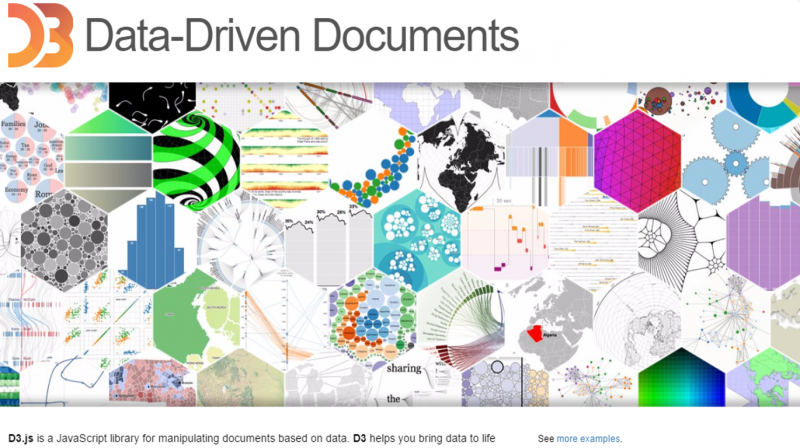

# D3.js



> D3는 ‘Data Drivened Document’(데이터 기반 문서)의 약자다. D3.js는 데이터에 기반을 둔 문서를 다룰 수 있는 자바스크립트 기반 라이브러리다. D3.js는 HTML, SVG(Scalable Vector Graphics), CSS를 사용해 데이터를 시각적인 결과물로 나타낸다. D3.js는 최신 표준 기술을 지원하는 웹브라우저에서 구동하며,‘인터넷 익스플로러8’ 이하 버전에서는 동작하지 않는다.

  


## 목차

I. [일단 해 보기](#I-일단-해-보기)

II. [여러 개의 데이터 처리하기](#ii-여러-개의-데이터-처리하기)

III. [CSV 읽어오기 / 애니메이션](#iii-csv-읽어오기--애니메이션)

IV. [세로 막대 그래프](#iv-세로-막대-그래프 )

1. 예제-1
2. 예제-2

V. [파이 차트](#v-파이-차트)

VI. [꺾은 선 차트](#vi-꺾은-선-차트)

1. [기본 꺽은 선 차트](#1-기본-꺾은-선-차트)
2. [여러개의 꺾은선 그래프와 회전된 축 텍스트](#2-여러개의-꺾은선-그래프와-회전된-축-텍스트)
3. [영역 안을 칠한 꺾은선 그래프](#3-영역-안을-칠한-꺾은선-그래프)

VII. [TreeMap](#vii-treemap)

VIII. [Plot 그리기](#viii-Plot-그리기-scatter)

  

  

## I. 일단 해 보기

테스트용 html. `d3js` 라이브러리를 적용하고 `<body>`에 ```svg``` 엘리먼트를 추가한다.

```html
<!DOCTYPE html>
<html>
<head>
<meta charset="UTF-8">
<title>Sample</title>
<script src="https://d3js.org/d3.v5.min.js"></script>
<script src="https://d3js.org/d3-dsv.v1.min.js"></script>
<script src="https://d3js.org/d3-fetch.v1.min.js"></script>
<style>
  svg {
    width: 320px;
    height: 240px;
    border: 1px solid black;
  }
  
  .bar {
    fill: orange;
  }
  
  .barNum {
    font-size: 9pt;
    text-anchor : middle;
  }
  
</style>
</head>
<body>
  <svg id="myGraph"></svg>
</body>
</html>
```

가로 그래프 한 개 찍어보기

```javascript
//1. 데이터 준비
var dataSet = [300, 150, 10, 80, 230];
d3.select("#myGraph")
    .append("rect")
    .attr("x", 0)
    .attr("y", 0)
    .attr("width", dataSet[0])
    .attr("height", "20px");
```


## II. 여러 개의 데이터 처리하기 

### selectAll(), data(), enter()

```javascript
var dataSet = [300, 150, 10, 80, 230];
	d3.select("#myGraph")
		.selectAll("rect")
		.data(dataSet) //데이터 설정
		.enter()
		.append("rect")
		.attr("x", 0)
		.attr("y", function(d, i){
			return i*30;
		})
		.attr("width", function(d, i){
			return d+"px";
		})
		.attr("height", "20px");
```


## III. CSV 읽어오기 / 애니메이션

```javascript
d3.csv("data.csv").then(function(data){
    for(var i = 0; i < data.length; i++){
        dataSet.push(data[i].item1);
    }


    d3.select("#myGraph")
        .selectAll("rect")
        .data(dataSet) //데이터 설정
        .enter()
        .append("rect")
        .attr("x", 0)
        .attr("y", function(d, i){
        return i * 30;
    })
        .attr("width", "0px")
        .attr("height", "20px")
        .transition()
        .delay(function(d, i){
        return i*500;
    })
        .duration(2000)
        .attr("width", function(d, i){
        return d + "px";
    });

    d3.select("#myGraph")
        .selectAll("rect")
        .on("click", function(){
        d3.select(this)
            .style("fill", "cyan");
    });


    d3.select("#updateButton")
        .on("click", function() {
        for(var i = 0; i < dataSet.length; i++) {
            dataSet[i] = Math.floor(Math.random()*320);
        }

        d3.select("#myGraph")
            .selectAll("rect")
            .data(dataSet)
            .transition()
            .attr("width", function(d, i){
            return d + "px";
        });
    });

});
```


## IV. 세로 막대 그래프 

### 1. 예제-1

```html
<!DOCTYPE html>
<html>
<head>
<meta charset="UTF-8">
<title>Sample</title>
<script src="https://d3js.org/d3.v5.min.js"></script>
<script src="https://d3js.org/d3-dsv.v1.min.js"></script>
<script src="https://d3js.org/d3-fetch.v1.min.js"></script>
<script src="js/bar3.js"></script>
<style>
  svg { width: 320px; height: 240px; border: 1px solid black; }
  .bar { fill: orange; }
  .barNum { font-size: 9pt; text-anchor : middle; }
  .axis text { font-family: sans-serif; font-size: 11px; }
  .axis path, .axis line { fill: none; stroke: black; }
  .axis_x line { fill: none; stroke: black; }
</style>
</head>
<body>
  <h1>세로형 막대그래프 - csv파일로부터 데이터와 레이블 읽어와서 표시</h1>
  <svg id="myGraph"></svg><br>
  
  ticks() - 누금 간격 지정, 기본값 10 <br>
  ticks()는 모두가 지정한 값과 같은 간격이 됩니다 <br>
  tickValues()는 서로 다른 간격으로 표기합니다.<br>
  tickFormat()는 눈금에 표시할 숫자에 서식 지정합니다<br>

</body>
</html>
```

### 2. 예제-2

```javascript
/**
 * 
 */

window.addEventListener("load", function(){
	
	var dataSet = [];
	var labelName = [];
	d3.csv("datas/mydata4.csv").then(function(data){
		for(var i in data[0]) {
			dataSet.push(data[0][i]);
			labelName.push(i);
		}
		
		
		var svgEle = document.getElementById("myGraph");
		var svgWidth = window.getComputedStyle(svgEle, null).getPropertyValue("width");
		var svgHeight = window.getComputedStyle(svgEle, null).getPropertyValue("height");
		svgWidth = parseFloat(svgWidth);
		svgHeight = parseFloat(svgHeight);
		
		
		var barElements;	//막대그래프의 막대 요소를 저장할 변수
		var offsetX = 30;
		var offsetY = 15;
		var dataMax = 300;
		var barWidth = 20;
		var barMargin = 15;
		
		barElements = d3.select("#myGraph")
		.selectAll("rect") //rect 요소를 지정
		.data(dataSet);	//ㄷ이터를 요소에 연결
		
		
		
		barElements.enter()	//데이터 수 만큼 반복
		.append("rect")		//데이터 수 만큼 rect 요소가 추가됨
		.attr("class", "bar") //CSS 클래스 설정
		.attr("height", 0)
		.attr("width", barWidth)	//넒이 지정
		.attr("x", function(d, i) {
			return i * (barWidth + barMargin) + offsetX;	//X 좌표를 표시 순서 x25로 함
		})
		.attr("y", svgHeight - offsetY)	//Y 좌표를 계산 
		.on("mouseover", function(){
			d3.select(this).style("fill", "red")
		})
		.on("mouseout", function(){
			d3.select(this).style("fill", "orange")
		})
		//에니메이션 처리
		.transition()
		.duration(3000)
		.attr("y", function(d, i){
			return svgHeight - d - offsetY;
		})
		.attr("height", function(d, i){
			return d;
		})
		
		barElements.enter()
		.append("text")
		.attr("class", "barNum")
		.attr("x", function(d, i){
			return i * (barWidth + barMargin)+ 10 + offsetX;
		})
		.attr("y", svgHeight - 5 - offsetY)
		.text(function(d, i){
			return d;
		});
		
		//눈금을 표시하기 위한 스케일 설정
		var yScale = d3.scaleLinear()
		.domain([0, dataMax])
		.range([dataMax, 0])
		
		//눈금의 표시 위치를 왼쪽으로 지정
		var axis = d3.axisLeft(yScale)
		.ticks(10)
		.tickValues([0, 10, 20, 30, 50, 100, 1500, 200])
		//.tickFormat(d3.format(".2f"));
		
		//눈금을 설정하여 표시
		d3.select("#myGraph").append("g")
		.attr("class", "axis")
		.attr("transform", "translate("+ offsetX +", " + ((svgHeight-300-offsetY))+ ")")
		.call(axis)
		
		d3.select("#myGraph")
		.append("rect")
		.attr("class", "axis_x")
		.attr("width", 320)
		.attr("height", 1)
		.attr("transform", "translate("+ offsetX + ", " + (svgHeight-offsetY)+")")
		
		barElements.enter()
		.append("text")
		.attr("class", "barNum")
		.attr("x", function(d, i){
			return i * (barWidth + barMargin) + 10 + offsetX;
		})
		.attr("y", svgHeight - offsetY + 15)
		.text(function(d, i){
			//return d;
			return labelName[i];
		});
	})
	
	
	
}, false);

```


## V. 파이 차트

pie10.html

```html
<!DOCTYPE html>
<html>
<head>
<meta charset="UTF-8">
<title>Sample</title>
<script src="https://d3js.org/d3.v5.min.js"></script>
<script src="https://d3js.org/d3-dsv.v1.min.js"></script>
<script src="https://d3js.org/d3-fetch.v1.min.js"></script>
<script src="js/pie10.js"></script>
<style>
  svg { width: 320px; height: 240px; border: 1px solid black; }
  .pie { fill: orange; stroke: none; }
  .total { font-size: 9pt; text-anchor: middle; }
  .pieNum { font-size: 10pt; text-anchor: middle; }
</style>
</head>
<body>
  <h1>원 그래프 표시</h1>
  <svg id="myGraph"></svg><br>
  <form>
    <select id="year">
      <option value="2008">2008년</option>
      <option value="2009">2009년</option>
      <option value="2010">2010년</option>
      <option value="2011">2011년</option>
      <option value="2012">2012년</option>
      <option value="2013">2013년</option>
      <option value="2014">2014년</option>
    </select>
  </form>
  
</body>
</html>
```

pie10.js

```javascript
/**
 * 
 */

window.addEventListener("load", function(){
	
	drawPie("./datas/mydata2008.csv");
	
	d3.select("#year").on("change", function(){
		d3.select("#myGraph").selectAll("*").remove();
		drawPie("./datas/mydata"+this.value+".csv", this.value);
	});
	
	
}, false);

function drawPie(filename) {
	d3.csv(filename).then(function(data){
		
		var dataSet = [];
		var labelName = [];
		
		for(var i in data[0]) {
			dataSet.push(data[0][i]);
			labelName.push(i);
		}
		
		
		var svgEle = document.getElementById("myGraph");
		var svgWidth = window.getComputedStyle(svgEle, null).getPropertyValue("width");
		var svgHeight = window.getComputedStyle(svgEle, null).getPropertyValue("height");
		svgWidth = parseFloat(svgWidth);
		svgHeight = parseFloat(svgHeight);
		
		var color = d3.scaleOrdinal(d3.schemeCategory10);
		
		//원 그래프의 좌표값을 계산하는 메서드
		var pie = d3.pie().value(function(d, i) {return d;}); //원 그래프 레이아웃
		var arc = d3.arc().innerRadius(40).outerRadius(100);
		
		//원 그래프 그리기
		//원 그래프의 부채꼴은 path의 좌표로 구성되므로 path요소 지정
		var pieElements = d3.select("#myGraph")
		.selectAll("g")
		.data(pie(dataSet))
		.enter()
		.append("g")
		.attr("transform", "translate(" + svgWidth/2 + ", " + svgHeight/2 + ")")
		
		pieElements
		.append("path")
		.attr("class", "pie")
		.style("fill", function(d, i){
			return color(i);
		})
//		.attr("d", arc)
		.transition()
		.duration(200)
		.delay(function(d, i) {
			return i*200;
		})
		.ease(d3.easeLinear)
		.attrTween("d", function(d, i){
			var interpolate = d3.interpolate(
				{ startAngle : d.startAngle, endAngle : d.startAngle },
				{ startAngle : d.startAngle, endAngle : d.endAngle }
			);
			return function(t) {
				return arc(interpolate(t));
			}
			
		})
		
		var textElements = d3.select("#myGraph")
		.append("text")
		.attr("class", "total")
		.attr("transform", "translate(" + svgWidth/2 + ", " + (svgHeight/2 + 5)+ ")")
		.text("점유율: " + d3.sum(dataSet));
		
		pieElements
		.append("text")
		.attr("class", "pieNum")
		.attr("transform", function(d, i) {
			return "translate("+arc.centroid(d)+")";
		})
		.text(function(d, i){
			return labelName[i] + ": " + d.value;
		})
		
	});
}


```


## VI. 꺾은 선 차트

### 1. 기본 꺾은 선 차트

```html
<!DOCTYPE html>
<html>
<head>
<meta charset="UTF-8">
<title>chart1.html</title>
<style>
  svg {
     width: 380px;
    height: 240px;
    border: 1px solid black;
  }
  
  .line { fill:none; stroke: black;}
  
  .axis text {
    font-family: sans-serif;
    font-size: 11px;
  }
  
  .axis path, .axis line {
    fill: none;
    stroke: black;
  }
  
  .axis_x line {
    fill: none;
    stroke: black;
  }
  
  .barNum { font-size: 10pt; text-anchor : middle; font-color: black; }
  
</style>
<script src="https://d3js.org/d3.v5.min.js"></script>
<script src="js/line2.js"></script>
</head>
<body>
  <h3>꺾은선 그래프 - 눈금 표시</h3>
  <svg id="myGraph"></svg>

</body>
</html>
```

line2.js

```javascript
/**
 * 
 */

window.addEventListener("load", function(){
	
	var svgEle = document.getElementById("myGraph");
	var svgWidth = window.getComputedStyle(svgEle, null).getPropertyValue("width");
	var svgHeight = window.getComputedStyle(svgEle, null).getPropertyValue("height");
	svgWidth = parseFloat(svgWidth);
	svgHeight = parseFloat(svgHeight);
	
	var dataSet = [10, 47, 65, 8, 64, 99, 75, 22, 63, 80];
	var margin = (svgWidth*0.9)/(dataSet.length - 1);
	
	var offsetX = 30;
	var offsetY = 15;
	var dataMax = 100;
	
	var line = d3.line()
	.x(function(d, i){
		return i * margin;
	})
	.y(function(d, i){
		return svgHeight - d*2;
	})
	
	var lineElements = d3.select("#myGraph")
	.append("path")
	.attr("class", "line")
	.attr("d", line(dataSet))
	.attr("transform", "translate("+ offsetX +", " + -offsetY+ ")")
	
	
	
	//눈금을 표시하기 위한 스케일 설정
	var yScale = d3.scaleLinear()
	.domain([0, dataMax])
	.range([dataMax*2, 0])
	
	//눈금의 표시 위치를 왼쪽으로 지정
	var axis = d3.axisLeft(yScale)
	.ticks(10)
	//.tickFormat(d3.format(".2f"));
	
	d3.select("#myGraph").append("g")
	.attr("class", "axis")
	.attr("transform", "translate("+ offsetX +", " + ((svgHeight-dataMax*2-offsetY))+ ")")
	.call(axis)
		
	
	d3.select("#myGraph")
	.append("rect")
	.attr("class", "axis_x")
	.attr("width", 320)
	.attr("height", 1)
	.attr("transform", "translate("+ offsetX + ", " + (svgHeight-offsetY)+")")
	
	
	//안 먹네....
	lineElements.enter()
	.append("text")
	.attr("class", "barNum")
	.attr("x", function(d, i){
		return i *5;
	})
	.attr("y", function(d, i){
		return svgHeight - 100;
	})
	.text(function(d, i){
		return 100;
	});
	
}, false);


```


### 2. 여러개의 꺾은선 그래프와 회전된 축 텍스트

line8.html

```html
<!DOCTYPE html>
<html>
<head>
<meta charset="UTF-8">
<title>chart1.html</title>
<script src="https://d3js.org/d3.v5.min.js"></script>
<script src="js/line8.js"></script>
<style>
  svg {
     width: 380px;
    height: 300px;
    border: 1px solid black;
  }
  
  .line { fill:none; stroke: black;}
  
  .axis text {
    font-family: sans-serif;
    font-size: 11px;
  }
  
  .axis path, .axis line {
    fill: none;
    stroke: black;
  }
  
  .axis_x line {
    fill: none;
    stroke: black;
  }
  
  .itemA { stroke: #000; }
  .itemB { stroke: #F00; }
  .itemC { stroke: #00F; }
  
  .barNum { font-size: 10pt; text-anchor : middle; font-color: black; }
  
</style>

</head>
<body>
  <h3>여러개의 꺾은선 그래프 표시</h3>
  <svg id="myGraph"></svg>

</body>
</html>
```

line8.js

```javascript
window.addEventListener("load", function(){
	var svgWidth = 320;	// SVG 요소의 넓이
	var svgHeight = 240;	// SVG 요소의 높이
	var offsetX = 30;	// 가로 오프셋
	var offsetY = 20;	// 세로 오프셋
	var scale = 2.0;	// 2배 크기로 그리기 (세로 배율)

	var dataSet = [
		[
			{ year : 2004, value : 10},
			{ year : 2005, value : 47},
			{ year : 2006, value : 65},
			{ year : 2007, value : 8},
			{ year : 2008, value : 64},
			{ year : 2009, value : 99},
			{ year : 2010, value : 75},
			{ year : 2011, value : 22},
			{ year : 2012, value : 63},
			{ year : 2013, value : 80}
		],
		[
			{ year : 2004, value : 90},
			{ year : 2005, value : 77},
			{ year : 2006, value : 55},
			{ year : 2007, value : 48},
			{ year : 2008, value : 64},
			{ year : 2009, value : 90},
			{ year : 2010, value : 85},
			{ year : 2011, value : 42},
			{ year : 2012, value : 13},
			{ year : 2013, value : 40}
		],
		[
			{ year : 2004, value : 50},
			{ year : 2005, value : 27},
			{ year : 2006, value : 45},
			{ year : 2007, value : 58},
			{ year : 2008, value : 84},
			{ year : 2009, value : 70},
			{ year : 2010, value : 45},
			{ year : 2011, value : 22},
			{ year : 2012, value : 30},
			{ year : 2013, value : 90}
		]
	];
	

	var margin = svgWidth/(dataSet[0].length - 1);	// 꺾은선 그래프의 간격 계산
	drawGraph(dataSet[0], "itemA");	// itemA의 꺾은선 그래프 표시
	drawGraph(dataSet[1], "itemB");	// itemB의 꺾은선 그래프 표시
	drawGraph(dataSet[2], "itemC");	// itemB의 꺾은선 그래프 표시
	drawScale();	// 눈금 표시

	//꺾은선 그래프를 표시하는 함수
	function drawGraph(dataSet, cssClassName){
		// 꺾은선 그래프의 좌표를 계산하는 메서드
		var line = d3.line()	// svg의 선
		.x(function(d, i){
			return offsetX + i * margin;	// X 좌표는 표시 순서×간격
		})
		.y(function(d, i){
			return svgHeight - (d.value * scale) - offsetY;	// 데이터로부터 Y 좌표 빼기
		});
		
		// 꺾은선 그래프 그리기
		var lineElements = d3.select("#myGraph")
		.append("path")	// 데이터 수만큼 path 요소가 추가됨
		.attr("class", "line "+cssClassName)	// CSS 클래스 지정
		.attr("d", line(dataSet))	//연속선 지정
		// 눈금 표시를 위한 스케일 설정
	}

	//그래프의 눈금을 표시하는 함수
	function drawScale(){
		var yScale = d3.scaleLinear()  // 스케일 설정
		.domain([0, 100])   // 원래 크기
		.range([scale*100, 0]) // 실제 표시 크기
	  
		//눈금의 표시 위치를 왼쪽으로 지정
		var axis = d3.axisLeft(yScale);
		
		// 눈금 표시  
		d3.select("#myGraph")	// SVG 요소를 지정
		.append("g")	// g 요소 추가. 이것이 눈금을 표시하는 요소가 됨
		.attr("class", "axis")	// CSS 클래스 지정
		.attr("transform", "translate("+offsetX+", "+offsetY+")")
		.call(axis)
			  
		// 가로 방향의 선을 표시
		d3.select("#myGraph")
		.append("rect")	// rect 요소 추가
		.attr("class", "axis_x")	// CSS 클래스 지정
		.attr("width", svgWidth)	// 선의 넓이를 지정
		.attr("height", 1)	// 선의 높이를 지정
		.attr("transform", "translate("+offsetX+", "+(svgHeight-offsetY)+")")
		
		var xScale = d3.scaleLinear()
		.domain([new Date("2004/1/1"), new Date("2013/1/1")])
		.range([0, svgWidth])
		
		var bottomAxis = d3.axisBottom(xScale)
		.ticks(5)
		.tickFormat(function(d, i){
			var formatTime = d3.timeFormat("%Y년%m월");
			return formatTime(d);
		});
		
		d3.select("#myGraph")
		.append("g")
		.attr("class", "axis")
		.attr("transform", "translate(" + offsetX + ", " + (svgHeight - offsetY) + ")")
		.call(bottomAxis)
		.selectAll("text")
		.attr("transform", "rotate(90)")
		.attr("dx", "0.7em")
		.attr("dy", "-0.4em")
		.style("text-anchor", "start")
		
	}

}, false); //addEventListener() end


```


### 3. 영역 안을 칠한 꺾은선 그래프

line4.html

```html
<!DOCTYPE html>
<html>
<head>
<meta charset="UTF-8">
<title>Sample</title>
<script src="https://d3js.org/d3.v4.min.js"></script>
<script src="js/line4.js"></script>
<style>
  
  
</style>

</head>
<body>
  <h1>영역 안을 칠한 꺾은선 그래프 표시</h1>
  <div id="my_dataviz"></div>

</body>
</html>
```

line4.js

```javascript
window.addEventListener("load", function(){
	
	var margin = { top: 10, right: 30, bottom: 30, left: 50},
		width = 460 - margin.left - margin.right,
		height = 400 - margin.top - margin.bottom;
	
	var svg = d3.select("#my_dataviz")
	.append("svg")
	.attr("width", width + margin.left + margin.right)
	.attr("height", height + margin.top + margin.bottom)
	.append("g")
	.attr("transform", "translate(" + margin.left + "," + margin.top + ")");
	
	d3.csv("datas/orders.csv", 
		function(d) {
			return { date: d3.timeParse("%Y-%m-%d")(d.date), value: d.value }
		}, 
		function(data) {
			
			//Add X axis
			var x = d3.scaleTime()
			.domain(d3.extent(data, function(d){ return d.date; }))
			.range([0, width]);
			
			svg.append("g")
			.attr("transform", "translate(0, " + height + ")")
			.call(d3.axisBottom(x));
			
			//Add Y axis
			var y = d3.scaleLinear()
			.domain([0, d3.max(data, function(d) { return +d.value; })])
			.range([height, 0]);
			
			svg.append("g")
			.call(d3.axisLeft(y));
			
			//Add the area
			svg.append("path")
			.datum(data)
			.attr("fill", "#cce5df")
			.attr("stroke", "#69b3a2")
			.attr("stroke-width", 1.5)
			.attr("d", d3.area()
				.x(function(d){ console.log(d.date); return x(d.date) })
				.y0(y(0))
				.y1(function(d) { console.log(d.value); return y(d.value)})
			)
		}
		
	);
	

}, false); //addEventListener() end
```


## VII. TreeMap

treemap1.html

```html
<!DOCTYPE html>
<html>
<head>
<meta charset="UTF-8">
<title>Sample</title>
<style>

  
</style>
<script src="https://d3js.org/d3.v5.min.js"></script>
<script src="js/treemap1.js"></script>
</head>
<body>
  <h3>D3 v5 hierarchy treemap</h3>
  <svg id="myGraph" width="800" height="600"></svg>

</body>
</html>
```

treemap1.js

```javascript
window.addEventListener("load", function(){
	var width = document.querySelector("svg").clientWidth;
	var height = document.querySelector("svg").clientHeight;
	
	var data = {
		"name": "A",
		"children": [
			{ 	"name": "B", "value": 25},
			{
				"name": "C",
				"children": [
					{ "name": "D", "value": 10 },
					{ "name": "E", "value": 15 },
					{ "name": "F", "value": 10 }
				]
			},
			{ 	"name": "G", "value": 15 },
			{
				"name": "H",
				"children": [
					{ "name": "I", "value": 20 },
					{ "name": "J", "value": 10 },
				]
			},
			{ 	"name": "K", "value": 10 }
		]
	};
	
	root = d3.hierarchy(data);
	root.sum(function(d){ return d.value})
	.sort(function(a, b){
		return b.height - a.height || b.value - a.value
	});
	
	var treemap = d3.treemap()
	.size([width, height])
	.padding(1)
	.round(true);
	
	treemap(root);
	
	var g = d3.select("svg")
	.selectAll(".node")
	.data(root.leaves())
	.enter()
	.append("g")
	.attr("class", "node")
	.attr("transform", function(d){ 
		return "translate(" + d.x0 + ", " + (d.y0) + ")"; 
	});
	
	g.append("rect")
	.style("width", function(d){ return d.x1 - d.x0; })
	.style("height", function(d){ return d.y1 - d.y0; })
	.style("fill", function(d){
		while(d.depth > 1) d = d.parent;
		return d3.schemeCategory10[parseInt(d.value % 7)];
	})
	.style("opacity", 0.6)
	
	g.append("text")
	.attr("text-anchor", "start")
	.attr("x", 5)
	.attr("dy", 30)
	.attr("font-size", "150%")
	.attr("class", "node-label")
	.text(function(d){ return d.data.name + " : " + d.value; });
		

}, false); //addEventListener() end


```


## VIII. Plot 그리기 (scatter)

plot4.html

```html
<!DOCTYPE html>
<html>
<head>
<meta charset="UTF-8">
<title>Sample</title>
<script src="https://d3js.org/d3.v5.min.js"></script>
<script src="js/plot4.js"></script>
<style>
  svg { width: 320px; height: 240px; border: 1px solid black; }
  .mark { fill: blue; stroke: none; }
  .axis text {
    font-family: sans-serif;
    font-size: 11px;
  }
  
  .axis path,
  .axis line {
    fill: none;
    stroke: black;
  }
  
  .grid {
    stroke : gray;
    stroke-dasharray: 4, 2;
    shape-rendering: crispEdges;
  }
  
  .tip {
    position: absolute;
    top: 0px;
    left: 0px;
    z-index: 9999;
    visibility: hidden;
    border: 1px solid black;
    background-color: yellow;
    width: 80px;
    height: 16px;
    overflow: hidden;
    text-align: center;
    font-size: 9pt;
    font-family: Tahoma, Optima, Helvetica;
    color: black;
  }
</style>

</head>
<body>
  <h1>산포도 표시 : 애니메이션 + 그리프 표현</h1><br>
  <svg id="myGraph"></svg><br>

</body>
</html>
```

plot4.js

```javascript
/**
 * 
 */

window.addEventListener("load", function(){
	
	var svgWidth = 320;
	var svgHeight = 240;
	var offsetX = 30;
	var offsetY = 20;
	var svg = d3.select("#myGraph");
	
	var dataSet = [
		[30, 40], [120, 115], [125, 90], [150, 160], [300, 190],
		[60, 40], [140, 145], [165, 110], [200, 170], [250, 190]
	];
	

	
	var circleElements = svg.selectAll("circle").data(dataSet);
	
	circleElements.enter()
	.append("circle")
	.attr("class", "mark")
	.attr("cx", function(d, i) {
		return d[0] + offsetX;
	})
	.attr("cy", function(d, i){
		return svgHeight - d[1] - offsetY;
	})
	.attr("r", 5);
	
	
	drawScale(dataSet);
	
	
	function updateData(data) {
		var result = data.map(function(d, i) {
			var x = Math.random() * (svgWidth );
			var y = Math.random() * (svgHeight );
			return [x, y];
		});
		
		return result;
	}
	
	function updateGraph(dataSet) {
		d3.select("#myGraph").selectAll("*").remove();
		
		circleElements = d3.select("#myGraph")
			.selectAll("circle")
			.data(dataSet)
			
		circleElements.enter()
		.append("circle")
		.attr("class", "mark")
		.transition()
		.attr("cx", function(d, i){
			return d[0] + offsetX;
		})
		.attr("cy", function(d, i){
			return svgHeight - d[1] - offsetY;
		})
		.attr("r", 5);
		
	}
	
	function drawScale(dataSet) {
		d3.select("#myGraph").selectAll("g").remove(); //눈금 삭제
		
		var maxX = d3.max(dataSet, function(d, i) {
			return d[0];
		});
		
		var maxY = d3.max(dataSet, function(d, i){
			return d[1];
		});
		
		var yScale = d3.scaleLinear()
			.domain([0, maxY])
			.range([maxY, 0]);
		
		var axis = d3.axisLeft(yScale);
		
		d3.select("#myGraph")
		.append("g")
		.attr("class", "axis")
		.attr("transform", "translate(" + offsetX + ", " + (svgHeight - maxY - offsetY) +")")
		.call(axis);
		
		var xScale = d3.scaleLinear()
			.domain([0, maxX])
			.range([0, maxX]);
		
		var axis_x = d3.axisBottom(xScale);
		
		d3.select("#myGraph")
		.append("g")
		.attr("class", "axis")
		.attr("transform", "translate(" + offsetX + ", " + (svgHeight - offsetY) +")")
		.call(axis_x);
		
		var grid = svg.append("g");
		var rangeX = d3.range(50, maxX, 50);
		var rangeY = d3.range(20, maxY, 20);
		
		grid.selectAll("line.y")
		.data(rangeY)
		.enter()
		.append("line")
		.attr("class", "grid")
		.attr("x1", offsetX)
		.attr("y1", function(d, i){
			return svgHeight - d - offsetY;
		})
		.attr("x2", maxX + offsetX)
		.attr("y2", function(d, i){
			return svgHeight - d - offsetY;
		});
		
		grid.selectAll("line.x")
		.data(rangeX)
		.enter()
		.append("line")
		.attr("class", "grid")
		.attr("x1", function(d, i){
			return d + offsetX;
		})
		.attr("y1", svgHeight - offsetY)
		.attr("x2", function(d, i){
			return d + offsetX;
		})
		.attr("y2", svgHeight - offsetY - maxY)
		
	}
	
	var tooltip = d3.select("body")
	.append("div")
	.attr("class", "tip");
	
	
	function showTooltip() {
		circleElements = d3.select("#myGraph")
		.selectAll("circle")
		
		circleElements.on("mouseover", function(d){
			var x = parseInt(d[0]);
			var y = parseInt(d[1]);
			var data = d3.select(this).datum();
			var dx = parseInt(data[0]);
			var dy = parseInt(data[1]);
			
			tooltip
			.style("left", offsetX + x + "px")
			.style("top", svgHeight + offsetY - y + "px")
			.style("visibility", "visible")
			.text(dx + ", " + dy)
		})
		
		circleElements.on("mouseout", function(d){
			tooltip.style("visibility", "hidden")
		})
	}
	
	showTooltip();
	
	setInterval(function(){
		dataSet = updateData(dataSet);
		updateGraph(dataSet);
		drawScale(dataSet);
		showTooltip();
	}, 2000);
	
	
	
}, false);
```


