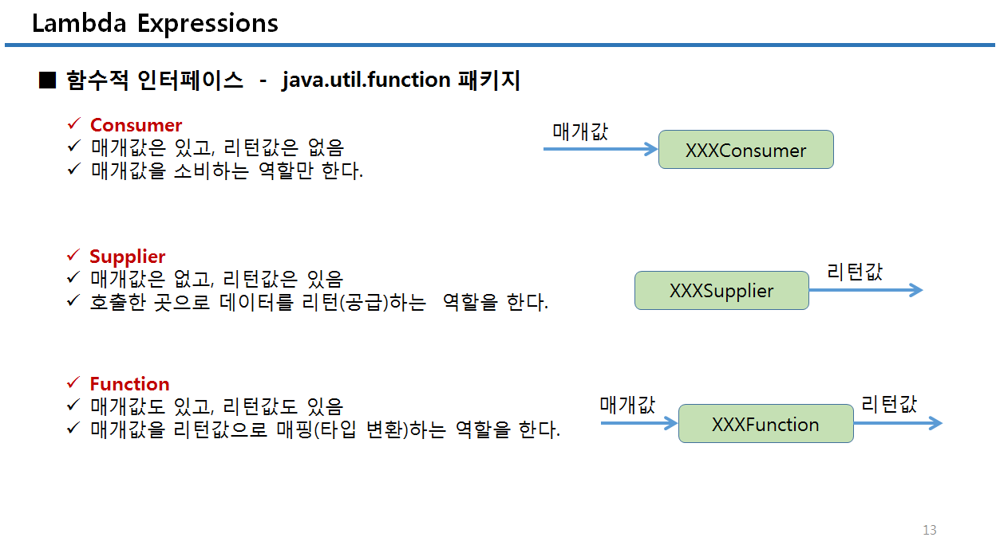
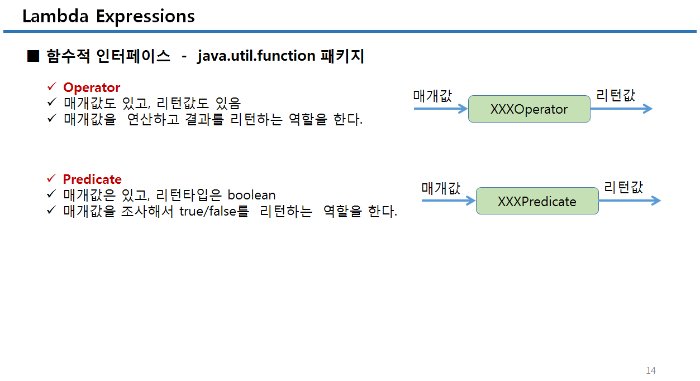

#### Lambda Expression

- 익명 함수(anonymous function)를 생성하기 위한 식

- 자바 코드가 매우 간결해지고, 컬렉션의 요소를 필터링하거나 매핑해서 원하는 결과를 쉽게 집계할 수 있다

- 매개 변수를 가진 코드 블록 형태지만, 런타임 시에는 익명 구현 객체를 생성

- 하나의 매개 변수만 있다면 괄호 ( )를 생략할 수 있고, 하나의 실행문만 있다면 중괄호 { }도 생략할 수 있다 


- 인터페이스  변수 = 람다식;

- 함수적 인터페이스는 하나의 추상 메소드가 선언된 인터페이스로서 람다식의 타겟 타입이 될 수 있다

- @FunctionalInterface - 두 개 이상의 추상 메소드가 선언되지 않도록 컴파일러가 체킹해주는 기능

- 람다식의 실행 블록에는 클래스의 멤버(필드와 메소드) 및 로컬 변수를 사용할 수 있다

- 람다식에서 this 는 내부적으로 생성되는 익명 객체의 참조가 아니라 람다식을 실행한 객체의 참조이다

- 매개변수 또는 로컬 변수를 람다식에서 읽는 것은 허용되지만, 람다식 내부 또는 외부에서 변경할 수 없다








```java
package lab.java.lambda;

public class LambdaTest {

	public static void main(String[] args) {
		
		new Thread(new Runnable() {
			public void run() {
				for(int i = 0; i < 10; i++){
	                System.out.println("hello-runnable" + i);
	            }
			}
		}).start();
		
		new Thread( ()->{
            for(int i = 0; i < 10; i++){
                System.out.println("hello-lambda " + i);
            }
        } ).start();
	}

}

```


### aaa


