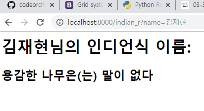
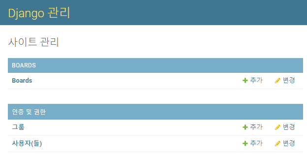

# Happy Hacking 수업 내용

## VSCODE 설치

### Extention 설치

- HTML Snippet
- Open in Browser
- HTML CSS Support

> :point_right:꿀팁!
>
> vscode 첫 줄에서 `!` `tab` 을 하면 기본적인 사항이 적용된다.
>
> snippet의 힘

## HTML

> HTML에 대한 기본적인 사항에 대하여 리마인드 하고 넘어간다.

- Hyper Text Markup Language의 약자
- `<head>`:
- `<body>`:
- attribute
- `DOM` 트리
- 시맨틱 태그
  - header
  - nav
  - aside
  - section
  - article
  - footer

### Tags

> CSS에 대한 기본적인 사항에 대하여 리마인드 하고 넘어간다.

- `h`, `p`, `div`, `span`
- `ol`, `ul`, `li`
- `table`, `tr`, `th`, `td`
- `section`
- `iframe`
- `img`
- `form`, `input`, `select`
  - text, email, password, number
  - radio, check
  - date

## CSS

- em

  em은 배수 단위로 상대 단위이다. 요소에 지정단 사이즈(상속된 사이즈나 디폴트 사이즈)에 상대적인 사이즈를 설정한다

- rem

  rem의 기준은 상속의 영향으로 바뀔 수 있다. 즉, 상황에 따라  1.2em은 각기 다른 값을 가질 수 있따. rem은 최상위 요소의 사이즈를 기준으로 삼는다. rem의 r은 root를 의미

- viewport

  디바이스 마다 다른 크기의 화면을 가지고 있기 때문에 상대적인 단위 viewport를 기준으로 만든 단위

- 색상표현

- box model의 구성

  - border
  - margin
  - padding
  - 크기지정은 shorthand 표현 가능

- display 속성

  - block
    - 항상 새로운 라인에서 시작
    - 100% 차지
    - 컨텐츠 영역 외에는 마진으로 채워진다
    - 정렬에는 margin을 auto로 설정
    - div, table emdemd

  - inline
    - 새로운 라인에서 시작하지 않으며 문자의 중간에 들어갈 수 있다.
    - content의 너비 만큼 지정 가능
    - span, a, strong, img, br, input, select, textarea, button

  - inline-block

    inline과는 다르게 상하좌우 마진 등을 줄 수 있다.

  - none

    해당 요소를 화면에 표현하지 않는다. 공간 조차 사라진다.

    ig. visibility:hidden - 해당 요소를 화면에 표현하지 않지만 공간은 남아 있다.

- 위치

  - static

  - relative(상대위치)

    top, bottom, left, right를 사용하여 위치를 이동

  - absolute(절대위치)

    부모 요소 또는 가장 가까이 있는 조상 요소(static 제외)를 기준으로 좌표 프로퍼티만큼 이동한다.

  - fixed(고정위치)

    부모 요소와 관계없이 브라우저의 viewport를 기준으로 위치를 잡는다.  스크롤 해도 사라지지 않는다.

#### Bootstrap

 https://getbootstrap.com/ 

#### Animate.css

 https://daneden.github.io/animate.css/ 

## Python

> 파이썬 기본 사항에 대하여 간단하게 훑고 지나감.

### flask

- virtualenv 가상 환경 설정

  >  독립적인 파이썬 가상환경 관리에 용이한 패키지

  ```bash
  > pip install virtualenv
  
  > virtualenv venv
  
  # 가상환경으로 들어가기
  > source venv/Scripts/activate
  
  # 빠져나가기
  > deactivate
  ```

- flask 설치

  ```
  pip install flask
  ```

- app.py

  ```python
  from flask import Flask
  import random
  
  app = Flask(__name__)
  
  @app.route("/")
  def hello():
      name = "World!!"
      return f"Hello {name}!"
  
  @app.route("/mulcam")
  def mulcal():
      return "Hello mulcam"
  
  @app.route("/greeting/<string:name>")
  def greeting(name):
      return f"{name}님 안녕하세요."
  
  
  @app.route("/lunch/<int:num>")
  def lunch(num):
      menu = ["짜장면", "짬뽕", "라면", "스파게티", "스테이크"]
      order = random.sample(menu, num)
      return str(order)
  
  @app.route("/lotto/<int:num>")
  def lotto(num):
      base = range(1, 47)
      lotnum = random.sample(base, num)
      return str(lotnum)
  
  
  # app.py 로 바로 실행 시
  if __name__ == "__main__":
      app.run(debug=True, port=8000)
  
  ```

- 실행

  ```bash
  # 1번 실행 예: 
  > env FLASK_APP=hello.py flask run
  # 2번 실행 예: 
  > python app.py
  ```

#### render_template

flask 상에서 html 파일을 해석해서 보여줌

- templates 폴더 생성

  이곳에 hi.html 등의 html 파일을 생성한다.

  ```bash
  mkdir templates
  
  # 만약 hi.html을 미리 만들었었다면
  mv hi.html templates/
  ```

  ***hi.html***

  ```html
  <h1>Hi, {{ name }}</h1>
  ```

  ***lunch.html***

  ```html
  <h1>오늘의 개인별 메뉴는!</h1>
  <h3>{{ menu }}</h3>
  
  <ul>
  
      <li>{{ m }}</li>
  
  </ul>
  ```

- 사용 예

  ```python
  # -----------------------------------------------------------------------------
  # render_template 적용
  # -----------------------------------------------------------------------------
  @app.route("/hi/<string:name>")
  def hi(name):
      return  render_template("hi.html", name=name)
  
  @app.route("/lunch2/<int:num>")
  def lunch2(num):
      menu = ["짜장면", "짬뽕", "라면", "스파게티", "스테이크"]
      order = random.sample(menu, num)
      return render_template("lunch.html", menu=order)
  ```

#### fake 검색엔진

***fake_xxx.html***

```html
<form action="https://search.naver.com/search.naver">
    <input type="text" name="query"/>
    <input type="submit">
</form>

<form action="https://www.google.com/search">
    <input type="text" name="q"/>
    <input type="submit">
</form>
```

***app source***

```python
# -----------------------------------------------------------------------------
# fake 검색엔진
# -----------------------------------------------------------------------------
@app.route("/fake_naver")
def fake_naver():
    return render_template('fake_naver.html')

@app.route("/fake_google")
def fake_google():
    return render_template('fake_google.html')
```

#### send 와 receive

***send.html***

```html
<form action="/receive" method="GET">
    이름: <input type="text" name="name"/><br>
    메세지: <input type="text" name="message"/><br/>
    <input type="submit" value="보내기"/>
</form>
```

***receive.html***

```html
<h1>{{ name }}: {{ msg }}</h1>
```

***indian_s.html***

```html
<form action="/indian_r" method="GET">
    이름을 입력해주세요: <input type="text" name="name"/><br>
    <input type="submit" value="보내기"/>
</form>
```

***indian_r.html***

```html
<h1>{{ name }}님의 인디언식 이름:</h1>
<h2> {{ pre }} {{ mid}}{{suf}} </h2> 
```

***app source***

```python
# -----------------------------------------------------------------------------
#  send와 receive
# -----------------------------------------------------------------------------
@app.route("/send")
def send():
    return render_template("send.html")

@app.route("/receive")
def receive():
    name = request.args.get('name')
    message = request.args.get('message')
    return render_template("receive.html", name=name, msg=message)


@app.route("/indian_s")
def indian_s():
    return render_template("indian_s.html")
    

@app.route("/indian_r")
def indian_r():
    name = request.args.get('name')

    list_1 = [
        "시끄러운, 말 많은", "푸른", "어두운 →적색", "조용한",
        "웅크린", "백색", "지혜로운", "용감한", "날카로운", "욕심 많은"]

    list_2 = [
        "늑대", "태양", "양", "매", "황소", "불꽃", "나무", "달빛", "말",
        "돼지", "하늘", "바람"]

    list_3 = [
        "와(과) 함께 춤을", "의 기상", "은(는) 그림자 속에", "의 환생",
        "의 죽음", "아래에서", "을(를) 보라.", "이(가) 노래하다.",
        "의 그늘 → 그림자", "의 일격", "에게 쫒기는 남자", "의 행진",
        "의 왕", "의 유령", "을 죽인 자.", "은(는) 맨날 잠잔다.",
        "처럼..", "의 고향", "의 전사", "은(는) 나의 친구", "의 노래",
        "의 정령", "의 파수꾼", "의 악마", "와(과) 같은 사나이",
        "의 심판자→을(를) 쓰러뜨린 자", "의 혼", "은(는) 말이 없다"
    ]

    pre = random.sample(list_1, 1)
    mid = random.sample(list_2, 1)
    suf = random.sample(list_3, 1)

    return render_template("indian_r.html", 
        name=name, pre=pre[0], mid=mid[0], suf=suf[0])
```

- 실행결과



#### requests 로또 번호 가져와서 맞춰보기

- lotto_get.html

  ```html
  <form action="/lotto_num" method="GET">
      원하시는 회차: <input type="text" name="num"/>
      <input type="submit" value="확인"/>
  </form>
  ```

- lotto_result.html

  ```html
  <div>
      회차: {{ num }}<br/>
      당첨번호: {{ winNum}}<br/>
      응모번호: {{ myNum}}<br/>
      결과: {{ msg }}<br/>
  </div>
  ```

- app source

  ```python
  # -----------------------------------------------------------------------------
  #  lotto 맞춰보기
  # -----------------------------------------------------------------------------
  # https://dhlottery.co.kr/common.do?method=getLottoNumber&drwNo=882
  
  @app.route("/lotto_get")
  def lotto_get():
      return render_template("lotto_get.html")
  
  @app.route('/lotto_num')
  def lotto_num():
      num = request.args.get('num')
      url= f"https://dhlottery.co.kr/common.do?method=getLottoNumber&drwNo={num}"
      res = requests.get(url).json()
      # pprint(res)
  
      base = range(1, 47)
      myNum = sorted(random.sample(base, 6))
  
      # list comprehention
      # [ 받는변수 for 받는변수 in 범위로된데이터 ]
      winNum = [ res[f"drwtNo{i}"] for i in range(1, 7) ]
  
      match = list(set(myNum) & set(winNum))
      hit = len(match)
      
      print(match)
  
      if hit == 6:
          rank = "1등입니다."
      elif hit == 5:
          rank = "2등입니다. "
      elif hit == 4:
          rank = "3등"
      elif hit == 3:
          rank = "4등"
      else:
          rank = "꽝 다음 기회에..."
  
      return render_template("lotto_result.html",
          num=num, winNum=winNum, myNum=myNum, msg=rank)
  
  ```

## Chat bot 만들기

### 준비작업

- Telegram 가입

- @BotFather 친추

- `/newbot` 으로 bot 생성 및 필수 사항 입력

- TOKEN 받기

- 기능 확인

  ```
  # 상태 확인
  https://api.telegram.org/botxxxxooxoxoxooxooOXOOXOXOxoxoxoxoxoxo/getMe
  
  # 업데이트 된 내용 확인 (chat_id 도 확인 가능)
  https://api.telegram.org/botxxxxooxoxoxooxooOXOOXOXOxoxoxoxoxoxo/getUpdates
  
  # 위에서 확인한 chat_id로 message 보내보기
  https://api.telegram.org/botxxxxooxoxoxooxooOXOOXOXOxoxoxoxoxoxosendMessage?chat_id=936561044&text=%EC%9C%BC%ED%95%98%ED%95%98%ED%95%98%ED%95%98%ED%95%98
  ```

### 코드 작성

- `.env` 에 TOKEN 설정
- `pip install python-decouple`

**app.py**

```python
from flask import Flask, request, render_template
from decouple import config
from pprint import pprint
import requests
import random

app = Flask(__name__)

token = config('TOKEN')
base_url = f"https://api.telegram.org/bot{token}"


# -----------------------------------------------------------------------------
# 로또 번호 보내보기
# -----------------------------------------------------------------------------
@app.route('/telegram')
def telegram(): 
    # telegram 서버에 data 요청
    # .json() 이 없으면 응답코드만 받음
    res = requests.get(f"{base_url}/getUpdates").json()
    pprint(res)

    # chat id 추출 (sendMessage 할 때 필요하기 때문)
    chat_id = res['result'][0]['message']['chat']['id']
    print(chat_id)

    lotNum = str(random.sample(range(1, 47), 6))
    res = requests.get(
        f"{base_url}/sendMessage?chat_id={chat_id}&text={lotNum}")

    return f"Message have sent: {lotNum}"


# -----------------------------------------------------------------------------
# View 를 이용하여 메시지 보내보기
# -----------------------------------------------------------------------------
@app.route('/chat')
def chat():
    return render_template("chat.html")
   

@app.route('/send_msg')
def send_message():
    req = request.args.get('chat')

    res = requests.get(f"{base_url}/getUpdates").json()
    chat_id = res['result'][0]['message']['chat']['id']

    send_url = f"/sendMessage?chat_id={chat_id}&text={req}"
    response = requests.get(base_url + send_url)

    return "보내기 완료"
# -----------------------------------------------------------------------------
# main process 로 실행 시
# -----------------------------------------------------------------------------
if __name__ == "__main__":
    app.run(debug=True)

```

### webHook 설정

> webHook을 설정하면 getUpdates 메서드는 더이상 작동하지 않게 된다. webHook으로 설정한 route로 테스트 필요.

**set_webhook.py**

```python
from decouple import config
import requests
from pprint import pprint

token = config('TOKEN')
base_url = f"https://api.telegram.org/bot{token}"
url = "https://1287d0fb.ngrok.io"
setweb_url = f"/setWebhook?url={url}"

req = requests.get(base_url + setweb_url).json()

pprint(req)
```

**ngrok 실행**

```bash
./ngrok.exe http 5000
```

**app.py** 내용 추가

```python
# -----------------------------------------------------------------------------
# 실시간 반응 Web hoc - ngrok.exe 이용
# -----------------------------------------------------------------------------
@app.route('/', methods=['POST'])
def tel_web():
    req = request.get_json().get('message')
    # pprint(req)

    # 방법 1
    print(req['chat']['id'], req['text'])

    # 방법 2
    if req is not None:
        chat_id = req.get('chat').get('id')
        text = req.get('text')
    print(chat_id, text)

    if re.search(r'로또', text):
        msg = str(random.sample(range(1, 47), 6))
    else:
        msg = text

    send_url = f"/sendMessage?chat_id={chat_id}&text={msg}"
    response = requests.get(base_url + send_url)
    
    return '', 200

```

### 인디언 이름 보내보기

**app.py 내용 추가**

```python
elif "/인디안" in text:
            name = text[text.index(" "):]
             
            list_1 = [
                "시끄러운, 말 많은", "푸른", "어두운 →적색", "조용한",
                "웅크린", "백색", "지혜로운", "용감한", "날카로운", 
                "욕심 많은"
            ]

            list_2 = [
                "늑대", "태양", "양", "매", "황소", "불꽃", "나무", "달빛",
                 "말", "돼지", "하늘", "바람"
            ]

            list_3 = [
                "와(과) 함께 춤을", "의 기상", "은(는) 그림자 속에", "의 환생",
                "의 죽음", "아래에서", "을(를) 보라.", "이(가) 노래하다.",
                "의 그늘 → 그림자", "의 일격", "에게 쫒기는 남자", "의 행진",
                "의 왕", "의 유령", "을 죽인 자.", "은(는) 맨날 잠잔다.",
                "처럼..", "의 고향", "의 전사", "은(는) 나의 친구", "의 노래",
                "의 정령", "의 파수꾼", "의 악마", "와(과) 같은 사나이",
                "의 심판자→을(를) 쓰러뜨린 자", "의 혼", "은(는) 말이 없다"
            ]

            pre = random.choice(list_1)
            mid = random.choice(list_2)
            suf = random.choice(list_3)

            msg = f"{name} : {pre} {mid}{suf}"
```

### Papago 번역 붙여보기

#### 사전준비

- NAVER 개발자 센터 App에  NMT 번역 API 설정
- `localhost` 등록
- .env에 키 설정 및 app.py에 headers 등록

#### 단독으로 붙여보기

```python
# -----------------------------------------------------------------------------
# 파파고 NMT 번역
# -----------------------------------------------------------------------------
@app.route('/papago')
def papago():
    C_ID = config('C_ID')
    C_SC = config('C_SC')
    url = "	https://openapi.naver.com/v1/papago/n2mt"

    headers = {
        'Content-Type': 'application/x-www-form-urlencoded; charset=UTF-8',
        'X-Naver-Client-Id': C_ID,
        'X-Naver-Client-Secret': C_SC
    }

    data = {
        'source': 'ko',
        'target': 'en',
        'text': "안녕하세요"
    }

    req = requests.post(url, headers=headers, data=data).json()
    pprint(req['message']['result']['translatedText'])

    return "Finish"
```

#### 텔레그램과 붙여보기 내용 추가

```python
elif "/번역" in text:
            req_text = text[text.index(" "):]
            data = {
                'source': 'ko',
                'target': 'en',
                'text': req_text
            }

            res = requests.post(url, headers=headers, data=data).json()
            msg = "번역 결과: " + res['message']['result']['translatedText']
```

### Python Anywhere 설정

#### 사전 준비

WEB > Add New Webapp > Files > my site > flask_app.py > 코드 복사 붙여넣기 > .env 업로드 > open bash > `pip3 install --user python-decouple`

#### 텔레그램 봇 webHook 재설정

> 텔레그램의 webHook 주소를 Python Anywhere로 설정하면 이제부터 계속 사용 가능하다.

**set_webhook.py**

```python
from decouple import config
import requests
from pprint import pprint

token = config('TOKEN')
base_url = f"https://api.telegram.org/bot{token}"
# url = "85bacf34.ngrok.io"
url = "CodeOrChord.pythonanywhere.com"
setweb_url = f"/setWebhook?url={url}"

req = requests.get(base_url + setweb_url).json()

pprint(req)
```

## Django

> 웹 개발 프레임워크.  http://hotframeworks.com/, https://octoverse.github.com/ 에서 좋은트렌드를 유지하고 있는 `python`과 `django`에 대해서 공부해본다.

- MTV(model, template, view)

  - M(model): MVC `M`과 같음

  - T(template): MVC `V`와 같음

    `요청` -> `urls` -> `View` -> `Template` 의 **순서**로 진행된다.

  - V(view): MVC `C`와 같음

### 설치 및 프로젝트 생성

```bash
$ pip install django

# 폴더명 중복으로 잘 쓰지 않는 방법
django-admin startproject mysite

# 권장 방법
$ mkdir django_ex
$ cd django_ex
$ django-admin startproject config .

# 서버 실행
$ python manage.py runserver {<port num>} # 없으면 8000이 기본
```

### setting.py 설정

```python
# SECRET_KEY를 decouple을 이용하여 .env 로 옮기는 등의 보안 처리를 한다.
# SECURITY WARNING: keep the secret key used in production secret!
SECRET_KEY = config('SECRET_KEY')

# localization 설정
# Internationalization
# https://docs.djangoproject.com/en/2.2/topics/i18n/
LANGUAGE_CODE = 'ko-kr'

TIME_ZONE = 'Asia/Seoul'
```

### app 만들기

```bash
$ python manage.py startapp pages
```

#### source 구조

- admin.py

  > database 설정 등 여러가지를 편리하게 설정할 수 있다.

- app.py

  > app의 추가 설정을 하는 곳

- models.py

  - model(M)을 담당하는 소스
  - class로 만든다

- tests.py

  > 테스트 코드를 작성하는 곳

- views.py

  > controller(C)를 담당하는 소스

#### app 설정

> settings.py 의 INSTALLED_APPS 에 생성한 앱을 설정한다. 새로 생성한 app을 상단에 붙여넣는 방식을 권장한다.

```python
INSTALLED_APPS = [
    'pages', # 방금 생성한 app를 등록한다.
    'django.contrib.admin',
    'django.contrib.auth',
    ...
]
```

#### index page 만들기

- urls.py 설정

  ```python
  from pages import views
  
  urlpatterns = [
      path('admin/', admin.site.urls),
      path('', views.index), #추가
  ]
  ```

- views.py에 index 함수 정의

  ```python
  from django.http import HttpResponse
  
  # Create your views here.
  def index(req):
      #return HttpResponse("Hello Django")
      return render(req, 'index.html')
  ```

- templates 디렉토리 생성 및 `index.html` 작성

  ```html
  <h1>Index Page</h1>
  <p>Hello Django!</p>
  ```

#### 동적 주소 설정하기

- type
  - `int`: 0 또는 양의 정수와 매치
  - `str`: /를 제외한 모든 문자열과 매치, 디폴트 값
  - `slug`: slug 형식(ASCII, 숫자, 하이픈, 밑줄)과 매치
  - `uuid`: uuid 형식의 문자열과 매치

- urls.py 설정

  ```python
  path('<int:age>/', views.age),
  ```

- views.py 설정

  ```python
  def age(req, age):
      return render(req, 'age.html', {'age' : age})
  ```

- age.html 작성

  ```html
  <h1>{{age}}</h1>
  ```

#### 동적 주소 실습

- urls.py

  ```python
  path('square/<int:num>/', views.square),
  path('<str:calc>/<int:a>/<int:b>/', views.calc)
  ```

- views.py

  ```python
  def square(req, num):
      return render(req, 'square.html', {
          'num' : num,
          'sol' : num**2
      })
  
  def calc(req, calc, a, b):
      if calc == 'plus':
          sol = a + b
          calc = "+"
      elif calc == 'minus':
          sol = a - b
          calc = "-"
      elif calc == 'multi':
          sol = a * b
          calc = "*"
      else:
          sol = a / b
          calc = "/"
  
      return render(req, 'calc.html', {
          'calc' : calc,
          'a' : a,
          'b' : b,
          'sol' : sol
      })
  ```

### joke2k/faker 사용해보기

> :point_right: https://github.com/joke2k/faker 

#### faker 설치

```bash
$ pip install faker
```

#### faker 사용

```python
from faker import Faker
...
 fake = Faker("ko_KR")
 b4job = fake.job()
... 
```

### Lorem Picsum 이용해보기

> :point_right: https://picsum.photos/ 
>
> Lorem Ipsum 도 있다.

```python
def image(req):
    num = random.choice(range(1, 1000))
    url = f"https://picsum.photos/id/{num}/320/320"
    return render(req, 'image.html', {
        'url' : url
    })
```

### Django Template Language(DTL)

> JSP의 EL과 JSTL을 합친 것과 같은(그보다 강력한) 템플릿 언어
>
> :point_right: [Django DTL]( https://docs.djangoproject.com/en/2.2/ref/templates/builtins/ ) 

```django
<h3>1. 반복문</h3>

    <p>{{ f }}</p>

<hr>

    <p>{{ forloop.counter }}. {{ f }}</p>

<hr>

    <p>{{ user }} 입니다.</p>

    <p>현재 가입한 유저가 없습니다.</p>

<hr>

<h3>2. 조건문</h3>

    <p>짜장면엔 단무지 최고!</p>

<hr>

    {{ forloop.counter }}번째 
    
        <p>짜장면 + 고추가루</p>
    
        <p>{{ f }}</p>
    

<hr>

<h3>3. lorem ipsum</h3>

<hr>

<hr>

<hr>

<hr>

<h3>4. length filter 활용</h3>

    
        <p>글씨가 너무 길어요.</p>
    
        <p>{{ message }}, {{ message|length}}</p>
    

<hr>

<h3>5. 글자수 제한(truncate)</h3>
<p>{{ my_sentence }}</p>
<p>{{ my_sentence|truncatewords:3 }} 단어 단위로 문장 제한</p>
<p>{{ my_sentence|truncatechars:5 }} 글자 단위로 문장 제한</p>
<p>{{ my_sentence|truncatechars:15 }} 글자 단위로 문장 제한</p>
<hr>

<h3>6. 글자 관련 필터</h3>
<p>{{  'abc'|length }}</p>
<p>{{ 'ABC'|lower }}</p>
<p>{{ my_sentence|title }}</p>
<P>{{ foods|random }}</P>

<!-- https://github.com/dbrgn/django-mathfilters -->
<h3>7. 연산</h3>
<p> {{ 4|add:6 }}</p>
<hr>

<h3>8. 날짜 표현</h3>
{{ timenow }}<br>
<br>
<br>
<br>
<br>
<hr>
<br>
<hr>

Copyright {{ current_year }}<br>
<hr>
{{ timenow|date:"SHORT_DATE_FORMAT" }}
<hr>

<h3>9. 하이퍼링크</h3>
{{ 'google.com'|urlize }}
```

- datetime 

  >  날짜 등을 다루어보고 생일 확인기를 만들어 본다

  html 을 이용하는 방법

  ```html
  
  
  <p>네!</p>
  
  <p>아니오...</p>
  
  
  <!-- 이 부분은 views.py 에서 계산 해온다 -->
  {{ d_day }}일 남았습니다.
  ```

  views.py 이용하는 방법

  ```python
  def isityourbirth(req):
      today = datetime.now()
      print(today)
      if today.month == 3 and today.date == 22:
          res = True
      else:
          res = False
  
      birth = datetime(2020, 3, 22)
      d_day = (birth - today).days
  
      return render(req, 'isityourbirth.html', {
          'res' : res,
          'd_day' : d_day
      })
  ```

- 주석

  ```html
  <!-- DTL 주석과 HTML 주석을 따로 적용 시켜줘야함. -->
  <!-- DTL 주석은 '{#' -->
  <!-- <p>{#{ 'abc'|length }}</p> -->
  ```

### Virtual Env 팁

```bash
$ pip freeze > requirements.txt
$ pip install -r requirements.txt
```

### GET method 통신

- views.py

  ```python
  def throw(request):
      return render(request, 'throw.html')
  
  def catch(request):
      # print(request)
      # print(request.path)
      # print(request.method)
      # print(request.META)
      print(request.GET)
  
      message = request.GET.get('message')
      message2 = request.GET.get('message2')
      context = {
          'msg': message,
          'msg2': message2
      }
  
      return render(request, 'catch.html', context)
  ```

- template

  ```html
  <h1>받을 내용 : {{ msg }} / {{ msg2 }}</h1>
  
  <form action="/catch/" method="GET">
      <label for="msg">메세지</label>
      <input type="text" name="message" id="msg"/><br/>
      <label for="msg2">메세지2</label>
      <input type="text" name="message2" id="msg2"/><br/>
      <input type="submit">
  </form>
  ```

### Artii API 사용해보기

- views.py

  ```python
  def artii(request):
      return render(request, 'artii.html')
  
  def artii_result(request):
      sent = request.GET.get('sent')
      sent = urllib.parse.quote(sent)
  
      font_url = "http://artii.herokuapp.com/fonts_list"
      font_list = requests.get(font_url).text.split("\n")
      font = random.choice(font_list)
  
      url = "http://artii.herokuapp.com/make?text=" + sent \
          + "&font=" + font
      res_text = requests.get(url).text
  
      return render(request, 'artii_result.html', {
          'result': res_text 
      })
  ```

- template

  ```html
  <!-- artii.html -->
  <form action="/artii_result/" method="GET">
      <label for="sent">요청 문장</label>
      <input type="text" name="sent" id="sent"/>
      <input type="submit"/>
  </form>
  
  <!-- artii_result.html -->
  {{ result }}
  ```

### POST method 통신

> 디비를 생성/변경할 때 주로 사용하고 html body 정보를 담아 전송
>
> 원칙적으로 POST 요청은 html 파일로 응답하면 안 됨.
>
> - POST 요청이 오면 GET 요청 받는 페이지로 redirec (RESTful)
>
> Django는 POST data를 그냥 보내지 않는다.
>
> - **csrf_token**(Cross Site Request Forgery Token)을 사용하여 보안성을 확보한다.
> - 이 토큰을 보내지 않으면 **`403 forbidden error`** 가 발생된다.

- views.py

  ```python
  def user_new(request):
      return render(request, 'user_new.html')
  
  def user_create(request):
      username = request.POST.get('name')
      pw = request.POST.get('pw')
      
      context = {
          'username': username,
          'pw': pw
      }
  
      return render(request, 'user_create.html', context)
  ```

- template (중요)

  ```html
  <form action="/user_create/" method="POST">
       <!-- 매우 중요!!!!! -->
      <label for="name">이름</label>
      <input type="text" name="name" id="name"><br/>
      <lable for="pw">패스워드</lable>
      <input type="password" name="pw" id="pw"><br/>
      <input type="submit">
  </form>
  ```

- list 받기

  > 리스트로 넘어온 값은 `request.POST.get`으로 받으면 단일 값만 넘어오므로 `getlist`로 받아야 한다

  ```python
  data.getlist('etc')
  ```

### Static File

> HTML 최상단에 ``을 선언하면 기본적으로 static 파일을 사용할 수 있다.

- template

  ```html
  
  <!DOCTYPE html>
  <html lang="en">
  <head>
      <meta charset="UTF-8">
      <meta name="viewport" content="width=device-width, initial-scale=1.0">
      <meta http-equiv="X-UA-Compatible" content="ie=edge">
      <title>Document</title>
      <link rel="stylesheet" href="">
  </head>
  <body>
      <h1>Static 파일 실습</h1>
      
  </body>
  </html>
  ```

- `<app name>/static/<something> ` 구조로 static 파일을 넣어두면 위와 같은 방법으로 사용 가능하다.

### urls.py (중요)

- main urls.py 변경

  ```python
  from django.contrib import admin
  from django.urls import path, include
  
  urlpatterns = [
      path('pages/', include('pages.urls')),
      path('admin/', admin.site.urls),
  ]
  ```

- app의 urls.py 작성

  ```
  from django.urls import path
  from . import views
  
  urlpatterns = [
      path('throw/', views.throw),
      path('catch/', views.catch),
      path('lotto/', views.lotto),
      path('lotto_result/', views.lotto_result),
      path('artii/', views.artii),
      path('artii_result/', views.artii_result),
      path('user_new/', views.user_new),
      path('user_create/', views.user_create),
      path('subway_form/', views.subway_form),
      path('subway_result/', views.subway_result),
      path('static_example/', views.static_example),
  ]
  ```

- template 폴더에 app 명으로 서브 디렉토리를 만들고 그 안에 모든 template 넣기

  >Django는 template을 찾을 때 첫 번째 app의 template 폴더 밑에 해당 이름의 html파일을 찾기 때문에 디렉토리 분리를 위와 같이 해줘야 한다.

### 템플릿 상속

#### setting.py 설정

```python
TEMPLATES = [
    {
        'BACKEND': 'django.template.backends.django.DjangoTemplates',
        'DIRS': [
            os.path.join(BASE_DIR, 'config', 'templates')
        ],
        'APP_DIRS': True, #App에 있는 templates를 불러 올 것인지
        'OPTIONS': {
            'context_processors': [
                'django.template.context_processors.debug',
                'django.template.context_processors.request',
                'django.contrib.auth.context_processors.auth',
                'django.contrib.messages.context_processors.messages',
            ],
        },
    },
]
```

#### base template 만들기

> `<app-root>/config/templates/`에  base.html 을 만든다.

***base.html***

```html
<!DOCTYPE html>
<html lang="ko">
<head>
    <meta charset="UTF-8">
    <meta name="viewport" content="width=device-width, initial-scale=1.0">
    <meta http-equiv="X-UA-Compatible" content="ie=edge">
    <title></title>
    
    
</head>
<body>
    <h1>여기는 BASE입니다.</h1>
    
    
</body>
</html>
```

#### 상속받을 html 수정하기

***pages/tempates/pages/index.html***

```html


INDEX PAGE


    <h1>여기는 PAGES의 INDEX입니다.</h1>

```

***pages/template/pages/static_example.html***

```html


Static Test

    <link rel="stylesheet" href="">


    <h1>Static 파일 실습</h1>
    


```

### ORM-Boards 구현

> 지금까지 배웠던 모든 것(urls 관리, template, template 상속, static적용 등 )을 적용하고 추가로 그 위에 ORM을 적용 하는 법을 배운다.

#### Database 용어

- query: 데이터에 관한 질의
- database: 체계화된 데이터의 모임
- schema: 데이터베이스의 구조, 관계 등에 관한 정의
- 테이블
  - 필드: 컬럼
  - 레코드: 로우

#### ORM(Object Relational Mapping)

- 장점
  - SQL을 몰라도 사용이 가능하다.
  - 코드의 가독성이 좋다.
  - 객체지향적인 접근으로 인해 생산성이 좋아진다.
  - ERD 관련 작업에서 의존성을 낮을 수 있다.
  - MTV(MVC)패턴을 견고하게 해준다.
- 단점
  - 모든것을 ORM으로 구현할 수 있다.
  - 사용은 편하지만 설계할 때는 주의해야한다.
  - 관계가 복잡해질 경우 난이도가 올라갈 수 있다.
  - 잘못 구현하면 속도저하가 일어날 수 있다.

#### class 테스트

```bash
>>> class Person:
...     name = "사람의 고유한 이름"
...     age = "출생 이후로부터 삶을 마감할 때까지의 기간"  
...     def greeting(self):
...             print(f"{self.name}이 인사합니다.")
...     def eating(self):
...             print(f"{self.name}이 밥을 먹고 있습니다.")  
...     def aging(self):
...             print(f"{self.name}은 현재 {self.age}살이지만 점점 나이를 더 먹겠죠.") 

>>> justin = Person()
>>> justin.name = "수능 보는 justin"
>>> justin.age = 19
>>> justin.greeting()
수능 보는 justin이 인사합니다.
>>> justin.eating()
수능 보는 justin이 밥을 먹고 있습니다.
>>> justin.aging()
수능 보는 justin은 현재 19살이지만 점점 나이를 더 먹겠죠.

```

#### Model

> - 모델은 단일 데이터에 대한 정보를 가지고 있다. 필수적인 필드(컬럼)과 데이터(레코드)에 대한 정보를 포함한다.
> - 각각의 모델은 각각의 DB 테이블과 매핑된다.
> - 사용자가 저장하는 데이터들의 필수적인 필드(컬럼) 동작을 포함한다.

##### Model 정의

***<app>/models.py***

```python
from django.db import models

# Create your models here.
class Board(models.Model):
    title = models.CharField(max_length=10)
    content = models.TextField()
    created_at = models.DateTimeField(auto_now_add=True)
    
```

##### Model 생성 - migrations

> bash 명령어로 모델을 생성한다
>
> ```python manage.py makemigrations```

```bash
$ python manage.py makemigrations
Migrations for 'boards':
  boards\migrations\0001_initial.py
    - Create model Board
```

##### 생성된 <app>/migrations/ 확인

***0001_initial.py***

```python
# Generated by Django 2.2.7 on 2019-11-14 01:48

from django.db import migrations, models


class Migration(migrations.Migration):

    initial = True

    dependencies = [
    ]

    operations = [
        migrations.CreateModel(
            name='Board',
            fields=[
                ('id', models.AutoField(auto_created=True, primary_key=True, serialize=False, verbose_name='ID')),
                ('title', models.CharField(max_length=10)),
                ('content', models.TextField()),
                ('created_at', models.DateTimeField(auto_now_add=True)),
            ],
        ),
    ]

```

##### Create Query 확인

> 생성된 Model의 create query를 확인
>
> ```python manage.py sqlmigrate boards 0001```

```bash
$ python manage.py sqlmigrate boards 0001
BEGIN;
--
-- Create model Board
--
CREATE TABLE "boards_board" ("id" integer NOT NULL PRIMARY KEY AUTOINCREMENT, "title" varchar(10) NOT 
NULL, "content" text NOT NULL, "created_at" datetime NOT NULL);
COMMIT;
```

##### Database Model 적용 확인

> Model이 database에 적용되었는지 확인
>
> ```$ python manage.py showmigrations```

```bash
admin
 [ ] 0001_initial
 [ ] 0002_logentry_remove_auto_add
 [ ] 0003_logentry_add_action_flag_choices
auth
 [ ] 0001_initial
 [ ] 0002_alter_permission_name_max_length
 [ ] 0003_alter_user_email_max_length
 [ ] 0004_alter_user_username_opts
 [ ] 0005_alter_user_last_login_null
 [ ] 0006_require_contenttypes_0002
 [ ] 0007_alter_validators_add_error_messages
 [ ] 0008_alter_user_username_max_length
 [ ] 0009_alter_user_last_name_max_length
 [ ] 0010_alter_group_name_max_length
 [ ] 0011_update_proxy_permissions
boards
 [ ] 0001_initial
 [ ] 0002_board_updated_at
contenttypes
 [ ] 0001_initial
 [ ] 0002_remove_content_type_name
sessions
 [ ] 0001_initial
```

##### Database에  Model 적용

> `migrate` 명령으로 model을 database에 적용한다.
>
> ```$ python manage.py migrate```

```bash
$ python manage.py migrate
Operations to perform:
  Apply all migrations: admin, auth, boards, contenttypes, sessions
Running migrations:
  Applying contenttypes.0001_initial... OK
  Applying auth.0001_initial... OK
  Applying admin.0001_initial... OK
  Applying admin.0002_logentry_remove_auto_add... OK
  Applying admin.0003_logentry_add_action_flag_choices... OK
  Applying contenttypes.0002_remove_content_type_name... OK
  Applying auth.0002_alter_permission_name_max_length... OK
  Applying auth.0003_alter_user_email_max_length... OK
  Applying auth.0004_alter_user_username_opts... OK
  Applying auth.0005_alter_user_last_login_null... OK
  Applying auth.0006_require_contenttypes_0002... OK
  Applying auth.0007_alter_validators_add_error_messages... OK
  Applying auth.0008_alter_user_username_max_length... OK
  Applying auth.0009_alter_user_last_name_max_length... OK
  Applying auth.0010_alter_group_name_max_length... OK
  Applying auth.0011_update_proxy_permissions... OK
  Applying boards.0001_initial... OK
  Applying boards.0002_board_updated_at... OK
  Applying sessions.0001_initial... OK
Operations to perform:
  Apply all migrations: admin, auth, boards, contenttypes, sessions
Running migrations:
  Applying contenttypes.0001_initial... OK
  Applying auth.0001_initial... OK
  Applying admin.0001_initial... OK
  Applying admin.0002_logentry_remove_auto_add... OK
  Applying admin.0003_logentry_add_action_flag_choices... OK
  Applying contenttypes.0002_remove_content_type_name... OK
  Applying auth.0002_alter_permission_name_max_length... OK
  Applying auth.0003_alter_user_email_max_length... OK
  Applying auth.0004_alter_user_username_opts... OK
  Applying auth.0005_alter_user_last_login_null... OK
  Applying auth.0006_require_contenttypes_0002... OK
  Applying auth.0007_alter_validators_add_error_messages... OK
  Applying auth.0008_alter_user_username_max_length... OK
  Applying auth.0009_alter_user_last_name_max_length... OK
  Applying auth.0010_alter_group_name_max_length... OK
  Applying auth.0011_update_proxy_permissions... OK
  Applying boards.0001_initial... OK
  Applying boards.0002_board_updated_at... OK
  Applying sessions.0001_initial... OK
```

##### SQLITE 3 관련 툴 설치

:point_right: https://www.sqlite.org/download.html 

[sqlite-dll-win64-x64-3300100.zip](https://www.sqlite.org/2019/sqlite-dll-win64-x64-3300100.zip) (788.50 KiB)

 [sqlite-tools-win32-x86-3300100.zip](https://www.sqlite.org/2019/sqlite-tools-win32-x86-3300100.zip)(1.72 MiB) 

- sqlite-tools 압축 해제후 원하는 위치에 놓고

- dll 폴더를 

```bash
$ vim ~/.bashrc

alias sqlite="c:/sqlite/sqlite3.exe"
:wq

$ source ~/.bashrc
$ sqlite
sqlite> .exit

$ sqlite db.sqlite3 
SQLite version 3.30.1 2019-10-10 20:19:45
Enter ".help" for usage hints.
sqlite> .tables ######### <----------테이블 확인
auth_group                  boards_board
auth_group_permissions      django_admin_log
auth_permission             django_content_type
auth_user                   django_migrations
auth_user_groups            django_session
auth_user_user_permissions
sqlite> .schema boards_board ########## <------------스키마 확인
CREATE TABLE IF NOT EXISTS "boards_board" ("id" integer NOT NULL PRIMARY KEY AUTOINCREMENT, "title" varchar(10) NOT NULL, "content" text NOT NULL, "created_at" datetime NOT NULL, "updated_at" datetime NOT NULL);
```

##### python shell로 테이블 확인 및 레코드 생성

>```python manage.py shell```

- 레코드 넣어보기

  ```bash
  $ python manage.py shell
  >>> from boards.models import Board
  >>> Board.objects.all() ### select * from board 와 같은 명령
  <QuerySet []>
  # 첫 번째 방법
  >>> board = Board()
  >>> board.title = "first"
  >>> board.content = "django !!!!"
  >>> board   
  <Board: Board object (None)>
  >>> board.save()
  >>> board
  <Board: Board object (1)>
  # 두 번째 방법
  >>> board = Board(title="second", content="django")
  >>> board.save()
  >>> board
  <Board: Board object (2)>
  # 세 번째 방법
  >>> Board.objects.create(title="third", content="django3")
  <Board: Board object (3)>
  # 테이블 확인 - query set list로 반환되는 것을 알 수 있다.
  >>> Board.objects.all()
  <QuerySet [<Board: Board object (1)>, <Board: Board object (2)>, <Board: Board object (3)>]>
  ```

- 모델에 함수 추가 - ***toString()***과 같은 역할

  ```python
  def __str__(self):
  	return f"{self.id} : {self.title}"
  
  # 모델이 변경된 것이 아니기 때문에 makemigrations를 하지 않아도 된다.
  ```

- 다시 Shell을 통해 ORM으로 데이터 확인

  > 변경된 부분을 적용하기 위해선 shell을 다시 시작해야한다.

  ```bash
  $ python manage.py shell
  Python 3.7.5 (tags/v3.7.5:5c02a39a0b, Oct 15 2019, 00:11:34) [MSC v.1916 64 bit (AMD64)] on win32
  Type "help", "copyright", "credits" or "license" for more information.
  (InteractiveConsole)
  >>> from boards.models import Board
  >>> Board.objects.all()
  <QuerySet [<Board: 1 : first>, <Board: 2 : second>, <Board: 3 : third>]>
  >>>
  ```

##### 정리

1. 첫 번째 방식

   ```bash
   >>> board = Board()
   >>> board.title = "값"
   >>> board.save()
   ```

2. 두 번째 방식

   ```bash
   >>> board = Board(title="값", content="값")
   >>> board.save()
   ```

3. 세 번째 방식

   ```bash
   >>> board = Board.objects.create(title="값", content="값")
   ```

##### Validation 체크

```bash
board2 = Board()
>>> board2.title = "12345678901"
>>> board2.full_clean() # <--------------- 정합성 체크
Traceback (most recent call last):
  File "<console>", line 1, in <module>
  File "C:\GIT@JA~1\MULTIC~1\해피해~1\실습\venv\lib\site-packages\django\db\models\base.py", line 1203, in full_clean
    raise ValidationError(errors)
django.core.exceptions.ValidationError: {'title': ['이 값이 최대 10 개의 글자인지 확인하세
요(입력값 11 자).'], 'content': ['이 필드는 빈 칸으로 둘 수 없습니다.']}
```

##### 기본 사용 법

- indexing

  ```bash
  # indexing
  >>> b = Board.objects.all()
  >>> b
  >>> b[0]
  <Board: 1 : first>
  >>> b[0].title
  'first'
  ```

- get

  > 단일 레코드를 선택할 때 사용 한다.
  >
  > 조건에 해당하는 객체가 많을 경우에는 에러 발생

  ```bash
  # select one by condition (get)
  >>> b = Board.objects.get(pk=3)
  >>> b                 
  <Board: 3 : third>
  >>> b = Board.objects.get(title='second')
  >>> b
  <Board: 2 : second
  ```

- filter

  >조건에 맞는 여러 레코드를 선택할 때 사용한다.

  ```bash
  # select many by condition (filter)
  >>> Board.objects.create(title='second', content="두 번째")
  >>> b = Board.objects.filter(title="second") 
  >>> b
  <QuerySet [<Board: 2 : second>, <Board: 5 : second>]>
  ```

- slicing

  > 파이썬 문법과 같게 슬라이싱을 사용할 수 있다.

  ```bash
  >>> b = Board.objects.all()
  >>> b[1:3]
  <QuerySet [<Board: 2 : second>, <Board: 3 : third>]>
  
  # 타입 확인
  >>> type(b)
  <class 'django.db.models.query.QuerySet'>
  >>> type(b[0])
  <class 'boards.models.Board'>
  ```

- like

  ***__contains***, ***__startswitdh***, ***__endswith***

  ```bash
  # __contains
  >>> b = Board.objects.filter(title__contains="sec") 
  >>> b
  <QuerySet [<Board: 2 : second>, <Board: 5 : second>]>
  
  
  # __startswith
  >>> b = Board.objects.filter(title__startswith="fi")
  >>> b
  <QuerySet [<Board: 1 : first>]>
  
  # __endswith
  >> b = Board.objects.filter(title__endswith="d")
  >>> b
  <QuerySet [<Board: 2 : second>, <Board: 3 : third>, <Board: 5 : second>]>
  ```

- update

  ***save()***

  ```bash
  >>> b.title = "hello orm"
  >>> b
  <Board: 1 : hello orm>
  >>> b.save()
  
  # 확인
  >>> b = Board.objects.get(pk=1)
  >>> b
  <Board: 1 : hello orm>
  ```

- delete

  ***delete()***

  ```bash
  >>> b = Board.objects.get(pk=3)
  >>> b
  <Board: 3 : third>
  >>> b.delete()
  (1, {'boards.Board': 1})
  
  #확인
  >>> Board.objects.all()
  <QuerySet [<Board: 1 : hello orm>, <Board: 2 : second>, <Board: 4 : forth>, <Board: 5 : second>]>
  ```

#### Subway 주문 실습

> Board와 같이 동일하게 설정하고 특이사항은 아래와 같다.

- admin.py

  ```python
  from django.contrib import admin
  from .models import Board, Subway
  
  # Customizing
  class BoardAdmin(admin.ModelAdmin):
      fields = ['content', 'title']
      list_display = ['id', 'title', 'updated_at', 'created_at']
      list_filter = ['updated_at']
      search_fields = ['title', 'content']
      
  
  # Register your models here.
  admin.site.register(Board, BoardAdmin)
  admin.site.register(Subway)
  ```

- models.py

  ```python
  class Subway(models.Model):
      name = models.CharField(max_length=10)
      date = models.DateTimeField()
      sandwich =  models.CharField(max_length=20)
      size = models.IntegerField()
      bread = models.CharField(max_length=20)
      source = models.TextField()
  
      def __str__(self):
          return f"{self.name}, {self.date}, {self.sandwich}," +\
              f"{self.size}, {self.bread}"
  
  ```

- urls.py

  ```python
  urlpatterns = [
      path('', views.index),
      path('order/', views.order),
      path('order_result/', views.order_result),
      path('order_list/', views.order_list),
      path('order/<int:id>/', views.order_id),
  ]
  ```

- views.py

  ```python
  def order(request):
      return render(request, "boards/order.html")
  
  def order_result(request):
      data = request.POST
  
      subway = Subway()
      subway.name = data['name']
      subway.date = data['date']
      subway.sandwich = data['sandwich']
      subway.bread = data['bread']
      subway.size = data['size']
      subway.source = ", ".join(data.getlist('source'))
      subway.save()
  
      subways = Subway.objects.all()
      context = {
          'subways': subways
      }
  
      return render(request, "boards/order_result.html", context)
  
  def order_list(request):
      subways = Subway.objects.all()
      context = {
          'subways': subways
      }
  
      return render(request, "boards/order_list.html", context)
  
  def order_id(request, id):
      context = {'id': id}
  
      subway = Subway.objects.filter(id=id)
      context['result'] = subway[0] if len(subway) > 0 else {
          'id': "해당 ID 정보가 없습니다."}
  
      return render(request, "boards/order_id.html", context)
  
  ```

  

#### 관리자(admin) 계정 만들기

> 장고의 강력한 admin  기능을 사용해본다.
>
> - 사용자 관리
> - ORM model  관리

:point_right: https://tutorial.djangogirls.org/ko/django_admin/ 

- 계정 생성

  ```bash
  python manage.py createsuperuser
  사용자 이름 (leave blank to use 'student'): admin
  이메일 주소:
  Password:12341234
  Password (again):12341234
  비밀번호가 너무 일상적인 단어입니다.
  비밀번호가 전부 숫자로 되어 있습니다.
  Bypass password validation and create user anyway? [y/N]: y
  Superuser created successfully.
  ```

- admin.py

  ```python
  from django.contrib import admin
  from .models import Board
  
  # Register your models here.
  admin.site.register(Board)
  ```

- 접속 및 Board(Model) 등록 상황  확인

  ```loacalhost:8000/admin```

  

- 필트 순서 등 커스터마이징 하기

  ***admin.py***

  ```python
  # Customizing
  class BoardAdmin(admin.ModelAdmin):
      # 자세히 보기 컬럼 순서 변경
      fields = ['content', 'title'] 
      # 리스트 컬럼 순서 변경
      list_display = ['id', 'title', 'updated_at', 'created_at']
      # 해당 필드 필터 기능 추가
      list_filter = ['updated_at']
      # 검색 기능 추가
      search_fields = ['title', 'content']
  
  # Register your models here.
  admin.site.register(Board, BoardAdmin) # BoardAdmin 추가
  ```

  


### TBD

## 협업 툴 소개

### slack

> 메신저 스타일의 협업 툴

:point_right: https://slack.com/intl/en-kr/ 

- 시간대별 나열
- 모든 공유 파일 보기
- 강력한 검색기능

### Trello

> 게시판 형태의 협업 툴

:point_right: https://trello.com/home 

- 정보/아이디어 공유
- 회의록
- 첨삭
- 태깅

### Oven

> mock-up 툴. UI 샘플 등을 만들어 볼 수 있다.

:point_right: https://ovenapp.io/ 

- UI/UX mock-up
- 많은 템플릿 제공

### 어도비 XD

> Oven과 비슷하지만 강력한 기능을 제공하는 mock-up 툴

:point_right: https://www.adobe.com/kr/products/xd.html 

- 설치해야하는 단점이 있다

### 구글 폰트

> 수 많은 폰트 제공

:point_right: https://fonts.google.com/ 

- 라이선스 확인 후 사용

### Cloud9

> online 개발 환경

### goorm

> online 개발 환경
>
>  구름IDE는 설치가 필요없는 클라우드 통합 개발환경

:point_right: https://www.goorm.io/  :point_right: https://ide.goorm.io/ 

## VSCODE 팁

#### snippet

File > Preference > User Snippet > html 엔터 > 설정하기

ex)

```json
{
	"post_form": {
		"prefix": "post_form",
		"body": [
			"<form action='' method='POST'>",
			"    ",
			"    <input type='submit'/>",
			"</form>"
		],
		"description": "basic post form."
	}
}
```

#### emmet syntax

:point_right: https://docs.emmet.io/ 

ex) div>ul>li

```html
<div>
	<ul>
		<li></li>
	</ul>
</div>
```


